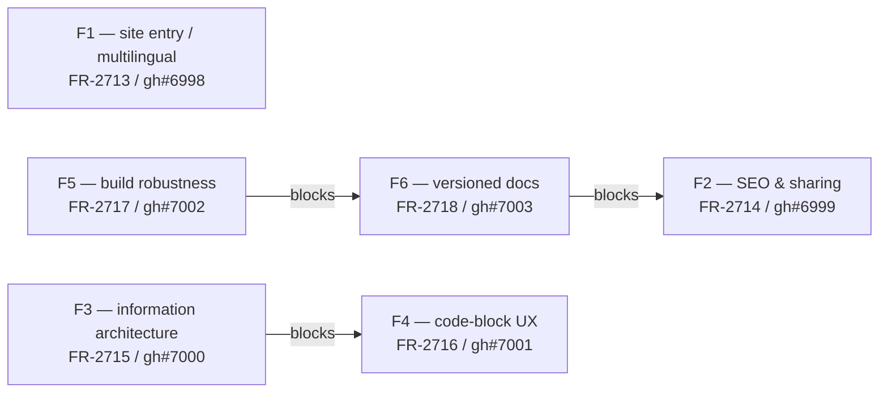

# Backend.AI WebUI Docs — Static Site Production Uplift Dev Plan

> **Epic**: FR-2710 ([link](https://lablup.atlassian.net/browse/FR-2710))
> **Spec**: `.specs/FR-2710-docs-site-production-uplift/spec.md`
> **Spec Task**: FR-2711 ([link](https://lablup.atlassian.net/browse/FR-2711)) — PR #6988
> **Generated**: 2026-04-25

## Sub-task Summary

Six sub-tasks, exactly one per feature bucket. Each ships as one PR.

| # | Bucket | Jira | GitHub | Title |
|---|--------|------|--------|-------|
| F1 | Site entry & multilingual routing | [FR-2713](https://lablup.atlassian.net/browse/FR-2713) | [#6998](https://github.com/lablup/backend.ai-webui/issues/6998) | site entry and multilingual routing |
| F2 | SEO & sharing metadata | [FR-2714](https://lablup.atlassian.net/browse/FR-2714) | [#6999](https://github.com/lablup/backend.ai-webui/issues/6999) | SEO and sharing metadata |
| F3 | Information architecture | [FR-2715](https://lablup.atlassian.net/browse/FR-2715) | [#7000](https://github.com/lablup/backend.ai-webui/issues/7000) | sidebar grouping, right-rail TOC, breadcrumbs |
| F4 | Reading UX: code blocks | [FR-2716](https://lablup.atlassian.net/browse/FR-2716) | [#7001](https://github.com/lablup/backend.ai-webui/issues/7001) | Shiki syntax highlighting + Copy button |
| F5 | Build robustness & static assets | [FR-2717](https://lablup.atlassian.net/browse/FR-2717) | [#7002](https://github.com/lablup/backend.ai-webui/issues/7002) | `--strict`, hashed assets, favicons, lazy images |
| F6 | Versioned docs & version selector | [FR-2718](https://lablup.atlassian.net/browse/FR-2718) | [#7003](https://github.com/lablup/backend.ai-webui/issues/7003) | minor-grained version selector + orphan-branch archive |

## Dependency Graph

```
F1 (independent)
F5 ──blocks──► F6 ──blocks──► F2
F3 ──blocks──► F4
```



## Suggested Merge Order

Branch base for every PR is `main`. Use a Graphite stack only along hard-blocker chains; otherwise create independent branches off `main` so they can merge in any order.

1. **F1 — FR-2713 / gh#6998** *(independent; cheapest)*
   - Stops the bleeding: removes the root 404 and the multi-line `<title>` bug.
   - Coordinates lightly with F6 on header layout (version selector lives next to the language switcher), but no Jira blocker.
2. **F5 — FR-2717 / gh#7002** *(independent; prerequisite for F6)*
   - `--strict` is required by F6's eligible-minor policy. Asset hashing and shared `assets/search.js` benefit every other bucket.
3. **F6 — FR-2718 / gh#7003** *(blocked by F5)*
   - Switches output layout to `dist/web/<version>/<lang>/...` (with single-version compatibility mode preserved). Lands before F2/F3/F4 to avoid retrofitting paths in those buckets.
4. **F3 — FR-2715 / gh#7000** *(independent of F6 / F5; blocks F4)*
   - IA shifts CSS/layout (right-rail TOC, breadcrumbs, grouped sidebar). Lands before F4 to avoid double-rework on the page template.
5. **F4 — FR-2716 / gh#7001** *(blocked by F3)*
   - Shiki + Copy button slot into the right rail / page template introduced in F3.
6. **F2 — FR-2714 / gh#6999** *(blocked by F6)*
   - SEO is the lightest churn and consumes F1 (`hreflang`), F3 (description from first paragraph), and F6 (canonical / sitemap version awareness).

Ordering is advisory — buckets are designed to merge in any reasonable order with light coordination, except along the hard blocker chains shown above.

## Stacking Strategy

- **F1**: independent branch off `main`. Merge any time.
- **F3**: independent branch off `main`. Merge any time.
- **F4**: branch off `main` after F3 has merged (use `gt restack` if F3 changes during review). Stack only if F3 has not merged yet.
- **F5**: independent branch off `main`. Merge any time.
- **F6**: branch off `main` after F5 has merged. Stack on top of F5 via `gt create` if F5 has not yet merged.
- **F2**: branch off `main` after F6 has merged. Stack on top of F6 via `gt create` if F6 has not yet merged.

Per project rules, prefer `gt create` / `gt restack` / `gt submit --stack` over plain `git rebase`.

## Cross-cutting — PDF pipeline non-regression (referenced once, applies to ALL six sub-tasks)

> Each sub-task issue carries this block verbatim. Every PR must verify it before merge.

- [ ] Each bucket's PR verifies, on the same commit, that **`pnpm run build:pdf` (all languages)** exits 0.
- [ ] Page count and outline-entry count of the PDF artifacts before/after the merge match the baseline, or any difference is justified in the PR description.
- [ ] Buckets that change the `book.config.yaml` schema (F1: title normalization, F3: navigation grouping, F6: `versions` key) must **explicitly check** that PDF builds pass under both the new and the legacy flat schema.
- [ ] Any PR that touches `markdown-processor.ts` (the shared core) must pass *both* web and PDF builds before merge.

---

## Sub-tasks

### F1 — Site entry & multilingual routing
- **Jira**: [FR-2713](https://lablup.atlassian.net/browse/FR-2713)
- **GitHub**: [#6998](https://github.com/lablup/backend.ai-webui/issues/6998)
- **Dependencies**: None (light coordination with F6 on header layout)
- **Review complexity**: Medium

**Summary.** Generate a root `dist/web/index.html` with a language picker (default from `navigator.language` / `Accept-Language`, persisted in `localStorage.lang`, fallback to `en`, no infinite redirects). Add a header language switcher to every page that links to the same chapter slug in peer languages. Emit `<link rel="alternate" hreflang="…">` per page covering all languages plus `x-default`. Fix the multi-line `<title>` bug by collapsing newlines from `book.config.yaml`'s `title: |` block scalar at config-read time. Document the title-normalization rule in `ARCHITECTURE.md`.

**Acceptance criteria.** See spec section *F1 — Site entry & multilingual routing* (Must Have + Acceptance Criteria) and the FR-2713 issue body.

**Files of interest.**
- `packages/backend.ai-docs-toolkit/src/website-builder.ts` — root index, language switcher, hreflang
- `packages/backend.ai-docs-toolkit/src/website-generator.ts` — root `index.html` emission
- `packages/backend.ai-docs-toolkit/src/config.ts` — book.config.yaml read; title normalization
- `packages/backend.ai-docs-toolkit/src/styles-web.ts` — header layout for switcher
- `packages/backend.ai-docs-toolkit/ARCHITECTURE.md` — document title rule

**Stretch goals.** None defined for this bucket.

---

### F2 — SEO & sharing metadata
- **Jira**: [FR-2714](https://lablup.atlassian.net/browse/FR-2714)
- **GitHub**: [#6999](https://github.com/lablup/backend.ai-webui/issues/6999)
- **Dependencies**: Blocked by **F6 (FR-2718)**. Light coordination with F1 (hreflang).
- **Review complexity**: Medium

**Summary.** Per-page `<meta name="description">` (≤155 chars from first non-heading paragraph). Open Graph (`og:title`, `og:description`, `og:image`, `og:url`, `og:type=article`, `og:site_name`, `og:locale`), Twitter `summary_large_image`, `<link rel="canonical">`, and JSON-LD `TechArticle`. Build-time `dist/web/sitemap.xml` (all pages × all languages × all versions, `lastmod` from git with `fs.statSync().mtime` fallback) and `dist/web/robots.txt`. Default OG image: render `manifest/backend.ai-brand-simple.svg` to PNG at build time, ship as `assets/og-default.png`; operators may override via `og.imagePath` in `docs-toolkit.config.yaml`.

**Acceptance criteria.** See spec section *F2 — SEO & sharing metadata* (Must Have + Acceptance Criteria) and the FR-2714 issue body.

**Files of interest.**
- `packages/backend.ai-docs-toolkit/src/website-builder.ts` — head tag injection
- new `packages/backend.ai-docs-toolkit/src/seo.ts` OR extend `website-generator.ts` — sitemap.xml, robots.txt
- `packages/backend.ai-docs-toolkit/src/markdown-processor-web.ts` — extract description from first paragraph
- asset pipeline for `assets/og-default.png` from `manifest/backend.ai-brand-simple.svg`

**Stretch goals.** None defined for this bucket.

---

### F3 — Information architecture (sidebar grouping + right-rail TOC + breadcrumbs)
- **Jira**: [FR-2715](https://lablup.atlassian.net/browse/FR-2715)
- **GitHub**: [#7000](https://github.com/lablup/backend.ai-webui/issues/7000)
- **Dependencies**: None. Blocks F4.
- **Review complexity**: High (layout + schema migration + PDF compatibility)

**Summary.** Extend `book.config.yaml` `navigation` to accept `{ category, items[] }` groups, keeping the flat-list form fully backward-compatible (PDF pipeline reads the same file). Render the sidebar as collapsible category groups; the active page's group auto-expands. Add a sticky right-rail "On this page" TOC with H2+H3 and scroll-spy. Move the active-page H2 list out of the sidebar into the right rail. Add `Home › Category › Page` breadcrumbs above each chapter. Commit a default 4–5-category mapping for the existing 29 chapters (proposed: Getting Started, Workloads, Storage & Data, Administration — boundaries adjustable in review).

**Acceptance criteria.** See spec section *F3 — Information architecture* (Must Have + Acceptance Criteria) and the FR-2715 issue body.

**Files of interest.**
- `packages/backend.ai-docs-toolkit/src/website-builder.ts` — sidebar grouping render, right-rail TOC, breadcrumb
- `packages/backend.ai-docs-toolkit/src/styles-web.ts` — sticky right rail, collapsible sidebar groups
- `packages/backend.ai-docs-toolkit/src/config.ts` — book.config.yaml schema extension; backward-compat with flat form
- `packages/backend.ai-webui-docs/src/book.config.yaml` — default category mapping for 29 chapters

**Stretch goals.** None defined for this bucket.

---

### F4 — Reading UX: code blocks
- **Jira**: [FR-2716](https://lablup.atlassian.net/browse/FR-2716)
- **GitHub**: [#7001](https://github.com/lablup/backend.ai-webui/issues/7001)
- **Dependencies**: Blocked by **F3 (FR-2715)**.
- **Review complexity**: Medium

**Summary.** Build-time syntax highlighting via Shiki (zero runtime JS for highlighting); cache highlighted output by code-block hash. Default theme `github-light`, overridable via `code.lightTheme` in `docs-toolkit.config.yaml`. Dark mode is intentionally out of scope but the `code.*` namespace is reserved for future extension. Ship a small no-framework `assets/code-copy.js` for the per-block Copy button.

**Acceptance criteria.** See spec section *F4 — Reading UX: code blocks* (Must Have + Acceptance Criteria) and the FR-2716 issue body.

**Files of interest.**
- `packages/backend.ai-docs-toolkit/src/markdown-processor-web.ts` — Shiki integration in code-block renderer; cache by hash
- `packages/backend.ai-docs-toolkit/src/styles-web.ts` — Shiki theme CSS injection
- new `assets/code-copy.js`
- `packages/backend.ai-docs-toolkit/src/config.ts` — `code.lightTheme`

**Stretch goals.** None defined for this bucket.

---

### F5 — Build robustness & static asset optimization
- **Jira**: [FR-2717](https://lablup.atlassian.net/browse/FR-2717)
- **GitHub**: [#7002](https://github.com/lablup/backend.ai-webui/issues/7002)
- **Dependencies**: None. Blocks F6.
- **Review complexity**: High (build-pipeline changes + CI gating)

**Summary.** `--strict` flag (defaulted on for production builds) exits 1 on broken links / missing images during `generateWebsite`; non-strict preserves current warning-only behavior. Extract the inline per-page search script to a shared `assets/search.js`. Content-hash filenames for `styles.css`, `search.js`, `code-copy.js` (`name.{8-char-hex}.ext`); update `<link>` / `<script>` references. Generate `favicon.ico`, `apple-touch-icon.png`, `site.webmanifest` (no service worker) at the site root. Image rendering: emit `loading="lazy"`, `decoding="async"`, and best-effort `width`/`height` parsed from PNG headers; on parse failure skip dimensions but never break the build.

**Acceptance criteria.** See spec section *F5 — Build robustness & static asset optimization* (Must Have + Acceptance Criteria) and the FR-2717 issue body.

**Files of interest.**
- `packages/backend.ai-docs-toolkit/src/website-generator.ts` — `--strict` broken-link fail mode; asset hashing
- `packages/backend.ai-docs-toolkit/src/website-builder.ts` — extract inline search `<script>` to file ref
- new `packages/backend.ai-docs-toolkit/src/asset-hasher.ts`
- new `packages/backend.ai-docs-toolkit/src/image-meta.ts` — PNG header parse for width/height
- `packages/backend.ai-docs-toolkit/src/cli.ts` — `--strict` flag wiring
- favicon / apple-touch-icon / site.webmanifest assets in `packages/backend.ai-webui-docs/`

**Stretch goals.** WebP/AVIF generation behind `--optimize-images`; if implementation slows the bucket, ship the must-haves and file a follow-up.

---

### F6 — Versioned docs & version selector
- **Jira**: [FR-2718](https://lablup.atlassian.net/browse/FR-2718)
- **GitHub**: [#7003](https://github.com/lablup/backend.ai-webui/issues/7003)
- **Dependencies**: Blocked by **F5 (FR-2717)**. Blocks F2.
- **Review complexity**: High (output layout migration + orphan-branch workflow)

**Summary.** Versioned docs with **minor-grained** selector — one row per minor version, the highest patch within that minor represents it (e.g., `25.16.5` shown as `25.16`). Eligible-minor policy: only minors released after `backend.ai-webui-docs` was introduced and that build cleanly under the current toolkit with `build:web --strict`. Version metadata declared via a new `versions` key in `docs-toolkit.config.yaml`; entries carry `label`, `source`, and exactly one `latest: true`. `versions[].source` accepts `{ kind: 'workspace' }` (current checkout) or `{ kind: 'archive-branch', ref: 'docs-archive/<version>' }`. Past-minor artifacts live on **orphan branches** (`docs-archive/<version>`), each built once with the toolkit-of-its-day. The release-time workflow that creates and pushes the orphan branch is in scope; the public deploy/CDN pipeline is deferred to a separate spec. Output layout becomes `dist/web/<version>/<lang>/...`; root `index.html` resolves to the `latest` entry. Header version dropdown navigates to the same slug in the target version, falling back to that version's index page if the slug doesn't exist. Version scope isolation: sidebar, right-rail TOC, search index, internal links operate strictly within the current version. Canonical points at the latest version's URL for the same slug; hreflang cross-links languages within the same version. Sitemap covers all versions × languages × pages. Single-version compatibility mode: when `versions` is not declared, build the existing flat `dist/web/<lang>/...` layout (no FR-2159 regression). Update `ARCHITECTURE.md` accordingly.

**Acceptance criteria.** See spec section *F6 — Versioned docs & version selector* (Must Have + Acceptance Criteria) and the FR-2718 issue body.

**Files of interest.**
- `packages/backend.ai-docs-toolkit/src/website-generator.ts` — version-aware output directory
- new `packages/backend.ai-docs-toolkit/src/versions.ts`
- `packages/backend.ai-docs-toolkit/src/config.ts` — `versions` schema
- `packages/backend.ai-docs-toolkit/src/website-builder.ts` — header version dropdown
- new CI workflow under `.github/workflows/` for creating/pushing `docs-archive/<version>` orphan branches
- `packages/backend.ai-docs-toolkit/ARCHITECTURE.md` — version model, directory layout

**Stretch goals.**
- "This page is not in the selected version" inline notice when the selector falls back to the version's index.
- "View latest version" inline banner when reading a non-latest version.

---

## Next

Run `/fw:batch-implement .specs/FR-2710-docs-site-production-uplift/dev-plan.md` to start work.
