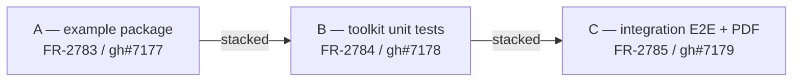

# Backend.AI Docs Toolkit & Site — Test Coverage Uplift Dev Plan

> **Epic**: FR-2781 ([link](https://lablup.atlassian.net/browse/FR-2781))
> **Spec**: `.specs/FR-2781-docs-toolkit-test-coverage/spec.md`
> **Spec Task**: FR-2782 ([link](https://lablup.atlassian.net/browse/FR-2782)) — gh#7176
> **Generated**: 2026-04-30

## Sub-task Summary

Three sub-tasks, exactly one per bucket. Each ships as one PR. Linear Graphite stack only — `main → A → B → C`.

| # | Bucket                                    | Jira                                                           | GitHub                                                  | Title                                              |
|---|-------------------------------------------|----------------------------------------------------------------|---------------------------------------------------------|----------------------------------------------------|
| A | docs-toolkit example boilerplate package  | [FR-2783](https://lablup.atlassian.net/browse/FR-2783)         | [#7177](https://github.com/lablup/backend.ai-webui/issues/7177) | example/boilerplate workspace package              |
| B | toolkit unit test coverage expansion      | [FR-2784](https://lablup.atlassian.net/browse/FR-2784)         | [#7178](https://github.com/lablup/backend.ai-webui/issues/7178) | unit tests for uncovered toolkit modules           |
| C | example-driven E2E + PDF integration tests| [FR-2785](https://lablup.atlassian.net/browse/FR-2785)         | [#7179](https://github.com/lablup/backend.ai-webui/issues/7179) | Playwright web E2E + PDF artifact verification     |

## Dependency Graph

```
A (example) ──► B (unit tests) ──► C (integration tests)
```

A is technically a hard prerequisite only for C (C's tests run against the example's build output). B is logically independent of A — its tests are self-contained. The linear stack constraint (per the request) puts B in the middle anyway, so:

- A is the foundation: example package + toolkit README link.
- B layers on top: unit tests for uncovered modules. Reviewable in isolation.
- C layers on top: integration tests reading A's `dist/` output.



## Stacking Strategy (Graphite, single-branch linear)

- **Base** for the stack: `main`.
- **Spec PR**: branch `fr-2781-docs-toolkit-test-coverage` off `main`. Contains only `.specs/FR-2781-…/{spec,dev-plan}.md` and `metadata.json`.
- **A**: `gt create` on top of spec PR → branch `fr-2783-docs-toolkit-example`. Contains the new `packages/backend.ai-docs-toolkit-example/` and the README link from the toolkit README.
- **B**: `gt create` on top of A → branch `fr-2784-docs-toolkit-unit-tests`. Adds `*.test.ts` files only under `packages/backend.ai-docs-toolkit/src/`.
- **C**: `gt create` on top of B → branch `fr-2785-docs-example-integration-tests`. Adds `tests/` under the example package + Playwright config + npm scripts.

Per project rules, use `gt create` / `gt restack` / `gt submit --stack`. Never plain `git rebase`.

## Cross-cutting checks (applies to every sub-task)

- [ ] `bash scripts/verify.sh` exits with `=== ALL PASS ===` before `gt submit`.
- [ ] PR description includes a "Verification" block with the verify.sh tail.
- [ ] PR title prefix per project convention: `feat:` / `test:` / `docs:`.
- [ ] PR body opens with `Resolves #N(FR-XXXX)` for the GitHub-cloned issue.
- [ ] PR body's "Stacked on" header per `fw:stacked-pr-lifecycle`.

## Suggested execution order

The linear stack is the literal order: spec → A → B → C. Submitting can happen incrementally — spec + A can land while B is in progress, etc. — but stacked `gt submit --stack` is the default mode.

### Spec PR (this document)
Contents: `.specs/FR-2781-docs-toolkit-test-coverage/{spec.md,dev-plan.md,metadata.json}`. No code changes.

### A — FR-2783 / gh#7177 — example/boilerplate package

**Files to create**:
- `packages/backend.ai-docs-toolkit-example/package.json`
- `packages/backend.ai-docs-toolkit-example/README.md`
- `packages/backend.ai-docs-toolkit-example/docs-toolkit.config.yaml`
- `packages/backend.ai-docs-toolkit-example/src/book.config.yaml`
- `packages/backend.ai-docs-toolkit-example/src/{en,ko}/*.md` (3-5 chapters per language)
- `packages/backend.ai-docs-toolkit-example/assets/logo.svg`
- `packages/backend.ai-docs-toolkit-example/assets/sample.png` (with declared dimensions)
- `.gitignore` carve-out: ignore `dist/` under the example

**Files to modify**:
- `packages/backend.ai-docs-toolkit/README.md` — add a "Getting started" section linking to the example package.
- `pnpm-workspace.yaml` — confirm `packages/*` glob already covers it; add explicit entry only if needed.

**Acceptance**:
- [ ] `pnpm install` succeeds at the repo root.
- [ ] `pnpm --filter backend.ai-docs-toolkit-example build:web` exits 0.
- [ ] `pnpm --filter backend.ai-docs-toolkit-example pdf` exits 0 for both `en` + `ko`.
- [ ] Smoke screenshot of the rendered site (with custom logo and brand color) attached to the PR.

### B — FR-2784 / gh#7178 — toolkit unit test coverage expansion

**Files to create** (under `packages/backend.ai-docs-toolkit/src/`):

Priority 1 (mandatory, all 6):
- `asset-hasher.test.ts`
- `robots-txt.test.ts`
- `sitemap.test.ts`
- `image-meta.test.ts`
- `book-config.test.ts`
- `theme.test.ts`

Priority 2 (at least 4 of 6):
- `shiki-highlighter.test.ts`
- `html-builder.test.ts` and/or `html-builder-web.test.ts`
- `markdown-processor.test.ts` and/or `markdown-processor-web.test.ts`
- `og-image-renderer.test.ts` (skip-on-missing-`sharp`)
- `search-index-builder.test.ts`
- `website-generator.test.ts` (small fixture smoke + `--strict` failure case)

**Acceptance**:
- [ ] `pnpm --filter backend.ai-docs-toolkit test` passes; total runtime ≤ 30s.
- [ ] All test files use `tsx --test` with inline fixtures — no read from `backend.ai-webui-docs/`.
- [ ] `og-image-renderer.test.ts` skips (does not fail) when `sharp` is absent.

### C — FR-2785 / gh#7179 — example-driven E2E + PDF tests

**Files to create** (under `packages/backend.ai-docs-toolkit-example/`):
- `tests/web/playwright.config.ts` — `webServer` runs `serve:web`; build dependency on `dist/web/`.
- `tests/web/root-and-redirects.spec.ts`
- `tests/web/language-switcher.spec.ts`
- `tests/web/version-selector.spec.ts`
- `tests/web/sidebar-and-toc.spec.ts`
- `tests/web/mobile-drawer.spec.ts`
- `tests/web/code-blocks.spec.ts`
- `tests/web/pdf-download-card.spec.ts`
- `tests/pdf/page-count.test.ts`
- `tests/pdf/text-extraction.test.ts`
- `tests/pdf/fonts.test.ts`
- `tests/pdf/metadata.test.ts`
- `tests/pdf/baseline.json` — recorded page-count baseline per language

**Files to modify**:
- `packages/backend.ai-docs-toolkit-example/package.json` — add `test:e2e`, `test:pdf`, `test` scripts; add `playwright`, `pdf-lib` to `devDependencies`.

**Acceptance**:
- [ ] `pnpm --filter backend.ai-docs-toolkit-example test:e2e` passes locally and in CI.
- [ ] `pnpm --filter backend.ai-docs-toolkit-example test:pdf` passes for en + ko.
- [ ] PR description records the recorded baseline page counts.
- [ ] Total CI wall-clock cost added ≤ 3 minutes.

## Next

Once spec PR is merged (or while in review), run:

```bash
gt create -m "feat(FR-2783): docs-toolkit example boilerplate package"
# implement A
gt submit
```

Then `gt create` for B on top of A, then C on top of B.
