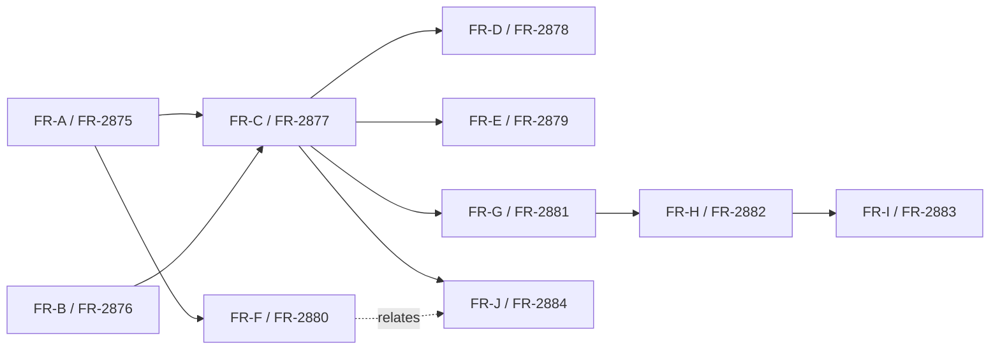

# WebUI Smoke CLI — Dev Plan

## Spec Reference

- Spec: `.specs/FR-2871-webui-smoke-cli/spec.md`
- Epic: [FR-2871](https://lablup.atlassian.net/browse/FR-2871)
- Spec Task: [FR-2872](https://lablup.atlassian.net/browse/FR-2872)
- Spec PR (parent in stack): [#7375](https://github.com/lablup/backend.ai-webui/pull/7375)

## Sub-tasks

GitHub mirror issue numbers are populated by the Jira → GitHub webhook clone; if a row shows `pending`, the webhook has not yet completed at the time of writing — batch-implement should look the cloned issue up by Jira key.

| FR | Jira | Tier | GitHub | Title |
|----|------|------|--------|-------|
| FR-A | [FR-2875](https://lablup.atlassian.net/browse/FR-2875) | MVP | #7379 | chore(WebUI Smoke CLI): introduce @smoke tag convention for e2e specs |
| FR-B | [FR-2876](https://lablup.atlassian.net/browse/FR-2876) | MVP | #7380 | feat(WebUI Smoke CLI): scaffold backend.ai-webui-smoke-cli workspace package |
| FR-C | [FR-2877](https://lablup.atlassian.net/browse/FR-2877) | MVP | #7381 | feat(WebUI Smoke CLI): implement runner with tag filter and external endpoint support |
| FR-D | [FR-2878](https://lablup.atlassian.net/browse/FR-2878) | Phase 2 | #7382 | feat(WebUI Smoke CLI): add preflight/doctor subcommand and role auto-detection |
| FR-E | [FR-2879](https://lablup.atlassian.net/browse/FR-2879) | Phase 2 | #7383 | feat(WebUI Smoke CLI): post-process report with summary.json and diagnostic block |
| FR-F | [FR-2880](https://lablup.atlassian.net/browse/FR-2880) | Phase 2 | #7384 | refactor(WebUI Smoke CLI): extract single-account-safe e2e utilities |
| FR-G | [FR-2881](https://lablup.atlassian.net/browse/FR-2881) | Phase 2 | #7385 | feat(WebUI Smoke CLI): bundle Chromium and add air-gap + insecure-tls support |
| FR-H | [FR-2882](https://lablup.atlassian.net/browse/FR-2882) | Phase 2 | #7386 | chore(WebUI Smoke CLI): SEA/pkg binary build and internal release workflow |
| FR-I | [FR-2883](https://lablup.atlassian.net/browse/FR-2883) | Phase 2 | #7387 | docs(WebUI Smoke CLI): operator README in English and Korean |
| FR-J | [FR-2884](https://lablup.atlassian.net/browse/FR-2884) | Phase 2 | #7388 | feat(WebUI Smoke CLI): expand smoke coverage (App launcher P1, model serving, RBAC basics) |

## Dependency Graph

Encoded Jira links (`blocks` unless noted):

- FR-2875 blocks FR-2877
- FR-2876 blocks FR-2877
- FR-2875 blocks FR-2880
- FR-2877 blocks FR-2878
- FR-2877 blocks FR-2879
- FR-2877 blocks FR-2881
- FR-2881 blocks FR-2882
- FR-2882 blocks FR-2883
- FR-2877 blocks FR-2884
- FR-2880 *relates to* FR-2884 (soft)

## Wave Ordering

### Wave 1 — MVP foundation (parallel)

| FR | Files touched | Verification |
|----|---------------|--------------|
| FR-A | `e2e/E2E-TEST-NAMING-GUIDELINES.md`, `e2e/**` (tag annotations only) | `pnpm exec playwright test --grep @smoke --list` (run at the repo root) lists starter specs; existing e2e CI run count unchanged |
| FR-B | `packages/backend.ai-webui-smoke-cli/` (new), `pnpm-workspace.yaml` | `pnpm install && pnpm --filter backend.ai-webui-smoke-cli run build`; verify `bai-smoke list`, `bai-smoke version`, and `bai-smoke run --help` |

### Wave 2 — MVP runner

| FR | Depends on | Files touched | Verification |
|----|------------|---------------|--------------|
| FR-C | FR-A, FR-B | `packages/backend.ai-webui-smoke-cli/playwright.smoke.config.ts`, `src/runner.ts`, `src/commands/run.ts`, `src/auth/storage-state.ts` | Smoke run against staging produces a report with **login + dashboard + 1 session lifecycle** PASS; HTML report at `./report/index/index.html`; non-zero exit on forced failure |

### Wave 3 — Phase 2 expansion (parallel; all depend on FR-C)

| FR | Files touched | Verification |
|----|---------------|--------------|
| FR-D | `src/commands/{doctor,preflight}.ts`, `src/role/detect.ts`, updates to `src/commands/run.ts` | `doctor` distinguishes "unreachable" from "login failed"; `--role auto` picks correct tag set |
| FR-E | `src/report/{summary,environment,prune,diagnostic}.ts` | After a forced failure, output directory matches the documented shape; `summary.json` and `environment.json` parse and contain required fields |
| FR-F | `e2e/utils/test-util.ts` (audit), `e2e/utils/smoke-util.ts` (new), smoke-tagged spec imports | Single-account fixture: smoke run green; full e2e suite: no regression |
| FR-G | `scripts/bundle-browsers.*`, `src/runtime/{browsers,network-allowlist}.ts`, `playwright.smoke.config.ts` | Outbound-blocked host completes a smoke run; `--insecure-tls` accepts self-signed certs |

### Wave 4 — Packaging + coverage expansion (parallel; FR-J only soft-relates to FR-F)

| FR | Depends on | Files touched | Verification |
|----|------------|---------------|--------------|
| FR-H | FR-G | `scripts/build-{linux,mac,win}.sh`, `.github/workflows/webui-smoke-cli-release.yml` | Each platform binary extracted on a no-Node host runs a smoke pass against staging |
| FR-J | FR-C (hard), FR-F (soft / relates) | `e2e/tests/smoke/{app-launcher,model-serving,rbac-basics}.spec.ts` | App-launcher smoke distinguishes session-runtime failure from app-proxy 502 |

### Wave 5 — Documentation (gated on final CLI surface)

| FR | Depends on | Files touched | Verification |
|----|------------|---------------|--------------|
| FR-I | FR-H | `packages/backend.ai-webui-smoke-cli/README.md`, `README.ko.md` | Both READMEs print on one A4 page; a Field-Ops engineer completes the documented flow on a fresh host |

## Per-wave batch-implement guidance

- **Common verification command** for every Wave: `bash scripts/verify.sh` (Relay / Lint / Format / TypeScript), in addition to the per-FR functional check above.
- **PR titles** follow `prefix(JIRA-KEY): title` from CLAUDE.md (e.g., `feat(FR-2877): ...`).
- **PR body** starts with `Resolves #<github-mirror>(FR-2877)` once the webhook has cloned each Jira sub-task.
- **Graphite stack**: each FR is one PR stacked on the previous wave's PRs. Use `gt create` / `gt submit --stack`. The MVP slice (FR-A → FR-B → FR-C) is the critical path stacked above the spec PR (#7375) and this dev-plan PR.
- **Single-account staging account** is required from Wave 2 onward for runtime verification.

## Risks / notes

- The Jira → GitHub webhook clone is asynchronous; the table's `pending` entries should be filled in by batch-implement at the moment each FR is picked up.
- FR-F is intentionally Phase 2 even though FR-C will rely on the smoke specs being single-account-safe in practice. If a tagged spec in FR-C fails because of a multi-account assumption, **exclude it from the `@smoke` selection** and note it on the FR-F ticket — do not fix it inside FR-C.
- FR-J's "App launcher P1" check is the highest-signal Phase 2 deliverable; prioritize it within Wave 4.
