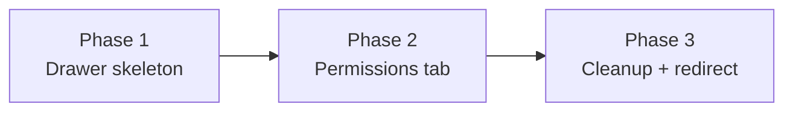

# Storage Host Permission Migration — Dev Plan

## Spec Reference

`.specs/FR-2969-storage-host-permission-migration/spec.md`

## Epic: FR-2969

Migrate storage host permission management from `backend.ai-control-panel`
into `backend.ai-webui`'s Resources → Storage tab, and absorb the existing
standalone Storage Setting page into a tabbed detail drawer.

> **Jira sub-task keys**: `jira` CLI is not installed in this environment.
> The sub-task identifiers below (`FR-2969-1`, `FR-2969-2`, `FR-2969-3`) are
> placeholders for documentation/section ordering only. The GitHub PR will
> reference the Epic directly: `Resolves #<gh-issue-number> (FR-2969)`.

## PR Strategy — Single Consolidated PR (user decision 2026-05-26)

Per user request ("이거 그냥 전부 한 PR 로 작업해주세요"), the three
implementation phases below ship together as **one** branch / one PR:

```
main
 └─ fr-2969-storage-host-permission-migration   (single PR)
     ├─ phase 1: Drawer skeleton + Capacity Setting tab
     ├─ phase 2: Permissions tab (Relay queries + 3 mutations + warning + gate)
     └─ phase 3: Old standalone page removal + redirect
```

Reasoning notes:
- The three phases are tightly coupled to the same migration. Splitting them
  into stacked PRs costs cycle time without giving reviewers smaller mental
  units (the drawer-without-permissions intermediate has no user value).
- Single PR avoids the route ambiguity window where both the drawer and the
  legacy `/storage-settings/:hostname` page coexist.
- Verification gate is a single `bash scripts/verify.sh` run at the end.

The phase ordering inside the single PR matches the original stack ordering
(drawer → permissions → cleanup) — implement them in that sequence so the
working tree is consistent at each step.

## Phases

### Phase 1 — Drawer skeleton + Capacity Setting tab

- **Phase order**: 1 of 3 (implement first within the single PR)
- **Branch**: `fr-2969-storage-host-permission-migration` (shared with all phases)
- **Review complexity**: Medium (new drawer component + open/close wiring;
  reuses existing fragments)
- **Estimated diff size for this phase**: ~250–400 lines net

#### Scope

Introduce the new `StorageHostDetailDrawer` and wire the storage-row gear
icon to open it. The drawer contains a top section (`StorageHostResourcePanel`)
and a `Tabs` whose only active item for now is **Capacity Setting**, which
renders the existing `StorageHostSettingsPanel` (including the "quota not
supported" `Empty` fallback). A placeholder/disabled `Permissions` tab is
**not** added here — it ships in Sub-task 2. The old standalone
`/storage-settings/:hostname` route remains registered and functional so this
PR is independently mergeable; the gear icon simply stops navigating to it.

#### Files to create

- `react/src/components/StorageHostDetailDrawer.tsx`
  - Mirrors `react/src/components/AgentDetailDrawer.tsx` (lines 1–113):
    - `interface StorageHostDetailDrawerProps extends DrawerProps` with
      `onRequestClose?: () => void` and `storageHostId?: string | null`
      (per `.claude/rules/component-props-extension.md`).
    - `size={800}` (matches `AgentDetailDrawer`; spec Decision D-2).
    - Drawer header `title`: the storage host id (`storageHostId`).
    - `extra`: `BAIFetchKeyButton` that refetches the inner content.
    - `<Suspense fallback={<Skeleton active />}>` wrapping the content.
- `react/src/components/StorageHostDetailDrawerContent.tsx`
  - Mirrors `react/src/components/AgentDetailDrawerContent.tsx`:
    - `useLazyLoadQuery` for `storage_volume(id:)` with the same shape used
      today by `StorageHostSettingPage` (selects `id`, `capabilities`,
      `...StorageHostResourcePanelFragment`,
      `...StorageHostSettingsPanel_storageVolumeFrgmt`).
    - Renders `<StorageHostResourcePanel/>` at top.
    - Renders `<Tabs items={...}/>` with a single item for now:
      - key `capacity`, label `t('storageHost.tab.CapacitySetting')`,
        children = the Capacity Setting tab body (the existing
        `<StorageHostSettingsPanel/>` plus the `<Empty/>` "quota not
        supported" fallback that currently lives in
        `StorageHostSettingPage` lines 66–81 — wrapped in
        `ErrorBoundaryWithNullFallback` + `Suspense` per the current
        implementation).
    - Default active tab key `capacity`.
    - Use a bare `<Tabs>` inside `BAIFlex` (spec note — not `BAICard`
      with `tabList`, per `.claude/rules/use-bai-card.md` and the
      `AgentDetailDrawerContent` precedent).
  - `'use memo'` directive at top of component body.
  - No `useMemo` / `useCallback`. No `console.log` — use `useBAILogger`.

#### Files to modify

- `react/src/components/StorageProxyList.tsx`
  - Add local state (e.g. `const [drawerStorageHostId, setDrawerStorageHostId] = useState<string | null>(null);`).
  - Replace the row action `key: 'settings'` `onClick` body (lines 175–177
    currently call `webuiNavigate('/storage-settings/${record.id}')`) with
    `setDrawerStorageHostId(record.id)`.
  - Mount `<StorageHostDetailDrawer open={!!drawerStorageHostId} storageHostId={drawerStorageHostId} onRequestClose={() => setDrawerStorageHostId(null)} />`
    at the list level (mirror how `AgentList` mounts `AgentDetailDrawer`).
  - Drop the `useWebUINavigate` import if it becomes unused (verify with
    `pnpm run lint`).
- `resources/i18n/en.json`
  - Add `storageHost.tab.CapacitySetting` and `storageHost.tab.Permissions`
    (the latter is unused this PR but added now to avoid a follow-up i18n
    churn — it ships with the Permissions tab in Sub-task 2; leaving the
    key here is fine because i18n JSON is additive). If preferred, defer
    the `Permissions` key to Sub-task 2 — both options are acceptable.
- `resources/i18n/ko.json`
  - Korean equivalents of the same keys. Use 합니다체 to match surrounding
    `storageHost.*` entries.

#### Files NOT touched in this sub-task

- `react/src/pages/StorageHostSettingPage.tsx` — survives untouched.
- `react/src/routes.tsx` — route registration untouched.
- `react/src/components/MainLayout/WebUISider.tsx`,
  `react/src/hooks/useWebUIMenuItems.tsx` — `storage-settings` branch
  remains; removed in Sub-task 3.

#### Acceptance criteria (subset from spec)

- Clicking the gear icon on any storage row opens
  `StorageHostDetailDrawer` with the storage host id as the drawer title.
- The drawer body shows `StorageHostResourcePanel` (Endpoint / Backend /
  Capabilities / Usage) as a top section.
- The drawer body shows a `Tabs` with one tab: **Capacity Setting** (default
  active). The **Permissions** tab is intentionally absent in this sub-task.
- The Capacity Setting tab renders `<StorageHostSettingsPanel/>` with
  identical behavior to the pre-migration full-page version, including the
  "quota not supported" `Empty` fallback.
- Closing the drawer (close button or backdrop) clears `drawerStorageHostId`
  and does not navigate.
- The legacy `backend-ai-selected-storage-proxy` "Info" event flow is
  untouched.
- The route `/storage-settings/:hostname` still works (it is only unreachable
  from the gear icon now). Verify by typing the URL directly.
- All new `.tsx` files start with `'use memo'`. No new `useMemo` /
  `useCallback`. New `BAICard` call sites (if any) follow
  `.claude/rules/use-bai-card.md`.
- `bash scripts/verify.sh` ends with `=== ALL PASS ===`.

---

### Phase 2 — Permissions tab

- **Phase order**: 2 of 3 (implement after Phase 1 within the single PR)
- **Branch**: `fr-2969-storage-host-permission-migration` (shared)
- **Review complexity**: High (new Relay queries, three modify mutations,
  JSON merge logic, mount-in-session warning, superadmin gate, role-based
  rendering)
- **Estimated diff size for this phase**: ~600–900 lines (component + Relay artifacts +
  i18n)

#### Scope

Add the new **Permissions** tab inside `StorageHostDetailDrawerContent`,
gated by superadmin role. The tab body is `StorageHostPermissionPanel`,
which fetches the canonical permission list and the three policy
collections via native Relay queries (no Django REST proxy), renders three
checkbox-matrix sections (Domains / Projects / Keypair Resource Policies),
provides Select All per section and a single Update button, and saves dirty
rows via the existing `modify_domain` / `modify_group` /
`modify_keypair_resource_policy` mutations preserving permissions for other
hosts. The mount-in-session warning runs as a `modal.confirm` (reversible
action, per `.claude/rules/destructive-confirmation.md`).

#### Files to create

- `react/src/components/StorageHostPermissionPanel.tsx`
  - Props: `{ storageHostId: string; onAfterSave?: () => void }`.
  - Two Relay queries via `useLazyLoadQuery`:
    1. `StorageHostPermissionPanel_HostPermissionsQuery` —
       `vfolder_host_permissions { vfolder_host_permission_list }`
       (source of truth for the column set).
    2. `StorageHostPermissionPanel_PoliciesQuery` —
       `domains { name allowed_vfolder_hosts }`,
       `groups { id name allowed_vfolder_hosts }`,
       `keypair_resource_policies { name allowed_vfolder_hosts }`.
  - Three `useMutation` calls:
    - `ModifyDomainAllowedVfolderHostsMutation`
    - `ModifyGroupAllowedVfolderHostsMutation`
    - `ModifyKeypairResourcePolicyAllowedVfolderHostsMutation`
  - Local edit state: `Record<rowKey, Set<permissionKey>>` per section, seeded
    from the parsed `allowed_vfolder_hosts[storageHostId]`. Track "dirty"
    rows to know which mutations to fire.
  - Render three sections, each a `BAICard` with `extra` containing
    a "Select All / Unselect All" toggle. Body holds a `BAITable` with
    one column per permission key. Each cell is a `<Checkbox/>`. Section
    header label keys (use existing patterns or add new ones under
    `storageHost.permission.*`).
  - Single panel-level **Update** button (`BAIButton` with `action` prop
    for loading state, per CLAUDE.md React Essentials), placed at the
    panel header / top-right.
  - Mount-in-session warning flow:
    - Before firing mutations, scan all dirty rows.
    - If any row has `mount-in-session` enabled while either
      `download-file` or `upload-file` is disabled, call
      `App.useApp().modal.confirm({ title: t('storageHost.permission.MountSessionWarningTitle'), content: t('storageHost.permission.MountSessionWarningContent'), okText: t('button.Update'), onOk: doSave, onCancel: () => {} })`.
    - This is **not** destructive — use `modal.confirm`, **not**
      `BAIConfirmModalWithInput` (per
      `.claude/rules/destructive-confirmation.md`).
  - Merge logic for save:
    ```ts
    const existing = (() => {
      try { return JSON.parse(row.allowed_vfolder_hosts || '{}'); }
      catch { return {}; }
    })();
    const merged = { ...existing, [storageHostId]: enabledPermissions };
    // props.allowed_vfolder_hosts = JSON.stringify(merged)
    ```
  - On success: `message.success(...)` toast and refetch both queries via
    a shared fetch key (or `useRefetchableFragment` if restructured).
  - On error: `message.error(error.message)` per mutation.
  - `'use memo'` at top. No `useMemo` / `useCallback`. Use `useEffectEvent`
    if any effect closes over the dirty-state callbacks (per
    `.claude/rules/use-effect-event.md`).
  - Authoritative permission grouping (8 keys × category labels) lives in
    a local constant map (`create-vfolder → Create / Volume`, etc.),
    matching spec [Permission Model](spec.md#permission-model). **Render
    one column per permission key returned by the server**; the local map
    is only consulted for the display label / category.

#### Files to modify

- `react/src/components/StorageHostDetailDrawerContent.tsx`
  - Import `StorageHostPermissionPanel`, `useCurrentUserRole` (from
    `react/src/hooks/backendai.tsx`, line 219), and the i18n hook.
  - Compute `isSuperadmin = useCurrentUserRole() === 'superadmin'`.
  - Conditionally append the **Permissions** tab item to the `Tabs.items`
    array only when `isSuperadmin` is true. Tab key `permissions`,
    label `t('storageHost.tab.Permissions')`, children
    `<StorageHostPermissionPanel storageHostId={storage_volume?.id || ''} />`.
  - Default active tab key remains `capacity`.
- `react/src/components/StorageHostDetailDrawer.tsx`
  - Wire the `BAIFetchKeyButton` to also refetch the permissions queries
    (pass a fetch key down to the content, or use a shared Jotai atom /
    `useFetchKey` in the content). Simplest: pass `fetchKey` prop to
    `StorageHostDetailDrawerContent` and forward it to
    `StorageHostPermissionPanel`.
- `resources/i18n/en.json` and `resources/i18n/ko.json`
  - Add keys under `storageHost.permission.*`:
    - `Domains`, `Projects`, `KeypairResourcePolicies`
    - `Update`, `SelectAll`, `UnselectAll`
    - `MountSessionWarningTitle`, `MountSessionWarningContent`
    - Permission display labels: `Create`, `Delete`, `Modify`, `Mount`,
      `Download`, `Upload`, `Invite`, `SetPermission`
    - Category labels: `Volume`, `Folder`, `UserFolder`, `ProjectFolder`
    - Save success/error toast keys: `SaveSuccess`, `SaveFailed`
  - PascalCase leaf keys per existing `storageHost.*` convention.
  - Korean translations in 합니다체 to match surrounding entries.
  - Other 20 locales receive the English fallback (no action needed —
    `react-i18next` falls back to `en` by default).

#### Files NOT touched in this sub-task

- `react/src/pages/StorageHostSettingPage.tsx`, `react/src/routes.tsx`,
  `react/src/components/MainLayout/WebUISider.tsx`,
  `react/src/hooks/useWebUIMenuItems.tsx` — removed in Sub-task 3.

#### Acceptance criteria (subset from spec)

- The Permissions tab is visible only to superadmin. Domain-admin and
  regular users see only the Capacity Setting tab (verify by toggling
  `useCurrentUserRole()` in dev tools / inspecting render with a mock).
- The Permissions tab body renders three sections (Domains / Projects /
  Keypair Resource Policies), each as a `BAITable` checkbox matrix with
  one column per permission key returned by `vfolder_host_permissions`.
- Each section has a Select All / Unselect All toggle in its header
  `extra`.
- The Update button is disabled while permissions are still loading and
  shows a loading state during the network round-trip (via `BAIButton`
  `action` prop).
- Saving issues the correct mutations per dirty row with the
  `JSONString` payload preserving permissions for other storage hosts.
- A round-trip save (toggle → Update → success toast → reopen drawer)
  reflects the saved value.
- The mount-in-session confirmation modal appears when applicable; OK
  proceeds with save, Cancel preserves in-form edits without saving.
- On save success: `message.success` toast + permission queries refetch
  automatically.
- On save failure: `message.error` toast with the backend error message.
- New Relay artifacts are generated under `react/src/__generated__/` and
  committed.
- `bash scripts/verify.sh` ends with `=== ALL PASS ===`.

---

### Phase 3 — Old standalone page removal + redirect

- **Phase order**: 3 of 3 (implement last within the single PR)
- **Branch**: `fr-2969-storage-host-permission-migration` (shared)
- **Review complexity**: Low (mechanical deletions + a `<Navigate/>` swap)
- **Estimated diff size for this phase**: ~80–120 lines, mostly deletions

#### Scope

Delete the now-orphan standalone Storage Setting page, swap its route for
a redirect to `/agent` (the Storage tab landing) so old bookmarks land
somewhere reasonable, and remove the `storage-settings` special cases in
sidebar / menu selection logic.

#### Files to delete

- `react/src/pages/StorageHostSettingPage.tsx`

#### Files to modify

- `react/src/routes.tsx`
  - Remove the lazy import at lines 51–53:
    ```tsx
    const StorageHostSettingPage = React.lazy(
      () => import('./pages/StorageHostSettingPage'),
    );
    ```
  - Replace the route entry at lines 764–772 with a redirect:
    ```tsx
    {
      path: '/storage-settings/:hostname',
      element: <Navigate to="/agent" replace />,
    },
    ```
    `Navigate` is from `react-router-dom`; the file likely already imports
    it (verify and add to imports if not). Drop the `handle.labelKey` and
    `Suspense`/`Skeleton` wrappers — they are not needed for a redirect.
- `react/src/components/MainLayout/WebUISider.tsx`
  - Remove the `storage-settings` ternary at lines 252–253:
    ```tsx
    selectedKeys={[
      // TODO: After matching first path of 'storage-settings' and 'agent', remove this code
      location.pathname.split('/')[1] === 'storage-settings'
        ? 'agent'
        : location.pathname.split('/')[1],
    ]}
    ```
    becomes:
    ```tsx
    selectedKeys={[location.pathname.split('/')[1]]}
    ```
    Drop the `TODO` comment as the redirect now handles the URL.
- `react/src/hooks/useWebUIMenuItems.tsx`
  - Remove `|| 'storage-settings' === location.pathname.split('/')[1]`
    at line 785.
  - Remove `|| currentPathFirstSegment === 'storage-settings'` at line 799.

#### Files NOT touched in this sub-task

- Drawer / panel components from Sub-tasks 1 and 2 are untouched here.

#### Acceptance criteria (subset from spec)

- `react/src/pages/StorageHostSettingPage.tsx` no longer exists.
- Visiting `/storage-settings/:hostname` redirects to `/agent` (verify via
  manual nav and via the browser back button — back from `/agent` should
  not re-trigger the redirect loop because `Navigate replace` rewrites the
  history entry).
- Sidebar selection logic (`WebUISider.tsx`) and menu logic
  (`useWebUIMenuItems.tsx`) no longer reference `storage-settings`.
- The drawer continues to open from the storage row gear icon (regression
  check on Sub-task 1).
- The Permissions tab still renders for superadmin (regression check on
  Sub-task 2).
- `bash scripts/verify.sh` ends with `=== ALL PASS ===`.

## Phase Ordering Within the Single PR

```
Phase 1 (drawer) ──▶ Phase 2 (permissions tab) ──▶ Phase 3 (cleanup)
```

Mermaid:



All three phases share the single branch
`fr-2969-storage-host-permission-migration` and ship as one PR. There is no
inter-phase mergeability guarantee — only the **final** state must pass
`bash scripts/verify.sh`. The phase ordering simply defines the recommended
implementation sequence so the working tree stays coherent during development.

| Order | Phase | Branch |
|---|---|---|
| 1 | Drawer skeleton + Capacity Setting tab | `fr-2969-storage-host-permission-migration` |
| 2 | Permissions tab | `fr-2969-storage-host-permission-migration` |
| 3 | Old standalone page removal + redirect | `fr-2969-storage-host-permission-migration` |

After the PR lands, the Epic FR-2969 is complete and the
`/storage-settings/:hostname` route is purely a redirect.

## Risks and Notes

- **Bulk vs. per-row mutations** (spec Open Question 2). Sub-task 2 fires
  N separate Relay mutations rather than the single hand-built multi-mutation
  GraphQL string control-panel uses. If atomicity is required, this becomes
  a follow-up backend ticket and a larger refactor of Sub-task 2's save
  flow. The current spec's [Decision D-5](spec.md#decisions-and-defaults)
  says no new backend ops in v1.
- **Drawer URL state** (spec Open Question 1). Not in scope. If PO later
  asks for deep linking, it becomes a follow-up — likely affecting both
  Sub-task 1 (drawer open/close) and Sub-task 2 (active tab).
- **JSONString parse defensiveness**. The schema types `allowed_vfolder_hosts`
  as `JSONString` (always a wire-string). A single `JSON.parse` inside
  `try/catch` defaulting to `{}` is sufficient (spec Implementation Note).
- **Refetch fan-out**. The `BAIFetchKeyButton` in the drawer header must
  refetch both the `storage_volume` query (Sub-task 1) and the two
  permission-panel queries (Sub-task 2). Plan: pass a shared `fetchKey` from
  the drawer down through the content into both panels (Sub-task 2 wires
  the permission side). Avoid duplicating fetch UI inside the Permissions
  tab body — the card-scoped refresh belongs in the drawer `extra`, per
  `.claude/rules/use-bai-card.md`.
- **i18n locale fallback**. Per spec Decision D-6, only `en.json` and
  `ko.json` get translations in v1; the other 20 locales rely on the
  `react-i18next` `en` fallback. No action needed in those files.
- **Pre-commit lint-staged churn**. Husky's pre-commit hook will reformat
  / re-lint changed files. Expect minor diff noise on save.
- **Relay artifacts**. Sub-task 2 generates ~5 new files under
  `react/src/__generated__/` (2 queries + 3 mutations). Make sure
  `pnpm run relay` is run before final commit and the artifacts are
  committed.

## Verification

After all three phases are implemented on the single branch, run from the
worktree root:

```bash
bash scripts/verify.sh
```

Expected: `=== ALL PASS ===`. This is the single quality gate before pushing
the PR.
