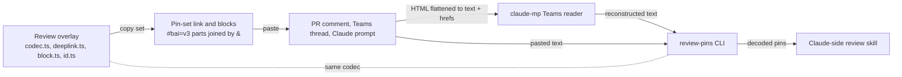

# 0002 — Pin set link grammar and a single codec

## Summary

- A pin set is `&`-repeated `#bai=v3` parts in one link:
  `#bai=v3.<id1>.<anchor1>&bai=v3.<id2>.<anchor2>…`. A single pin is the N=1
  case and is byte-identical to the existing link, so there is no version
  bump.
- The format has one reader: the review overlay's own codec, exposed as the
  `pnpm run review-pins` CLI. The Claude-side review skill runs that CLI
  instead of keeping a reimplementation.
- The Teams transport in claude-mp only reconstructs the pasted text and hands
  it to the CLI; it does not parse pins itself.

## Diagram

## Context

The dev review overlay copies one pin as `<path>?<query>#bai=v3.<id>.<anchor>`
plus a markdown block. Reviewers want to make several pins in one sitting and
hand them over as one comment with one link that shows every pin at once. The
fragment is a wire format: it is pasted into PR comments, Teams threads and
Claude prompts, and it is read back by this overlay and by the Claude-side
review skill, so its grammar is hard to change once links exist in the wild.

## Decision

A pin set is carried as **`&`-separated repetitions of the existing part**:
`#bai=v3.<id1>.<anchor1>&bai=v3.<id2>.<anchor2>…`, in set order, with the
link's path and query taken from the first pin. A single pin is the N=1 case
and is byte-identical to today's link and block. There is no version bump.

The format has **one reader**: the overlay's own codec
(`react/vite-plugins/review-overlay/client/codec.ts`, `deeplink.ts`,
`block.ts`, `id.ts`), exposed as a Node CLI (`pnpm run review-pins`). The
Claude-side skill runs that CLI from a Web UI checkout instead of keeping its
own reimplementation.

What stays in claude-mp is the **transport** in front of the format: Teams
renders a pasted block to HTML and its reader flattens it back to text with
the quote markers gone and the link moved to a separate `hrefs[]`, so that
reconstruction is Teams-shaped, not pin-shaped, and it feeds the CLI rather
than duplicating it.

## Considered options

- **`v4` set envelope** — every anchor in one compressed blob. Shorter URLs
  (deflate shares the repeated route and landmark) and a natural place for
  set-level metadata, but a second grammar, a permanent legacy path for `v3`
  links, all-or-nothing decoding of a truncated link, and every reader has to
  be revised. Rejected until set-level metadata is actually wanted; `&`
  repetition remains valid alongside it if that day comes.
- **Keeping the Python reimplementation** (`pin_parser.py` in claude-mp)
  in step with the TypeScript codec by hand. Rejected: the multi-pin change
  would have to land twice, and the two had already drifted in comments.

## Consequences

- `deeplink.ts` parses a list; the app's own fragment parts still ride along
  and are preserved.
- A pin's `at` (hence its id) is fixed when it joins the set, not when the
  set is copied, so re-copying a growing set re-emits stable ids.
- Fragment length grows linearly (≈300–500 chars per pin); a soft cap of 30
  pins keeps a link pasteable everywhere.
- Each block carries its own pin's link and the set link is emitted once after
  the last block, because repeating the set link in every block made the
  comment O(N²) — 371 KB at 30 pins, past GitHub's 65,536-character comment
  limit from 13 pins on.

## Sources

- FR-3313 (epic) and the pin-set tickets under it; FR-3855 landed the CLI.
- Decided 2026-09-04.
