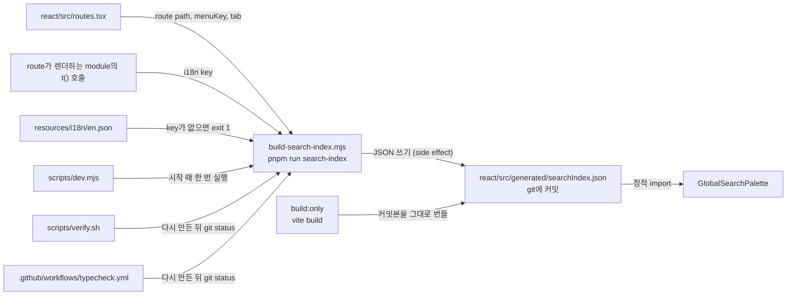

# 0003 — Committed search index artifact

## Summary

> 낯선 용어는 문서 맨 아래 [용어](#용어)에 모아 두었다.

- 전역 검색 palette가 읽는 인덱스 `react/src/generated/searchIndex.json`은 `react/scripts/build-search-index.mjs`가 `react/src/routes.tsx`와 각 route가 렌더하는 module의 i18n key에서 만들며, git에 커밋된다.
- 커밋된 파일이 유일한 원천이다. production build(`react/package.json`의 `build:only`)는 이 파일을 그대로 번들하고 다시 만들지 않는다.
- 커밋본이 source와 어긋난 상태([drift](#용어))는 두 게이트가 잡는다. `scripts/verify.sh`의 "Search index" 단계와 `.github/workflows/typecheck.yml`의 "Check for drift in the search index" step은 둘 다 인덱스를 다시 만든 뒤 `git status`에 그 파일이 dirty로 뜨면 실패한다.
- 이 파일의 merge conflict는 손으로 합치지 않는다. `.claude/rules/search-index-conflicts.md`대로 어느 한쪽을 취한 뒤 다시 만든다.
- 추출기는 `EXTERNAL_PREFIXES`에 걸리는 `packages/backend.ai-ui/`에 아예 들어가지 않으므로 BUI의 locale key는 색인하지 않는다.

## Context

- **Why an index exists**: route는 모두 `React.lazy` chunk라서 palette가 열릴 때 다른 page의 텍스트는 DOM에 없다. 그래서 `build-search-index.mjs`가 source에서 인덱스를 만들고, 인덱스는 문자열이 아니라 i18n key를 담아 22개 locale이 재색인 없이 동작한다.
- **What the artifact is**: `searchIndex.json`은 `routes.tsx`, 각 route가 transitive하게 import하는 module의 `t()` 호출, 그리고 추출기의 CONFIG block에서 결정되는 함수값이다. 같은 source에서 두 번 만들면 byte 단위로 같다(`searchIndex.test.ts`가 단언한다). 추출기가 esbuild나 import 스캔 실패를 경고로 보고한 실행에서는 일부 import edge가 빠져 결과가 달라질 수 있으므로, 그 경고가 있는 실행의 diff는 drift가 아니라 실행 환경의 문제로 본다.
- **What was wrong**: 이 결정 전에는 `build:only`도 빌드 때마다 인덱스를 다시 만들었다. 그래서 커밋본이 drift 상태여도 빌드는 성공했고, `verify.sh`의 drift 게이트는 CI가 돌리지 않는 로컬 검사라 drift 상태의 커밋본을 아무도 막지 않았다. 리뷰한 인덱스와 출하된 인덱스가 다를 수 있었다.
- **Cost of committing**: 사용자 문구를 바꾸는 거의 모든 PR이 이 큰 JSON도 바꾸므로 stack을 rebase할 때마다 conflict가 난다. FR-3558 stack 하나에서 재생성 commit이 세 번 필요했다.

## 설계도

## Decision

### 1. 산출물은 git에 커밋한다

- **Location**: `react/src/generated/searchIndex.json`. `react/src/__generated__/`가 아닌 이유는 relay-compiler가 그 디렉터리에서 자기 것이 아닌 파일을 지우기 때문이다. 이 제약은 `.claude/rules/review-ignored-paths.md`가 적어 둔 것이다.
- **Version field**: JSON의 `version`은 추출기의 `INDEX_VERSION`이고 `generatedFrom`은 추출기의 `GENERATED_FROM`, 즉 입력 파일 `react/src/routes.tsx`다. shape가 바뀌면 `INDEX_VERSION`과 `searchIndex.types.ts`의 타입을 같은 PR에서 함께 올린다.
- **Generated marks**: 세 파일이 이 산출물을 생성물로 표시한다.

| 파일 | 하는 일 |
|---|---|
| `.gitattributes` | `linguist-generated=true`로 표시해 GitHub diff에서 접는다. |
| `.prettierignore` | 포맷 대상에서 뺀다. |
| `.claude/rules/review-ignored-paths.md` | 리뷰 대상에서 빼고 `routes.tsx`와 추출기를 보게 한다. |

### 2. build는 커밋본을 그대로 쓴다

- **Build script**: `react/package.json`의 `build:only`는 `pnpm run relay`와 `vite build`만 실행한다. `search-index`는 들어 있지 않다.
- **Guard**: `searchIndex.test.ts`가 `react/package.json`의 `build:only`에 `search-index`가 들어 있지 않음을 단언한다.
- **Single source**: `GlobalSearchPalette`가 `searchIndex.types.ts`에서 정적 import하는 파일과 리뷰어가 diff에서 본 파일과 번들에 들어가는 파일이 모두 같은 커밋본이다.

### 3. drift는 로컬과 CI 두 곳에서 게이트한다

- **Local gate**: `scripts/verify.sh`의 `check_search_index_drift`가 `pnpm run search-index`를 실행한 뒤 `git status --porcelain`에 그 파일이 뜨면 실패한다.
- **CI gate**: `.github/workflows/typecheck.yml`이 relay-compiler 다음에 `pnpm run search-index`를 실행하고, Relay drift step과 같은 모양의 "Check for drift in the search index" step에서 같은 검사를 한다.
- **Shared script**: 두 게이트의 diff 부분은 `scripts/check-generated-drift.sh` 하나이고, `verify.sh`와 `typecheck.yml`은 label, 고치는 명령, 검사할 경로만 넘긴다.
- **Trigger paths**: `typecheck.yml`의 path filter에 `resources/i18n/en.json`이 들어간다. 추출기가 인덱스에 든 key를 `en.json`에서 확인하기 때문이다.

### 4. 인덱스가 참조하는 key는 en.json에 있어야 한다

- **Fatal check**: 추출기는 인덱스에 든 key 중 `resources/i18n/en.json`에 없는 것이 있으면 파일을 쓰기 전에 exit 1로 끝난다. 오타 난 key가 palette에 raw key로 보이는 일을 막는다.
- **Allowlist**: 일부러 비워 둔 key는 추출기의 `KNOWN_MISSING_KEYS`에 이유와 함께 적는다. 지금은 비어 있다.

### 5. dev 서버는 시작 때 한 번 다시 만든다

- **Dev startup**: `scripts/dev.mjs`가 시작 때 추출기를 한 번 실행한다. 실패하면 경고만 내고 커밋본을 쓴다. 개발 중의 drift는 검색 결과가 오래된 것일 뿐이라 dev 서버를 막지 않는다.

### 6. conflict는 다시 만들어서 푼다

- **Conflict resolution**: `.claude/rules/search-index-conflicts.md`가 절차를 정한다. 개발자는 어느 한쪽을 취하고 `pnpm run search-index`를 실행한 뒤 stage한다.

## 대안과 기각 사유

- **Ignore the artifact and generate before every consumer**: 파일을 `.gitignore`에 넣고 `tsc`, vitest, build, dev 앞에 생성 단계를 둔다. conflict가 사라지는 것이 장점이다. 기각한 이유는 `searchIndex.types.ts`의 정적 import 때문에 fresh checkout에서 `tsc`와 vitest가 생성 전에는 실패하고, 이 저장소의 Relay 산출물이 이미 "커밋 + drift 게이트" 관례를 쓰고 있어서 두 산출물이 다른 규칙을 따르게 되기 때문이다.
- **Regenerate inside the build**: `build:only`가 매번 인덱스를 다시 만드는 이 결정 전의 상태로, 번들이 항상 최신이라는 것이 장점이다. 기각한 이유는 drift 상태의 커밋본이 머지되어도 아무것도 실패하지 않기 때문이다.
- **Fail the build on drift**: 추출기에 `--check`를 두고 `build:only`가 커밋본과 새 빌드가 다르면 실패하게 한다. 조용히 다른 인덱스를 출하하는 일이 없어지는 것이 장점이다. 기각한 이유는 CI의 drift step이 같은 경우를 PR 단계에서 먼저 잡고, build 단계의 검사는 그것과 중복되기 때문이다.

## Consequences

- **Skipped verify is caught**: `verify.sh`를 돌리지 않은 PR도 `typecheck.yml`이 drift와 `en.json`에 없는 key를 잡는다.
- **Advisory in CI**: `typecheck.yml`은 path filter가 event 수준에 있어 required check로 올릴 수 없다. filter에 걸리지 않은 PR은 check-run 자체가 만들어지지 않기 때문이다. 다만 그 filter의 `react/**`와 `resources/i18n/en.json`이 인덱스의 입력을 모두 덮으므로 인덱스를 바꿀 수 있는 PR은 전부 이 workflow를 띄운다. 남는 것은 개발자가 실패한 check를 그대로 두고 머지할 수 있다는 점뿐이고, Relay drift check도 같은 처지다.
- **BUI is not indexed**: 추출기의 `EXTERNAL_PREFIXES`가 `packages/backend.ai-ui/`를 걸러 그 안으로 들어가지 않는데, BUI가 자기 i18next instance와 `packages/backend.ai-ui/src/locale/`의 locale 파일을 따로 쓰기 때문이다. 그래서 page의 UI를 BUI component가 그리는 route는 host 쪽 key만 색인되어 검색 결과가 얇다.

## 출처

- Jira: FR-3558 (global search palette). GitHub: #8811의 리뷰(2026-09-09), `react/package.json:99`와 review body의 (1)번 질문.
- 결정일: 2026-09-09.
- 관련: `.claude/rules/search-index-conflicts.md`, `.claude/rules/review-ignored-paths.md`. 이웃한 ADR은 없다.

## 용어

| 용어 | 뜻 |
|---|---|
| drift | 커밋된 산출물과 지금 source에서 새로 만든 산출물이 다른 상태다. `verify.sh`와 `typecheck.yml`은 다시 만든 뒤 `git status`로 이것을 잡는다. |
