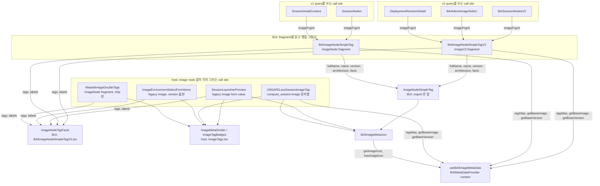

# 0004 — Container image meta row

## Summary

> 낯선 용어는 문서 맨 아래 [용어](#용어)에 모아 두었다.

- container image 한 개의 identity를 보여주는 화면은 image node의 schema에 맞는 BUI component를 쓴다. v2 `ImageV2` node는 `packages/backend.ai-ui/src/components/fragments/BAIImageNodeSimpleTagV2.tsx`의 `BAIImageNodeSimpleTagV2`가, v1 `ImageNode`는 같은 폴더의 `BAIImageNodeSimpleTag`가 그린다. 둘 다 image의 icon, 이름, version, architecture, tag chip, 그리고 full reference를 복사하는 control을 한 줄에 그린다.
- 두 component의 prop은 `imageFrgmt`, `withoutTag`, `copyable` 셋뿐이다. 이름, version, architecture, chip, 복사할 문자열은 모두 fragment가 읽은 node에서 파생한다. 문자열을 넘기는 prop은 없다.
- v2 component는 v2 query를 쓰는 곳에서만 쓰고, v1 query를 쓰는 곳은 v1 component를 쓴다. fragment가 필요하면 query에 spread한다.
- image node가 없는 화면은 host가 각자 같은 모양의 행을 그린다. session launcher 리뷰 단계의 form value, session 상세의 `compute_session.image` 문자열, 환경 선택 dropdown의 legacy `Image` 객체가 그렇다. 구분선과 chip은 `react/src/components/ImageTags.tsx`가 export하는 `ImageMetaDivider`와 `ImageTagBadges`를 쓴다.
- tag chip을 [double tag](#용어)로 그릴지 badge 하나로 그릴지는 BUI의 `imageNodeTagFacts` 하나가 정한다. v1, v2, host 세 곳이 같은 fact로 chip을 그리고, chip 색을 호출자가 고르는 prop은 없다.
- 구분선과 chip은 BUI가 따로 export하지 않는다. 두 component가 함께 쓰는 `ImageNodeSimpleTag` module의 지역 component이고, 그 module도 export하지 않는다. Astryx `Divider`를 `orientation="vertical"`로 직접 쓰면 `BAIFlex` 안에서 높이가 0으로 접히므로, 그 metric을 그 module이 고정한다.
- Full image path 열은 행이 아니라 reference 문자열이다. `BAIText monospace copyable ellipsis`로 그린다.
- 이 저장소가 지원하는 가장 낮은 manager는 26.4.x이고 [extended image info](#용어)는 24.12.0부터 켜지므로, 그 이전 manager를 위한 image 표현은 모두 지웠다.
- 범위 밖: 화면 세 곳은 image 행을 그리지 않는다. 환경 선택 dropdown의 환경 목록, session launcher가 손으로 입력받은 image 문자열, 그리고 session template 표의 축약 label이다.

## Context

- **What the components are**: `BAIImageNodeSimpleTagV2`는 v2 `ImageV2` fragment를 읽어 image 한 개의 행을 그린다. `BAIImageNodeSimpleTag`는 v1 `ImageNode` fragment를 읽어 같은 행을 그린다. 한쪽이 다른 쪽을 부르지 않는다. 행의 markup은 같은 폴더의 `ImageNodeSimpleTag`가 문자열과 chip fact를 prop으로 받아 그리고, 둘 다 그것을 부른다. `ImageNodeSimpleTag`는 barrel이 export하지 않는다.
- **Why a decision is needed**: 같은 image reference `cr.backend.ai/stable/python-tensorflow:2.15-py39-cuda12.4-ubuntu20.04@x86_64`가 화면마다 다르게 보였다. 아래 여섯 곳이 그 image를 각자 그리고 있었다.

| 위치 | 그린 방식 |
|---|---|
| `react/src/components/ImageNodeSimpleTag.tsx` | icon, `BAIText`로 그린 세 부분, 직접 쓴 `Divider`, tag chip, `BAIText copyable` |
| `packages/backend.ai-ui/src/components/fragments/BAIImageNodeSimpleTagV2.tsx` | icon, Astryx `Text`로 그린 세 부분, 직접 쓴 `Divider`, tag chip, `BAIText copyable` |
| `react/src/components/SessionLauncherPreview.tsx` | 같은 행을 `supportExtendedImageInfo` 분기마다 한 벌씩. FR-3544의 `ImageMetaDivider`와 `ImageTagBadges`는 썼지만 icon, 세 부분, copy control은 두 분기가 따로 조립했고 copy control은 이 파일 안의 `CopyValueIconButton`이었다 |
| `react/src/components/ImageTags.tsx`의 `UNSAFELazySessionImageTag` | 행이 아니라 다른 모양. 이름과 version을 blue/green double tag로, base image와 architecture를 각각 badge로 |
| `react/src/components/ImageList.tsx`의 Full image path 열 | reference 문자열. `BAIText copyable ellipsis`, monospace 아님 |
| `react/src/components/CustomizedImageList.tsx`의 Full image path 열 | reference 문자열. `BAIText monospace copyable`, ellipsis 없음 |

- **Collapsed dividers**: `ImageNodeSimpleTag`와 `BAIImageNodeSimpleTagV2`는 `Divider orientation="vertical"`을 `marginInline: 0`으로 직접 썼다. Astryx의 vertical `Divider`는 `height: 100%`이고 `BAIFlex`의 기본값은 `align="center"`이므로 그 높이가 0으로 접혀, session 목록과 session 상세에서 구분선이 아예 보이지 않았다. FR-3544가 `ImageTags.tsx`에 만든 `ImageMetaDivider`는 이 metric을 이미 고쳐 두었지만 session launcher 경로만 그것을 썼다.
- **Four copies of the chip rule**: double tag 판정 규칙이 `ImageTags.tsx`의 `imageTagFacts` / `imageNodeTagFacts`, `AliasedImageDoubleTags`, `ImageNodeSimpleTag`, `BAIImageNodeSimpleTagV2` 네 곳에 복제돼 있었다. chip 색도 갈렸다. FR-3544의 `ImageTagBadges`는 blue를 박아 두었고, 나머지 셋은 customized가 아닌 tag에 `undefined`나 호출자가 넘긴 `color`를 넘겨 `badgeVariantForTagColor`가 neutral을 냈다. `ImageList`만 `color="blue"`를 넘겨서, 같은 Tags 열이 `ImageList`에서는 blue이고 `CustomizedImageList`에서는 neutral이었다.
- **Divergent type scale**: `ImageNodeSimpleTag`는 각 부분을 `BAIText`로 그렸고 나머지 두 곳은 Astryx `Text`로 그렸다. `BAIText`는 antd 시절의 metric을, Astryx `Text`는 Astryx의 type scale과 색을 쓴다.
- **A host twin of the icon**: `react/src/components/ImageMetaIcon.tsx`가 BUI의 `BAIImageMetaIcon`과 같은 일을 하는 component로 남아 있었다. `.claude/rules/bui-component-home.md`가 금지하는 same-purpose twin이다.
- **Two schemas, two kinds of query**: `image_nodes`, `customized_images`, `KernelNode.image`는 v1 `ImageNode`를 돌려주고, `adminImagesV2`, `SessionV2.images`, `Revision.imageV2`는 v2 `ImageV2`를 돌려준다. session launcher의 `images`는 둘 다 아닌 legacy `Image` 객체이고, `ComputeSession.image`는 문자열이다. 한 fragment로 네 입력을 덮을 수 없다.

## 설계도

## Decision

### 1. schema마다 component가 하나씩 있고, prop은 셋뿐이다

| component | fragment | 이름 | version | architecture | 복사하는 문자열 |
|---|---|---|---|---|---|
| `BAIImageNodeSimpleTagV2` | `BAIImageNodeSimpleTagV2Fragment on ImageV2` | `tagAlias(getBaseImage(reference))` | `getBaseVersion(reference)` | `identity.architecture` | `identity.canonicalName`에 `@architecture`를 붙인 것 |
| `BAIImageNodeSimpleTag` | `BAIImageNodeSimpleTagFragment on ImageNode` | `tagAlias(base_image_name)` | `version` | `architecture` | `registry/namespace:tag`에 `@architecture`를 붙인 것 |

- **Same three props**: 두 component는 `imageFrgmt`, `withoutTag`, `copyable`만 받는다. `withoutTag`는 chip과 그 앞 구분선을 빼고, `copyable={false}`는 copy control을 뺀다. 이 이름은 antd 시절부터 call site가 쓰던 것이고, `.claude/rules/component-props-extension.md`가 그 어휘를 바꾸지 말라고 정한다.
- **Everything else is derived**: 이름, version, architecture, chip, 복사할 문자열을 넘기는 prop은 없다. v2 `identity.canonicalName`에는 architecture가 들어 있지 않으므로 `@architecture`를 붙인 reference에서 이름과 version을 뽑는다. `architecture`는 두 schema 모두 nullable이라 없으면 `@`를 붙이지 않는다.
- **No string input**: 문자열로 행을 그리는 입구는 없다. node가 있으면 fragment를 spread하고, 없으면 host가 그린다(3항). prop 확장이 필요해지면 별도 이슈로 다룬다.
- **Provider requirement**: icon과 alias와 base name/version 분리는 `useBAIImageMetaData`에서 오므로 두 component는 `BAIMetaDataProvider` 안에 있어야 한다. host app은 `react/src/components/DefaultProviders.tsx`에서 app 전체를 그 provider로 감싸고 `imagePath="resources/icons"`를 넘긴다.

### 2. v2 component는 v2 query에서만, v1 component는 v1 query에서만 쓴다

| call site | query가 돌려주는 type | component |
|---|---|---|
| `BAISessionNodesV2`의 Environments 열 | `SessionV2.images` → `ImageV2` | `BAIImageNodeSimpleTagV2 withoutTag copyable={false}` |
| `BAIAdminImageSelect`의 popup 옵션 | `adminImagesV2` → `ImageV2` | `BAIImageNodeSimpleTagV2 copyable={false}`를 `labelContent`로 |
| `DeploymentRevisionDetail`의 Image | `Revision.imageV2` → `ImageV2` | `BAIImageNodeSimpleTagV2` |
| `SessionNodes`의 Environments 열 | `KernelNode.image` → `ImageNode` | `BAIImageNodeSimpleTag withoutTag copyable={false}` |
| `SessionDetailContent`의 Environments | `KernelNode.image` → `ImageNode` | `BAIImageNodeSimpleTag` |

- **Spread the fragment**: call site는 자기 query의 image node에 `...BAIImageNodeSimpleTagV2Fragment` 또는 `...BAIImageNodeSimpleTagFragment`를 spread하고 그 node를 `imageFrgmt`로 넘긴다. node를 plain object로 다시 조립하지 않는다.
- **Never cross**: v1 `ImageNode`를 v2 component에, v2 `ImageV2`를 v1 component에 넘기지 않는다. fragment type이 막는다.

### 3. image node가 없는 화면은 host가 각자 그린다

| call site | 가진 것 | 그리는 것 |
|---|---|---|
| `SessionLauncherPreview`의 Image | `images` query가 준 legacy `Image` form value | icon, `tagAlias(base_image_name)`, `version`, `architecture`, chip, `BAIText copyable` |
| `UNSAFELazySessionImageTag` | `compute_session.image` 문자열과 `architecture` | icon, `tagAlias(getBaseImage(...))`, `getBaseVersion(...)`, `architecture`. tag가 없으므로 chip이 없다 |
| `ImageEnvironmentSelectFormItems`의 version 옵션 | legacy `Image` 객체 | `version`, `architecture`, chip. 같은 환경의 옵션은 이름이 같으므로 icon과 이름을 뺀다 |
| `AliasedImageDoubleTags` | `ImageNode` fragment | chip만. 이미지 목록의 Tags 열이 쓴다 |

- **Shared parts live in `ImageTags.tsx`**: 구분선 `ImageMetaDivider`와 chip 행 `ImageTagBadges`는 FR-3544가 이 파일에 만든 것이고, 위 네 곳이 그것을 쓴다. `ImageTagBadges`는 BUI의 `BAIImageTagFact` 배열을 받고 검색어 highlight를 지원한다.
- **Same shape**: 행은 `BAIFlex direction="row" wrap="wrap" gap="xxs"` 안에 Astryx `Text`로 부분을 늘어놓고 사이마다 `ImageMetaDivider`를 둔다. BUI의 두 component가 그리는 모양과 같다.
- **Why not a fragment**: session launcher의 `images` query는 legacy `Image` type을 돌려주고 form value로 들어와 Relay를 거치지 않는다. `ComputeSession.image`는 node가 아니라 문자열이다. 두 곳은 spread할 fragment가 없다.

### 4. tag chip 규칙은 fact builder 하나에 있다

- **`BAIImageTagFact`**: chip 하나의 표시 사실을 담는 type이다. `key`, `value`, `isCustomized`, `aliasedTag`, `isDouble`, `keyAlias` 여섯 field를 가지며 BUI가 export한다.
- **`imageNodeTagFacts`**: image node의 `tags`와 `labels`를 받는 유일한 builder다. key에 `customized_`가 든 tag를 customized로 보고, 값이 hash라서 읽을 수 있는 이름을 `ai.backend.customized-image.name` label에서 가져온다. v1 schema의 tag `value`는 nullable이므로 빈 문자열로 다룬다.
- **Who calls it**: image node의 `tags`를 가진 call site가 직접 부른다. `BAIImageNodeSimpleTag`, `BAIImageNodeSimpleTagV2`, `AliasedImageDoubleTags`, `SessionLauncherPreview`, `ImageEnvironmentSelectFormItems`가 그렇게 하고, 새 call site도 이 builder를 부르지 직접 판정하지 않는다.
- **Colour**: customized tag는 cyan, 나머지는 blue다. 호출자가 색을 넘기는 prop은 없다.
- **Tags without a key**: key가 빈 tag는 alias할 것이 없으므로 chip을 그리지 않는다.
- **Empty means no divider**: fact가 하나도 없으면 chip 행과 그 앞 구분선을 둘 다 그리지 않는다.

### 5. 구분선과 chip은 BUI가 export하지 않는다

- **Module-local in BUI**: 구분선과 chip 행은 `packages/backend.ai-ui/src/components/fragments/ImageNodeSimpleTag.tsx`의 지역 component다. `BAIImageNodeSimpleTag`와 `BAIImageNodeSimpleTagV2`는 fragment에서 파생한 `fullName`, `name`, `version`, `architecture`, `facts`를 그 module의 `ImageNodeSimpleTag`에 넘겨 행을 그린다. barrel이 export하는 image component는 그 둘과 `imageNodeTagFacts`, `BAIImageTagFact`뿐이고, `ImageNodeSimpleTag`는 export하지 않는다.
- **Host parts in host**: node 없이 행을 그리는 host 화면은 `ImageTags.tsx`의 `ImageMetaDivider`와 `ImageTagBadges`를 쓴다.
- **Fixed metrics**: 구분선은 `alignSelf: center`, `height: 0.9em`, `marginInline: token.marginXXS`로 고정한 `Divider`다. Astryx `Divider`를 `orientation="vertical"`로 직접 쓰면 flex row 안에서 높이가 0으로 접힌다.

### 6. Full image path 열은 reference 문자열이다

- **Not a row**: `ImageList`와 `CustomizedImageList`의 Full image path 열은 사람이 읽는 identity가 아니라 기계가 읽는 reference라 image 행을 그리지 않는다. 두 열 모두 `BAIText monospace copyable ellipsis={{ tooltip: true }}`다.
- **Why one line**: Astryx table cell은 `white-space: nowrap; overflow: hidden`이라 잘리지 않은 path는 줄바꿈되지 않고 잘린다. 한 줄 truncation과 tooltip이 전체 값을 닿게 한다. 두 열은 폭이 `token.screenXS`로 묶여 있다.
- **Search highlight**: `CustomizedImageList`는 검색어를 받으므로 `TextHighlighter`로 감싼다.

### 7. 공용 component는 BUI에 산다

- **Home**: 두 image component는 `packages/backend.ai-ui/src/components/fragments/`에 있다. `.claude/rules/bui-component-home.md`가 정한 자리다.
- **The icon twin is retired**: host의 `react/src/components/ImageMetaIcon.tsx`를 지우고 call site를 `BAIImageMetaIcon`으로 옮겼다. 두 component는 같은 metadata를 읽어 같은 icon과 같은 fallback glyph를 그렸고, BUI 쪽은 `imagePath`가 없으면 null을 그리는 점만 달랐다. host app은 늘 `imagePath`를 넘긴다.
- **Host side**: host에 남는 image 관련 code는 host query나 host form value가 필요한 것뿐이다. `ImageTags.tsx`의 `ImageMetaDivider`, `ImageTagBadges`, `UNSAFELazySessionImageTag`와 `AliasedImageDoubleTags`다.

### 8. 24.12 이전 manager를 위한 image 표현은 없다

- **Support floor**: 이 저장소가 지원하는 가장 낮은 manager는 26.4.x다. `extended-image-info`는 `packages/backend.ai-client/src/client.ts`에서 manager 24.12.0부터 켜지므로, 이 flag는 지원 범위 안에서 늘 참이다.
- **What went**: 그 flag의 거짓 분기가 그리던 image 표현을 모두 지웠다. host의 `ImageTags` component, `CustomizedImageList`의 Namespace/Version/Base/Tags 레거시 열 네 개, `ImageEnvironmentSelectFormItems`의 version 옵션 레거시 행, `SessionLauncherPreview`의 두 번째 복제본이다.
- **Parsers that went with them**: image 문자열에서 tag와 base image를 다시 parse하던 `getTags`와 `getBaseImages`를 host의 `imageParser`에서 지웠고, 그것을 받던 `imageTagFacts`도 지웠다. 서버가 `tags`를 직접 주므로 다시 parse할 이유가 없다.
- **Search coverage**: `CustomizedImageList`의 검색은 이제 서버가 준 `tags`, `version`, `namespace`, `digest`, 전체 reference만 본다. 다시 parse한 base version과 base image는 같은 값을 중복으로 훑던 것이라 함께 지웠다.
- **New code**: `supports('extended-image-info')`로 갈리는 분기를 새로 만들지 않는다.

## 대안과 기각 사유

- **One row component that also takes strings**: `BAIImageNodeSimpleTagV2`가 `imageFrgmt` 대신 `fullName`, `name`, `version`, `architecture`, `tags`, `variant`를 받아 v1 adapter, launcher form value, `compute_session.image` 문자열까지 한 markup으로 그리는 형태다. 행 markup이 한 벌인 것이 장점이다. 기각한 이유는 v2 component의 prop 표면이 v1과 달라져 같은 일을 하는 두 component가 다른 계약을 갖게 되고, fragment를 spread하면 되는 곳에서도 문자열을 조립해 넘기는 adapter가 생기기 때문이다. 문자열을 받는 행은 export하지 않는 `ImageNodeSimpleTag`로만 두어, 그 markup을 한 벌로 유지하면서도 call site는 fragment만 넘긴다. v2 component에 새 prop이 필요해지면 별도 이슈로 다룬다.
- **One fragment-reading component for both schemas**: 공용 component 하나가 v1과 v2를 모두 읽는 형태다. 기각한 이유는 Relay fragment가 한 type에만 선언되기 때문이다. v1 `ImageNode`와 v2 `ImageV2`는 schema가 다르다.
- **Keep the shared component in the host app**: v1 화면이 모두 host에 있으니 이동 거리가 짧은 것이 장점이다. 기각한 이유는 BUI의 `BAISessionNodesV2`와 `BAIAdminImageSelect`가 같은 행을 쓰는데 BUI가 host를 import할 수 없고, `.claude/rules/bui-component-home.md`가 재사용 component의 집을 BUI로 정해 두었기 때문이다.
- **The chips and the divider as exported BUI components**: 둘을 각각 component로 두고 barrel이 export해 host도 그것을 쓰는 형태다. host의 `ImageMetaDivider`와 `ImageTagBadges`가 없어지는 것이 장점이다. 기각한 이유는 부품 셋을 따로 export하면 행을 조립하는 hop이 늘고, 두 image component가 부품에 묶이기 때문이다. host의 두 부품은 FR-3544가 만든 자리에 그대로 둔다.
- **An icon on the Full image path column too**: 표의 Full image path 열도 한눈에 framework를 알아볼 수 있는 것이 장점이다. 기각한 이유는 그 열의 폭이 `token.screenXS`로 묶여 있어 icon이 차지하는 만큼 reference가 잘리고, 그 열은 복사해서 쓰는 값이기 때문이다.
- **Convert every surface that shows an image icon**: session template 표의 Environments 열처럼 icon과 이름을 함께 보여주는 자리를 모두 행으로 바꾸는 형태다. 예외를 세지 않아도 되는 것이 장점이다. 기각한 이유는 그런 자리가 image 한 개의 identity가 아니라 좁은 cell에 넣는 축약 label이라, 행으로 바꾸면 architecture와 copy control이 딸려 들어와 폭을 넘기기 때문이다.

## Consequences

- **Dividers become visible**: session 목록과 session 상세의 image 행에서 구분선이 처음으로 보인다.
- **One type scale**: `ImageNodeSimpleTag`가 그리던 세 부분이 `BAIText`에서 Astryx `Text`로 바뀌어, session launcher 리뷰 단계와 같은 글자 크기와 색이 된다.
- **Full image path becomes monospace everywhere**: `ImageList`의 Full image path 열이 monospace가 되고, `CustomizedImageList`의 같은 열에 truncation tooltip이 생긴다.
- **Neutral chips become blue**: 지금까지 neutral이던 chip이 모두 blue가 된다. session 목록과 session 상세의 image 행, `CustomizedImageList`의 Tags 열이 그 대상이고, `ImageList`의 Tags 열과 session launcher 경로는 이미 blue였다. `CustomizedImageList`의 Tags 열 badge는 검색어 highlight도 받게 된다.
- **Session detail fallback changes shape**: image node가 없는 session의 상세 화면이 blue/green double tag 표현에서 icon, 이름, version, architecture의 행으로 바뀐다. 이 경로에는 tag 정보가 없으므로 chip은 없다.
- **The launcher copy control loses its custom label**: session launcher 리뷰 단계의 copy control이 "Copy Image" tooltip 대신 다른 행과 같은 BUI의 일반 Copy label을 쓴다.
- **Empty chips and empty parts disappear**: key가 빈 tag가 그리던 빈 badge가 사라지고, chip이 없는 image는 chip 앞 구분선도 그리지 않는다.
- **The chip loop exists three times**: v1 component, v2 component, host의 `ImageTagBadges`가 같은 fact를 같은 규칙으로 그린다. 판정은 `imageNodeTagFacts` 한 곳에 있으므로 규칙이 갈리지는 않지만, chip의 markup을 바꾸려면 세 곳을 같이 고쳐야 한다.
- **Three surfaces stay outside the row**: 환경 선택 dropdown의 환경 목록, 손으로 입력한 image 문자열, 그리고 `react/src/components/SessionTemplateModal.tsx`의 Environments 열은 image 행을 그리지 않는다. 앞의 둘은 image 하나의 identity가 아니고, 마지막은 폭이 250px로 묶인 cell에 넣는 축약 label이라 architecture와 copy control이 들어갈 자리가 없다. 셋 다 `BAIImageMetaIcon`은 쓴다.

## 출처

- Jira: FR-3182. GitHub: lablup/backend.ai-webui#7995.
- 선행 수정: FR-3544가 `ImageMetaDivider`, `ImageTagBadges`와 tag fact 개념을 host의 `ImageTags.tsx`에 만들어 session launcher 경로에 적용했고, FR-3587이 icon 없는 image의 fallback glyph를 theme 색으로 바꿨다.
- 결정일: 2026-09-11. 2026-09-15에 두 component의 prop을 `imageFrgmt`, `withoutTag`, `copyable` 셋으로 줄이고 문자열 입력을 없앴다.
- 관련: `.claude/rules/bui-component-home.md`가 공용 component의 집을, `.claude/rules/component-props-extension.md`가 wrapper의 props base와 얼어붙은 prop 어휘를 정한다. 이웃한 ADR은 없다.

## 용어

| 용어 | 뜻 |
|---|---|
| image meta row | image 하나의 icon, 이름, version, architecture, tag chip을 한 줄에 늘어놓은 표현이다. |
| double tag | 붙어 있는 badge 두 개로 `key`와 `value`를 나란히 보여주는 chip이다. `BAIDoubleTag`가 그리고, metadata에 그 tag의 alias가 없거나 그 tag가 customized image의 것일 때 쓴다. |
| extended image info | 서버가 image의 `namespace`, `base_image_name`, `version`, `tags`를 따로 제공하는 기능이다. `baiClient.supports('extended-image-info')`로 판정하고, 지원하지 않는 서버에서는 같은 정보를 image 문자열에서 parse한다. |
