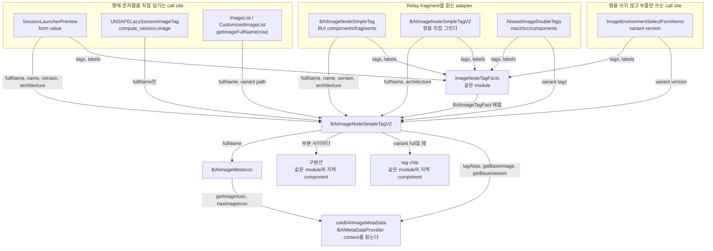

# 0004 — Container image meta row

## Summary

> 낯선 용어는 문서 맨 아래 [용어](#용어)에 모아 두었다.

- container image 한 개의 identity를 보여주는 화면은 `packages/backend.ai-ui/src/components/fragments/BAIImageNodeSimpleTagV2.tsx`의 `BAIImageNodeSimpleTagV2`를 쓴다. image의 icon, 이름, version, architecture, tag chip, 그리고 full reference를 복사하는 control을 이 component가 그린다. 행과 fragment 읽기 사이에 다른 component를 두지 않는다.
- `variant` prop이 surface를 가른다. `full`은 tag chip까지 그리고, `compact`는 chip을 뺀 행을 그리고, `path`는 같은 reference를 monospace 한 줄로 그린다.
- tag chip을 [double tag](#용어)로 그릴지 badge 하나로 그릴지는 같은 module의 `imageNodeTagFacts`가 정한다. FR-3544가 host의 `react/src/components/ImageTags.tsx`에 만든 규칙을 옮긴 것이고, chip 색을 호출자가 고르는 prop은 없앴다.
- 구분선과 chip은 별도 component가 아니라 이 module 안의 지역 component다. Astryx `Divider`를 `orientation="vertical"`로 직접 쓰면 `BAIFlex` 안에서 높이가 0으로 접히므로, 그 metric을 이 module이 고정한다.
- schema가 둘이므로 component도 둘이다. v2 `ImageV2`는 `BAIImageNodeSimpleTagV2`가, v1 `ImageNode`는 `BAIImageNodeSimpleTag`가 각자 읽고 각자 같은 행을 그린다. 둘이 공유하는 것은 chip 판정을 하는 `imageNodeTagFacts` 하나뿐이다.
- fragment가 없는 call site는 `BAIImageNodeSimpleTagV2`에 `imageFrgmt` 대신 `fullName`과 `variant`를 넘긴다.
- 이 저장소가 지원하는 가장 낮은 manager는 26.4.x이고 [extended image info](#용어)는 24.12.0부터 켜지므로, 그 이전 manager를 위한 image 표현은 모두 지웠다.
- 범위 밖: 화면 세 곳은 이 component를 쓰지 않는다. 환경 선택 dropdown의 환경 목록, session launcher가 손으로 입력받은 image 문자열, 그리고 session template 표의 축약 label이다.

## Context

- **What the components are**: `BAIImageNodeSimpleTagV2`는 v2 `ImageV2` fragment를 읽거나 호출자가 이미 가진 문자열을 받아 image 한 개의 표현을 그린다. `BAIImageNodeSimpleTag`는 v1 `ImageNode` fragment를 읽어 같은 행을 그린다. 한쪽이 다른 쪽을 부르지 않는다.
- **Why a decision is needed**: 같은 image reference `cr.backend.ai/stable/python-tensorflow:2.15-py39-cuda12.4-ubuntu20.04@x86_64`가 화면마다 다르게 보였다. 아래 여섯 곳이 그 image를 각자 그리고 있었다.

| 위치 | 그린 방식 |
|---|---|
| `react/src/components/ImageNodeSimpleTag.tsx` | icon, `BAIText`로 그린 세 부분, 직접 쓴 `Divider`, tag chip, `BAIText copyable` |
| `packages/backend.ai-ui/src/components/fragments/BAIImageNodeSimpleTagV2.tsx` | icon, Astryx `Text`로 그린 세 부분, 직접 쓴 `Divider`, tag chip, `BAIText copyable` |
| `react/src/components/SessionLauncherPreview.tsx` | 같은 행을 `supportExtendedImageInfo` 분기마다 한 벌씩. FR-3544의 `ImageMetaDivider`와 `ImageTagBadges`는 썼지만 icon, 세 부분, copy control은 두 분기가 따로 조립했고 copy control은 이 파일 안의 `CopyValueIconButton`이었다 |
| `react/src/components/ImageTags.tsx`의 `UNSAFELazySessionImageTag` | 행이 아니라 다른 모양. 이름과 version을 blue/green double tag로, base image와 architecture를 각각 badge로 |
| `react/src/components/ImageList.tsx`의 Full image path 열 | 행이 아니라 reference 문자열. `BAIText copyable ellipsis`, monospace 아님 |
| `react/src/components/CustomizedImageList.tsx`의 Full image path 열 | 행이 아니라 reference 문자열. `BAIText monospace copyable`, ellipsis 없음 |

- **Collapsed dividers**: `ImageNodeSimpleTag`와 `BAIImageNodeSimpleTagV2`는 `Divider orientation="vertical"`을 `marginInline: 0`으로 직접 썼다. Astryx의 vertical `Divider`는 `height: 100%`이고 `BAIFlex`의 기본값은 `align="center"`이므로 그 높이가 0으로 접혀, session 목록과 session 상세에서 구분선이 아예 보이지 않았다. FR-3544가 `ImageTags.tsx`에 만든 `ImageMetaDivider`는 이 metric을 이미 고쳐 두었지만 session launcher 경로만 그것을 썼다.
- **Four copies of the chip rule**: double tag 판정 규칙이 `ImageTags.tsx`의 `imageTagFacts` / `imageNodeTagFacts`, `AliasedImageDoubleTags`, `ImageNodeSimpleTag`, `BAIImageNodeSimpleTagV2` 네 곳에 복제돼 있었다. chip 색도 갈렸다. FR-3544의 `ImageTagBadges`는 blue를 박아 두었고, 나머지 셋은 customized가 아닌 tag에 `undefined`나 호출자가 넘긴 `color`를 넘겨 `badgeVariantForTagColor`가 neutral을 냈다. `ImageList`만 `color="blue"`를 넘겨서, 같은 Tags 열이 `ImageList`에서는 blue이고 `CustomizedImageList`에서는 neutral이었다.
- **Divergent type scale**: `ImageNodeSimpleTag`는 각 부분을 `BAIText`로 그렸고 나머지 두 곳은 Astryx `Text`로 그렸다. `BAIText`는 antd 시절의 metric을, Astryx `Text`는 Astryx의 type scale과 색을 쓴다.
- **A host twin of the icon**: `react/src/components/ImageMetaIcon.tsx`가 BUI의 `BAIImageMetaIcon`과 같은 일을 하는 component로 남아 있었다. `.claude/rules/bui-component-home.md`가 금지하는 same-purpose twin이다.

## 설계도

## Decision

### 1. image identity는 `BAIImageNodeSimpleTagV2`가 그린다

- **Single renderer**: container image 한 개의 identity를 보여주는 화면은 `BAIImageNodeSimpleTagV2`를 쓴다. `BAIImageMetaIcon`, Astryx `Text`, divider, chip을 call site에서 손으로 조립하지 않는다.
- **Two inputs, one markup**: `imageFrgmt`로 `ImageV2` fragment를 받거나, `fullName`·`name`·`version`·`architecture`·`tags`를 문자열과 배열로 받는다. 그래서 v1 schema, launcher form value, `compute_session.image` 문자열이 모두 같은 행으로 들어간다.
- **Props base**: `BAIImageNodeSimpleTagV2Props`는 `Omit<React.HTMLAttributes<HTMLElement>, 'children'>`를 extend하고, 남은 prop을 root로 넘긴다. root는 `full`과 `compact`에서 `BAIFlex`, `path`에서 `BAIText`라 둘 다 받는 DOM 타입을 base로 쓴다. `.claude/rules/component-props-extension.md`가 정한 두 번째 경우다.
- **Provider requirement**: icon과 alias는 `useBAIImageMetaData`에서 오므로 세 variant 모두 `BAIMetaDataProvider` 안에 있어야 한다. host app은 `react/src/components/DefaultProviders.tsx`에서 app 전체를 그 provider로 감싸고 `imagePath="resources/icons"`를 넘긴다.

### 2. variant 세 개가 surface를 나눈다

| variant | 그리는 것 | 쓰는 곳 |
|---|---|---|
| `full` | icon, 이름, version, architecture, tag chip, copy control | session 상세의 Environments, session launcher 리뷰 단계의 Image |
| `version` | `full`에서 icon과 이름과 copy control을 뺀 것 | 환경 선택 dropdown의 version 옵션 |
| `tags` | tag chip만 | 이미지 목록의 Tags 열 |
| `compact` | `full`에서 tag chip과 그 앞 divider를 뺀 것 | session 목록의 Environments 열, session 상세에서 image node가 없을 때의 fallback |
| `path` | 같은 reference를 monospace 한 줄로, truncation tooltip과 copy control을 붙여서 | 이미지 목록과 customized 이미지 목록의 Full image path 열 |

- **Defaults**: `variant`는 `full`, `copyable`은 `true`다. `copyLabel`은 copy control의 tooltip이고 넘기지 않으면 BUI의 일반 Copy label을 쓴다.
- **`tags` is only read by `full`**: `compact`는 `tags`를 받아도 무시하고, `full`은 `tags`가 비면 chip과 그 앞 divider를 둘 다 그리지 않는다. 그래서 tag가 없는 image는 두 variant가 같은 행을 그린다.
- **Why `path` carries no icon**: `path`는 사람이 읽는 identity가 아니라 기계가 읽는 reference다. 두 Full image path 열은 폭이 `token.screenXS`로 묶여 있어 icon이 들어가면 잘리는 글자가 늘어난다. 한 줄 truncation은 호출자가 폭을 묶어 줄 때만 뜻이 있으므로, `path`를 쓰는 열은 폭을 정해야 한다.
- **`highlightKeyword`**: 검색어로 걸러지는 목록만 넘긴다. 넘기면 행의 모든 부분과 chip이 같은 규칙으로 highlight된다.

### 3. 부분값은 `fullName`에서 파생하고 호출자가 덮어쓴다

- **Derived by default**: `name`은 `tagAlias(getBaseImage(fullName))`, `version`은 `getBaseVersion(fullName)`, `architecture`는 `fullName`의 `@` 뒤 부분이다. 호출자가 아무것도 넘기지 않으면 `fullName` 하나로 행이 완성된다.
- **Empty means derive**: 세 override는 비어 있으면 파생값으로 되돌아간다. adapter는 server field를 그대로 넘기고 그 field는 nullable이므로, 빈 값을 그대로 그리면 이름 자리가 빈 채로 남는다. v2 adapter처럼 `architecture`만 넘기는 call site도 나머지 두 자리를 `fullName`에서 얻는다.
- **Overridden where the server knows better**: [extended image info](#용어)를 지원하는 서버는 `base_image_name`과 `version`을 따로 준다. 그 값이 있으면 adapter가 넘겨 문자열 parsing 대신 server 값을 쓴다.

### 4. tag chip 규칙은 fact builder 하나에 있다

- **`BAIImageTagFact`**: chip 하나의 표시 사실을 담는 type이다. `key`, `value`, `isCustomized`, `aliasedTag`, `isDouble`, `keyAlias` 여섯 field를 가지며 같은 module이 export한다.
- **`imageNodeTagFacts`**: image node의 `tags`와 `labels`를 받는 유일한 builder다. key에 `customized_`가 든 tag를 customized로 보고, 값이 hash라서 읽을 수 있는 이름을 `ai.backend.customized-image.name` label에서 가져온다.
- **Who calls it**: image node의 `tags`를 가진 call site가 직접 부른다. `ImageNodeSimpleTag`, `BAIImageNodeSimpleTagV2`, `AliasedImageDoubleTags`, `SessionLauncherPreview`, `ImageEnvironmentSelectFormItems`가 그렇게 하고, 새 call site도 이 builder를 부르지 직접 판정하지 않는다.
- **Colour**: customized tag는 cyan, 나머지는 blue다. 호출자가 색을 넘기는 prop은 없다.
- **Tags without a key**: key가 빈 tag는 alias할 것이 없으므로 chip을 그리지 않는다.

### 5. 구분선과 chip은 같은 module의 지역 component다

- **Not exported**: 구분선과 tag chip은 `BAIImageNodeSimpleTagV2.tsx` 안에만 있고 barrel이 내보내지 않는다. 둘을 따로 쓰던 두 surface는 `version`과 `tags` variant로 같은 component를 부른다.
- **Fixed metrics**: 구분선은 `alignSelf: center`, `height: 0.9em`, `marginInline: token.marginXXS`로 고정한 `Divider`다. Astryx `Divider`를 `orientation="vertical"`로 직접 쓰면 flex row 안에서 높이가 0으로 접힌다.

### 6. schema마다 fragment를 읽는 component가 하나씩 있다

| component | fragment | reference를 만드는 법 |
|---|---|---|
| `BAIImageNodeSimpleTag` | `BAIImageNodeSimpleTagFragment on ImageNode` | `registry`, `namespace`, `tag`를 이어 붙이고 `architecture`가 있으면 `@`를 붙인다 |
| `BAIImageNodeSimpleTagV2` | `BAIImageNodeSimpleTagV2Fragment on ImageV2` | `identity.canonicalName`과 `identity.architecture`를 `@`로 이어 붙인다 |
| `AliasedImageDoubleTags` | `AliasedImageDoubleTagsFragment on ImageNode` | reference를 만들지 않는다. fact만 만들어 `variant="tags"`로 chip만 그린다 |

- **`fullName` is the full reference**: copy control이 그 문자열을 그대로 복사하므로, registry부터 `@architecture`까지 다 붙여야 화면에 보이는 image와 복사되는 image가 같아진다. v2의 `identity.canonicalName`에는 architecture가 들어 있지 않아 따로 이어 붙인다.
- **Prop surface**: 두 image node component는 `variant` 대신 `withoutTag`와 `copyable`을 받는다. 이 이름은 antd 시절부터 call site가 쓰던 것이고, `.claude/rules/component-props-extension.md`가 그 어휘를 바꾸지 말라고 정한다.
- **What the two share**: chip 판정을 하는 `imageNodeTagFacts` 하나뿐이다. 한쪽이 다른 쪽을 부르면 v1 화면이 v2 component의 prop 변화에 묶이므로, 행 markup은 각자 가진다.

### 7. 공용 component는 BUI에 산다

- **Home**: 행과 두 adapter는 `packages/backend.ai-ui/src/components/fragments/`에 있고, 행은 fragments barrel이 export하는 단 하나의 image component다. `.claude/rules/bui-component-home.md`가 정한 자리다.
- **The icon twin is retired**: host의 `react/src/components/ImageMetaIcon.tsx`를 지우고 call site를 `BAIImageMetaIcon`으로 옮겼다. 두 component는 같은 metadata를 읽어 같은 icon과 같은 fallback glyph를 그렸고, BUI 쪽은 `imagePath`가 없으면 null을 그리는 점만 달랐다. host app은 늘 `imagePath`를 넘긴다.
- **Host side**: host에 남는 image 관련 component는 host query가 필요한 `AliasedImageDoubleTags`와 `UNSAFELazySessionImageTag`뿐이다.

### 8. 24.12 이전 manager를 위한 image 표현은 없다

- **Support floor**: 이 저장소가 지원하는 가장 낮은 manager는 26.4.x다. `extended-image-info`는 `packages/backend.ai-client/src/client.ts`에서 manager 24.12.0부터 켜지므로, 이 flag는 지원 범위 안에서 늘 참이다.
- **What went**: 그 flag의 거짓 분기가 그리던 image 표현을 모두 지웠다. host의 `ImageTags` component, `CustomizedImageList`의 Namespace/Version/Base/Tags 레거시 열 네 개, `ImageEnvironmentSelectFormItems`의 version 옵션 레거시 행, `SessionLauncherPreview`의 두 번째 복제본이다.
- **Parsers that went with them**: image 문자열에서 tag와 base image를 다시 parse하던 `getTags`와 `getBaseImages`를 host의 `imageParser`에서 지웠고, 그것을 받던 BUI의 `imageTagFacts`도 지웠다. 서버가 `tags`를 직접 주므로 다시 parse할 이유가 없다.
- **Search coverage**: `CustomizedImageList`의 검색은 이제 서버가 준 `tags`, `version`, `namespace`, `digest`, 전체 reference만 본다. 다시 parse한 base version과 base image는 같은 값을 중복으로 훑던 것이라 함께 지웠다.
- **New code**: `supports('extended-image-info')`로 갈리는 분기를 새로 만들지 않는다.

## 대안과 기각 사유

- **One fragment-reading component**: 공용 component가 직접 `useFragment`를 불러 call site가 fragment만 spread하면 되는 형태다. adapter 계층이 없어지는 것이 장점이다. 기각한 이유는 입력 네 가지가 한 fragment로 덮이지 않기 때문이다. v1 `ImageNode`와 v2 `ImageV2`는 schema가 다르고, session launcher의 form value는 Relay를 거치지 않으며, `compute_session.image`는 image node가 아니라 문자열 한 개다.
- **Keep the shared component in the host app**: v1 화면이 모두 host에 있으니 이동 거리가 짧은 것이 장점이다. 기각한 이유는 BUI의 `BAISessionNodesV2`가 같은 행을 쓰는데 BUI가 host를 import할 수 없고, `.claude/rules/bui-component-home.md`가 재사용 component의 집을 BUI로 정해 두었기 때문이다.
- **An icon on the `path` variant too**: 표의 Full image path 열도 한눈에 framework를 알아볼 수 있는 것이 장점이다. 기각한 이유는 그 열의 폭이 `token.screenXS`로 묶여 있어 icon이 차지하는 만큼 reference가 잘리고, `path`는 복사해서 쓰는 값이기 때문이다.
- **The row, the chips and the divider as three exported components**: 셋을 각각 component로 두고 barrel이 모두 export하는 형태로, 파일 하나가 하는 일이 좁아지는 것이 장점이다. 기각한 이유는 adapter에서 markup까지 hop이 세 단계가 되고, chip과 구분선을 따로 쓰던 두 surface도 `tags`와 `version` variant로 같은 component가 덮기 때문이다. 셋은 `BAIImageNodeSimpleTagV2` 안의 지역 component가 되었다.
- **Convert every surface that shows an image icon**: session template 표의 Environments 열처럼 icon과 이름을 함께 보여주는 자리를 모두 행으로 바꾸는 형태다. 예외를 세지 않아도 되는 것이 장점이다. 기각한 이유는 그런 자리가 image 한 개의 identity가 아니라 좁은 cell에 넣는 축약 label이라, 행으로 바꾸면 architecture와 copy control이 딸려 들어와 폭을 넘기기 때문이다.

## Consequences

- **Dividers become visible**: session 목록과 session 상세의 image 행에서 구분선이 처음으로 보인다.
- **One type scale**: `ImageNodeSimpleTag`가 그리던 세 부분이 `BAIText`에서 Astryx `Text`로 바뀌어, session launcher 리뷰 단계와 같은 글자 크기와 색이 된다.
- **Full image path becomes monospace everywhere**: `ImageList`의 Full image path 열이 monospace가 되고, `CustomizedImageList`의 같은 열에 truncation tooltip이 생긴다.
- **Neutral chips become blue**: 지금까지 neutral이던 chip이 모두 blue가 된다. session 목록과 session 상세의 image 행, `CustomizedImageList`의 Tags 열이 그 대상이고, `ImageList`의 Tags 열과 session launcher 경로는 이미 blue였다. `CustomizedImageList`의 Tags 열 badge는 검색어 highlight도 받게 된다.
- **Session detail fallback changes shape**: image node가 없는 session의 상세 화면이 blue/green double tag 표현에서 `compact` 행으로 바뀐다. 이 경로에는 tag 정보가 없으므로 chip은 없다.
- **Empty chips and empty parts disappear**: key가 빈 tag가 그리던 빈 badge가 사라지고, `base_image_name`을 주지 않는 manager에서 비어 있던 이름 자리에 파생된 이름이 들어간다.
- **Three surfaces stay outside the row**: 환경 선택 dropdown의 환경 목록, 손으로 입력한 image 문자열, 그리고 `react/src/components/SessionTemplateModal.tsx`의 Environments 열은 이 component를 쓰지 않는다. 앞의 둘은 image 하나의 identity가 아니고, 마지막은 폭이 250px로 묶인 cell에 넣는 축약 label이라 architecture와 copy control이 들어갈 자리가 없다. 셋 다 `BAIImageMetaIcon`은 쓴다.

## 출처

- Jira: FR-3182. GitHub: lablup/backend.ai-webui#7995.
- 선행 수정: FR-3544가 `ImageMetaDivider`와 tag fact 개념을 host의 `ImageTags.tsx`에 만들어 session launcher 경로에 적용했고, FR-3587이 icon 없는 image의 fallback glyph를 theme 색으로 바꿨다.
- 결정일: 2026-09-11.
- 관련: `.claude/rules/bui-component-home.md`가 공용 component의 집을, `.claude/rules/component-props-extension.md`가 wrapper의 props base와 얼어붙은 prop 어휘를 정한다. 이웃한 ADR은 없다.

## 용어

| 용어 | 뜻 |
|---|---|
| image meta row | image 하나의 icon, 이름, version, architecture, tag chip을 한 줄에 늘어놓은 표현이다. |
| double tag | 붙어 있는 badge 두 개로 `key`와 `value`를 나란히 보여주는 chip이다. `BAIDoubleTag`가 그리고, metadata에 그 tag의 alias가 없거나 그 tag가 customized image의 것일 때 쓴다. |
| extended image info | 서버가 image의 `namespace`, `base_image_name`, `version`, `tags`를 따로 제공하는 기능이다. `baiClient.supports('extended-image-info')`로 판정하고, 지원하지 않는 서버에서는 같은 정보를 image 문자열에서 parse한다. |
