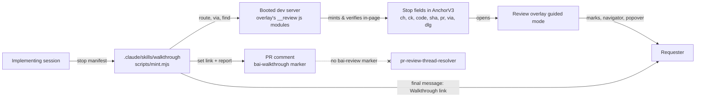

# 0004 — Walkthrough stops in the v3 anchor

## Summary

> Unfamiliar terms are collected at the bottom under [Glossary](#glossary).

- A **Stop** — one pin an implementing session leaves to say what changed and
  what to check — is an additive set of optional fields on the existing v3
  anchor (ADR 0002). There is no v4 envelope: it measures three times
  smaller, but it is a second grammar, so it stays deferred.
- A Stop resolves **strictly**: its landmark must match, and a `dlg` flag
  restricts a candidate to an open dialog. A measured false positive — a
  closed-modal stop that located onto a look-alike element outside it —
  ruled out the looser reviewer-pin resolution for stops.
- The codec owns one **volatile-query denylist** that drops parameters such
  as `formValues` from every anchor's query, reviewer pins included.
- A walkthrough is capped at **20 stops**, driven by GitHub's 65,536-
  character comment limit, not by the link itself.
- The PR comment carries exactly one `<!-- bai-walkthrough v1 pr= sha=
stops= server= -->` marker and no `<!-- bai-review -->` markers, so
  `pr-review-thread-resolver` never reads a stop as a finding.
- Guided mode ports the docs PR preview's grammar
  (`packages/backend.ai-docs-toolkit/templates/assets/pr-preview.{js,css}`)
  as design. Sharing its implementation with the Web UI overlay is out of
  scope.
- A link opens guided mode only when **every** part is a stop; the
  walkthrough it opens is a separate, read-only set that never merges into
  the reviewer's draft set. Marks are drawn by a Shadow-root tracking box,
  not by styling the reviewed element, and cross-page `›` prefers the host
  app's own router over a full reload.
- The trigger is a webui-owned skill (`.claude/skills/walkthrough/`), run by
  the implementing session itself — not a change to the shared `dw`/`fw`
  plugins, and not a notification. This narrows spec R3.1's "no ✅ What to
  check comment" decision (2026-09-01) into the shape spec R3.9 invited: a
  new ticket, not a revival of the dropped Teams reply.

## Context

The review overlay's pin set (ADR 0002) carries one reviewer's remarks. This
decision extends the same anchor to also carry a [**Stop**](#glossary): a pin
the _implementing_ session authors, not a reviewer, to say what it changed
and what the requester should check. An ordered set of Stops is a
[**Walkthrough**](#glossary). These terms, plus [**Mark**](#glossary) (the
tinted element guided mode draws in place of a pin glyph) and
[**Navigator**](#glossary) (the bottom-right pill that walks the stops), are
also defined in `react/vite-plugins/review-overlay/CONTEXT.md`.

A Stop has to fit the anchor's existing budget, resolve reliably against a
DOM that renders behind tabs and dialogs, and reach the PR as a comment that
GitHub accepts and the review-thread resolver ignores. Spec Revision 3 (R3.1,
R3.9) had already ruled out an automatic "what to check" comment and an
end-of-run notification for the shared implementation workflow; this
decision revisits only the first ruling, for a differently triggered
mechanism, and leaves R3.9 in force.

## Diagram

## Decision

### 1. Additive stop fields, no v4 envelope

A Stop adds optional keys to `AnchorV3`
(`react/vite-plugins/review-overlay/client/types.ts`), each capped in
`client/stop-guard.ts`:

| field         | meaning                                                                                                       | cap              |
| ------------- | ------------------------------------------------------------------------------------------------------------- | ---------------- |
| `ch`          | what changed                                                                                                  | ≤280 chars       |
| `ck`          | what to check, phrased as an expected outcome                                                                 | ≤280 chars       |
| `old` / `new` | the popover's diff line                                                                                       | ≤40 chars each   |
| `type`        | `'added'` or `'modified'`                                                                                     | fixed enum       |
| `kind`        | a short element kind                                                                                          | ≤64 chars        |
| `code`        | 1–3 `{path, line, to?}` code references                                                                       | 1–3 entries      |
| `sha`         | the full head the stop was made for                                                                           | 40-hex           |
| `pr`          | the PR the stop was minted for                                                                                | positive integer |
| `via`         | a replayable `{click: {text?, tid?}}` step list, rendered by the overlay as a sentence and never auto-clicked | ≤8 entries       |
| `dlg`         | picked inside an open dialog                                                                                  | literal `1`      |

`pr` is always present, so a static build with no boot record can still
build a code link. `decodeAnchor` drops an ill-typed optional field rather
than rejecting the anchor; `isStop(anchor)` is `ck` being a string. Today's
`decodeAnchor` and the `review-pins` CLI already accept and preserve these
keys unchanged, so this is ADR 0002's "no version bump" case.

| variant                                         | worst case, chars                                  |
| ----------------------------------------------- | -------------------------------------------------- |
| today's reviewer note, 280 chars Korean         | 760                                                |
| `ch`+`ck` 280 Korean, 3 code refs, `sha`, `pr`  | 1,263                                              |
| `ch`+`ck` 280 English, 3 code refs, `sha`, `pr` | 792                                                |
| v4 envelope, same content                       | not applicable — 3× smaller as a set, not per-stop |

A v4 envelope measures three times smaller at 30 stops (12.3K vs. 36.1K
characters) but is a second grammar with a permanent legacy path for v3
links. It stays deferred until a cap higher than 20 stops is actually
needed.

### 2. Strict resolution and the volatile-query denylist

`resolve.ts` accepts a text-scan candidate for a Stop only when the
candidate's landmark `data-testid` matches the stop's. `tid` is an optional
base-anchor field (ADR 0002), not a Stop-specific one; a stop with no `tid`
at all therefore has no landmark to check against, so it falls back to an
unrestricted, document-wide text scan instead of failing closed. A stop
carrying `dlg: 1` accepts a candidate only while it sits inside
`DIALOG_SELECTOR`
(`dialog, [role="dialog"], [role="alertdialog"]` — Astryx's own native
`<dialog>` and `BAIDialog`'s `alertdialog` both count). This followed a
measured false positive: a stop for a modal "located" onto the Data page's
Active button while the modal was closed, because the text fallback matched
a look-alike with no landmark check, and opening the modal never moved the
mark onto the real element. An unresolved stop stays "waiting" rather than
pinning the wrong element.

`client/stop-guard.ts` owns a shared, codec-owned denylist of volatile
query parameters (`VOLATILE_QUERY_PARAMS`, `formValues` first) and the
`stripVolatileQuery` helper that drops them from a query string.
`client/anchor.ts` strips them at capture; `deeplink.ts`'s
`pathNeedsChange` and `cli.ts`'s link ranking both strip them from the
anchor's query _and_ the live URL before comparing, so every comparison
point agrees, reviewer pins included. The session launcher's `formValues`
JSON had produced a 1,047-character anchor on its own, and rewrites it on
every keystroke — comparing the raw query alone had flipped a fresh pin to
"away" the moment it was made.

While a walkthrough stop is current and unresolved, `pin.ts` re-arms
resolution on DOM mutation outside the overlay host, not only on the
landing ladder and route changes as today — a dialog that opens without
changing the URL never re-triggered resolution otherwise.

### 3. The 20-stop cap and the comment-length budget

GitHub's 65,536-character comment body is the binding limit, not the anchor
or the URL. At 20 Korean stops, a comment whose blocks carry no per-stop
link and a header carrying only the set link once runs to roughly 38K
characters; the same shape with a per-stop link on every block runs to
roughly 62K, close enough to the limit to fail on a heavier stop. A
walkthrough is therefore capped at 20 stops, separate from the reviewer
pin set's 30-pin cap (ADR 0002).

### 4. The code-link format and the sha-drift warning

A stop's code link needs no commit SHA to resolve: it is rendered as
`<repo>/pull/<pr>/files#diff-<sha256(path)>R<line>[-R<to>]`, which the PR's
Files tab answers regardless of the current head. `<repo>` is
`ReviewServerState.repo` (`/__review/state`), turned into a GitHub URL by
`repoUrl()`; it falls back to `https://github.com/lablup/backend.ai-webui`
only when the state carries no `repo` at all, never as a hardcoded
constant. Line drift after a rebase is accepted; the stop's own `sha` field
is what lets the overlay warn when the server serves a different commit
than the one the stop was made for.

### 5. The `bai-walkthrough` marker, kept apart from `bai-review`

One PR comment per PR carries exactly one marker,
`<!-- bai-walkthrough v1 pr=<pr> sha=<sha> stops=<n> server=<app> -->`,
found and edited in place on a re-mint. The comment carries **no**
`<!-- bai-review -->` markers and no `> 📍` quote blocks, so
`pr-review-thread-resolver` (ADR 0002, R3.8) never reads a stop as a
reviewer finding — no change to the shared `claude-mp` resolver is needed.
A reviewer comment made inside the walkthrough's guided-mode popover still
exports as an ordinary `bai-review` block (with a `re: stop k · <id>` line),
so the resolver keeps reading those as it always has.

### 6. Guided mode as the docs PR preview's grammar, ported as design

The overlay's guided mode — tinted Marks with a dashed outline and an
ordinal badge, the bottom-right Navigator pill, the per-stop popover, the
`n`/`p`/`v`/`m`/`c` keys, and the page banner that also carries the
stale-server warning — follows the visual and interaction grammar of the
docs PR preview (`packages/backend.ai-docs-toolkit/templates/assets/
pr-preview.{js,css}`). The port is a design reference, not shared code: the
docs preview is a global-CSS IIFE bound to the docs DOM, and the Web UI
overlay is Shadow-DOM modules bound to `#bai=v3`. Converging the two
implementations into one module is a later effort, out of this decision's
scope.

### 7. A link opens guided mode only when every part is a stop

`applyFragment` (`main.ts`) decodes each part of a `#bai=v3` link and checks
`isStop` on every one of them; guided mode opens only when the part count
and the stop count match. A single part that is not a stop sends the whole
link through the existing merge-into-draft-set path unchanged — a
walkthrough is never a mode a caller chooses with a flag, it is what a link
becomes when every anchor in it carries `ck`. A stop that loses `ck` (a hand
edit, or a decode that drops an ill-typed field) reopens its link as an
ordinary pin set rather than a broken walkthrough.

### 8. The walkthrough set stays apart from the draft set

A walkthrough lives in its own `sessionStorage` key, distinct from the
reviewer's draft set, and is never merged into it and never included in the
dock's "Copy all". Its progress — which stops are viewed, and any typed
comments — lives separately, in `localStorage` keyed by the walkthrough's
`sha` (or a fixed fallback key when no stop carries one), so re-minting a
walkthrough for a new push starts viewed state over rather than inheriting
a previous run's. A page reload keeps a walkthrough open: the stored set is
read back before an incoming hash is applied, and a hash that itself carries
a walkthrough replaces the stored one. Every storage read and write is
wrapped so a tab with storage disabled can still walk a walkthrough, only
without persistence across reloads. Exiting is the ☰ panel's `Exit` action
only — `Escape` closes just the popover and the panel — and clears the
session-scoped set and every mark; the `localStorage` progress survives, so
reopening the same link restores what was already viewed.

### 9. Marks are a tracking overlay, not element styling

Guided mode draws each mark as its own box inside the overlay's Shadow
root, positioned to track the target element's rect, beneath the reviewer's
own pin layer so a reviewer's pins stay visible while a walkthrough is open.
The box takes no pointer events; the mark's only clickable part is its
ordinal badge, never the underlying element. The element itself gains only
`data-bai-change`, `data-bai-type`, and — only when it does not already
carry them — `role` and `aria-label`; which of those were added is recorded
so that exiting removes exactly what guided mode added and leaves whatever
the app itself supplied untouched.

### 10. Cross-page navigation prefers the host's own router

The host publishes a `navigate` function on the same `window.__BAI_REVIEW__`
object it already uses to publish the route label
(`DevReviewRouteLabel.tsx`, via `useWebUINavigate`). Guided mode's `›` calls
that function first; only when it is absent or throws does guided mode fall
back to a full-page `location.assign` on the stop's own set link — which
still reopens guided mode on arrival, because that link carries the whole
walkthrough.

### 11. `/__review/state` reports the serving head

The page banner can only warn that a walkthrough was made for a different
commit if it knows which commit the server is currently serving.
`/__review/state` gains an optional `head` field — the checkout's
`git rev-parse HEAD`, or `null` outside a checkout — and the banner turns
into a warning only when `head` is present, the walkthrough carries a real
`sha`, and no stop's `sha` matches `head`.

### 12. Comment export reuses the existing block format, with no set link

`✎ Copy N comments` emits one existing-format reviewer-pin block per
commented stop, each carrying that stop's own anchor and a
`re: stop k · <id>` trailer. It adds **no trailing set link** — the export
is N separate remarks, not one set, so `pr-review-thread-resolver`, the
CLI and the Claude-side skill read each comment as its own finding with no
new parsing.

### 13. Trigger: a webui-owned skill, not dw/fw plugins

A Walkthrough is minted by `.claude/skills/walkthrough/`, a skill owned by
this repository. The implementing session invokes it as the last step of
its own workflow — after the PR's dev server is booted and advertised — and
it is also invocable on demand for any PR with a live server. `dev-server`'s
own skill is unchanged; minting is a caller, not a new side effect of
booting.
No shared `dw`/`fw` plugin changes, and no notification: the final chat
message gains one `Walkthrough:` line, and nothing is posted to Teams.

This is a narrow revisit of spec R3.1's "no ✅ What to check comment"
decision (2026-09-01, driver Jongeun Lee, FR-3814 Not Planned) — the comment
spec R3.1 rejected was to be posted automatically by the shared `dw:impl`
orchestrator for every implementation run. A Walkthrough is triggered by a
repository-owned skill instead, and is scoped to on-screen, reviewable
change, not a status update. Spec R3.9's "not planned" ruling on an
end-of-run notification stays in force: minting a Walkthrough posts no
Teams message. The reversal is flagged to the previous driver on
[FR-3947](https://lablup.atlassian.net/browse/FR-3947) rather than landing
silently.

## Rejected alternatives

- **A v4 envelope for every stop.** Shorter comments (3× at 30 stops), but a
  second grammar and a permanent legacy path for v3 links. Rejected until
  the 20-stop cap itself needs to rise.
- **Loose (reviewer-style) resolution for stops.** Matches today's reviewer
  pins, but a measured false positive — locating a closed-modal stop onto a
  look-alike element — showed a wrong pin is worse than a stop that stays
  "waiting". Rejected in favor of the strict landmark-and-dialog check.
- **An encoder CLI fallback for minting.** Would let a stop be authored
  without a live dev server. Rejected: every stop is minted and verified
  headless, against the running server, or it is not minted at all — a
  CLI-built anchor is never verified to exist.
- **Per-stop dev links inside the PR comment.** Matches ADR 0002's per-block
  link convention for reviewer pins, but a 20-stop Korean walkthrough with a
  link on every block runs to roughly 62K characters, close to GitHub's
  limit. Rejected: the comment carries the set link once; the Navigator
  walks the rest.
- **Merging the docs PR preview and the Web UI review overlay into one
  guided-mode implementation.** Would remove the duplication guided mode's
  port creates, but the two run on different DOM and styling substrates.
  Rejected for this decision; a shared implementation is a later effort.
- **Reviving spec R3.9's end-of-run Teams notification for the walkthrough
  trigger.** The same shape the notification would have taken — one message
  when an implementation run finishes — is available again now that the
  trigger is repository-owned rather than the shared orchestrator. Rejected:
  R3.9 stays dropped, and a Walkthrough's only delivery is the PR comment
  and the final chat message.
- **Merging stops into the draft set and drawing them as ordinary pin
  cards.** Needs no new set, storage key or mode switch. Rejected: opening
  someone else's walkthrough would silently grow the reviewer's own draft
  set, and "Copy all" would ship it into a PR comment the reviewer never
  wrote. A walkthrough has to be read-only by construction, not by
  convention.
- **Painting marks by injecting global CSS into the reviewed document.** The
  shortest path, and what the earliest prototype did. Rejected: it leaks the
  overlay's styling onto the page under review, and leaves no way to prove
  every trace was removed on exit — a Shadow-root tracking box paints
  nothing onto the app's own elements or stylesheets. Only the semantic
  attributes decision 9 names touch the app's DOM, and those come off on
  exit.
- **A comment-only export format** (the prototype's plain
  `[walkthrough] …` text block). More readable pasted on its own. Rejected:
  neither `pr-review-thread-resolver`, the `review-pins` CLI, nor the
  Claude-side skill can read it, while all three already read the existing
  block format.
- **Always navigating cross-page with `location.assign`.** Needs no
  cooperation from the host app. Rejected: a full reload on every `›` drops
  the resolution ladder a stop hidden behind a modal depends on, and
  re-mounts the whole app on every step; preferring the host's own router
  avoids both.

## Consequences

- `react/vite-plugins/review-overlay/client/types.ts`, `resolve.ts`,
  `stop-guard.ts` and `pin.ts` gain the Stop-specific fields, resolution
  rule and denylist; the reviewer-pin path is unaffected except for the
  shared denylist.
- `.claude/skills/walkthrough/` becomes a new caller of the overlay's
  in-page anchor-minting modules and of `dev-server`'s boot record; neither
  of those changes for this decision.
- A walkthrough longer than 20 stops has to be trimmed or grouped by the
  authoring skill; there is no larger-set escape hatch until a v4 envelope
  is built.
- `pr-review-thread-resolver` needs no change to stay safe from walkthrough
  comments, because the marker boundary is the enforcement point rather than
  a resolver-side skip list.
- Guided mode's visual language now has to be kept in step with the docs PR
  preview by hand, since nothing shares code between them.
- A reviewer keeps pinning and copying from the dock as usual while a
  walkthrough is open; the two sets never interact.
- The authoring skill needs no explicit mode flag: giving every stop a `ck`
  is what makes a link open as a walkthrough, and one stop losing it reopens
  the whole link as a pin set.
- Guided mode runs a mutation observer alongside its resolution ladder,
  because a stop behind a modal or a launcher step never changes the route
  the way the ladder alone expects.
- An element that already carries `role`/`aria-label` keeps only its own
  semantics for a screen reader; a mark's ordinal position is not read
  aloud on such an element.

## Sources

- [FR-3941](https://lablup.atlassian.net/browse/FR-3941) (wayfinder map) and
  its resolved decisions [FR-3942](https://lablup.atlassian.net/browse/FR-3942)
  (payload and budget),
  [FR-3943](https://lablup.atlassian.net/browse/FR-3943) (headless minting
  and strict resolution), [FR-3944](https://lablup.atlassian.net/browse/FR-3944)
  (guided mode), [FR-3945](https://lablup.atlassian.net/browse/FR-3945) (the
  walkthrough skill), [FR-3946](https://lablup.atlassian.net/browse/FR-3946)
  (the PR comment). Decided 2026-09-15.
- FR-3947 — flags the R3.1 revisit to the previous driver.
- FR-3950 — the guided-mode implementation (marks, navigator, popover,
  storage split, host-router navigation, comment export, `/__review/state`),
  decisions 7–12 above.
- FR-3949 — the volatile-query denylist applied at every comparison point
  and the widened `DIALOG_SELECTOR`, decision 2 above (commit `3c4507c74`).
- Prototype: branch `proto/FR-3944-guided-mode`,
  `walkthrough-guided-mode.html` variant D. Visual tokens ported from
  `packages/backend.ai-docs-toolkit/templates/assets/pr-preview.css`.
- Related: ADR 0002 (the v3 anchor and pin-set grammar this decision
  extends); spec `pr-devserver-review.md` Revision 3 (R3.1, R3.8, R3.9) and
  Revision 4, `lablup/frontend-board`.

## Glossary

- **Stop** — one pin in a Walkthrough, carrying what changed, what to check,
  and its code references. Full definition:
  `react/vite-plugins/review-overlay/CONTEXT.md`.
- **Walkthrough** — the ordered set of Stops an implementing session leaves
  on the dev server. Full definition: `react/vite-plugins/review-overlay/
CONTEXT.md`.
- **Mark** — the tinted changed element guided mode draws in place of a pin
  glyph. Full definition: `react/vite-plugins/review-overlay/CONTEXT.md`.
- **Navigator** — the bottom-right pill that walks the stops. Full
  definition: `react/vite-plugins/review-overlay/CONTEXT.md`.
