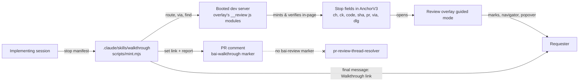

# 0004 — Walkthrough stops in the v3 anchor

## Summary

> 낯선 용어는 문서 맨 아래 [용어](#용어)에 모아 두었다.

- **Stop** — 구현한 session이 무엇이 바뀌었고 무엇을 확인해야 하는지 남기는 pin
  하나 — 은 기존 v3 anchor(ADR 0002)에 추가된 optional field 묶음이다. v4
  envelope는 없다: 3배 더 작지만 grammar가 하나 더 늘어나므로 미룬다.
- Stop은 **strict**하게 resolve된다: landmark가 일치해야 하고, `dlg` flag는
  후보를 열린 dialog 안으로 제한한다. 측정된 false positive — 닫힌 modal의
  stop이 밖의 look-alike element에 위치를 잡은 사례 — 가 stop에 더 느슨한
  reviewer-pin resolution을 쓰지 않기로 한 이유다.
- codec은 **volatile-query denylist** 하나를 소유하며, `formValues` 같은
  parameter를 모든 anchor의 query에서 제거한다 — reviewer pin도 포함된다.
- walkthrough는 **20 stop**으로 cap되며, GitHub의 65,536자 댓글 제한이 그
  기준이지 link 자체가 아니다.
- PR 댓글은 `<!-- bai-walkthrough v1 pr= sha= stops= server= -->` marker
  하나만 가진다 — 이 marker는 re-mint 시 댓글을 idempotent하게 만드는
  역할일 뿐이고, `pr-review-thread-resolver`가 stop을 finding으로 읽지 않게
  만드는 실제 보장은 `cli.ts`의 `review-pins parse`가 stop(즉 `ck`를 가진
  anchor)을 기본으로 findings에서 제외하는 codec 쪽 규칙이다.
- guided mode는 docs PR preview의 grammar
  (`packages/backend.ai-docs-toolkit/templates/assets/pr-preview.{js,css}`)를
  design으로 차용한다. Web UI overlay와 구현을 공유하는 것은 범위 밖이다.
- link는 **모든** part가 stop일 때만 guided mode를 연다; 그렇게 열리는
  walkthrough는 reviewer의 draft set에 절대 합쳐지지 않는 별도의 읽기
  전용 set이다. Mark는 Shadow-root tracking box가 그리며 화면에 보이는
  element를 직접 칠하지 않고, page를 넘는 `›`는 전체 reload보다 host app
  자신의 router를 우선한다.
- trigger는 webui 소유 skill(`.claude/skills/walkthrough/`)이며, 구현한
  session 자신이 실행한다 — 공유 `dw`/`fw` plugin의 변경이 아니고
  notification도 아니다. 이는 spec R3.1의 "no ✅ What to check comment"
  결정(2026-09-01)을 spec R3.9가 열어 둔 모양으로 좁게 재검토한 것이다: 새
  ticket이지 중단된 Teams 답장의 부활이 아니다.

## Context

review overlay의 pin set(ADR 0002)은 reviewer 한 명의 remark를 나른다. 이
결정은 같은 anchor가 [**Stop**](#용어)도 나르도록 확장한다: reviewer가
아니라 _구현한_ session이 무엇을 바꿨고 requester가 무엇을 확인해야 하는지
적어 만드는 pin이다. Stop들의 순서 있는 집합이 [**Walkthrough**](#용어)다.
이 용어들과 [**Mark**](#용어)(pin glyph 대신 guided mode가 그리는 tint
처리된 element), [**Navigator**](#용어)(stop을 따라가는 우하단 pill)는
`react/vite-plugins/review-overlay/CONTEXT.md`에도 정의되어 있다.

Stop은 anchor의 기존 예산 안에 들어가야 하고, tab과 dialog 뒤에서 렌더되는
DOM에 대해서도 안정적으로 resolve되어야 하며, GitHub가 받아들이고
review-thread resolver가 무시하는 댓글로 PR에 도달해야 한다. spec Revision
3(R3.1, R3.9)은 이미 자동 "what to check" 댓글과 공유 구현 workflow를 위한
종료 시 notification을 배제해 두었다; 이 결정은 트리거가 다른 mechanism에
한해 첫 번째 ruling만 재검토하고, R3.9는 그대로 유지한다.

## 설계도

## Decision

### 1. Additive stop field와 없는 v4 envelope

Stop은 `AnchorV3`(`react/vite-plugins/review-overlay/client/types.ts`)에
optional key를 추가하며, 각각의 cap은 `client/stop-guard.ts`에 있다:

| field         | 의미                                                                                                 | cap           |
| ------------- | ---------------------------------------------------------------------------------------------------- | ------------- |
| `ch`          | 무엇이 바뀌었는지                                                                                    | ≤280자        |
| `ck`          | 무엇을 확인해야 하는지, 기대되는 결과로 표현                                                         | ≤280자        |
| `old` / `new` | popover의 diff 줄                                                                                    | 각각 ≤40자    |
| `type`        | `'added'` 또는 `'modified'`                                                                          | 고정 enum     |
| `kind`        | 짧은 element 종류                                                                                    | ≤64자         |
| `code`        | 1–3개의 `{path, line, to?}` code reference                                                           | 1–3개 항목    |
| `sha`         | stop이 만들어진 시점의 전체 head                                                                     | 40자리 16진수 |
| `pr`          | stop이 minting된 PR                                                                                  | 양의 정수     |
| `via`         | 재생 가능한 `{click: {text?, tid?}}` step list, overlay가 문장으로 렌더하며 절대 auto-click하지 않음 | ≤8개 항목     |
| `dlg`         | 열린 dialog 안에서 pick됨                                                                            | 리터럴 `1`    |

`pr`는 항상 존재하므로 boot record가 없는 static build도 code link를 만들
수 있다. `decodeAnchor`는 anchor를 거부하는 대신 타입이 맞지 않는 optional
field를 버린다; `isStop(anchor)`은 `ck`가 문자열인지로 판정한다. 오늘의
`decodeAnchor`와 `review-pins` CLI는 이미 이 key들을 그대로 받아들이고
보존하므로, 이는 ADR 0002의 "버전을 올리지 않는" case다.

| variant                                         | 최악의 경우, 문자 수                          |
| ----------------------------------------------- | --------------------------------------------- |
| 오늘의 reviewer note, 280자 한국어              | 760                                           |
| `ch`+`ck` 280 한국어, code ref 3개, `sha`, `pr` | 1,263                                         |
| `ch`+`ck` 280 영어, code ref 3개, `sha`, `pr`   | 792                                           |
| v4 envelope, 같은 내용                          | 해당 없음 — set 기준 3배 작음, stop 기준 아님 |

v4 envelope는 30 stop 기준 3배 더 작지만(12.3K vs. 36.1K자) grammar가 하나
더 늘고 v3 link를 위한 legacy path가 영구히 남는다. 20 stop보다 높은 cap이
실제로 필요해질 때까지 미룬다.

### 2. Strict resolution과 volatile-query denylist

`resolve.ts`는 Stop에 대해 text-scan 후보의 landmark `data-testid`가
stop의 것과 일치할 때만 받아들인다. `tid`는 (ADR 0002의) optional
base-anchor field이지 Stop 전용이 아니다; 그래서 `tid`가 아예 없는 stop은
맞춰 볼 landmark가 없으므로, 막혀서 실패하는 대신 제한 없는 문서 전체
text scan으로 넘어간다. `dlg: 1`을 가진 stop은 후보가 `DIALOG_SELECTOR`
(`dialog, [role="dialog"], [role="alertdialog"]` — Astryx 자체의 native
`<dialog>`와 `BAIDialog`의 `alertdialog` 둘 다 해당) 안에 있을 때만
받아들인다. 이는 측정된 false positive를 따른 것이다: modal이 닫혀 있는
동안 modal용 stop이 Data page의 Active 버튼에 "위치를 잡은" 사례로, text
fallback이 landmark 확인 없이 look-alike를 매칭했고 modal을 열어도 mark가
실제 element로 옮겨가지 않았다. 확인되지 않은 stop은 틀린 element를 pin하는
대신 "waiting" 상태로 남는다.

`client/stop-guard.ts`는 volatile query parameter(`VOLATILE_QUERY_PARAMS`,
`formValues`가 첫 번째)의 공유된 codec 소유 denylist와, query string에서
그것을 제거하는 `stripVolatileQuery` helper를 갖는다. `client/anchor.ts`는
capture 시점에 제거하고; `deeplink.ts`의 `pathNeedsChange`와 `cli.ts`의
link ranking은 둘 다 비교 전에 anchor의 query _와_ 실제 URL 양쪽에서
제거하므로, 모든 비교 지점이 일치한다 — reviewer pin도 포함이다. session
launcher의 `formValues` JSON은 그것만으로 1,047자짜리 anchor를 만들었고,
매 keystroke마다 다시 쓴다 — raw query만 비교하면 막 만든 pin이 그 순간
바로 "away"로 뒤집혔다.

walkthrough stop이 현재 선택되어 있고 확인되지 않은 동안, `pin.ts`는
오늘처럼 landing ladder와 route 변경뿐 아니라 overlay host 바깥의 DOM
mutation에서도 resolution을 다시 무장한다 — URL을 바꾸지 않고 열리는
dialog는 그렇지 않으면 resolution을 다시 트리거하지 못했다.

### 3. 20-stop cap과 댓글 길이 예산

GitHub의 65,536자 댓글 본문이 anchor나 URL이 아니라 실제 한계다. 20개의
한국어 stop에서, block마다 per-stop link를 나르지 않고 header에 set link
하나만 나르는 댓글은 대략 38K자에 이른다; 모든 block마다 per-stop link를
붙인 같은 모양은 대략 62K에 이르러, 더 무거운 stop에서 실패할 만큼 한계에
가깝다. 그래서 walkthrough는 reviewer pin set의 30-pin cap(ADR 0002)과
별도로 20 stop으로 cap된다.

### 4. Code link 형식과 sha-drift 경고

stop의 code link는 resolve하는 데 commit SHA가 필요 없다: 이는
`<repo>/pull/<pr>/files#diff-<sha256(path)>R<line>[-R<to>]`로 렌더되며,
현재 head와 무관하게 PR의 Files 탭이 답한다. `<repo>`는
`ReviewServerState.repo`(`/__review/state`)이며, `repoUrl()`이 GitHub
URL로 바꾼다; state가 `repo`를 전혀 갖지 않을 때만
`https://github.com/lablup/backend.ai-webui`로 떨어지고, hardcode된
상수가 아니다. rebase 이후의 line drift는 받아들여진다; stop 자신의 `sha`
field는 server가 stop이 만들어진 시점과 다른 commit을 서빙할 때 overlay가
경고하게 해주는 값이다.

### 5. `bai-review`와 가르는 것은 marker가 아니라 codec의 stop 제외 규칙이다

PR마다 댓글 하나가 정확히 marker 하나를 갖는다,
`<!-- bai-walkthrough v1 pr=<pr> sha=<sha> stops=<n> server=<app> -->` —
찾아서 re-mint 시 제자리에서 편집한다. 이 marker의 역할은 댓글을
idempotent하게 만드는 것뿐이고, `pr-review-thread-resolver`를 stop에서
떼어 놓는 것이 아니다. 그 보장은 `cli.ts`의 `review-pins parse`에서
온다: `--include-stops`가 주어지지 않는 한, `ck`를 가진 anchor(stop,
Decision 1)를 findings에서 기본으로 제외한다. 그래서 stop은 marker의
유무와 무관하게 resolver에게 보이지 않는다 — 공유 `claude-mp` resolver의
변경은 필요 없다. walkthrough의 guided-mode popover 안에서 남긴 reviewer
댓글은 여전히 보통의 `bai-review` block으로 export된다(Decision 12가
먼저 stop field를 제거하므로 export된 anchor는 `ck`를 갖지 않고, 그래서
같은 제외 규칙이 적용되지 않는다), `re: stop k · <id>` 줄과 함께 — 그래서
resolver는 언제나처럼 그것들을 계속 읽는다.

### 6. Guided mode는 docs PR preview의 grammar를 design으로 차용한다

overlay의 guided mode — dashed outline과 ordinal badge를 가진 tint 처리된
Mark, 우하단 Navigator pill, stop별 popover, `n`/`p`/`v`/`m`/`c` key,
그리고 stale-server 경고도 나르는 page banner — 는 docs PR preview
(`packages/backend.ai-docs-toolkit/templates/assets/pr-preview.{js,css}`)의
시각·상호작용 grammar를 따른다. 이 차용은 design 참조이지 공유 code가
아니다: docs preview는 docs DOM에 묶인 global-CSS IIFE이고, Web UI
overlay는 `#bai=v3`에 묶인 Shadow-DOM module이다. 두 구현을 하나의
module로 합치는 것은 나중 과제이며 이 결정의 범위 밖이다.

### 7. 모든 part가 stop일 때만 link가 guided mode를 연다

`applyFragment`(`main.ts`)는 `#bai=v3` link의 각 part를 decode해 모두에
대해 `isStop`을 확인한다; guided mode는 part 수와 stop 수가 같을 때만
열린다. stop이 아닌 part가 하나라도 있으면 link 전체는 기존의 draft
set으로 합치는 경로를 그대로 탄다 — walkthrough는 caller가 flag로 고르는
mode가 아니라, link 안의 모든 anchor가 `ck`를 가질 때 link가 되는 것이다.
`ck`를 잃은 stop(손으로 고쳤거나, 타입이 안 맞는 field를 버린 decode)은
깨진 walkthrough 대신 보통의 pin set으로 그 link를 다시 연다.

### 8. walkthrough set은 draft set과 분리되어 있다

walkthrough는 reviewer의 draft set과 구분되는 자신만의 `sessionStorage`
key에 살며, 거기에 합쳐지지도 dock의 "Copy all"에 포함되지도 않는다.
그 진행 상태 — 어떤 stop을 봤는지, 어떤 comment를 입력했는지 — 는
따로 `localStorage`에 walkthrough의 `sha`로 key가 잡혀 산다(어떤 stop도
sha를 갖지 않으면 고정된 fallback key로), 그래서 새 push를 위해
walkthrough를 다시 만들면 본 상태가 처음부터 다시 시작한다. page reload는
walkthrough를 연 채로 유지한다: 들어오는 hash가 적용되기 전에 저장된
set을 먼저 읽고, 들어오는 hash 자체가 walkthrough를 나르면 저장된 것을
대체한다. 모든 storage 읽기·쓰기는 감싸져 있어 storage가 꺼진 tab에서도
walkthrough를 걸을 수 있다, 다만 reload 사이의 지속성은 없다. 나가는
것은 ☰ panel의 `Exit` action뿐이다 — `Escape`는 popover와 panel만
닫는다 — 나가면 session 범위의 set과 모든 mark가 지워진다;
`localStorage`의 진행 상태는 남아서, 같은 link를 다시 열면 이미 본 것이
돌아온다.

### 9. Mark는 tracking overlay이지 element styling이 아니다

Guided mode는 각 mark를 overlay의 Shadow root 안에 있는 자신만의 box로
그리며, target element의 rect를 따라 위치를 잡는다, reviewer 자신의 pin
layer 아래에 있어서 walkthrough가 열려 있는 동안에도 reviewer의 pin이
그대로 보인다. 이 box는 pointer event를 받지 않는다; mark의 유일한 클릭
가능 부분은 ordinal badge이며, 밑에 있는 element가 아니다. element
자신은 `data-bai-change`, `data-bai-type`만 얻고 — element가 아직 갖고
있지 않을 때만 — `role`과 `aria-label`을 얻는다; 그중 무엇을 추가했는지가
기록되어, 나갈 때 guided mode가 추가한 것만 정확히 제거하고 app이 원래
준 것은 그대로 둔다.

### 10. page를 넘는 이동은 host의 router를 우선한다

host는 route label을 publish하던 것과 같은 `window.__BAI_REVIEW__`
object에 `navigate` function을 함께 publish한다
(`DevReviewRouteLabel.tsx`, `useWebUINavigate`를 통해). guided mode의
`›`는 그것을 먼저 부른다; 그것이 없거나 던질 때만 guided mode는 stop
자신의 set link로 전체 reload하는 `location.assign`으로 물러난다 —
그 link가 walkthrough 전체를 나르기 때문에 도착해도 guided mode로 다시
돌아온다.

### 11. `/__review/state`가 서빙 중인 head를 알려 준다

page banner는 server가 지금 무엇을 서빙하는지 알아야만 walkthrough가
다른 commit용으로 만들어졌다고 경고할 수 있다. `/__review/state`는
optional `head` field를 얻는다 — checkout의 `git rev-parse HEAD`, checkout
밖에서는 `null` — 그리고 banner는 `head`가 있고, walkthrough가 진짜
`sha`를 가지며, 어떤 stop의 `sha`도 `head`와 일치하지 않을 때만 경고로
바뀐다.

### 12. Comment export는 stop field를 제거해 보통의 pin으로 다시 쓴다

`✎ Copy N comments`(하나에 대해서는 `Copy ref`)는 comment가 달린 stop마다
보통의 reviewer pin으로 다시 쓴다: anchor에서 stop 전용 field(`ch`, `ck`,
`old`, `new`, `type`, `kind`, `code`, `via`, `dlg`)를 제거하므로, 내보내진
anchor는 `ck`를 갖지 않고 stop이 아니라 보통의 pin으로 읽힌다; reviewer
자신의 comment는 그 pin의 note가 된다. 내보낸 block마다 기존의
reviewer-pin 형식을 쓰며 `re: stop k · <id>` 줄이 붙고, 뒤따르는 set
link는 없다 — export는 하나의 set이 아니라 N개의 별개 remark다. 내보낸
anchor가 더는 `ck`를 갖지 않으므로 `cli.ts`의 stop 제외 규칙(Decision
5)은 여기 적용되지 않고, 그래서 `pr-review-thread-resolver`, CLI, Claude
쪽 skill은 내보낸 comment 각각을 자기 쪽에서 새로 parsing할 것 없이
보통의 finding으로 읽는다.

### 13. Trigger: dw/fw plugin이 아니라 webui 소유 skill

Walkthrough는 이 repository가 소유한 skill인
`.claude/skills/walkthrough/`가 mint한다. 구현한 session이 자신의
workflow 마지막 단계로 — PR의 dev server가 부팅되고 advertise된 뒤 —
그것을 부르며, 살아 있는 server가 있는 어떤 PR에 대해서도 요청에 따라
부를 수 있다. `dev-server` 자신의 skill은 바뀌지 않는다; minting은
booting의 새 side effect가 아니라 그것을 부르는 쪽이다. 공유 `dw`/`fw`
plugin의 변경은 없고, notification도 없다: 마지막 chat message에
`Walkthrough:` 줄 하나가 더해질 뿐, Teams에는 아무것도 올라가지 않는다.

이는 spec R3.1의 "no ✅ What to check comment" 결정(2026-09-01, driver
Jongeun Lee, FR-3814 Not Planned)을 좁게 재검토한 것이다 — spec R3.1이
배제한 댓글은 모든 구현 실행마다 공유 `dw:impl` orchestrator가 자동으로
올리는 것이었다. Walkthrough는 그 대신 repository 소유 skill이
trigger하며, 화면에 보이고 review 가능한 변경에 국한된다, 상태 업데이트가
아니다. 종료 시 notification에 대한 spec R3.9의 "not planned" ruling은
그대로 유지된다: Walkthrough를 minting해도 Teams 메시지는 올라가지
않는다. 이 reversal은 조용히 착지하는 대신
[FR-3947](https://lablup.atlassian.net/browse/FR-3947)을 통해 이전
driver에게 알린다.

## 대안과 기각 사유

- **모든 stop에 v4 envelope.** 댓글이 더 짧아진다(30 stop 기준 3배), 하지만
  grammar가 하나 더 늘고 v3 link를 위한 legacy path가 영구히 남는다.
  20-stop cap 자체가 올라가야 할 때까지 기각.
- **Stop에 느슨한(reviewer 스타일) resolution.** 오늘의 reviewer pin과
  맞지만, 측정된 false positive — 닫힌 modal의 stop이 look-alike
  element에 위치를 잡은 사례 — 는 "waiting"으로 남는 stop보다 틀린 pin이
  더 나쁘다는 것을 보여줬다. strict한 landmark-and-dialog 확인을 택하며
  기각.
- **Minting을 위한 encoder CLI fallback.** 살아 있는 dev server 없이도
  stop을 만들 수 있게 해준다. 기각: 모든 stop은 돌아가는 server를 상대로
  headless로 minting되고 검증되거나, 아예 minting되지 않는다 — CLI가
  만든 anchor는 존재를 검증받지 못한다.
- **PR 댓글 안에 per-stop dev link.** ADR 0002의 reviewer pin per-block
  link 관례와 맞지만, 20-stop 한국어 walkthrough에 block마다 link를
  붙이면 대략 62K자에 이르러 GitHub 한계에 가깝다. 기각: 댓글은 set
  link 하나만 나르고, Navigator가 나머지를 걷는다.
- **docs PR preview와 Web UI review overlay를 하나의 guided-mode 구현으로
  합치기.** guided mode의 차용이 만드는 중복을 없애지만, 둘은 다른 DOM과
  styling 기반 위에서 돈다. 이 결정에서는 기각; 공유 구현은 나중 과제다.
- **walkthrough trigger를 위해 spec R3.9의 종료 시 Teams notification을
  되살리기.** notification이 취했을 같은 모양 — 구현 실행이 끝날 때
  메시지 하나 — 이 trigger가 공유 orchestrator가 아니라 repository
  소유가 된 지금 다시 가능해졌다. 기각: R3.9는 그대로 중단된 채 남고,
  Walkthrough의 전달 수단은 PR 댓글과 마지막 chat message뿐이다.
- **stop을 draft set에 합쳐서 보통의 pin card로 그리기.** 새 set, storage
  key, mode 전환이 필요 없다. 기각: 남의 walkthrough를 여는 것만으로
  reviewer 자신의 draft set이 조용히 불어나고, "Copy all"이 reviewer가
  쓴 적 없는 내용을 PR 댓글로 실어 보낸다. walkthrough는 관례가 아니라
  구조로 읽기 전용이어야 한다.
- **reviewed document에 global CSS를 주입해 mark를 그리기.** 가장 짧은
  길이며, 가장 이른 prototype이 한 방식이다. 기각: overlay의 styling이
  review 중인 page로 새고, exit 때 모든 흔적이 지워졌다는 것을 증명할
  방법이 없다 — Shadow-root tracking box는 app 자신의 element나
  stylesheet에 아무것도 칠하지 않는다. Decision 9가 이름 붙인 semantic
  attribute만 app의 DOM에 닿고, 그것도 exit 때 벗겨진다.
- **comment 전용 export 형식**(prototype의 그냥 `[walkthrough] …` text
  block). 그 자체로 더 읽기 좋다. 기각: `pr-review-thread-resolver`도,
  `review-pins` CLI도, Claude 쪽 skill도 그것을 읽지 못하는 반면, 셋 다
  기존 block 형식은 이미 읽는다.
- **page를 넘는 이동을 항상 `location.assign`으로.** host app의 협조가
  필요 없다. 기각: `›`마다 전체 reload를 하면 modal 뒤에 숨은 stop이
  기대는 resolution ladder가 사라지고, 매 단계마다 app 전체가 다시
  뜬다; host 자신의 router를 우선하면 둘 다 피한다.

## Consequences

- `react/vite-plugins/review-overlay/client/types.ts`, `resolve.ts`,
  `stop-guard.ts`, `pin.ts`가 Stop 전용 field, resolution 규칙, denylist를
  얻는다; reviewer-pin 경로는 공유 denylist를 빼면 영향받지 않는다.
- `.claude/skills/walkthrough/`는 overlay의 in-page anchor-minting
  module과 `dev-server`의 boot record의 새 caller가 된다; 이 결정에서는
  둘 다 바뀌지 않는다.
- 20 stop보다 긴 walkthrough는 만드는 skill이 줄이거나 묶어야 한다; v4
  envelope가 만들어질 때까지 더 큰 set을 위한 escape hatch는 없다.
- `cli.ts`의 `review-pins parse`가 stop을 findings에서 기본 제외하는
  것이 집행 지점이므로, `pr-review-thread-resolver`는 walkthrough
  댓글로부터 안전하기 위해 바뀔 필요가 없다.
- guided mode의 시각 언어는 이제 손으로 docs PR preview와 맞춰야 한다,
  둘 사이에 공유되는 code가 없기 때문이다.
- reviewer는 walkthrough가 열려 있는 동안에도 평소처럼 dock에서 pin을
  찍고 복사할 수 있다; 두 set은 서로 간섭하지 않는다.
- 만드는 skill은 별도의 mode flag가 필요 없다: 모든 stop에 `ck`를 주는
  것이 곧 link를 walkthrough로 여는 것이고, stop 하나가 그것을 잃으면
  link 전체가 pin set으로 다시 열린다.
- guided mode는 resolution ladder와 나란히 mutation observer를 돌린다,
  modal이나 launcher 단계 뒤의 stop은 ladder만으로는 기대한 대로 route가
  바뀌지 않기 때문이다.
- 이미 `role`/`aria-label`을 가진 element는 screen reader에게 자신의
  semantics만 남긴다; mark의 ordinal 위치는 그런 element에서는 읽히지
  않는다.

## 출처

- [FR-3941](https://lablup.atlassian.net/browse/FR-3941)(wayfinder map)과
  그 결의된 결정들인
  [FR-3942](https://lablup.atlassian.net/browse/FR-3942)(payload와 예산),
  [FR-3943](https://lablup.atlassian.net/browse/FR-3943)(headless
  minting과 strict resolution),
  [FR-3944](https://lablup.atlassian.net/browse/FR-3944)(guided mode),
  [FR-3945](https://lablup.atlassian.net/browse/FR-3945)(walkthrough
  skill), [FR-3946](https://lablup.atlassian.net/browse/FR-3946)(PR
  댓글). 2026-09-15 결정.
- FR-3947 — R3.1 재검토를 이전 driver에게 알린다.
- FR-3950 — guided-mode 구현(mark, navigator, popover, storage 분리,
  host-router navigation, comment export, `/__review/state`), 위
  decision 7–12.
- FR-3949 — 모든 비교 지점에 적용된 volatile-query denylist와 넓어진
  `DIALOG_SELECTOR`, 위 decision 2 (commit `3c4507c74`).
- Prototype: branch `proto/FR-3944-guided-mode`,
  `walkthrough-guided-mode.html` variant D. 시각 token은
  `packages/backend.ai-docs-toolkit/templates/assets/pr-preview.css`에서
  차용.
- 관련: ADR 0002(이 결정이 확장하는 v3 anchor와 pin-set grammar); spec
  `pr-devserver-review.md` Revision 3(R3.1, R3.8, R3.9)와 Revision 4,
  `lablup/frontend-board`.

## 용어

- **Stop** — Walkthrough 안의 pin 하나로, 무엇이 바뀌었는지, 무엇을
  확인해야 하는지, 그 code reference를 나른다. 전체 정의:
  `react/vite-plugins/review-overlay/CONTEXT.md`.
- **Walkthrough** — 구현한 session이 dev server에 남기는 Stop들의 순서
  있는 집합. 전체 정의: `react/vite-plugins/review-overlay/CONTEXT.md`.
- **Mark** — guided mode가 pin glyph 대신 그리는, tint 처리된 바뀐
  element. 전체 정의: `react/vite-plugins/review-overlay/CONTEXT.md`.
- **Navigator** — stop을 따라가는 우하단 pill. 전체 정의:
  `react/vite-plugins/review-overlay/CONTEXT.md`.
