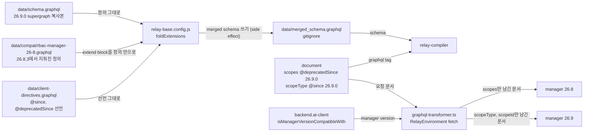

# 0005 — Compat schema for retired manager fields

## Summary

> 낯선 용어는 문서 맨 아래 [용어](#용어)에 모아 두었다.

- `data/schema.graphql`은 매니저 supergraph의 복사본이고 손으로 고치지 않는다.
- 아직 지원하는 옛 매니저가 답하지만 새 supergraph에서 지워진 type과 field는 `data/compat/rbac-manager-26-8.graphql`에 둔다. `relay-base.config.js`의 `foldExtensions`가 `data/merged_schema.graphql`을 쓸 때 그 파일의 `extend type|input` block을 같은 이름의 정의 안으로 [fold](#용어)한다.
- 한 document가 두 매니저가 각각 아는 field를 모두 select한다. 옛 field에는 `@deprecatedSince(version: "26.9.0")`, 새 field에는 `@since(version: "26.9.0")`를 달고, `react/src/helper/graphql-transformer.ts`가 요청 전에 연결된 매니저가 모르는 쪽을 지운다.
- [client directive](#용어)는 field에만 붙으므로, mutation input과 filter 값은 `backend.ai-client`의 feature flag `rbac-single-scope-role`로 component가 골라 보낸다.
- component는 새 field 값이 있으면 그것을 쓰고 없으면 옛 field를 읽는다.

## Context

- **Schema copy**: `data/schema.graphql`은 backend.ai 저장소의 `docs/manager/graphql-reference/supergraph.graphql`을 그대로 복사한 파일이다. `bai-agent query`는 네트워크에 나가기 전에 이 파일로 document를 검증하므로, 매니저에 없는 정의가 여기 들어가면 그 검증이 뚫린다.
- **Removed 26.9.0 fields**: 매니저 26.9.0은 role이 scope 하나에만 속하도록 바꾸었다(backend.ai BA-7796, #14478). 아래 표는 이 저장소의 document가 select하던 것 중 바뀐 것이다. 매니저는 모르는 field가 하나만 있어도 요청 전체를 거부한다.

| 26.8.3 | 26.9.0 |
|---|---|
| `Role.scopes` connection | `Role.scopeType`, `scopeId`, `scope`. `scopes`는 backend BA-7919(#14669)가 `@deprecated`로 되살려 26.9.0에도 남는다. |
| `CreateRoleInput.scopes` | `CreateRoleInput.scope`. `scopes`는 deprecated로 남아 항목 하나만 받는다. |
| `RBACElementType` enum, 대문자 값 | `String`, 소문자 snake_case 값 |
| `Permission.scopeType`, `scopeId`, `operation: OperationType` | `Permission.permission: PermissionBit`, scope field 없음. `entityType`은 양쪽에 있다. |
| `PermissionNestedFilter.entityType: RBACElementTypeFilter`, admin 권한의 entity `PROJECT_ADMIN_PAGE` | `StringFilter`, entity `scope_admin` |
| `RoleMappedScopeNestedFilter.scopeId: StringFilter` | `UUIDFilter` |

- **First failure site**: `useCurrentUserProjectRoles`가 `PROJECT_ADMIN_PAGE` entity로 거른 `myRoles`를 select한다. 이 hook을 `useRouteAccess`, `useWebUIMenuItems`, `WebUIHeaderProjectSelect`와 folder component 네 곳(`ProjectSelect`, `VFolderNodes`, `EditableVFolderNameV2`, `VFolderNodeDescriptionV2`)이 부른다. 26.9 매니저는 그 entity를 모르므로 빈 결과를 답하고, 프로젝트 관리자 메뉴와 route가 사라진다. 26.9의 답은 `myAtomicBulkScopePermissions`(backend BA-7924, #14678)로, 호출자가 각 프로젝트의 `scope_admin`에 실제로 가진 비트를 답한다. 26.8 매니저는 그 root field를 모르고, 모르는 field가 하나만 있어도 요청 전체를 거부한다.
- **Existing mechanism**: `data/client-directives.graphql`이 `@since`와 `@deprecatedSince`를 `on FIELD`로 선언한다. `react/src/RelayEnvironment.ts`의 fetch가 `manipulateGraphQLQueryWithClientDirectives`에 요청 문서와 `isNotCompatibleWithVersion`을 넘기고, 그 함수가 directive가 가리키는 field를 지운다. `packages/backend.ai-client/src/client.ts`의 `isManagerVersionCompatibleWith` block이 feature flag를 켜고 component는 `baiClient.supports(flag)`로 읽는다.
- **Compiler constraint**: relay-compiler는 schema에 없는 field를 select한 document를 컴파일하지 않는다. 옛 field를 `@deprecatedSince`로 select하려면 그 정의가 schema에 있어야 하는데, supergraph 복사본에는 더 이상 없다.

## 설계도

## Decision

### 1. supergraph 복사본은 그대로 둔다

- **Source file**: `data/schema.graphql`은 backend.ai supergraph를 복사한 파일이며, 옛 매니저용 정의를 여기에 더하지 않는다.

### 2. 지워진 정의는 compat 파일에 둔다

- **Location**: `data/compat/rbac-manager-26-8.graphql`이며, 옛 supergraph(backend.ai 태그 26.8.3)에서 복사한 정의만 담는다. 통째로 지워진 type(`RBACElementType`, `RBACElementTypeFilter`, `OperationType`, `OperationTypeFilter`)은 그대로 적고, 살아남은 type에서 지워진 field(`Permission.scopeType` 등)는 `extend type|input <이름> { … }` block으로 적는다. 26.9.0이 `@deprecated`로 남긴 `Role.scopes`와 `Entity*` type은 supergraph 복사본에 이미 있으므로 여기 두지 않는다.
- **Registration**: `relay-base.config.js`의 `compatFiles` 배열이 fold할 파일을 나열한다. 새 compat 파일은 이 배열에 더한다.
- **Fold**: `foldExtensions`가 `data/merged_schema.graphql`을 쓸 때 각 block의 field를 `data/schema.graphql`의 같은 이름 정의 안에 넣는다. relay-compiler가 `extend input`을 구현하지 않아 텍스트로 fold한다.
- **Invariants**: block이 schema에 없는 type을 extend하거나, 그 type이 아직 정의하는 field 이름을 되풀이하면 `foldExtensions`가 throw해 config 로드가 실패한다.
- **Server fields**: fold된 정의는 server schema의 일부다. relay-compiler는 이 field를 client field로 보지 않으므로 요청 문서에 그대로 남긴다.

### 3. document는 두 shape를 모두 select하고 directive로 가른다

- **Directive pair**: 옛 field에는 `@deprecatedSince(version: V)`, 새 field에는 `@since(version: V)`를 단다. V는 매니저가 그 field를 지우거나 더한 버전이다. root field도 같다. `useCurrentUserProjectRoles`는 한 query에 `myRoles @deprecatedSince(version: "26.9.0")`와 `myAtomicBulkScopePermissions @since(version: "26.9.0")`를 나란히 두고, transformer가 한쪽과 그쪽만 쓰는 변수를 지운다.
- **Version boundary**: `graphql-transformer.ts`는 연결된 매니저가 V 이상이면 `@since` field를 남기고 `@deprecatedSince` field를 지우며, V 미만이면 반대로 한다. 26.9.0 매니저는 `scopeType`을 받고 `scopes`를 받지 않는다.
- **Alias**: 같은 field를 argument만 다르게 두 번 select하는 document는 alias를 쓴다. `RoleAssignmentTab`의 `firstScope: scopes(first: 1)`이 그 예다.
- **Reading**: component는 자기 fragment 안에서 새 field 값이 있으면 그것을, 없으면 옛 field를 읽는다. 공유 helper는 없다. `useCurrentUserProjectRoles`가 `myAtomicBulkScopePermissions`의 답이 있으면 READ 비트가 있는 `scopeId`를, 없으면 `myRoles`의 `scopes.edges[0]`를 읽는다.
- **Fallback type**: generated type은 compat 파일의 enum을 쓰는 옛 field를 `RBACElementType` union으로, 새 field를 `string`으로 만든다. 두 값을 합치는 표현식은 `string`으로 다룬다.
- **Value spelling**: 매니저가 준 값은 그 매니저에게 그대로 되돌려 보낸다. 옛 매니저는 enum 대문자(`PROJECT`), 새 매니저는 소문자(`project`)를 쓰므로, 비교와 i18n key는 `toUpperCase()`로 맞춘다. `rbacTypeI18nKey`가 그 예다.

### 4. input과 filter의 shape는 feature flag로 고른다

- **Flag**: `client.ts`의 `isManagerVersionCompatibleWith('26.9.0')` block이 `rbac-single-scope-role`을 켠다. client directive는 `on FIELD`라 argument 값은 가르지 못하므로 component가 flag로 값을 고른다. 두 root field가 각자 literal argument를 갖는 `useCurrentUserProjectRoles`는 flag 없이 directive만으로 갈린다.
- **Consumers**: flag를 읽는 component와 그 값이다.

| component | flag가 켜졌을 때 | flag가 꺼졌을 때 |
|---|---|---|
| `RoleFormModal` (FR-3956) | `CreateRoleInput.scope` | `CreateRoleInput.scopes`, 항목 하나 |

- **Common operator**: 양쪽 매니저의 filter type이 다르면 둘 다 받는 operator만 쓴다. `RBACManagementPage`의 `mappedScope.scopeId`는 26.8의 `StringFilter`와 26.9의 `UUIDFilter`가 함께 받는 `equals`만 쓴다.

### 5. 지원 종료 시 함께 지운다

- **Removal set**: 옛 매니저 지원을 끝내는 PR은 compat 파일과 `compatFiles`의 항목, 각 document의 `@deprecatedSince` 선택과 fallback, `rbac-single-scope-role` 분기를 함께 지운다.

## 대안과 기각 사유

- **New schema only**: schema는 supergraph 복사본 하나이고 document는 새 field만 select한다. compat 파일이 없다는 것이 장점이다. 기각한 이유는 26.8 매니저를 쓰는 배포에서 `useCurrentUserProjectRoles`의 요청이 거부되어 메뉴와 route guard가 멈추고, 이 저장소는 한 빌드로 여러 매니저 버전에 붙기 때문이다.
- **relay-compiler `schemaExtensions`**: 옛 정의를 relay config의 `schemaExtensions` 디렉터리에 둔다. config에 fold 코드가 없다는 것이 장점이다. 기각한 이유는 relay-compiler가 extension의 field를 client field로 보고 요청 문서에서 빼므로 옛 매니저가 그 field를 받지 못하기 때문이다.
- **Hand-edited supergraph copy**: 옛 정의를 `data/schema.graphql`에 직접 넣는다. 병합 단계가 없다는 것이 장점이다. 기각한 이유는 다음 sync가 그 편집을 덮어쓰고, `bai-agent`가 이 파일로 document를 검증하므로 매니저에 없는 field가 검증을 통과하기 때문이다.
- **Documents per manager version**: 매니저 버전마다 fragment와 query를 따로 두고 component가 고른다. directive 없이 각 document가 한 schema에 맞는다는 것이 장점이다. 기각한 이유는 relay-compiler가 schema를 하나만 받으므로 옛 document를 컴파일하려면 어차피 옛 정의가 schema에 있어야 하고, fragment를 spread하는 곳마다 분기가 생기기 때문이다.

## Consequences

- **One build, two managers**: 같은 빌드가 26.8 매니저와 26.9 매니저에 모두 붙는다.
- **Nullability gap**: `@since` field는 generated type에서 non-null이지만 옛 매니저에서는 `undefined`다. component가 fallback 없이 그 값을 쓰면 TypeScript는 잡지 못한다.
- **Required input fields**: 26.9가 required field를 더한 input은 compat 파일이 완화하지 못한다. `CreatePermissionInput.permission`이 그 예이고, 옛 shape로 보내는 `LegacyCreatePermissionModal`과 `RoleScopePermissionEditModal`은 `as CreatePermissionInput` cast를 달고 있다.
- **Bulk target cap**: `myAtomicBulkScopePermissions`는 target 100개까지 받으므로 `useCurrentUserProjectRoles`는 접근 가능한 프로젝트 중 앞 100개만 묻는다. 그 뒤의 프로젝트는 관리자여도 배지와 관리자 판정에서 빠진다.
- **Two schemas to read**: reviewer는 compat 파일을 supergraph 복사본과 함께 읽어야 한다. `data/merged_schema.graphql`은 gitignore라 diff에 나오지 않는다.
- **Ungated permission tab**: drawer의 permission tab(`LegacyRolePermissionTab`, `ScopedRolePermissionCard`)이 자기 query로 select하는 `Permission.scopeType`, `scopeId`, `operation`은 gate되지 않았다. 26.9 매니저는 그 query를 거부하고, tab 안에 error boundary가 없어 `RoleDetailDrawer` 밖의 boundary가 그 오류를 받는다. 목록 query가 select하는 `Role.scopes`는 26.9.0에 `@deprecated`로 남아 있어 열린다. 이 tab을 26.9 permission 모델로 옮기는 일은 FR-3957과 FR-3959다.

## 출처

- Jira: FR-3905 (Epic FR-3906). 호환 정책은 FR-3962에서 정했다. 후속은 FR-3957 권한 탭, FR-3958 할당 탭, FR-3959 Legacy 탭이다.
- backend.ai: BA-7796 (#14478) scope-entity association table 제거, BA-7885 (#14628) role, permission, assignment를 scope로 읽기, BA-7919 (#14669) `Role.scopes`를 deprecated로 복구, BA-7924 (#14678) `myScopePermissions`·`myAtomicBulkScopePermissions`와 `RoleFilter.permission`(머지 전, supergraph는 그 PR head에서 복사).
- 결정일: 2026-09-15.
- 관련: `data/client-directives.graphql`, `react/src/helper/graphql-transformer.ts`, `react/src/helper/graphql-transformer.test.ts`의 version-gated field pair 테스트.

## 용어

| 용어 | 뜻 |
|---|---|
| client directive | `@since`, `@deprecatedSince`처럼 매니저가 아니라 `graphql-transformer.ts`가 읽고 요청 문서에서 지우는 directive다. `data/client-directives.graphql`에 `on FIELD`로 선언되어 relay-compiler가 받아들인다. |
| fold | `extend type X { … }` block의 field를 schema 본문의 `type X` 정의 안으로 옮겨 하나의 정의로 만드는 것이다. `relay-base.config.js`의 `foldExtensions`가 한다. |
