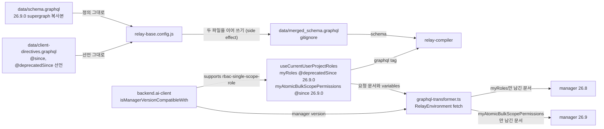

# 0006 — Version-gated field pairs across manager versions

## Summary

> 낯선 용어는 문서 맨 아래 [용어](#용어)에 모아 두었다.

- `data/schema.graphql`은 매니저 [supergraph](#용어)의 복사본이고 손으로 고치지 않는다. 26.9.0 supergraph는 26.9.0이 폐기한 RBAC field를 `@deprecated`로 남기므로, 옛 field를 select한 document도 relay-compiler가 컴파일한다.
- 한 document가 26.8 매니저와 26.9 매니저가 각각 답하는 root field를 함께 select한다. 옛 field에는 `@deprecatedSince(version: "26.9.0")`, 새 field에는 `@since(version: "26.9.0")`를 달고, `react/src/helper/graphql-transformer.ts`가 요청 전에 연결된 매니저에 맞지 않는 쪽을 지운다.
- 이 방식을 따르는 RBAC document는 `useCurrentUserProjectRoles`의 query 하나다. 권한 tab과 할당 tab의 document는 아직 gate되지 않았고, 26.9 매니저에서 어떻게 동작하는지는 Consequences에 적었다.

## Context

- **Schema copy**: `data/schema.graphql`은 backend.ai 저장소의 `docs/manager/graphql-reference/supergraph.graphql`을 그대로 복사한 파일이다. `bai-agent query`는 네트워크에 나가기 전에 이 파일로 document를 검증하므로, 매니저에 없는 정의가 여기 들어가면 그 검증이 매니저에 없는 field를 통과시킨다.
- **Compiler constraint**: `relay-base.config.js`는 `data/schema.graphql`과 `data/client-directives.graphql`을 이어 붙여 `data/merged_schema.graphql`을 쓰고, relay-compiler는 그 파일 하나만 schema로 읽는다. relay-compiler는 이 schema에 없는 field를 select한 document를 컴파일하지 않는다.
- **Changed 26.9.0 fields**: 매니저 26.9.0은 role이 scope 하나에만 속하도록 바꾸었다(backend.ai BA-7796, #14478). 아래 표는 이 저장소의 document가 select하던 것 중 바뀐 것이다.

| 26.8.3 | 26.9.0 |
|---|---|
| `Role.scopes` connection | `Role.scopeType`, `scopeId`, `scope`. `scopes`는 `@deprecated`로 남고 role의 scope 하나만 담으며 `filter`와 `order_by`를 무시한다. |
| `CreateRoleInput.scopes` | `CreateRoleInput.scope`. `scopes`는 `@deprecated`로 남아 항목 하나만 받는다. |
| `RBACElementType` enum, 대문자 값 | `String`, 소문자 snake_case 값. enum 정의는 schema에 남고, 설명 문자열이 "Deprecated since 26.9.0"이라고 적는다. |
| `Permission.scopeType`, `scopeId`, `operation: OperationType`, 모두 non-null | `Permission.permission: PermissionBit!`. 옛 field는 nullable `@deprecated` field로 남고 항상 `null`을 답한다. |
| `CreatePermissionInput.scopeType`, `scopeId`, `operation` | `CreatePermissionInput.permission: PermissionBit!`가 required다. 옛 field는 `@deprecated`로 남고 값은 무시된다. |
| `PermissionNestedFilter.entityType: RBACElementTypeFilter`, 프로젝트 관리자 entity `PROJECT_ADMIN_PAGE` | `StringFilter`, 프로젝트 관리자 entity [`scope_admin`](#용어). `scopeType`, `scopeId`, `operation` filter는 `@deprecated`로 남고 값은 무시된다. |
| `RoleMappedScopeNestedFilter.scopeId: StringFilter` | `UUIDFilter` |

- **Unknown field rejection**: 매니저는 요청 문서에 모르는 field가 하나만 있어도 요청 전체를 거부한다. 26.8.3 supergraph에는 `myAtomicBulkScopePermissions`, `Role.scopeType`, `Permission.permission`이 없다.
- **First failure site**: `useCurrentUserProjectRoles`는 `useRouteAccess`, `useWebUIMenuItems`, `WebUIHeaderProjectSelect`와 folder component가 프로젝트 관리자 여부를 묻는 hook이다. 이 hook이 `PROJECT_ADMIN_PAGE`로 거른 `myRoles`만 select하면 26.9 매니저에서 맞는 permission이 없어 프로젝트 관리자 메뉴와 route가 사라진다. 26.9의 답은 `myAtomicBulkScopePermissions`(backend BA-7924, #14678)로, 호출자가 각 프로젝트의 `scope_admin`에 실제로 가진 [`PermissionBit`](#용어) 목록을 답한다.
- **Existing mechanism**: `data/client-directives.graphql`이 `@since`와 `@deprecatedSince`를 `on FIELD`로 선언한다. `react/src/RelayEnvironment.ts`의 fetch가 `manipulateGraphQLQueryWithClientDirectives`에 요청 문서와 `isNotCompatibleWithVersion`을 넘기고, 그 함수가 반환한 문서를 원래 variables 객체와 함께 보낸다.

## 설계도

## Decision

### 1. supergraph 복사본 하나만 schema로 쓴다

- **Source file**: `data/schema.graphql`은 backend.ai supergraph를 복사한 파일이며, 옛 매니저용 정의를 여기에 더하지 않는다. 옛 매니저가 답하는 field는 supergraph가 `@deprecated`로 남긴 정의를 그대로 select한다.

### 2. 매니저마다 다른 root field는 directive 쌍으로 가른다

- **Directive pair**: 옛 field에는 `@deprecatedSince(version: V)`, 새 field에는 `@since(version: V)`를 단다. V는 매니저가 그 field를 폐기하거나 더한 버전이다. `useCurrentUserProjectRoles`는 한 query에 `legacyRoles: myRoles … @deprecatedSince(version: "26.9.0")`와 `heldPermissions: myAtomicBulkScopePermissions … @since(version: "26.9.0")`를 나란히 둔다.
- **Version boundary**: `graphql-transformer.ts`는 연결된 매니저가 V 이상이면 `@since` field를 남기고 `@deprecatedSince` field를 지우며, V 미만이면 반대로 한다.
- **Variable pruning**: 두 root field는 각자 variable(`$targets`, `$legacyPermissionFilter`)을 받는다. `graphql-transformer.ts`는 field를 지운 뒤 문서 안에서 더는 참조되지 않는 variable 정의를 지우므로, 26.8 매니저가 받는 문서에는 `$targets: [PermissionTarget!]!` 정의가 없다. `RelayEnvironment.ts`는 variables 객체를 줄이지 않고 그대로 보낸다.
- **Why both gates**: `@since`는 26.8 매니저가 모르는 새 field 때문에 요청 전체가 거부되지 않게 한다. `@deprecatedSince`는 26.9 매니저에게 맞는 permission이 없는 `myRoles` filter를 보내지 않게 한다. 폐기된 field는 26.9에서 거부되지 않으므로, 이 gate가 빠져도 오류는 나지 않고 결과가 비어 있다.
- **Error isolation**: 두 root field 모두 `@catch(to: RESULT)`를 단다. field가 오류를 내면 hook은 `{ ok: false }`를 받아 그 결과를 건너뛰고, 페이지는 계속 그려진다.
- **Result merge**: hook은 `heldPermissions`의 답에서 `permissions`에 `READ`가 있는 `scopeId`를 모으고, `legacyRoles`의 답에서 각 role의 `scopes` 중 `scopeType`이 PROJECT인 `scopeId`를 모아 한 집합으로 합친다. transformer가 한쪽만 남기므로 한 요청에서는 한쪽만 값이 있다.

### 3. 같은 hook의 나머지 분기는 feature flag로 고른다

- **Flag location**: [feature flag](#용어)는 `packages/backend.ai-client/src/client.ts`의 `isManagerVersionCompatibleWith('<version>')` block이 켜고, component와 hook은 `baiClient.supports(flag)`로 읽는다.
- **Hook flags**: `useCurrentUserProjectRoles`가 읽는 flag와 그 값이다.

| flag | 켜지는 버전 | 켜졌을 때 | 꺼졌을 때 |
|---|---|---|---|
| `rbac-single-scope-role` | 26.9.0 | `useCurrentUserProjectRolesProjectsQuery`를 `store-or-network`로 읽어 `$targets`를 만든다. | 같은 query를 `store-only`로 읽어 요청을 보내지 않는다. |
| `my-roles` | 26.4.0 | 주 query를 `store-or-network`로 읽는다. | 주 query를 `store-only`로 읽는다. |
| `rbac-filter-wrapper` | 26.4.4rc9 | `$legacyPermissionFilter.entityType`을 `{ equals: 'PROJECT_ADMIN_PAGE' }`로 보낸다. | 같은 값을 문자열 그대로 보낸다. |

### 4. 26.8 지원을 끝낼 때 함께 지운다

- **Removal set**: 26.8 매니저 지원을 끝내는 PR은 RBAC document의 `@deprecatedSince(version: "26.9.0")` 선택과 그 결과를 읽는 코드, `rbac-single-scope-role` 분기, 옛 shape로 보내는 permission input의 `as CreatePermissionInput` cast를 함께 지운다. 같은 버전 표시는 RBAC가 아닌 document(`DeleteVFolderModalV2`, `DeleteForeverVFolderModalV2`, `PurgeUsersModal`)에도 있으므로, 대상은 `@deprecatedSince(version: "26.9.0")`를 grep한 결과에서 RBAC document만 고른다.

## 대안과 기각 사유

- **New schema only**: document는 새 field만 select한다. directive와 fallback이 없다는 것이 장점이다. 기각한 이유는 26.8 매니저를 쓰는 배포에서 `useCurrentUserProjectRoles`의 요청이 거부되어 메뉴와 route 접근 판정이 멈추고, 이 저장소는 한 빌드로 여러 매니저 버전에 붙기 때문이다.
- **Compat schema fold**: 폐기된 정의를 별도 compat 파일에 두고 `relay-base.config.js`가 merged schema에 접어 넣는다. supergraph가 정의를 완전히 지워도 옛 document가 컴파일된다는 것이 장점이다. 기각한 이유는 26.9.0 supergraph가 그 정의를 `@deprecated`로 이미 담고 있어, compat 파일은 같은 field를 다시 선언하는 두 번째 schema가 될 뿐이기 때문이다.
- **Hand-edited supergraph copy**: 옛 정의를 `data/schema.graphql`에 직접 넣는다. 병합 단계가 없다는 것이 장점이다. 기각한 이유는 다음 sync가 그 편집을 덮어쓰고, `bai-agent`가 이 파일로 document를 검증하므로 매니저에 없는 field가 검증을 통과하기 때문이다.
- **Documents per manager version**: 매니저 버전마다 fragment와 query를 따로 두고 component가 고른다. 각 document가 한 매니저 버전에만 맞으면 된다는 것이 장점이다. 기각한 이유는 fragment를 spread하는 곳마다 분기가 생기고, relay-compiler가 schema를 하나만 받으므로 두 document가 여전히 같은 schema에 맞아야 하기 때문이다.

## Consequences

- **One build, two managers**: `useCurrentUserProjectRoles`는 같은 빌드로 26.8 매니저와 26.9 매니저 모두에서 프로젝트 관리자 여부를 답한다.
- **Nullability gap**: `@since` field는 generated type에서 non-null이지만 옛 매니저에서는 `undefined`다. component가 그 값을 확인 없이 쓰면 TypeScript는 잡지 못한다. `useCurrentUserProjectRoles`는 `@catch` 결과의 `ok`와 optional chaining으로 이를 처리한다.
- **Deprecated nulls**: 폐기된 field는 generated type에서 nullable이다. `RoleScopePermissionEditModal`과 `ScopedRolePermissionCard`는 `scopeId`나 `operation`이 `null`인 permission 행을 건너뛰고, `LegacyRolePermissionTab`은 `null`을 빈 문자열로 바꾼다.
- **Bulk target cap**: `myAtomicBulkScopePermissions`는 target 100개까지 받으므로 `useCurrentUserProjectRoles`는 사용자의 프로젝트 중 앞 100개만 묻는다. 그 뒤의 프로젝트는 사용자가 관리자여도 관리자로 판정되지 않는다.
- **Ungated RBAC documents**: 아래 document는 폐기된 정의를 gate 없이 select하거나 보낸다. 이 화면들을 26.9 permission 모델로 옮기는 일은 FR-3957, FR-3958, FR-3959다.

| document | 폐기된 정의 | 26.9 매니저에서 |
|---|---|---|
| `ScopedRolePermissionCardQuery` | `Role.scopes`, `Permission.scopeId`, `operation`, `$permissionFilter`의 `PermissionFilter.scopeType: RBACElementTypeFilter` | component는 matrix가 답한 `scopeType`을 `permissionFilter.scopeType.equals`에 넣는다. 26.9의 소문자 값은 `RBACElementType` enum 값이 아니므로 variable 검증에서 요청이 거부된다. `scopeFilter.scopeType`은 `EntityFilter`의 `StringFilter`라 거부되지 않는다. |
| `RoleScopePermissionEditModal_permissionsFragment` | `Permission.scopeId`, `operation` | 두 값이 `null`이다. |
| `RoleScopePermissionEditModalBulkAddMutation` | input의 `scopeType`, `scopeId`, `operation`, payload의 같은 field | input에 required `permission`이 없어 mutation이 거부된다. component는 `as CreatePermissionInput[]` cast로 컴파일한다. |
| `LegacyCreatePermissionModal`의 create, update mutation | input의 옛 field, payload의 `scopeType`, `scopeId`, `operation` | create는 `permission`이 없어 거부된다. component는 `as CreatePermissionInput` cast로 컴파일한다. |
| `LegacyRolePermissionTabQuery` | `Permission.scopeType`, `scopeId`, `operation`, `scope`, `PermissionFilter.scopeType` | `RoleDetailDrawerContent`는 `role-mapped-scope-filter`(26.8.0)가 꺼진 매니저에서만 이 tab과 `LegacyCreatePermissionModal`을 보여 주므로 26.9에서는 요청하지 않는다. |
| `RoleAssignmentTabFragment` | `firstScope: scopes(first: 1)` | 26.9가 답하는 소문자 `scopeType`은 component의 `=== 'PROJECT'` 비교와 맞지 않아, `projectScopeId`가 `undefined`가 된다. |

## 출처

- Jira: FR-3905 (Epic FR-3906). 호환 정책은 FR-3962에서 정했다. 후속은 FR-3957 권한 탭, FR-3958 할당 탭, FR-3959 Legacy 탭이다.
- backend.ai: BA-7796 (#14478) scope-entity association table 제거, BA-7885 (#14628) role, permission, assignment를 scope로 읽기, BA-7919 (#14669) `Role.scopes`를 deprecated로 복구, BA-7924 (#14678) `myScopePermissions`·`myAtomicBulkScopePermissions`와 `RoleFilter.permission`.
- schema: `data/schema.graphql`은 backend.ai 26.9.0 supergraph의 복사본이다. 비교 기준인 26.8.3은 backend.ai 태그 `26.8.3`의 supergraph다.
- 결정일: 2026-09-17.
- 관련: `data/client-directives.graphql`, `react/src/helper/graphql-transformer.ts`, `react/src/helper/graphql-transformer.test.ts`의 version-gated field pair 테스트.

## 용어

| 용어 | 뜻 |
|---|---|
| supergraph | backend.ai 매니저의 여러 GraphQL 서비스 schema를 하나로 합친 SDL이다. backend.ai 저장소의 `docs/manager/graphql-reference/supergraph.graphql`에 있다. |
| client directive | `@since`, `@deprecatedSince`처럼 매니저가 아니라 `graphql-transformer.ts`가 읽고 요청 문서에서 지우는 directive다. `data/client-directives.graphql`에 `on FIELD`로 선언되어 relay-compiler가 받아들인다. |
| feature flag | `backend.ai-client`의 `Client`가 연결된 매니저 버전으로 켜는 이름 붙은 boolean이다. `baiClient.supports(name)`으로 읽는다. |
| `@catch(to: RESULT)` | Relay directive로, field 오류를 throw하지 않고 `{ ok: false, errors }` 또는 `{ ok: true, value }`로 돌려준다. |
| `PermissionBit` | 26.9.0에서 permission 하나가 갖는 권한 종류 enum이다. `READ`, `UPDATE`, `CREATE`, `SOFT_DELETE`, `HARD_DELETE`가 있다. |
| `scope_admin` | 26.9.0 매니저에서 scope 관리 권한을 나타내는 entity type 문자열이다. 프로젝트 scope에 대해 이 entity의 `READ`를 가진 사용자를 hook이 프로젝트 관리자로 본다. |
