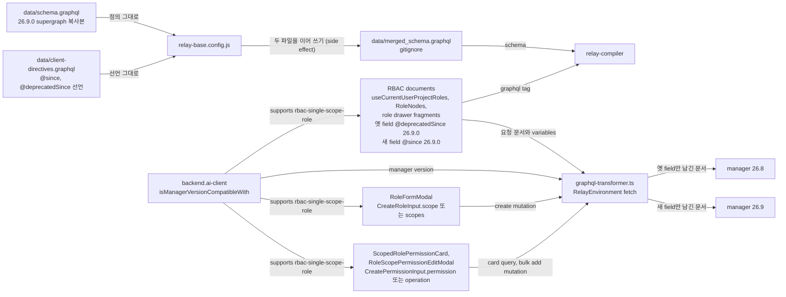

# 0006 — Version-gated field pairs across manager versions

## Summary

> 낯선 용어는 문서 맨 아래 [용어](#용어)에 모아 두었다.

- `data/schema.graphql`은 매니저 [supergraph](#용어)의 복사본이고 손으로 고치지 않는다. 26.9.0 supergraph는 26.9.0이 폐기한 RBAC field를 `@deprecated`로 남기므로, 옛 field를 select한 document도 relay-compiler가 컴파일한다.
- 한 document가 26.8 매니저와 26.9 매니저가 각각 답하는 field를 함께 select한다. 옛 field에는 `@deprecatedSince(version: "26.9.0")`, 새 field에는 `@since(version: "26.9.0")`를 달고, `react/src/helper/graphql-transformer.ts`가 요청 전에 연결된 매니저에 맞지 않는 쪽을 지운다.
- 이 방식을 따르는 RBAC document는 `useCurrentUserProjectRoles`의 query, role 목록의 `RoleNodesFragment`, role drawer의 `RoleAssignmentTabFragment`, `RolePermissionDetailTab_roleScopeFragment`, `ScopedRolePermissionCardQuery`, `RoleScopePermissionEditModal_permissionsFragment`, `RoleScopePermissionEditModalBulkAddMutation`, `AssignRoleModalBulkAssignMutation`이다. `LegacyRoleScopeTab`, `LegacyRolePermissionTab`, `LegacyCreatePermissionModal`의 document는 26.8.0 미만 매니저만 받으므로 gate하지 않는다.
- RBAC type 문자열을 비교하는 component는 값을 대문자로 바꾼 뒤 비교하고, 매니저에 보낼 때는 매니저가 답한 표기를 그대로 보낸다. role form은 `rbac-single-scope-role` flag로 `CreateRoleInput.scope`와 `scopes` 중 하나를 보낸다. `ScopedRolePermissionCard`는 같은 flag로 scope filter·pagination variables와 permission filter를 variables에 넣을지 고르고, `RoleScopePermissionEditModal`은 `CreatePermissionInput`의 shape을 고른다.

## Context

- **Schema copy**: `data/schema.graphql`은 backend.ai 저장소의 `docs/manager/graphql-reference/supergraph.graphql`을 그대로 복사한 파일이다. `bai-agent query`는 네트워크에 나가기 전에 이 파일로 document를 검증하므로, 매니저에 없는 정의가 여기 들어가면 그 검증이 매니저에 없는 field를 통과시킨다.
- **Compiler constraint**: `relay-base.config.js`는 `data/schema.graphql`과 `data/client-directives.graphql`을 이어 붙여 `data/merged_schema.graphql`을 쓰고, relay-compiler는 그 파일 하나만 schema로 읽는다. relay-compiler는 이 schema에 없는 field를 select한 document를 컴파일하지 않는다.
- **Changed 26.9.0 fields**: 매니저 26.9.0은 role이 scope 하나에만 속하도록 바꾸었다(backend.ai BA-7796, #14478). 아래 표는 이 저장소의 document가 select하던 것 중 바뀐 것이다.

| 26.8.3 | 26.9.0 |
|---|---|
| `Role.scopes` connection | `Role.scopeType`, `scopeId`, `scope`. `scopes`는 `@deprecated`로 남고 role의 scope 하나만 담으며 `filter`와 `order_by`를 무시한다. |
| `CreateRoleInput.scopes` | `CreateRoleInput.scope`. `scopes`는 `@deprecated`로 남아 항목 하나만 받는다. |
| `RBACElementType` enum, 대문자 값 | `String`, 소문자 snake_case 값. enum 정의는 schema에 남고, 설명 문자열이 "Deprecated since 26.9.0"이라고 적는다. |
| `Permission.scopeType`, `scopeId`, `operation: OperationType`, 모두 non-null | `Permission.permission: PermissionBit!`. 옛 field는 nullable `@deprecated` field로 남고 항상 `null`을 답한다. |
| `CreatePermissionInput.scopeType`, `scopeId`, `operation` | `CreatePermissionInput.permission: PermissionBit!`가 required다. 옛 field는 `@deprecated`로 남고 값은 무시된다. |
| `PermissionNestedFilter.entityType: RBACElementTypeFilter`, 프로젝트 관리자 entity `PROJECT_ADMIN_PAGE` | `StringFilter`, 프로젝트 관리자 entity [`scope_admin`](#용어). `scopeType`, `scopeId`, `operation` filter는 `@deprecated`로 남고 값은 무시된다. |
| `RoleMappedScopeNestedFilter.scopeId: StringFilter` | `UUIDFilter` |
| `rbacPermissionMatrix`의 `OperationInfo.requiredPermission: OperationType!` (`GRANT_*` 포함) | `PermissionBit!` |

- **Unknown field rejection**: 매니저는 요청 문서에 모르는 field가 하나만 있어도 요청 전체를 거부한다. 26.8.3 supergraph에는 `myAtomicBulkScopePermissions`, `Role.scopeType`, `Permission.permission`이 없다.
- **First failure site**: `useCurrentUserProjectRoles`는 `useRouteAccess`, `useWebUIMenuItems`, `WebUIHeaderProjectSelect`와 folder component가 프로젝트 관리자 여부를 묻는 hook이다. 이 hook이 `PROJECT_ADMIN_PAGE`로 거른 `myRoles`만 select하면 26.9 매니저에서 맞는 permission이 없어 프로젝트 관리자 메뉴와 route가 사라진다. 26.9의 답은 `myAtomicBulkScopePermissions`(backend BA-7924, #14678)로, 호출자가 각 프로젝트의 `scope_admin`에 실제로 가진 [`PermissionBit`](#용어) 목록을 답한다.
- **Existing mechanism**: `data/client-directives.graphql`이 `@since`와 `@deprecatedSince`를 `on FIELD`로 선언한다. `react/src/RelayEnvironment.ts`의 fetch가 `manipulateGraphQLQueryWithClientDirectives`에 요청 문서와 `isNotCompatibleWithVersion`을 넘기고, 그 함수가 반환한 문서를 원래 variables 객체와 함께 보낸다.

## 설계도

## Decision

### 1. supergraph 복사본 하나만 schema로 쓴다

- **Source file**: `data/schema.graphql`은 backend.ai supergraph를 복사한 파일이며, 옛 매니저용 정의를 여기에 더하지 않는다. 옛 매니저가 답하는 field는 supergraph가 `@deprecated`로 남긴 정의를 그대로 select한다.

### 2. 매니저마다 다른 field는 directive 쌍으로 가른다

- **Directive pair**: 옛 field에는 `@deprecatedSince(version: V)`, 새 field에는 `@since(version: V)`를 단다. V는 매니저가 그 field를 폐기하거나 더한 버전이다. `useCurrentUserProjectRoles`는 한 query에 `legacyRoles: myRoles … @deprecatedSince(version: "26.9.0")`와 `heldPermissions: myAtomicBulkScopePermissions … @since(version: "26.9.0")`를 나란히 둔다.
- **Version boundary**: `graphql-transformer.ts`는 연결된 매니저가 V 이상이면 `@since` field를 남기고 `@deprecatedSince` field를 지우며, V 미만이면 반대로 한다.
- **Variable pruning**: 두 root field는 각자 variable(`$targets`, `$legacyPermissionFilter`)을 받는다. `graphql-transformer.ts`는 field를 지운 뒤 문서 안에서 더는 참조되지 않는 variable 정의를 지우므로, 26.8 매니저가 받는 문서에는 `$targets: [PermissionTarget!]!` 정의가 없다. `RelayEnvironment.ts`는 variables 객체를 줄이지 않고 그대로 보낸다.
- **Why both gates**: `@since`는 26.8 매니저가 모르는 새 field 때문에 요청 전체가 거부되지 않게 한다. `@deprecatedSince`는 26.9 매니저에게 맞는 permission이 없는 `myRoles` filter를 보내지 않게 한다. 폐기된 field는 26.9에서 거부되지 않으므로, 이 gate가 빠져도 오류는 나지 않고 결과가 비어 있다.
- **Error isolation**: 두 root field 모두 `@catch(to: RESULT)`를 단다. field가 오류를 내면 hook은 `{ ok: false }`를 받아 그 결과를 건너뛰고, 페이지는 계속 그려진다.
- **Object field pair**: `RoleNodesFragment`는 role의 `scopes`에 `@deprecatedSince(version: "26.9.0")`를, `scopeType`·`scopeId`·`scope`에 `@since(version: "26.9.0")`를 단다. `RoleAssignmentTabFragment`는 `firstScope: scopes(first: 1)`와 `scopeType`·`scopeId`에 같은 쌍을 단다.
- **Read order**: `RoleNodes`와 `RoleAssignmentTab`은 `scopeType`에 값이 있으면 그 scope를 읽고, 없으면 `scopes`의 첫 항목을 읽는다. `RoleNodes`의 `readRoleScope`는 두 경로에서 `scopeType`·`scopeId`·`scope`와 `extraCount`를 답한다. `extraCount`는 26.9에서 항상 0이고, 26.8 이하에서는 cell이 이름을 대지 못한 나머지 scope 개수다. scope type과 scope id 열은 이 값이 0보다 클 때만 `+N` badge를 붙이므로 매니저 버전을 보지 않는다.
- **Empty-scope check**: `RolePermissionDetailTab_roleScopeFragment`는 `totalScopes: scopes(first: 1) @deprecatedSince(version: "26.9.0")`의 `count`와 `scopeType`·`scopeId @since(version: "26.9.0")`를 select한다. `RolePermissionDetailTab`은 `scopeId`가 없고 `count`가 0일 때만 빈 상태를 그리고, `scopeType`에 값이 있으면 그 type의 card 하나를, 없으면 `rbacPermissionMatrix`의 scope type마다 card를 그린다. 26.9 role은 항상 scope 하나를 가진다.
- **Card scope pair**: `ScopedRolePermissionCardQuery`는 `adminRole`의 `scopeType`·`scopeId`·`scope`에 `@since(version: "26.9.0")`를, `scopes(filter, limit, offset)`에 `@deprecatedSince(version: "26.9.0")`를 단다. `ScopedRolePermissionCard`는 `scopeType`에 값이 있으면 그 scope 하나를 행으로 그리고, 없으면 `scopes`의 edge를 행으로 그린다.
- **Permission field pair**: `ScopedRolePermissionCardQuery`, `RoleScopePermissionEditModal_permissionsFragment`, `RoleScopePermissionEditModalBulkAddMutation`의 payload는 `Permission.scopeId`·`operation`에 `@deprecatedSince(version: "26.9.0")`를, `permission`에 `@since(version: "26.9.0")`를 단다. `ScopedRolePermissionCard`와 `RoleScopePermissionEditModal`은 `permission ?? operation`을 grant 값으로 읽는다. `scopeId`가 없을 때 card는 `adminRole.scopeId`를, modal은 `rbac-single-scope-role`이 켜져 있을 때 `scopes[0].scopeId`를 그 permission의 scope로 읽는다. 26.9 매니저에서는 편집 대상 scope가 role의 scope 하나뿐이다.
- **Edit modal props**: `RoleScopePermissionEditModal`은 scope document를 갖지 않는다. `ScopedRolePermissionCard`가 `scopeType: string`과 `scopes: ReadonlyArray<EditingScope>`(`{ scopeId: string; scopeName?: string | null }`)를 prop으로 넘기고, scope 이름은 card의 `resolveScopeName`이 행의 `scope` entity에서 푼다.
- **Result merge**: hook은 `heldPermissions`의 답에서 `permissions`에 `READ`가 있는 `scopeId`를 모으고, `legacyRoles`의 답에서 각 role의 `scopes` 중 `scopeType`이 PROJECT인 `scopeId`를 모아 한 집합으로 합친다. transformer가 한쪽만 남기므로 한 요청에서는 한쪽만 값이 있다.

### 3. RBAC type 문자열은 대소문자를 무시하고 매니저의 표기로 보낸다

- **Spellings**: 26.8은 scope/entity type을 대문자 enum 값(`PROJECT`)으로, 26.9는 소문자 snake_case 문자열(`project`)로 답한다.
- **Case folding**: type 값을 비교하는 component는 값을 `toUpperCase()`한 뒤 대문자 값과 비교한다. 지금 비교하는 곳은 `RoleFormModal`의 scope type 옵션 필터와 `ScopeIdSelect`의 picker 분기, `RoleAssignmentTab`의 `PROJECT` 판정이다.
- **Labels**: `react/src/helper/rbacElementTypes.ts`의 `rbacTypeI18nKey(type)`가 `rbac.types.<대문자 type>` 키를 만든다. `RoleNodes`, `RoleFormModal`, `RBACManagementPage`가 이 함수로 라벨을 찾고, i18n 키는 대문자 표기 그대로 둔다.
- **Filter options**: role 목록 filter의 scope type 옵션은 `rbacScopeEntityCombinations`가 답한 `scopeType` 전부다. 이 query는 `RBACManagementPage`의 `ScopeTypeSelect`가 직접 들고, filter 속성의 `renderInput`이 그 select를 `Suspense`로 감싼다. 페이지는 filter를 열기 전에는 이 query를 보내지 않는다.
- **Form options**: role form의 scope type 옵션은 `rbacPermissionMatrix`가 답한 `scopeType` 중, 대문자로 바꾼 값이 `RBAC_ELEMENT_TYPES`(scope-id picker가 있는 type의 대문자 목록)에 있고 action이 하나 이상인 entity를 가진 것이다. 대문자 기준으로 중복을 없앤다.
- **Sent value**: 두 옵션 모두 매니저가 답한 표기를 option value로 쓰고, 그 값을 filter와 mutation에 그대로 보낸다.
- **Scope id filter**: role 목록의 `mappedScope.scopeId` filter는 `type: 'uuid'`와 `fixedOperator: 'equals'`를 쓴다. `equals`는 26.8과 26.9의 filter type이 모두 받는 operator다.

### 4. document 밖의 분기는 feature flag로 고른다

- **Flag location**: [feature flag](#용어)는 `packages/backend.ai-client/src/client.ts`의 `isManagerVersionCompatibleWith('<version>')` block이 켜고, component와 hook은 `baiClient.supports(flag)`로 읽는다.
- **Hook flags**: `useCurrentUserProjectRoles`가 읽는 flag와 그 값이다.

| flag | 켜지는 버전 | 켜졌을 때 | 꺼졌을 때 |
|---|---|---|---|
| `rbac-single-scope-role` | 26.9.0 | `useCurrentUserProjectRolesProjectsQuery`를 `store-or-network`로 읽어 `$targets`를 만든다. | 같은 query를 `store-only`로 읽어 요청을 보내지 않는다. |
| `my-roles` | 26.4.0 | 주 query를 `store-or-network`로 읽는다. | 주 query를 `store-only`로 읽는다. |
| `rbac-filter-wrapper` | 26.4.4rc9 | `$legacyPermissionFilter.entityType`을 `{ equals: 'PROJECT_ADMIN_PAGE' }`로 보낸다. | 같은 값을 문자열 그대로 보낸다. |

- **Role form flag**: `RoleFormModal`은 scope type 하나와 scope id 하나를 받는다. `rbac-single-scope-role`이 켜져 있으면 `CreateRoleInput.scope`로, 꺼져 있으면 항목 하나짜리 `CreateRoleInput.scopes`로 보낸다.
- **Card variables**: `ScopedRolePermissionCard`는 `rbac-single-scope-role`이 꺼져 있을 때만 `$scopeFilter`·`$scopeLimit`·`$scopeOffset`과 `$permissionFilter`를 variables에 넣고 scope-id filter, row selection, pagination을 그린다. `$scopeFilter`·`$scopeLimit`·`$scopeOffset`의 정의는 그 variables를 쓰는 `scopes` field와 함께 transformer가 지우지만, `permissions(filter: $permissionFilter)`는 gate하지 않으므로 `$permissionFilter` 정의는 남고 26.9 매니저는 값을 `null`로 받는다. `PermissionFilter.scopeType`은 `RBACElementTypeFilter`(`equals: RBACElementType`)라 26.9 매니저는 소문자 값을 variable 검증에서 거부한다.
- **Permission input shape**: `RoleScopePermissionEditModal`은 flag가 켜져 있으면 `CreatePermissionInput`을 `{ roleId, entityType, permission }`으로, 꺼져 있으면 `{ roleId, scopeType, scopeId, entityType, operation }`으로 보낸다.
- **Delegate columns**: `RoleScopePermissionEditModal`은 delegate(`GRANT_*`) column group을 flag가 아니라 `rbacPermissionMatrix`가 그 scope type에 `GRANT_*` `requiredPermission`을 답할 때만 그린다. 26.9 매니저는 `PermissionBit` 다섯 개만 답하므로 group 없이 다섯 column만 그린다.
- **Assignment source**: `RoleAssignmentTab`은 assignment 행을 `Role.users`가 아니라 `adminRoleAssignments(filter: { roleId })`로 읽는다. `Role.users`는 26.9.0에서 `@deprecated`이고, 그 대체인 `Role.usersV2`는 표가 보여 주는 `grantedAt`·`grantedBy`를 답하지 않는다. `AssignRoleModalBulkAssignMutation`은 `failed`에 `@deprecatedSince(version: "26.9.0")`를 단다. 26.9 매니저는 거부된 사용자가 있으면 mutation 전체를 거부하므로, `AssignRoleModal`은 그 오류를 선택한 사용자 전부의 실패로 표에 적는다.

### 5. 26.8 지원을 끝낼 때 함께 지운다

- **Removal set**: 26.8 매니저 지원을 끝내는 PR은 아래를 함께 지운다. 같은 버전 표시는 RBAC가 아닌 document(`DeleteVFolderModalV2`, `DeleteForeverVFolderModalV2`, `PurgeUsersModal`)에도 있으므로, 대상은 `@deprecatedSince(version: "26.9.0")`를 grep한 결과에서 RBAC document만 고른다.
  - RBAC document의 `@deprecatedSince(version: "26.9.0")` 선택과 그 결과를 읽는 코드.
  - `rbac-single-scope-role` 분기: `useCurrentUserProjectRoles`, `RoleFormModal`, `ScopedRolePermissionCard`, `RoleScopePermissionEditModal`.
  - `ScopedRolePermissionCard`의 `scopes.edges`에서 행을 만드는 경로와 `ScopeRow` type, scope-id filter·row selection·pagination state.
  - `RoleScopePermissionEditModal`의 `DELEGATE_OPERATIONS` column group, `scopes.length > 1`일 때의 bulk mode(`BAIBulkEditFormItem`), 옛 shape로 보내는 permission input의 `as CreatePermissionInput` cast.

## 대안과 기각 사유

- **New schema only**: document는 새 field만 select한다. directive와 fallback이 없다는 것이 장점이다. 기각한 이유는 26.8 매니저를 쓰는 배포에서 `useCurrentUserProjectRoles`의 요청이 거부되어 메뉴와 route 접근 판정이 멈추고, 이 저장소는 한 빌드로 여러 매니저 버전에 붙기 때문이다.
- **Compat schema fold**: 폐기된 정의를 별도 compat 파일에 두고 `relay-base.config.js`가 merged schema에 접어 넣는다. supergraph가 정의를 완전히 지워도 옛 document가 컴파일된다는 것이 장점이다. 기각한 이유는 26.9.0 supergraph가 그 정의를 `@deprecated`로 이미 담고 있어, compat 파일은 같은 field를 다시 선언하는 두 번째 schema가 될 뿐이기 때문이다.
- **Hand-edited supergraph copy**: 옛 정의를 `data/schema.graphql`에 직접 넣는다. 병합 단계가 없다는 것이 장점이다. 기각한 이유는 다음 sync가 그 편집을 덮어쓰고, `bai-agent`가 이 파일로 document를 검증하므로 매니저에 없는 field가 검증을 통과하기 때문이다.
- **Documents per manager version**: 매니저 버전마다 fragment와 query를 따로 두고 component가 고른다. 각 document가 한 매니저 버전에만 맞으면 된다는 것이 장점이다. 기각한 이유는 fragment를 spread하는 곳마다 분기가 생기고, relay-compiler가 schema를 하나만 받으므로 두 document가 여전히 같은 schema에 맞아야 하기 때문이다.

## Consequences

- **One build, two managers**: `useCurrentUserProjectRoles`는 같은 빌드로 26.8 매니저와 26.9 매니저 모두에서 프로젝트 관리자 여부를 답한다.
- **Nullability gap**: transformer가 지운 field는 generated type과 관계없이 `undefined`다. `@since` field는 옛 매니저에서, `@deprecatedSince` field는 새 매니저에서 그렇다. component가 그 값을 확인 없이 쓰면 TypeScript는 잡지 못한다. `useCurrentUserProjectRoles`는 `@catch` 결과의 `ok`와 optional chaining으로, `RoleNodes`·`RoleAssignmentTab`·`ScopedRolePermissionCard`는 `scopeType`에, `RolePermissionDetailTab`은 `scopeType`과 `scopeId`에 값이 있는지 먼저 확인하고, `ScopedRolePermissionCard`와 `RoleScopePermissionEditModal`은 `permission ?? operation`으로 둘 중 답한 쪽을 읽는다.
- **Bulk target cap**: `myAtomicBulkScopePermissions`는 target 100개까지 받으므로 `useCurrentUserProjectRoles`는 사용자의 프로젝트 중 앞 100개만 묻는다. 그 뒤의 프로젝트는 사용자가 관리자여도 관리자로 판정되지 않는다.
- **Ungated RBAC documents**: 아래 document는 폐기된 정의를 gate 없이 select하거나 보낸다. `RoleDetailDrawerContent`는 `role-mapped-scope-filter`(26.8.0)가 꺼진 매니저에서만 `LegacyRoleScopeTab`, `LegacyRolePermissionTab`, `LegacyCreatePermissionModal`을 그리므로 26.9 매니저는 이 document를 받지 않는다.

| document | 폐기된 정의 |
|---|---|
| `LegacyRoleScopeTabQuery` | `Role.scopes`의 `filter`, `orderBy` |
| `LegacyRolePermissionTabQuery` | `Permission.scopeType`, `scopeId`, `operation`, `scope`, `PermissionFilter.scopeType` |
| `LegacyCreatePermissionModal`의 create, update mutation | input의 `scopeType`, `scopeId`, `operation`, payload의 같은 field. component는 `as CreatePermissionInput` cast로 컴파일한다. |

- **Chip label after reload**: `renderInput`을 쓰는 filter 속성은 commit한 값의 label을 `onAddCondition`이 넘긴 메모리 상의 map에만 남긴다. 새로고침하면 scope type chip이 번역된 label 대신 매니저가 준 값(`project`)을 보여 준다. 같은 filter의 assigned-user 속성도 같다. 속성 단위 `resolveLabels`가 생기면 함께 풀린다.

## 출처

- Jira: FR-3905 (Epic FR-3906). 호환 정책은 FR-3962에서 정했다. role 목록·drawer fragment의 gate는 FR-3955, role form의 단일 scope 입력은 FR-3956, 권한 tab의 gate는 FR-3957, 할당 tab의 source 전환은 FR-3958이다. 후속은 FR-3959 Legacy 탭이다.
- backend.ai: BA-7796 (#14478) scope-entity association table 제거, BA-7885 (#14628) role, permission, assignment를 scope로 읽기, BA-7919 (#14669) `Role.scopes`를 deprecated로 복구, BA-7924 (#14678) `myScopePermissions`·`myAtomicBulkScopePermissions`와 `RoleFilter.permission`.
- schema: `data/schema.graphql`은 backend.ai 26.9.0 supergraph의 복사본이다. 비교 기준인 26.8.3은 backend.ai 태그 `26.8.3`의 supergraph다.
- 결정일: 2026-09-17.
- 관련: `data/client-directives.graphql`, `react/src/helper/graphql-transformer.ts`, `react/src/helper/graphql-transformer.test.ts`의 version-gated field pair 테스트.

## 용어

| 용어 | 뜻 |
|---|---|
| supergraph | backend.ai 매니저의 여러 GraphQL 서비스 schema를 하나로 합친 SDL이다. backend.ai 저장소의 `docs/manager/graphql-reference/supergraph.graphql`에 있다. |
| client directive | `@since`, `@deprecatedSince`처럼 매니저가 아니라 `graphql-transformer.ts`가 읽고 요청 문서에서 지우는 directive다. `data/client-directives.graphql`에 `on FIELD`로 선언되어 relay-compiler가 받아들인다. |
| feature flag | `backend.ai-client`의 `Client`가 연결된 매니저 버전으로 켜는 이름 붙은 boolean이다. `baiClient.supports(name)`으로 읽는다. |
| `@catch(to: RESULT)` | Relay directive로, field 오류를 throw하지 않고 `{ ok: false, errors }` 또는 `{ ok: true, value }`로 돌려준다. |
| `PermissionBit` | 26.9.0에서 permission 하나가 갖는 권한 종류 enum이다. `READ`, `UPDATE`, `CREATE`, `SOFT_DELETE`, `HARD_DELETE`가 있다. |
| `scope_admin` | 26.9.0 매니저에서 scope 관리 권한을 나타내는 entity type 문자열이다. 프로젝트 scope에 대해 이 entity의 `READ`를 가진 사용자를 hook이 프로젝트 관리자로 본다. |
