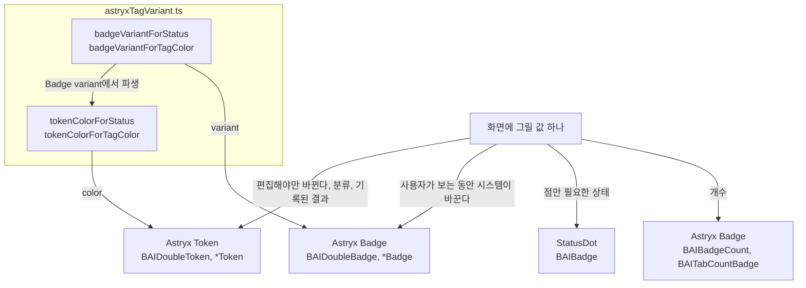

# 0007 — Badge for live values and Token for settled values

## Summary

> 낯선 용어는 문서 맨 아래 [용어](#용어)에 모아 두었다.

- 이 저장소에서 값 하나를 chip으로 그릴 때 Astryx `Badge`와 Astryx `Token` 중 무엇을 쓰는지는 값이 어떻게 바뀌는지로 정한다. 시스템이 스스로 바꾸는 [live value](#용어)는 `Badge`로, 사용자나 관리자가 편집할 때만 바뀌거나 분류를 나타내는 [settled value](#용어)는 `Token`으로 그린다.
- 개수(count)는 계속 `Badge`이고, 점 하나로 상태를 보이는 곳은 계속 `StatusDot`(BUI `BAIBadge`)이다.
- chip을 그리는 BUI·host component의 이름은 그 component가 그리는 primitive에 따라 `*Badge` 또는 `*Token`으로 끝난다. "Tag"는 image tag, deployment tag 같은 domain 명사로만 남는다.
- chip 색은 `packages/backend.ai-ui/src/helper/astryxTagVariant.ts`의 helper로만 고른다. `Badge`는 `badgeVariantFor*`, `Token`은 `tokenColorFor*`를 쓴다.
- 이 결정은 `.claude/rules/badge-vs-token.md`가 review 규칙으로, `AGENTS.md`의 ASTRYX block 아래 `STATUS SEMANTICS` 줄이 agent 지침으로 옮긴다. 그 줄은 Astryx가 생성한 "Status = StatusDot/Token; Badge = counts only"를 이 저장소에서 덮어쓴다.
- 범위 밖: `StatusDot`으로 그리는 isActive 표시를 `BAIBooleanToken`으로 바꾸는 일, 사용자 매뉴얼의 "status tag"·"tag chip" 표현, e2e의 `.ant-tag` locator는 별도 이슈로 다룬다.

## Context

- **What the two primitives are**: Astryx core에는 `Tag`나 `Chip` primitive가 없다. chip 모양은 `Badge`(`label: ReactNode`, `variant`, 클릭 불가)와 `Token`(`label: string`, `color`, `icon`, `onClick`, `onRemove`, `endContent`) 둘뿐이다. `StatusDot`은 점 하나만 그리며 chip이 아니다.
- **Styling after PR #9777**: FR-4002의 theme 변경으로 `Token`은 투명한 바탕에 자기 색의 1px outline을, `Badge`는 옅게 칠한 바탕과 outline과 진한 글자를 갖는다. 두 chip이 한 화면에서 눈에 띄게 달라졌으므로, 어느 값을 어느 chip으로 그리는지가 사용자에게 의미를 전하게 되었다.
- **One wrapper, two meanings**: BUI의 `BAITag`는 antd `Tag`의 `color` 문자열을 받아 `closable`이면 `Token`, 아니면 `Badge`를 그렸다. 쓰는 곳이 `closable`을 넘기지 않아 사실상 모든 chip이 `Badge`였고, 사용자 이름·권한·버전 같은 settled value와 session 상태 같은 live value가 같은 모양이었다. `BAIDoubleTag`, `BAITagList`, `BAIBadgeList`, `BooleanTag`도 이름과 상관없이 모두 `Badge`를 그렸다.
- **Upstream guidance disagrees with itself**: `astryx init`이 생성한 agent 지침은 "Status = StatusDot/Token; Badge = counts only"라고 쓰지만, Astryx `Badge` 문서는 semantic variant를 system state에 쓰라고 한다. 이 저장소에는 status를 chip으로 그리는 화면이 많아, 두 문장 중 어느 쪽도 그대로 따를 수 없다.
- **A hidden colour bug**: `BAIRouteNodes`는 `useSemanticColorMap`의 hex 문자열을 `BAITag`의 `color`로 넘겨 route status와 health status가 모두 neutral로 그려졌다. 색 입력을 helper 하나로 묶지 않은 것이 이 bug를 가렸다.

## 설계도

## Decision

### 1. 값이 바뀌는 방식이 primitive를 정한다

| primitive | 쓰는 값 | 예 |
|---|---|---|
| Astryx `Badge` | 시스템이 스스로 바꾸는 값 | lifecycle·health status, 진행 중 표시(Installing, Deploying, Applying), 사용자 모르게 움직이는 system pointer(Current, Latest), 매초 바뀌는 ticker와 metric |
| Astryx `Token` | 사용자나 관리자가 편집할 때만 바뀌는 값, 또는 분류 label | 이름, type, 권한, version, tag·label, on/off 설정, 한 번 기록되고 움직이지 않는 결과(login 결과, audit row의 status, error 기록) |

- **Deciding question**: "사용자가 아무것도 하지 않는데 화면을 보는 동안 이 값이 바뀔 수 있는가?"에 예이면 `Badge`, 아니오이면 `Token`이다. 이 질문과 예시는 `.claude/rules/badge-vs-token.md`가 review 규칙으로 싣는다.
- **Shared slot**: 한 자리에 `Badge`와 `Token`이 번갈아 들어가지 않는다. Current·Latest 표시가 `Badge`인 것은 같은 자리에 오는 `Deploying`이 `Badge`이기 때문이기도 하다.
- **Recorded outcomes**: 기록된 결과는 `Token`이다. history 표의 모든 행에 칠해진 `Badge`를 두면 행마다 경고처럼 읽히고, outline만 있는 `Token`은 기록으로 읽힌다.

### 2. 개수는 Badge, 점 하나는 StatusDot으로 남는다

- **Counts**: `BAIBadgeCount`, `BAITabCountBadge`, `+N` overflow 표시는 Astryx 지침대로 `Badge`다.
- **Dot-only status**: `BAIBadge`와 그것을 감싸는 `BAIAuditLogStatusBadge`, `BAISchedulingResultBadge`, `StorageUsageBadge`는 `StatusDot`을 그리며 이 결정이 바꾸지 않는다.

### 3. chip component 이름은 그리는 primitive를 따른다

- **Suffix**: chip을 그리는 component는 `*Badge` 또는 `*Token`으로 끝난다. 예: `BAIDeploymentStatusBadge`, `BAISessionTypeToken`, `BAIBooleanToken`, `BAITokenList`, `BAITokenRow`, `SessionStatusBadge`, `VFolderPermissionToken`.
- **Tag as a domain noun**: "Tag"는 image tag와 deployment tag를 가리킬 때만 쓴다. `BAIImageNodeSimpleTag(V2)`는 image 행 전체의 이름이라 그대로 두고, `BAIDeploymentTagTokens`는 deployment tag를 `Token`으로 그린다는 뜻이다.
- **No generic wrapper**: `BAITag`는 지웠다. 쓰는 곳은 Astryx `Badge`나 `Token`을 직접 import하고 색은 4항의 helper로 고른다.

### 4. 색은 `astryxTagVariant.ts`의 helper로만 고른다

| primitive | helper | 입력 |
|---|---|---|
| `Badge` | `badgeVariantForStatus(domain, value)` | `STATUS_BADGE_VARIANT`의 domain과 enum 값 |
| `Badge` | `badgeVariantForTagColor(color)` | antd 시절의 색 이름 |
| `Token` | `tokenColorForStatus(domain, value)` | 같은 domain과 enum 값 |
| `Token` | `tokenColorForTagColor(color)` | 같은 색 이름 |

- **Derived token colour**: `Token` 색은 `astryxTagVariant.ts`의 `BADGE_VARIANT_TO_TOKEN_COLOR`가 `Badge` variant에서 파생한다. palette 색은 같은 이름으로 가고, `gray`는 쓰지 않는다.

| `Badge` variant | `Token` color |
|---|---|
| `success` | `green` |
| `warning` | `orange` |
| `error` | `red` |
| `info` | `blue` |
| `neutral` | `default` |

- **No local maps**: 파일마다 status와 색의 map을 새로 만들지 않는다. 새 domain은 `STATUS_BADGE_VARIANT`에 추가한다.
- **Primary marker**: main access key 표시는 `PRIMARY_TOKEN_COLOR`(`'green'`)로 그린다.
- **Agent CLI vocabulary**: `packages/backend.ai-agent-cli/mappings/*.yaml`의 `variant` 값은 계속 `Badge` variant 이름이다. settled value의 `Token` 색은 `tokenColorForStatus`가 그 값에서 파생한다.

### 5. Token label은 문자열이다

`Token`의 `label`은 `string`만 받는다. node가 필요한 곳도 `Badge`로 되돌리지 않고 아래 경로를 쓴다.

| 필요한 것 | 경로 |
|---|---|
| 앞에 붙는 glyph | `icon` prop |
| `mode × size`, `label · count` 같은 합성 문자열 | 문자열 하나로 합친다 |
| 검색어 highlight | `label`에 원래 문자열, `isLabelHidden`, `endContent`에 `BAITextHighlighter`로 감싼 같은 문자열 |

- **Accessible name**: highlight 경로에서도 접근 가능한 이름은 `label`의 원래 문자열이다.

### 6. 붙은 chip 쌍은 두 가지로 따로 있다

- **Two components**: key와 value를 붙여 그리는 chip 쌍은 settled value용 `BAIDoubleToken`과 live value용 `BAIDoubleBadge`로 나뉜다. `kind` 같은 전환 prop은 없다.
- **Value types**: `BAIDoubleToken`의 `values`는 `string[]` 또는 `{ label: string; color?: AstryxTokenColor }[]`이고 문자열이면 `blue`다. `highlightKeyword`는 `BAIDoubleToken`에만 있다. `BAIDoubleBadge`의 `values`는 `string[]` 또는 `{ label: string; variant?: AstryxBadgeVariant }[]`이고 문자열이면 `neutral`이다.
- **Shared CSS**: 두 component는 `BAIDoubleToken.css`의 `.bai-double` class 하나로 outline을 겹치고 안쪽 모서리를 편다.

## 대안과 기각 사유

- **Keep a generic `BAITag` with a `kind` switch**: `BAITag`가 `kind="live" | "settled"`를 받아 `Badge`나 `Token`을 고르는 형태다. call site의 import를 바꾸지 않아도 되는 것이 장점이다. 기각한 이유는 wrapper 이름에서 어느 primitive인지 읽을 수 없고, `kind`를 빠뜨린 call site가 기본값으로 조용히 한쪽에 묶이기 때문이다. 이 결정이 없애려는 모호함이 그 wrapper 자체다.
- **Follow Astryx's "Badge = counts only"**: 생성된 agent 지침 그대로 status를 `StatusDot`이나 `Token`으로만 그리는 형태다. upstream과 어긋나지 않는 것이 장점이다. 기각한 이유는 Astryx `Badge` 문서 자체가 semantic variant를 system state에 쓰라고 하고, 표 한 칸에 진행 중 status와 spinner를 함께 보여야 하는 화면에서 `StatusDot`은 label을 보이지 않기 때문이다.

## Consequences

- **Visible difference**: 한 화면에서 칠해진 chip은 지금 상태를, outline chip은 값이나 분류를 뜻하게 된다. 권한, 이름, type, version을 그리던 chip이 모두 outline으로 바뀐다.
- **Route colours return**: `BAIRouteNodes`의 route status와 health status가 `badgeVariantForStatus('route', …)`로 그려져 처음으로 색을 갖는다.
- **Highlight cost**: 검색어 highlight가 필요한 `Token`은 `isLabelHidden`과 `endContent`를 함께 써야 해서 call site가 한 줄 길어진다.
- **Override to maintain**: `@astryxdesign/core`를 올리고 `astryx init`을 다시 돌릴 때마다 `STATUS SEMANTICS` 줄을 ASTRYX block에 다시 넣어야 한다. `AGENTS.md`의 block 아래 설명이 그것을 적어 둔다.
- **Pointers stay Badge**: Current·Latest는 사용자가 아무것도 하지 않아도 옮겨가는 system pointer라 `Badge`다. 같은 모양의 사용자 설정 표시가 새로 생기면 1항의 질문으로 다시 판정한다.

## 출처

- Jira: FR-4002. GitHub: lablup/backend.ai-webui#9777이 두 primitive의 스타일을 바꿨다.
- Astryx core 0.5.4의 `Badge`, `Token`, `StatusDot` 문서(`pnpm run astryx component <Name>`).
- 결정일: 2026-09-18.
- 관련: [ADR 0005](0005-container-image-meta-row.md)는 image tag chip을 그리는 곳을 정하고, 이 결정에 따라 그 chip을 `Token`으로 그린다. `.claude/rules/badge-vs-token.md`가 review 규칙이고, `.claude/rules/component-props-extension.md`가 wrapper props의 base를 정한다.

## 용어

| 용어 | 뜻 |
|---|---|
| live value | 사용자가 아무것도 하지 않아도 시스템이 바꾸는 값이다. session·deployment·agent의 status, 진행 중 표시, 경과 시간, Current·Latest pointer가 그렇다. |
| settled value | 사용자나 관리자가 편집할 때만 바뀌는 값, 분류 label, 한 번 기록되고 바뀌지 않는 결과다. 이름, type, 권한, version, tag, on/off 설정, login 결과가 그렇다. |
