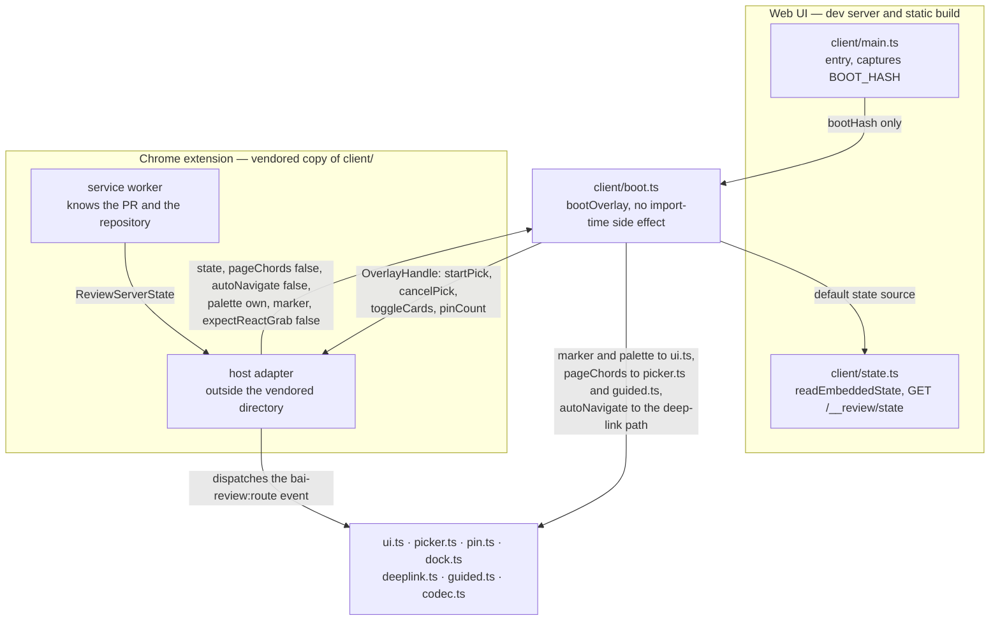

# 0008 — Host-agnostic review overlay client

## Summary

> 낯선 용어는 문서 맨 아래 [용어](#용어)에 모아 두었다.

- **Host seam**: review overlay client(`react/vite-plugins/review-overlay/client/`)가 dev server에서만 얻을 수 있는 것은 모두 [Host](#용어)가 답하는 option이 되었다. 시작점은 `client/boot.ts`의 `bootOverlay(options)` 하나이고, 이 module은 import될 때 아무 일도 하지 않는다. host가 넘기는 것은 항목이 전부 optional인 [`OverlayHostOptions`](#용어)다.
- **Entry**: `client/main.ts`는 dev server가 `/__review/overlay.js`로 내보내고 static build가 번들하는 entry로 남는다. 이 파일은 module 평가 시점에 `location.hash`를 잡아 기본 host로 `bootOverlay`를 부르는 것이 전부다.
- **Default host**: 기본값은 오늘의 동작 그대로다. `/__review/state`를 읽는 state source, page에서 가져가는 keyboard shortcut, link가 요구하는 page로의 자동 이동, page의 `--color-*` token 상속, 값이 빈 `data-bai-review-overlay` marker가 모두 기본값이다.
- **One codec**: ADR 0002의 "읽는 쪽은 codec 하나"는 그대로 발효 중이다. Lablup Jira Helper chrome extension은 이 client를 다시 구현하지 않고 `client/*.ts`를 byte 단위로 그대로 vendoring하며, sync script와 CI의 `--check` gate와 함께 복사한 vitest suite가 그 동일성을 보증한다.
- **Extension host**: extension은 `pageChords: false`, `autoNavigate: false`, `palette: 'own'`, `marker: 'extension'`, `expectReactGrab: false`로 boot한다. 임의의 site 위에서 Ctrl+C나 맨 글자 key를 가로채는 것과 fragment 하나가 독자를 다른 경로로 옮기는 것과 site의 `--color-*`를 그대로 믿는 것이 모두 받아들일 수 없기 때문이다.
- **Storage**: overlay가 쓰는 storage key는 전부 page의 `sessionStorage`·`localStorage`에 그대로 남는다. content script가 page와 같은 storage를 보므로 방문한 site가 그 key를 읽고 지울 수 있다는 것이 감수한 대가다.

## Context

review overlay는 화면의 element를 집어 note를 달고, 그 pin 전체를 `#bai=v3` link 하나로 복사하는 dev 도구다. link의 문법과 codec은 ADR 0002가, 구현한 session이 남기는 walkthrough stop은 ADR 0004가 정한다. 지금 이 client는 Web UI dev server와 nightly static build 두 곳에서만 돈다.

Lablup Jira Helper chrome extension이 같은 pin을 임의의 site 위에서 찍고, 같은 link를 임의의 site 위에서 열려고 한다. client가 dev server에 대해 갖고 있던 가정은 네 가지다. `/__review/state` endpoint가 같은 origin에 있다는 것, react-grab이 page에 올라온다는 것, page가 Astryx `--color-*` token을 정의한다는 것, 그리고 이 page는 overlay가 주인이므로 ⌘C를 가져가고 fragment를 따라 이동해도 된다는 것이다. content script 안에서는 넷 다 성립하지 않는다.

[**OverlayHostOptions**](#용어)는 그 네 가지를 포함한 일곱 항목이 전부 optional인 평범한 option 객체다. plugin system도 아니고 rendering을 추상화하는 layer도 아니다. host가 답하지 않은 항목은 기본값, 즉 오늘의 Web UI 동작이 된다.

## 설계도

## Decision

### 1. `bootOverlay`가 유일한 시작점이다

`client/boot.ts`는 import될 때 아무 일도 하지 않고 `bootOverlay(options)`를 export한다. 이 함수는 `window.__baiReviewOverlay`를 확인해 이미 떠 있으면 `null`을, 아니면 `OverlayHandle`을 돌려준다. handle은 host가 자기 entry point에서 부르는 네 가지 — `startPick()`, `cancelPick()`, `toggleCards()`, `pinCount()` — 를 가진다.

두 번 주입될 수 있는 host는 **첫 boot에서 받은 handle을 자기 쪽에 붙들어야 한다**. 두 번째 `bootOverlay`는 `null`을 돌려주고, 떠 있는 instance로 가는 길은 그 handle 말고 없다. extension처럼 popup을 누를 때마다 overlay file을 다시 주입하는 host라면 첫 주입이 등록한 message listener가 그 entry point다.

`client/main.ts`는 이 seam의 첫 host다. SPA의 login redirect가 fragment를 버리므로 module 평가 시점에 `location.hash`를 잡아 `bootOverlay({ bootHash })`를 부르는 것이 파일 전체다.

### 2. Host가 답하는 option

host가 넘기는 `OverlayHostOptions`는 항목이 전부 optional이고, `bootOverlay`가 기본값을 채워 모든 항목이 채워진 `OverlayHost` 하나로 만든 뒤 나머지 module에 넘긴다.

| option | 기본값 | 기본값이 뜻하는 것 |
|---|---|---|
| `state` | `client/state.ts`의 `readEmbeddedState`와 `fetchServerState` | built document의 JSON block을 먼저 읽고, 없으면 `/__review/state`를 부른다 |
| `bootHash` | `location.hash` | pin을 읽어 오는 fragment |
| `pageChords` | `true` | overlay가 page의 key를 가져간다: pick mode의 ⌘C/Ctrl+C, card를 접는 ⌘⇧H, guided mode의 맨 `n`·`p`·`v`·`m`·`c`·`[`·`]` |
| `autoNavigate` | `true` | link의 pin이 전부 다른 page에 있으면 `location.assign`으로 그 page로 간다 |
| `palette` | `'inherit'` | overlay의 색을 page의 `--color-*` token에서 읽는다 |
| `marker` | `''` | shadow host의 `data-bai-review-overlay` 값 |

`expectReactGrab`은 일곱 번째이자 유일하게 세 가지 상태를 갖는 항목이다. 값을 주지 않으면 지금까지처럼 state의 `host === 'static'`에서 파생하고, `false`를 주면 react-grab을 기다리지 않는다. 이 값이 없던 때에는 react-grab이 없는 host가 static build를 자칭하는 것 말고는 방법이 없었다.

`marker`는 값만 바뀌고 attribute 자체는 남는다. `[data-bai-review-overlay]` selector로 overlay를 찾는 코드와 test가 그대로 동작해야 하기 때문이다. attribute 이름은 그 값을 쓰는 `ui.ts`가 `OVERLAY_MARKER_ATTR`로 export하고, client 안에서 그 이름을 읽거나 쓰는 곳은 전부 이 상수를 쓴다. native overlay를 보고 물러서야 하는 host도 literal을 다시 적는 대신 이것을 import한다 — 이름이 바뀌었는데 한 쪽만 따라가지 않으면 한 page에 overlay가 둘 뜨고, 그때 실패하는 test가 없다.

**page chord를 끈 host에게는 그 key를 광고하지도 않는다.** `pageChords: false`면 dock header의 `⌘⇧H` hint와 cards button label의 chord 접미사, navigator의 `Previous stop (p)`·`Next stop (n)` title, popover의 `Copy ref (c)`·`Comment (m)`와 key legend가 모두 빠진다. 붙지 않은 key를 안내하는 UI는 그 자체로 틀린 말이다. Escape는 `pageChords`와 무관하게 언제나 동작하므로 legend에 남고, composer의 `⌘⏎`는 textarea 자신의 shortcut이라 그대로 있다.

### 3. extension은 client를 다시 구현하지 않고 vendoring한다

ADR 0002가 정한 "읽는 쪽은 codec 하나"는 그대로다. extension은 `client/*.ts`와 그 test를 **byte 단위로 그대로** 자기 저장소에 복사하고, 다음 세 가지로 그 동일성을 지킨다.

- **Sync script**: 복사해 온 upstream commit과 파일별 sha256을 기록 파일에 남긴다. 어떤 파일이 어느 시점의 webui에서 왔는지 한 곳에서 읽힌다.
- **`--check` gate**: 같은 script의 `--check` mode가 기록된 sha256과 실제 파일을 비교해 어긋나면 실패하고, extension CI가 PR마다 이것을 돌린다. vendored directory를 손으로 고치면 CI가 막는다.
- **Vendored tests**: 함께 복사한 vitest suite가 extension 저장소에서 conformance suite로 돈다. wire format, block 문법, id 파생이 두 저장소에서 같다는 것을 test가 증명한다.

extension 고유의 코드는 전부 vendored directory 바깥의 host adapter에 둔다.

### 4. extension host가 끄는 것

| option | extension 값 | 이유 |
|---|---|---|
| `pageChords` | `false` | `picker.ts`의 chord는 shift도 alt도 없는 ⌘C/Ctrl+C이고, guided mode는 맨 `n`·`p`·`v`·`m`·`c`·`[`·`]`를 `preventDefault`한다. 임의의 site에서 이것을 가져가면 사용자가 글자를 복사할 수 없고, `c`는 GitHub과 Jira에서 "새로 만들기"다. extension은 popup button과 `chrome.commands` command에서 `handle.startPick()`을 부른다. |
| `autoNavigate` | `false` | 남이 만든 link를 여는 것이 extension의 기본 사용 방식이므로, 조작된 fragment가 독자를 같은 origin의 다른 경로로 옮기게 두지 않는다. pin은 그대로 set에 합쳐지고, dock의 "go"와 guided mode의 `›`는 사용자가 overlay의 chrome을 눌러야 하는 것이라 그대로 동작한다. guided mode가 stop 사이를 옮기는 `location.assign`은 이 option이 아니라 `pageChords`가 막는다: `pageChords: false`면 맨 `n`이 붙지 않으므로 그 이동은 click으로만 시작한다. |
| `palette` | `'own'` | `--color-text-primary` 같은 이름은 흔하고, site마다 뜻이 다르다. `'own'`은 shadow root 안에서 literal light palette와 `prefers-color-scheme` dark palette를 정의하고 page의 custom property를 하나도 읽지 않는다. |
| `marker` | `'extension'` | 한 page에 native overlay와 extension overlay 둘 중 무엇이 떠 있는지 구분한다. |
| `expectReactGrab` | `false` | content script의 isolated world에서 `window.__REACT_GRAB__`은 영원히 보이지 않는다. 이 값이 없으면 chord가 붙기까지 20초, link가 연 pin마다 ⚛️ stack 재시도에 4초를 쓴다. |

### 5. storage는 page의 것을 그대로 쓴다

draft set, navigation guard, focus handover, dock 위치, walkthrough 진행률은 전부 지금 쓰는 key 그대로 page의 `sessionStorage`와 `localStorage`에 남는다. content script가 page와 같은 storage를 보므로 tab마다·origin마다 나뉘는 성질이 그대로 유지되고, `location.assign`이 일으키는 reload를 넘어 handover가 살아남는다.

대가는 방문한 site가 그 key를 읽고 지울 수 있다는 것이다. key에는 pin의 anchor와 reviewer가 쓴 note가 들어 있다. `chrome.storage`로 옮기면 이 노출은 사라지지만 `dock.ts`의 위치 읽기·쓰기가 async가 되고 vendored directory가 extension API를 알게 된다.

### 6. route event 이름을 export한다

`deeplink.ts`의 `ROUTE_EVENT` 상수를 export한다. `patchHistory()`가 page의 `history`를 감싸는 방식은 isolated world에서 동작하지 않지만 DOM event는 world를 넘으므로, extension adapter가 `navigation` API에서 같은 이름의 event를 직접 dispatch하면 `watchRoute`가 그대로 듣는다. route watching을 위한 client 쪽 변경은 이 export 하나뿐이다.

## 대안과 기각 사유

- **Publish as an npm package**: `client/`를 package로 내고 extension이 dependency로 받는 방법이다. 복사본을 CI로 지키는 대신 version 번호로 지킬 수 있다. 소비자가 하나뿐인 package를 위해 registry와 release 절차를 새로 만들어야 하고, 그 절차를 거치는 동안 두 저장소의 pin 동작이 서로 다른 기간이 생긴다. 기각한다.
- **Pin store on a backend**: pin을 server에 두고 extension이 id로 읽어 오는 방법이다. origin이 anchor에 없는 문제를 정면으로 풀 수 있다. FR-3813이 pin list를 일부러 없앤 결정을 되돌리는 일이고, link 하나가 pin 전부를 나른다는 ADR 0002의 전제를 깬다. 기각한다.
- **Reimplement in the extension**: ADR 0002가 이미 Python 재구현(`pin_parser.py`)을 두고 기각한 안이다. multi-pin 변경이 두 번 착지해야 했고 두 구현의 주석이 이미 어긋나 있었다. 같은 이유로 기각한다.
- **Inject into the MAIN world**: `chrome.scripting`의 `world: 'MAIN'`으로 page와 같은 realm에 넣으면 react-grab도 보이고 `history` patch도 동작한다. page의 script와 같은 realm을 공유하므로 page가 overlay의 함수와 storage에 접근할 수 있고, CSP가 script를 막는 site에서 실패한다. v1에서는 기각한다.

## Consequences

- **Default host unchanged**: dev server와 static build에서 관찰되는 동작은 그대로다. wire format, block 문법, label, cap, id 파생은 손대지 않았다. 기존 vitest suite에서 고친 것은 dock을 만드는 한 줄 — `SetDockOptions`에 새로 생긴 `pageChords` — 뿐이고, 나머지는 seam을 덮는 test가 늘어난 것이다.
- **New module served for free**: dev server는 `/__review/<name>.js`를 `client/<name>.ts`로 1:1 매핑하고 static build는 `main.ts`에서 도달하는 module을 전부 한 chunk로 묶으므로, `boot.ts`는 plugin을 고치지 않고도 serve되고 번들된다.
- **Extension tsconfig compatibility**: extension의 `exactOptionalPropertyTypes: true`, `moduleResolution: node`, `DOM.Iterable` 없는 `lib`에서 client 전체가 컴파일된다. 고친 곳은 네 군데이고 동작은 바뀌지 않았다 — `anchor.ts`의 `tid` 대입, `boot.ts`의 pick state에 담기는 `component`, `ui.ts`의 `copyWithToast` payload(`pin.ts:654`가 `html: undefined`를 넘기던 자리), 그리고 `DOMTokenList`를 펼치던 `dock.ts`의 `Array.from`.
- **A gate, pinned to TypeScript 5.x**: 위 문장은 저절로 참으로 남지 않으므로 `react/vite-plugins/review-overlay/tsconfig.host.json`이 extension의 flag로 client를 컴파일하고 `scripts/verify.sh`가 lane으로 돌린다. 이 lane만 **root의 TypeScript 5.5.4**를 쓴다: TypeScript 6은 iterable DOM 선언을 `DOM` lib 본체로 합쳐서 `DOM.Iterable` 위반을 아예 감지하지 못하고, `react/`의 6.0.3으로 돌리면 gate의 절반이 무력해진다. `host-conformance.ts`가 extension host를 type으로만 적어 두어 `OverlayHost`가 다시 `OverlayHostOptions`에 담기지 않게 되면 gate가 깨진다.
- **Pick entry point without a chord**: `pageChords: false`인 host는 chord를 전혀 붙이지 않으므로 `handle.startPick()` 말고는 pick mode로 들어갈 길이 없다. 그 entry point를 주지 않는 host는 pin을 만들 수 없고 읽기만 할 수 있다.
- **Two palettes to keep**: `palette: 'own'`의 dark 값은 `ui.ts`의 `TONES` table이 갖고 있고, app의 theme을 따라가지 않는다. `--color-*` token이 바뀌면 `inherit`는 따라가지만 `own`은 손으로 맞춰야 한다. 이 dark 값들은 이 저장소의 어떤 화면도 그리지 않으므로 대비를 잰 적이 없다. 실제 dark page에서 확인하는 것은 phase B의 몫이다.
- **Known limits for v1**: extension host에는 ⚛️ component stack이 없고, `data-testid`가 없는 site에서는 anchor가 selector와 text에만 기댄다. iframe 안의 element는 pin할 수 없다.

## 출처

- Jira: FR-4004. 이 결정은 review overlay client를 두 번째 host에 열어 주는 작업의 phase A이고, phase B는 Lablup Jira Helper extension 쪽 작업이다.
- FR-3811·FR-3813·FR-3858·FR-3859가 overlay를, FR-3950이 guided mode를 만들었다.
- 결정일: 2026-09-18.
- 관련: [ADR 0002](0002-pin-set-link-grammar-and-single-codec.md)가 link 문법과 codec 하나를, [ADR 0004](0004-walkthrough-stops-in-the-v3-anchor.md)가 walkthrough stop을 정한다.

## 용어

| 용어 | 뜻 |
|---|---|
| Host | overlay client를 띄우고, dev server에서만 얻을 수 있는 값들을 대신 답하는 쪽이다. Web UI dev server, static build, chrome extension이 각각 하나의 host다. |
| OverlayHostOptions | host가 `bootOverlay`에 넘기는 option 객체의 type이며 `client/boot.ts`가 export한다. 항목이 전부 optional이고, 뺀 항목은 Web UI의 기본값이 쓰인다. |
| OverlayHost | 위 option에 기본값을 채운 결과이며 `bootOverlay`가 만들어 안쪽에 넘긴다. 항목이 전부 채워져 있고, `defaultOverlayHost()`가 Web UI의 것을 돌려준다. |
| OverlayHandle | `bootOverlay`가 돌려주는 객체이고, host가 자기 entry point에서 부르는 `startPick`, `cancelPick`, `toggleCards`, `pinCount`를 가진다. |
| Vendoring | 다른 저장소의 source file을 dependency로 받지 않고 그대로 복사해 두고, script와 CI로 원본과의 동일성을 검사하는 것이다. |
