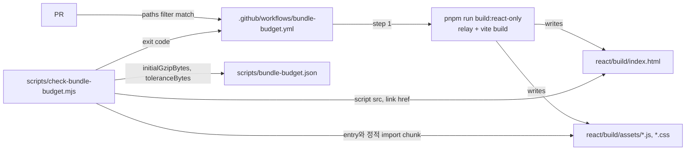

# 0009 — Initial-load bundle budget

## Summary

> 낯선 용어는 문서 맨 아래 [용어](#용어)에 모아 두었다.

- 첫 화면이 lazy import 전에 받는 파일, 즉 `react/build/index.html`이 불러오는 entry script와 그 정적 import와 entry CSS의 gzip 합계를 [initial load](#용어)라 부르고, 그 상한을 `scripts/bundle-budget.json`에 커밋한다.
- `scripts/check-bundle-budget.mjs`가 빌드 결과에서 initial load를 재고, 상한(`initialGzipBytes`)에 허용치(`toleranceBytes`, 10 KB)를 더한 값을 넘으면 exit 1로 끝난다.
- `.github/workflows/bundle-budget.yml`이 앱 번들에 영향을 주는 경로를 바꾼 PR에서 `pnpm run build:react-only` 뒤에 그 스크립트를 실행한다. 이 check는 [advisory](#용어)다.
- 상한은 [ratchet](#용어)이다. `--update`는 상한을 내리기만 하고, 올리는 것은 PR에서 `bundle-budget.json`을 직접 고치고 이유를 PR 설명에 적는 경우뿐이다.

## Context

- **Entry chunk size**: route page는 `React.lazy`로 나뉘지만, entry chunk는 FR-4082 전 4,647 KB(gzip 1,351 KB)였다. 알림 host, 헤더 메뉴, 로그인 패널이 클릭해야 여는 modal을 정적 import해, react-logviewer·shiki·qrcode.react·@dnd-kit과 `SessionLauncherPage` 전체가 첫 로드에 실렸다. FR-4082가 이 경로를 끊어 entry JS를 gzip 1,153 KB로 줄였다.
- **Missing check**: 이 크기를 재는 검사가 없었다. `vite.config.ts`의 `chunkSizeWarningLimit: 2000`은 경고만 내고, 앱을 빌드하는 workflow는 release와 수동 실행에서만 도는 `package.yml`뿐이라 PR에서는 아무도 빌드하지 않는다. modal 하나를 정적 import로 되돌리는 PR은 tsc와 lint를 그대로 통과한다.
- **Existing measurement**: `pr-preview.yml`은 BUI package bundle을 head와 base에서 빌드해 비교하지만, 대상이 `packages/backend.ai-ui`의 library build라 앱의 entry chunk는 재지 않는다.

## 설계도

## Decision

### 1. 재는 대상은 initial load의 gzip 합계다

- **Included files**: `index.html`의 `<script type="module" src>`, `<link rel="stylesheet">`, `<link rel="modulepreload">`가 가리키는 `assets/` 파일, 그리고 그 JS가 같은 디렉터리의 `./x.js`를 `import … from`으로 정적 import하는 chunk를 재귀로 모은 것.
- **Excluded files**: `import()`로만 닿는 chunk, 그리고 JS chunk가 import하는 CSS. lazy route와 lazy modal은 첫 화면 비용이 아니다.
- **Size unit**: 각 파일을 `zlib.gzipSync(level 9)`로 압축한 byte 수의 합. 서버의 압축 설정과 무관하게 같은 입력에서 같은 수가 나온다.
- **Baseline**: 상한의 첫 값은 1,220,348 byte(1,191.7 KB)다. entry JS 1,122.4 KB와 entry CSS 69.4 KB의 합이며, Context의 1,153 KB는 Vite 출력의 gzip 수치라 level 9 수치와 다르다.

### 2. 상한과 허용치는 `scripts/bundle-budget.json`에 둔다

| field | 뜻 |
|---|---|
| `initialGzipBytes` | 커밋된 상한(byte). |
| `toleranceBytes` | 빌드 간 흔들림을 흡수하는 허용치. 10,240 byte. |

- **Failure**: initial load가 `initialGzipBytes + toleranceBytes`를 넘으면 `::error` annotation을 남기고 exit 1.
- **Notice**: `initialGzipBytes - toleranceBytes`보다 작으면 `::notice`로 `--update`를 권하고 exit 0.
- **Missing entry**: `index.html`에서 entry script를 찾지 못하면 exit 2. 빌드가 없거나 Vite 출력 형식이 바뀐 경우다.

### 3. 상한은 내리기만 하는 ratchet이다

- **Lowering**: `node scripts/check-bundle-budget.mjs --update`는 측정값이 상한보다 작을 때만 `initialGzipBytes`를 측정값으로 덮어쓰고, 초과 여부를 검사하지 않고 exit 0으로 끝난다.
- **Raising**: 상한을 올리려면 `bundle-budget.json`을 손으로 고치고, 무엇이 왜 첫 화면에 필요한지 PR 설명에 적는다.

### 4. CI check는 advisory로 시작한다

- **Trigger paths**: `.github/workflows/bundle-budget.yml`은 `react/**`, `packages/backend.ai-ui/**`, `packages/backend.ai-client/**`, `pnpm-lock.yaml`, `pnpm-workspace.yaml`, `package.json`, 스크립트, 예산 파일, workflow 자체가 바뀐 PR에서 돈다.
- **Required check**: required check로 올리기 전에 event-level `paths:` filter를 workflow 안으로 옮긴다.

## 대안과 기각 사유

- **`chunkSizeWarningLimit` 낮추기**: 설정 한 줄로 끝나지만 경고는 빌드를 실패시키지 않고, chunk 하나만 보므로 여러 파일로 이루어진 initial load를 재지 못한다. 기각.
- **size-limit 같은 외부 도구**: 설정 파일로 예산을 표현할 수 있지만 devDependency가 늘고, Vite의 `index.html`에서 initial load를 고르는 규칙은 결국 따로 적어야 한다. 기각.
- **raw byte 측정**: 계산이 빠르지만, 전송 byte와 비례하지 않는 변경(주석, 긴 식별자)에 흔들린다. 기각.
- **base branch 동시 빌드**: 절대 상한 없이 증가분만 보여 주지만 CI 시간이 두 배가 되고, 작은 증가가 쌓이는 것을 막지 못한다. `pr-preview.yml`의 head/base 비교가 BUI library에 이 방식을 쓰지만, 앱 빌드에 그대로 옮기면 같은 비용이 든다. 기각.

## Consequences

- **Regression signal**: 첫 화면에 필요 없는 모듈을 정적 import로 끌어들이는 PR은 이 check가 실패로 표시된다. advisory인 동안 merge는 막지 않으므로 리뷰어가 실패를 확인해야 한다.
- **Locked gains**: 줄인 크기는 `--update` 커밋으로 상한에 반영되어 다음 PR에서 되돌아오지 않는다.
- **CI cost**: 해당 경로를 바꾼 PR마다 앱 빌드 한 번(로컬 기준 약 3분 30초)이 CI에 더해진다.
- **Scope**: 재는 것은 크기이지 속도가 아니다. 파싱·실행 시간과 실제 사용자 지표는 FR-4081의 Web Vitals가 맡는다.

## 출처

- [FR-4083](https://lablup.atlassian.net/browse/FR-4083) — 이 결정. 2026-09-25.
- [FR-4082](https://lablup.atlassian.net/browse/FR-4082) — 기준값을 만든 entry chunk 정리.
- [FR-4080](https://lablup.atlassian.net/browse/FR-4080) — 상위 에픽.

관련: [ADR 0003](0003-committed-search-index-artifact.md) — 커밋된 값을 CI가 게이트하는 같은 모양.

## 용어

| 용어 | 뜻 |
|---|---|
| initial load | `index.html`이 lazy import 전에 받게 하는 JS·CSS 파일 전체. entry script, 그 정적 import, entry CSS. |
| advisory | 결과가 PR에 표시되지만 branch ruleset의 required check가 아니어서 merge를 막지 않는 CI check. |
| ratchet | 한 방향으로만 움직이는 기준값. 여기서는 상한이 자동으로는 내려가기만 한다. |
