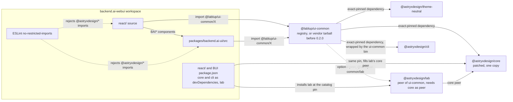
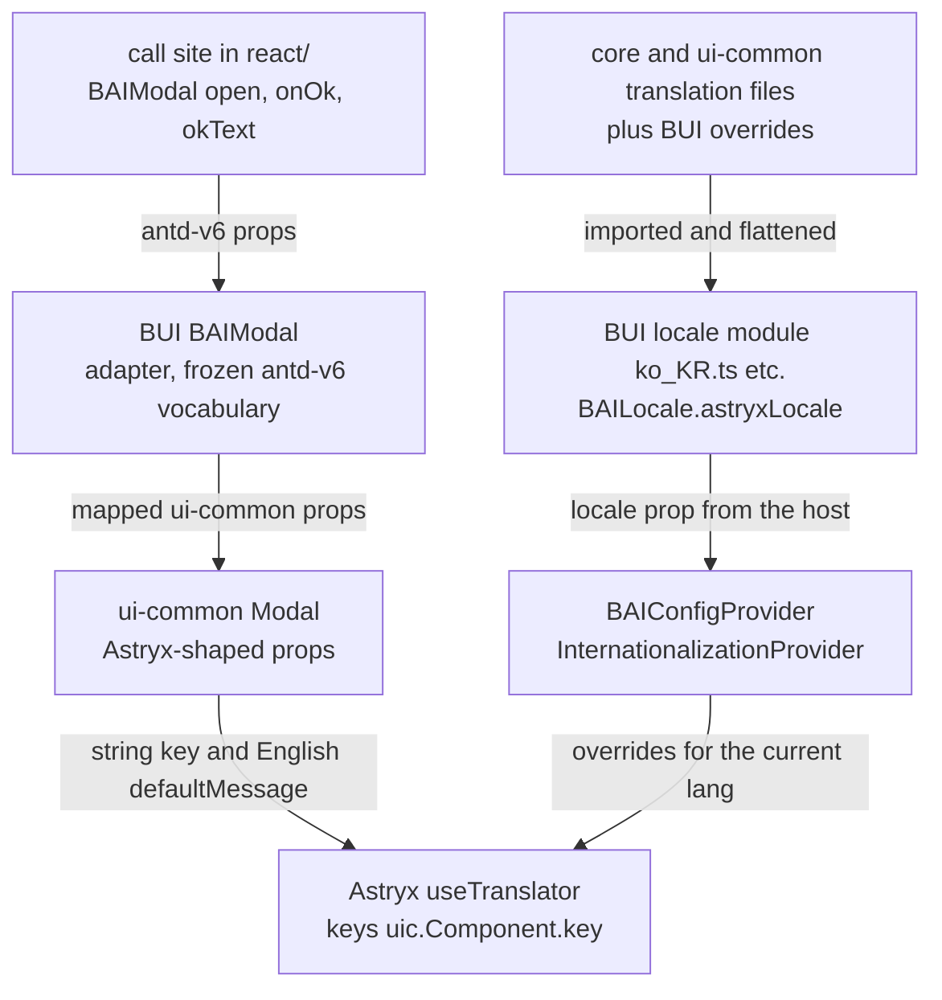

# 0009 — @lablup/ui-common as the single entry point to Astryx

## Summary

> 낯선 용어는 문서 맨 아래 [용어](#용어)에 모아 두었다.

- **Single entry point**: `react/`와 `packages/backend.ai-ui/`(BUI)의 source는 Astryx를 `@lablup/ui-common`으로만 import한다. ui-common은 `@astryxdesign/core`의 export map을 1:1로 [mirror](#용어)하고, `@astryxdesign/lab`은 `@lablup/ui-common/lab`으로, theme와 token과 CSS는 같은 이름의 ui-common subpath로 내보낸다.
- **Guardrail**: 두 source tree에서 ESLint `no-restricted-imports`가 `@astryxdesign/*` import를 막는다. Astryx CLI가 만들거나 읽는 파일 몇 개만 예외다.
- **Dependency form**: `react/`와 BUI는 registry의 `@lablup/ui-common`을 설치한다. 0.2.0이 publish되기 전에는 `vendor/`의 [packed tarball](#용어)을 `file:` spec으로 설치하고, ui-common checkout을 link하지 않는다. `@astryxdesign/core`와 `@astryxdesign/cli`는 exact-pinned devDependency로 남아 core가 한 벌만 설치되게 한다.
- **BAI adapters**: BUI에서 ui-common으로 옮긴 component는 ui-common에서 Astryx 모양의 props를 갖는다. BUI는 같은 이름의 `BAI*` component를 frozen antd-v6 prop vocabulary를 ui-common props로 옮기는 얇은 [adapter](#용어)로 남기고, call site는 바뀌지 않는다.
- **Strings**: ui-common component의 문자열은 Astryx `useTranslator()`가 찾는다. BUI의 locale module이 ui-common 번역을 `BAILocale.astryxLocale`에 합치고, `BAIConfigProvider`가 그것을 Astryx `InternationalizationProvider`에 한 번 넘긴다.
- **Layers and agent docs**: cascade layer 순서에는 `astryx-theme` 다음에 `ui-common`이 들어간다. agent 지침의 `ASTRYX` block은 `ui-common agents`가 만드는 `UI-COMMON` block으로 바뀐다.
- **Out of scope**: [`theme-shim`](#용어) 교체 track, component별 이동 순서(FR-4087), ui-common 내부 설계(theme, CLI, admission rule)는 범위 밖이다. ui-common 쪽 결정은 ui-common의 `CONTRIBUTING.md`와 `docs/astryx.md`에 있다.

## Context

- **What ui-common is**: `@lablup/ui-common`은 backend.ai-go, continuum-hub, mlxcel 같은 여러 Lablup 제품이 함께 쓰는 UI package다. 0.2.0부터 자체 component와 `--token-*` token contract를 버리고 Astryx 위의 얇은 layer가 된다. Astryx를 다시 구현하거나 bundle하지 않는다. ui-common은 precompiled JS와 CSS를 싣고, Astryx는 external로 두어 exact version으로 pin한다.
- **What webui does today**: `react/`와 BUI는 `@astryxdesign/core`, `@astryxdesign/lab`, `@astryxdesign/theme-neutral`을 `pnpm-workspace.yaml`의 [catalog pin](#용어)으로 직접 dependency에 두고, source의 1,200곳 넘게 `@astryxdesign/core/<X>`를 import한다. `react/src/index.css`는 `@astryxdesign/core/reset.css` 같은 CSS를 직접 `@import`한다.
- **Why a decision is needed**: BUI의 `BAIModal`처럼 BAI 의존성이 없는 component가 ui-common으로 옮겨 가면, webui는 같은 Astryx를 두 경로로 import하게 된다. ui-common은 core의 `Dialog`를 mirror에서 빼고 자기 `Modal`로 대신하는데, webui가 core를 직접 import하면 그 제외가 효력이 없다. 어느 경로가 정답인지, patch가 적용된 core 한 벌만 설치되려면 dependency를 어떻게 선언하는지, 문자열과 cascade layer를 어디서 맞추는지를 한 번 정해야 한다.

## 설계도

### Package graph



### A moved component at runtime



## Decision

### 1. source는 Astryx를 `@lablup/ui-common`으로만 import한다

`react/src/**`, `packages/backend.ai-ui/src/**`, `packages/backend.ai-ui/.storybook/**`의 Astryx import는 아래 표대로 ui-common subpath로 옮긴다. webui에 두는 일회성 [codemod](#용어) script `scripts/ui-common-codemod.mjs`가 표를 적용하고(rebase로 들어온 새 import에는 다시 돌린다), 그 뒤에는 2항의 ESLint rule이 같은 상태를 지킨다. ui-common version 사이의 migration은 이 script가 아니라 `ui-common upgrade`가 맡는다.

| 지금의 import | 바뀐 import |
|---|---|
| `@astryxdesign/core` (root) | `@lablup/ui-common` |
| `@astryxdesign/core/<X>` | `@lablup/ui-common/<X>` |
| `@astryxdesign/core/theme/tokens.stylex` | `@lablup/ui-common/theme/tokens.stylex` |
| `@astryxdesign/core/locales/<file>.json` | `@lablup/ui-common/locales/<file>.json` |
| `@astryxdesign/lab` | `@lablup/ui-common/lab` |
| `@astryxdesign/theme-neutral` | `@lablup/ui-common/theme/neutral` |
| CSS `@astryxdesign/core/reset.css` | `@lablup/ui-common/reset.css` |
| CSS `@astryxdesign/core/astryx.css` | `@lablup/ui-common/astryx.css` |
| CSS `@astryxdesign/lab/lab.css` | `@lablup/ui-common/lab/lab.css` |
| CSS `@astryxdesign/theme-neutral/theme.css` | `@lablup/ui-common/theme/neutral/theme.css` |

- **Excluded names**: ui-common은 core의 `Dialog` subpath를 [exclusion list](#용어)로 mirror에서 뺀다. `Dialog`, `DialogHeader`, `DialogProps` 대신 `@lablup/ui-common/Modal`의 `Modal`, `ModalHeader`, `ModalProps`를 쓴다.
- **Dialog cluster**: `BAIDialog`의 동작, 즉 top layer로 올리지 않고 portal로 그려 notice가 위에 남게 하는 것(FR-3578)과 level stack은 ui-common `Modal`이 가져가고, `BAIDialog`는 지운다. `BAIModal`은 `Modal` 위의 adapter로 BUI에 남아 antd 모양 prop, 창 최소화, `confirmBeforeClose`를 맡는다. `BAIUnmountAfterClose`도 BUI에 남는다. ui-common에서 같은 일은 `Modal`의 `unmountOnClose`가 한다 (FR-4087).
- **ui-common's own CSS**: ui-common custom component의 style은 각 component가 직접 import하고, 모든 rule이 `@layer ui-common` 안에 있다. 전역 scrollbar rule만 담은 `@lablup/ui-common/ui-common.css`는 webui의 모양을 바꾸므로 `react/src/index.css`도 Storybook도 import하지 않는다.
- **Product theme stays**: `react/src/astryx-theme/`의 Backend.AI theme family는 webui의 제품 theme으로 남는다. 손으로 쓴 파일은 `defineTheme`과 `Theme`을 `@lablup/ui-common/theme`에서, `neutralTheme`을 `@lablup/ui-common/theme/neutral`에서 import한다.
- **New code**: 새 webui code는 BUI에 `BAI*` adapter가 있으면 그것을, 없으면 ui-common component를 직접 쓴다.

### 2. ESLint가 `@astryxdesign/*` import를 막는다

- **Rule**: `react/eslint.config.js`와 `packages/backend.ai-ui/eslint.config.js`의 `no-restricted-imports`가 `@astryxdesign/*` group을 error로 막고, 메시지로 `@lablup/ui-common/<X>`를 가리킨다.
- **React blocks**: `react/eslint.config.js`는 rule을 다시 선언하는 block마다 pattern을 반복해야 한다. 공유 배열 `restrictedImportPatterns`에 pattern을 넣고, 지금 그 배열을 쓰지 않고 `backend.ai-ui/*` group을 손으로 반복하는 project-agnostic page block도 `...restrictedImportPatterns`를 쓰게 바꾼다.
- **BUI blocks**: BUI의 기존 `no-restricted-imports` block은 test와 story를 `ignores`로 빼고 `react-i18next` path를 막는다. flat config에서는 같은 파일에 걸린 뒤 block의 rule 설정이 앞 block을 대신하므로, ban pattern은 기존 block에 더하고, 기존 block이 빼는 파일(test, story, `useBAIi18n.ts`, `BAITrans.tsx`)만 대상으로 하는 block을 하나 더 두어 같은 pattern을 건다.
- **Exempt files**: 아래 파일은 `@astryxdesign/*`를 그대로 import하고, ban block의 `ignores`로 뺀다. negated group pattern으로 풀지 않는다.

| 파일 | 이유 |
|---|---|
| `packages/backend.ai-ui/src/**/*.doc.ts` | CLI의 integration 문서 입력이다. `@astryxdesign/cli/authoring`의 type만 쓰고 앱 bundle에 들어가지 않는다. |
| `packages/backend.ai-ui/src/astryx-docs/**` | CLI integration 문서(`backend-ai-ui.doc.ts`)와 그것을 `@astryxdesign/cli/authoring`으로 검증하는 test다. |
| `packages/backend.ai-ui/src/astryx-theme-augmentations.d.ts` | module augmentation은 core의 실제 module id(`@astryxdesign/core/Text` 등)를 대상으로 해야 한다. |
| `react/src/astryx-theme/built/**` | `astryx theme build` 출력이다. `scripts/verify.sh`가 CLI 출력과 byte 단위로 비교하고, 이미 ESLint `ignores`에 있다. codemod도 이 디렉터리를 건드리지 않는다. |

`packages/backend.ai-ui/astryx.integration.ts`는 `src` 밖이라 lint 대상이 아니다.

### 3. dependency 선언

| package | `react/package.json` | BUI `package.json` |
|---|---|---|
| `@lablup/ui-common` | `dependencies`에 추가 | `peerDependencies`와 `devDependencies`에 추가 |
| `@astryxdesign/core` | `dependencies`에서 `devDependencies`로 이동 | `peerDependencies`에서 삭제, `devDependencies`에 유지 |
| `@astryxdesign/cli` | `devDependencies`에 유지 | `devDependencies`에 유지 |
| `@astryxdesign/lab` | `dependencies`에 유지 | `peerDependencies`와 `devDependencies`에 유지 |
| `@astryxdesign/theme-neutral` | 삭제 | 삭제 |

- **Version spec**: `@lablup/ui-common`의 spec은 registry version이다. 0.2.0이 publish되기 전에는 저장소 루트의 `vendor/lablup-ui-common-<version>.tgz`를 `file:` spec으로 가리킨다. `workspace:`나 `link:` spec은 쓰지 않는다. packed tarball은 registry package와 같은 방식으로 설치되어, link가 가리는 두 번째 core 문제가 설치 단계에서 그대로 드러난다.
- **Tarball pin**: pnpm catalog는 `file:` spec을 받지 않는다(`ERR_PNPM_CATALOG_ENTRY_INVALID_SPEC`). 그래서 catalog의 `@lablup/ui-common`은 registry version을 적고, `pnpm-workspace.yaml`의 `overrides` 한 줄이 그것을 `file:vendor/lablup-ui-common-<version>.tgz`로 바꾼다. tarball 교체는 그 한 줄이고, 0.2.0 전환은 그 줄을 지운다. 절차는 `vendor/README.md`에 있다.
- **Build externals**: BUI의 library build는 peer만 external로 두므로, `vite.config.ts`가 `@astryxdesign/*` 전체를 external로 더 둔다. core가 peer에서 빠져도 남은 core import가 `dist`에 두 번째 copy로 bundle되지 않는다.
- **Test runner**: ui-common의 custom component는 자기 `.css`를 import한다. `react/vitest.config.ts`는 `server.deps.inline`에 ui-common을 두어 Vite가 그 CSS import를 처리하게 한다.
- **Pinned core devDependency**: lab의 canary version은 core를 optional이 아닌 peer로 요구한다. webui의 importer에 core가 없으면 pnpm [`autoInstallPeers`](#용어)가 patch 없는 core를 하나 더 설치하고, `--frozen-lockfile`과 peer 검사는 통과한다. `react/`와 BUI가 같은 pin의 core를 devDependency로 두면 pnpm이 lab의 peer를 그 core로 채운다. CLI도 설치된 core를 읽으므로 core가 필요하다.
- **Lab stays installed**: `@lablup/ui-common/lab`은 optional peer인 `@astryxdesign/lab`이 설치되어 있어야 해석된다. `scripts/migration-gates/z-index-ladder-gate.mjs`도 `react/node_modules/@astryxdesign/lab/dist/`를 읽는다. source는 lab을 `@lablup/ui-common/lab`과 `@lablup/ui-common/lab/lab.css`로만 import한다(`BAIDrawer`, `BAITour`, `Stat` 등).
- **Bare-name patch keys**: `pnpm-workspace.yaml`의 `patchedDependencies` key `"@astryxdesign/core@0.6.2"`와 `"@astryxdesign/lab@0.6.2-canary.c9fb1ad"`는 version 없는 `"@astryxdesign/core"`와 `"@astryxdesign/lab"`이 된다. FR-4059는 이것을 tripwire로 정했다. key가 version 하나에 묶이지 않으므로 pnpm은 그래프에 있는 모든 version의 copy에 patch 적용을 시도한다.
- **Pins move together**: ui-common 한 version은 Astryx pin 한 벌에 묶인다. catalog의 `@astryxdesign/*` pin은 ui-common이 pin한 version과 같아야 하며, ui-common을 올릴 때 함께 올린다. 둘이 다르면 core가 두 벌 설치된다.

### 4. BUI의 `BAI*` component는 ui-common component의 adapter가 된다

- **Props in ui-common**: BUI에서 ui-common으로 옮긴 component는 `isOpen`, `onOpenChange`, `onClose`, `label`, `variant` 같은 Astryx 모양의 props를 갖는다. ui-common은 `BAI*` 이름의 alias를 export하지 않는다.
- **Adapter props**: BUI는 같은 이름의 `BAI*` component와 `BAI*Props` type을 남긴다. adapter의 props interface는 ui-common component의 props type을 extend한다(`.claude/rules/component-props-extension.md`). 이름과 뜻이 같은 prop(`BAIModal`의 `isOpen`, `onOpenChange` 등)은 그대로 통과시킨다. 이름이나 모양이 다른 prop(`open`, `onOk`, `okText`, 지금 `'standard' | 'fullscreen'`인 `variant` 등)은 `Omit<>`한 뒤 BUI 쪽 모양으로 다시 선언한다.
- **Call sites unchanged**: `<BAIModal>`을 쓰는 파일 약 140개와 다른 옮긴 component의 call site는 수정하지 않는다. `BAIModalProps`를 extend하는 call site의 props interface도 그대로 compile된다.

### 5. 번역은 BUI locale module이 합치고 `BAIConfigProvider`가 한 번 넘긴다

- **Key format**: ui-common component는 기본 문자열을 Astryx `useTranslator()`로 찾는다. key는 `uic.<Component>.<key>`이고, 영어 `defaultMessage`는 ui-common code에 있다.
- **Explicit prop wins**: call site가 문자열 prop을 넘기면 그 값이 catalog보다 우선한다.
- **Locale modules**: `packages/backend.ai-ui/src/locale/<lang>_<REGION>.ts`는 지금 `BAILocale.astryxLocale`에 Astryx key의 번역을 평평한 문자열로 담는다. 각 module은 여기에 ui-common이 싣는 같은 언어의 `uic.*` 번역과 BUI의 override를 합친다. 병합은 `packages/backend.ai-ui/src/locale/uiCommonMessages.ts`의 `withUiCommonMessages(<Astryx locale 이름>, overrides)`가 한다. 이 함수는 `uiCommonMessages[<이름>]`을 평평한 문자열로 바꾸고 BUI override를 그 위에 얹는다. `BAILocale.lang`(`ko`, `pt-BR` 등)과 Astryx locale 이름(`ko-KR`, `pt-PT` 등)의 대응은 각 module이 넘기는 이름으로 정해진다. ui-common 번역이 없는 언어(`id`, `mn`, `ms`, `th` 등)는 영어 `defaultMessage`로 그려진다.
- **One mount**: `packages/backend.ai-ui/src/components/provider/BAIConfigProvider/BAIConfigProvider.tsx`는 지금처럼 `overrides={{ [lang]: locale.astryxLocale }}`를 `InternationalizationProvider`에 넘긴다. component마다 번역을 감싸는 wrapper는 없고, ui-common에 자체 context도 없다.
- **Moved keys**: 옮긴 component가 쓰던 BUI locale key는 그 component가 옮겨 갈 때 번역과 함께 ui-common key가 된다.

### 6. cascade layer 순서에 `ui-common`이 들어간다

네 곳의 layer 순서 선언이 모두 아래 문장이 된다.

```css
@layer reset, theme, base, astryx-base, astryx-theme, ui-common, components, utilities;
```

| 파일 | 역할 |
|---|---|
| `index.html` | 앱의 순서를 실제로 정하는 선언 |
| `react/src/index.css` | 앱 CSS의 mirror |
| `packages/backend.ai-ui/src/styles/backend.ai-ui.css` | BUI를 단독으로 쓰는 consumer용 |
| `packages/backend.ai-ui/.storybook/astryx.css` | Storybook용 |

- **Precedence**: ui-common component의 composite style은 Astryx base와 theme의 primitive style을 이기고, webui와 BUI의 `@layer components` rule은 ui-common을 이긴다.
- **Gate**: `scripts/migration-gates/layer-order-gate.mjs`의 `REQUIRED_ORDER`에 `astryx-theme` 다음으로 `ui-common`이 들어간다.

### 7. agent 지침과 token gate는 ui-common에서 만든다

- **Agent block**: `AGENTS.md`(`CLAUDE.md`는 이 파일의 symlink)와 `react/AGENTS.md`의 `ASTRYX:START`/`ASTRYX:END` block은 `ui-common agents --write <file>`이 만드는 `UI-COMMON:START`/`UI-COMMON:END` block으로 바뀐다. 이 block은 `astryx init --features agents` 출력의 import 경로를 ui-common으로 고쳐 쓴 것이다. marker가 다르므로 `astryx init`이나 `astryx upgrade`가 덮어쓰지 않는다.
- **Project lines**: `ASTRYX` block에 붙어 있던 MIGRATION RELAXATION, STATUS SEMANTICS(ADR 0007), BUI INTEGRATION 줄은 UI-COMMON block의 END marker 바로 뒤, marker 밖의 PROJECT LINES에 둔다. 그래서 `ui-common agents --write`로 block을 다시 만들어도 사라지지 않는다. block 아래의 재생성 안내는 `ui-common agents`를 다시 돌리라는 내용으로 바뀐다.
- **Staleness gate**: `scripts/verify.sh`는 두 파일에 `ui-common agents --check`를 돌려, ui-common을 올린 뒤 block을 다시 만들지 않으면 실패한다.
- **Token gate**: `scripts/migration-gates/astryx-token-gate.mjs`의 `DEFAULT_DECLARED_CSS`에서 core와 theme-neutral 항목은 ui-common이 싣는 같은 CSS 파일로 바뀐다. `react/src/astryx-theme/built/backendai-default-built.css` 항목은 그대로다.

## 대안과 기각 사유

- **Import Astryx directly next to ui-common**: webui가 `@astryxdesign/*` import를 그대로 두고 ui-common은 custom component만 가져다 쓰는 형태다. codemod가 필요 없다는 것이 장점이다. 기각한 이유는 ui-common이 mirror에서 뺀 `Dialog`를 webui가 계속 쓸 수 있어 exclusion이 효력을 잃고, 같은 primitive에 import 경로가 둘 생겨 어느 쪽이 맞는지 아무도 검사하지 않기 때문이다. ui-common#41도 ui-common consumer의 `@astryxdesign/*` 직접 import를 금지한다.
- **Link the local ui-common checkout**: `workspace:`나 `link:` spec으로 ui-common 작업본을 연결하는 형태다. ui-common을 고치면 바로 반영되는 것이 장점이다. 기각한 이유는 3항의 Version spec에 있다.
- **Reach core only transitively**: webui의 `package.json`에서 `@astryxdesign/core`를 완전히 빼는 형태다. dependency 목록이 목표 상태와 정확히 맞는 것이 장점이다. 기각한 이유는 3항의 Pinned core devDependency에 있다. `publicHoistPattern`, `overrides`, `peerDependencyRules`로 두 번째 core를 막는 방법도 FR-4059에서 기각했다.
- **Rename call sites to Astryx-shaped props**: BUI adapter 없이 `<BAIModal>` call site를 ui-common `Modal`의 props로 고쳐 쓰는 형태다. frozen vocabulary가 코드에서 사라지는 것이 장점이다. 기각한 이유는 약 140개 파일을 한 번에 바꿔야 하고, `.claude/rules/component-props-extension.md`가 그 vocabulary의 이름을 바꾸지 않도록 동결했기 때문이다.
- **Antd-shaped props in ui-common**: ui-common component가 BUI의 antd-v6 props를 그대로 받는 형태다. adapter가 필요 없는 것이 장점이다. 기각한 이유는 ui-common이 여러 제품의 library이고, antd-v6 vocabulary는 webui의 과거 사정이지 library contract가 아니기 때문이다(FR-4054).
- **Per-component translation wrappers**: BUI가 옮긴 component마다 `useBAIi18n()`으로 문자열을 넣어 주는 wrapper를 두는 형태다. 기존 BUI locale key를 그대로 쓰는 것이 장점이다. 기각한 이유는 wrapper가 component 수만큼 늘고, `BAIConfigProvider`가 이미 mount한 Astryx provider 한 곳으로 충분하기 때문이다(FR-4055).
- **Keep the ASTRYX markers**: ui-common 지침을 기존 `ASTRYX` block 안에 손으로 고쳐 넣는 형태다. 새 generator가 필요 없는 것이 장점이다. 기각한 이유는 `astryx init`이나 `astryx upgrade`가 그 block을 다시 만들며 import 경로를 `@astryxdesign/*`로 되돌리기 때문이다.

## Consequences

- **One import path**: agent와 사람이 Astryx component를 찾을 때 경로는 `@lablup/ui-common/<X>` 하나다. `ui-common component`, `ui-common search` 같은 CLI 명령이 `astryx` 출력을 같은 경로로 고쳐 보여 주고, 제외된 이름에는 대신 쓸 이름을 붙인다.
- **Upgrade through ui-common**: Astryx version을 올리는 일은 ui-common의 `sync-astryx` 명령이 먼저 한다. webui는 그 뒤 ui-common version과 catalog pin을 함께 올리고 `ui-common upgrade`로 codemod를 돌린다. webui가 Astryx만 따로 올릴 수는 없다.
- **Global scrollbar**: webui는 `ui-common.css`를 싣지 않으므로 scrollbar 모양은 계속 `MainLayout.css`의 unlayered rule이 정한다.
- **Tarball refresh**: 0.2.0 publish 전에는 ui-common을 고칠 때마다 누군가 tarball을 다시 pack해 `vendor/`에 넣어야 webui가 그 변경을 본다.
- **Component home narrows**: `.claude/rules/bui-component-home.md`의 "새 재사용 component는 BUI"는 BAI 의존성이 있는 component에만 남는다. 제품 중립인 component는 ui-common으로 가고, BUI에는 adapter가 남는다.
- **Exempt files track core**: 2항의 예외 파일은 계속 `@astryxdesign/*` 경로를 쓰므로, Astryx를 올릴 때 codemod가 아니라 `astryx theme build` 재실행과 손 수정으로 따라간다.

## 출처

- Jira: [FR-4086](https://lablup.atlassian.net/browse/FR-4086)(webui rollout), [FR-4046](https://lablup.atlassian.net/browse/FR-4046)(map).
- [FR-4047](https://lablup.atlassian.net/browse/FR-4047): core export map의 1:1 mirror, exclusion list, `@lablup/ui-common/lab`, `theme/tokens.stylex`, `ui-common.css`.
- [FR-4049](https://lablup.atlassian.net/browse/FR-4049): precompiled JS와 CSS, exact-pinned external Astryx, webui가 StyleX compiler dependency를 유지한다.
- [FR-4059](https://lablup.atlassian.net/browse/FR-4059): core devDependency와 bare-name patch key.
- [FR-4054](https://lablup.atlassian.net/browse/FR-4054): Astryx 모양 props와 BUI adapter. [FR-4055](https://lablup.atlassian.net/browse/FR-4055): `useTranslator`와 provider에서의 병합. [FR-4087](https://lablup.atlassian.net/browse/FR-4087): 이동 순서와 `theme-shim` track.
- ui-common: [#40](https://github.com/lablup/ui-common/issues/40)(dependency form, theme, layer), [#41](https://github.com/lablup/ui-common/issues/41)(admission rule, 직접 import 금지), [#42](https://github.com/lablup/ui-common/issues/42)(`ui-common` CLI), [#52](https://github.com/lablup/ui-common/issues/52)(upgrade tool).
- 결정일: 2026-09-25.
- 관련: [ADR 0007](0007-badge-for-live-values-and-token-for-settled-values.md)의 `Badge`·`Token`은 이제 `@lablup/ui-common/Badge`·`@lablup/ui-common/Token`에서 import하고, 그 ADR의 STATUS SEMANTICS 줄은 UI-COMMON block 바로 뒤의 PROJECT LINES로 옮겨 간다. `.claude/rules/component-props-extension.md`가 adapter props의 base를 정한다.

## 용어

| 용어 | 뜻 |
|---|---|
| mirror | ui-common이 generator로 `@astryxdesign/core`의 export map과 같은 subpath를 만들어 core를 그대로 re-export하는 것이다. `@lablup/ui-common/Button`은 core의 `Button`과 같은 module이다. |
| exclusion list | ui-common의 `exports.exclude.json`이다. 여기 있는 core export는 mirror에 생기지 않고, 대신 쓸 ui-common component가 있다. `Dialog`가 빠지고 `Modal`이 대신한다. |
| packed tarball | `pnpm pack`으로 만든 `.tgz` package 파일이다. `file:` spec으로 설치하면 registry에서 받은 package와 같은 방식으로 풀린다. |
| adapter | BUI에 남는 같은 이름의 `BAI*` component다. frozen antd-v6 props를 받아 ui-common component의 props로 옮겨 넘기는 일만 한다. |
| catalog pin | `pnpm-workspace.yaml`의 `catalog:`에 적은 version이다. 각 `package.json`은 `"catalog:"`로 그 version을 가리킨다. |
| autoInstallPeers | 요구된 peer dependency가 없으면 pnpm이 자동으로 설치하는 설정이다. 설치된 copy는 importer의 patch나 pin을 따르지 않는다. |
| codemod | source의 import 문을 AST 단위로 고쳐 쓰는 script다. 이 ADR의 일회성 script와 `ui-common upgrade`가 싣는 version별 jscodeshift 변환이 있다. |
| theme-shim | `packages/backend.ai-ui/src/theme-shim/`이다. antd 시절 `theme.useToken()` 값과 같은 JS 값을 돌려주는 BUI 내부 layer이고, 이것을 읽는 component(`BAIFlex`, `BAITable` 등)는 shim이 사라질 때까지 ui-common으로 옮길 수 없다. |
