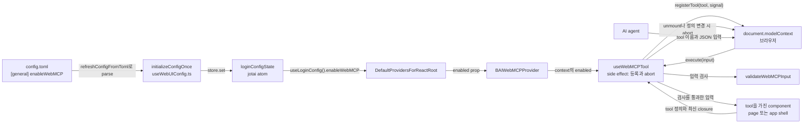

# 0009 — WebMCP tool surface

## Summary

> 낯선 용어는 문서 맨 아래 [용어](#용어)에 모아 두었다.

- WebUI는 AI agent가 열린 tab을 읽고 조작할 수 있도록 [WebMCP](#용어) [tool](#용어)을 등록한다. 등록 경로는 브라우저가 구현한 `document.modelContext.registerTool` 하나이고, [polyfill](#용어)·[relay](#용어)·`@mcp-b/*` package·새 runtime npm dependency는 쓰지 않는다.
- tool은 production build에도 들어간다. `config.toml`의 `[general] enableWebMCP`가 `true`이고 브라우저에 `document.modelContext`가 있을 때만 등록된다. 설정이 꺼져 있으면 WebUI 코드는 `document.modelContext`를 읽지도 않는다.
- tool이 하는 일은 읽기, 이동, form 채우기 세 가지다. WebUI는 생성·확인 action을 submit하는 tool과 삭제·종료 같은 destructive action을 여는 tool을 만들지 않는다.
- tool 이름은 `bai_`로 시작한다. page에 속한 tool은 `bai_list_visible_<noun>`, `bai_get_current_<noun>`, `bai_get_<noun>_filter`, `bai_prepare_<noun>` 네 모양 중 하나를 쓴다.
- 브라우저는 `inputSchema`를 강제하지 않는다. 그래서 BUI의 `useWebMCPTool`이 모든 입력을 `validateWebMCPInput`으로 검사하고, 잘못된 입력에는 예외 대신 `{ error: { code, message, issues } }`를 돌려준다.
- tool은 그 data를 이미 가진 component가 `useWebMCPTool`로 등록하고, 그 component가 unmount되면 [`AbortSignal`](#용어)로 등록이 풀린다.
- **Out of scope**: page별 tool 목록과 `bai_prepare_<noun>` tool의 구체적인 입력은 각 page의 Jira issue가 정한다.

## Context

- **What WebMCP is**: WebMCP는 web page가 JavaScript 함수를 tool로 브라우저에 알리고, 브라우저에 연결된 AI agent가 그 tool을 이름과 JSON 입력으로 부르게 하는 W3C community group 제안이다(webmachinelearning/webmcp). Chrome은 [origin trial](#용어)이나 `--enable-features=WebMCPTesting` flag가 켜졌을 때 `document.modelContext`를 노출한다. Chrome 153의 `navigator.modelContext`는 `undefined`다.
- **What the spec gives**: `registerTool(tool, { signal })`의 `tool`은 `name`, `description`, `inputSchema`(JSON Schema object), `execute`, 그리고 선택적인 `annotations`(`readOnlyHint`, `untrustedContentHint`, `consequentialHint`)로 이루어진다. 브라우저는 `execute`의 반환값을 JSON 문자열로 바꾼다. spec에는 `outputSchema`가 없다.
- **Earlier attempt**: FR-3764는 `@mcp-b` polyfill과 local relay, Vite plugin, dev CSP 예외로 dev server에서만 tool을 노출했다. 브라우저가 API를 직접 구현하면서 dependency 없이 production에서 같은 일을 할 수 있게 되었다.
- **Why the surface needs a rule**: page는 agent가 누른 버튼과 사람이 누른 버튼을 구별하지 못한다. 같은 agent가 tool도 부르고 page의 UI도 조작할 수 있으면, tool 앞에 둔 확인 dialog의 승인 버튼도 agent가 누를 수 있다(webmcp issue #288).
- **New pieces**: 이 결정은 BUI(`packages/backend.ai-ui`)에 둘을 더한다. `BAIWebMCPProvider`는 host가 넘긴 설정 값 `enabled`를 React context로 나르는 provider이고, `useWebMCPTool`은 component 하나가 tool 하나를 mount된 동안 등록하는 hook이다.

## 설계도

## Decision

### 1. 브라우저의 native API만 쓴다

- **Entry point**: `useWebMCPTool`은 `document.modelContext.registerTool(tool, { signal })`로만 tool을 등록한다. BUI의 `getWebMCPModelContext()`가 `document.modelContext`와 그 `registerTool` 함수가 있는지 확인한다.
- **No dependency**: WebUI는 polyfill, relay, `@mcp-b/*` package, 새 runtime npm dependency를 들이지 않는다. API 타입은 `packages/backend.ai-ui/src/components/provider/BAIWebMCPProvider/types.ts`에 손으로 적은 최소한의 선언이다.
- **No outputSchema**: tool 작성자는 spec에 없는 `outputSchema`를 tool 정의에 넣지 않는다. 반환 모양은 tool의 `description`이 설명한다.

### 2. 설정과 feature detection이 모두 켜져야 등록한다

- **Config key**: 설정 이름은 `config.toml`의 `[general] enableWebMCP`이고 기본값은 `false`다. `react/src/helper/loginConfig.ts`의 `refreshConfigFromToml`이 이 값을 `LoginConfigState.enableWebMCP`로 읽고, `applyConfigToClient`가 로그인 때 `baiClient._config.enableWebMCP`에 복사한다. `config.toml.sample`에 설명이 있다.
- **Provider**: `DefaultProvidersForReactRoot`가 `useLoginConfig()?.enableWebMCP`를 `BAIWebMCPProvider`의 `enabled` prop으로 넘긴다. provider가 없는 tree에서 `enabled`는 `false`다.
- **Check order**: `useWebMCPTool`은 `enabled`가 `false`이면 `document.modelContext`를 읽지 않는다. `enabled`가 `true`이면 `document.modelContext`를 읽어 API가 있는지 확인하고, 없으면 아무것도 등록하지 않는다.
- **Active check**: tool이 쓸 data를 얻으려고 query나 계산을 해야 하는 component는 `useBAIWebMCPActive()`가 `false`일 때 그 hook을 부르지 않는다. `useBAIWebMCPActive()`는 위 두 조건을 같은 순서로 확인한다.

### 3. 이름은 `bai_` prefix와 정해진 모양을 따른다

| 모양 | 하는 일 | 예 |
|---|---|---|
| `bai_list_visible_<noun>` | 지금 화면에 그려진 page의 행을 현재 정렬 순서로 돌려준다 | `bai_list_visible_session` |
| `bai_get_current_<noun>` | 열려 있거나 선택된 항목 하나를 돌려주고, 없으면 `null`이다 | `bai_get_current_vfolder` |
| `bai_get_<noun>_filter` | page가 URL에 둔 filter·정렬·page 상태를 돌려준다 | `bai_get_session_filter` |
| `bai_prepare_<noun>` | 생성·수정 form을 열고 값을 채운다. submit하지 않는다 | `bai_prepare_session` |

- **Noun**: `<noun>`은 snake_case 단수형이고, schema의 resource 이름을 쓴다(`session`, `vfolder`, `deployment`, `model_card`).
- **App shell tools**: 특정 page에 속하지 않는 tool은 짧은 동사구로 이름을 짓는다. FR-4073이 `bai_whoami`, `bai_get_current_page`, `bai_navigate`를 app shell에 둔다.
- **Unique names**: tool 작성자는 같은 이름의 tool이 두 component에서 동시에 mount되지 않도록 등록 위치를 고른다. 브라우저가 중복 이름을 거절하면 `useWebMCPTool`은 `useBAILogger`로 경고만 남긴다. 이름에 project나 tab을 넣어 중복을 피하지 않는다.

### 4. tool은 읽기, 이동, form 채우기만 한다

| 허용 | 금지 |
|---|---|
| component가 이미 화면에 그린 data와 URL 상태를 읽는다 | 생성·수정·확인 action을 submit한다 |
| app 안의 다른 page나 항목으로 이동한다 | 삭제, purge, 종료, revoke 같은 destructive action을 부른다 |
| form이나 modal을 열고 값을 채운다 | page 안의 확인 dialog를 조건으로 위 두 가지를 허용한다 |

- **Enforced by the tool list**: WebUI는 submit이나 삭제를 부르는 `execute`를 만들지 않는 것으로 이 규칙을 지킨다. agent가 UI의 승인 버튼을 누를 수 있어도, tool을 불러서는 그 action이 일어나지 않는다.
- **Prepare description**: `bai_prepare_<noun>`의 `description`은 form을 submit하지 않으며 submit은 사람이 한다고 적는다.
- **No extra data**: tool은 자기를 등록한 component가 화면에 그리는 data만 돌려준다. 권한 때문에 화면에 없는 field를 tool을 위해 더 가져오지 않는다.

### 5. tool은 입력을 스스로 검사한다

`validateWebMCPInput(schema, input)`는 평평한 object schema만 다룬다. `WebMCPInputSchema` 타입이 이 부분집합만 허용하므로 중첩 object, array, `oneOf`는 컴파일되지 않는다.

| keyword | 검사 |
|---|---|
| `type` | `string`, `integer`, `number`(유한한 수), `boolean` |
| `enum` | `string`과 수 property에서 값이 목록 안에 있는지 |
| `required` | 목록의 key가 `undefined`가 아닌지 |
| `minimum`·`maximum` | 수의 범위 |
| `minLength`·`maxLength` | 문자열 길이 |
| `additionalProperties: false` | 선언하지 않은 key가 없는지 |

- **Input forms**: `undefined`와 `null` 입력은 `{}`로 보고, 문자열 입력은 JSON으로 parse한다.
- **Always on**: `useWebMCPTool`이 `execute`를 부르기 전에 항상 검사한다. 여러 property 사이의 규칙(예: 둘 중 하나만)은 tool의 `execute`가 직접 확인한다.
- **Closed schemas**: tool 작성자는 모든 `inputSchema`에 `additionalProperties: false`를 둔다. 그래야 agent가 잘못 쓴 key가 조용히 무시되지 않고 error로 돌아간다.

### 6. 실패는 구조화된 error로 돌려준다

| `code` | 누가 돌려주는가 | 언제 |
|---|---|---|
| `invalid_input` | `useWebMCPTool` | `validateWebMCPInput`이 거절했다. `issues: [{ path, message }]`가 붙는다 |
| `execution_failed` | `useWebMCPTool` | `execute`가 예외를 던졌다 |
| `tool_unavailable` | `useWebMCPTool` | 등록된 뒤 component가 `null` tool을 넘기게 되었다 |
| 그 밖의 snake_case 문자열 | tool의 `execute` | tool이 자기 규칙으로 거절했다. `webMCPError(code, message)`로 만든다 |

- **Shape**: 모든 error는 `{ error: { code, message, issues? } }`이다(`WebMCPErrorResult`).
- **Success shape**: 성공한 호출은 camelCase key를 가진 JSON object 하나를 돌려준다.

### 7. annotation은 정해진 조건에서만 단다

| annotation | 다는 tool |
|---|---|
| `readOnlyHint: true` | 읽기만 하는 tool. 이동과 form 채우기 tool은 달지 않는다 |
| `untrustedContentHint: true` | 이름, email, 설명, project 이름처럼 사용자가 쓴 text를 반환값에 담는 tool |
| `consequentialHint` | 쓰지 않는다. 4항 때문에 되돌릴 수 없는 결과를 내는 tool이 없다 |

- **Description is page content**: agent는 tool의 `description`도 page가 보낸 신뢰할 수 없는 내용으로 받는다. tool 작성자는 `description`에 사용자가 쓴 data를 넣지 않는다.

### 8. data를 가진 component가 등록하고, unmount가 등록을 푼다

- **Owner**: tool은 그 data나 그 form의 열림 상태를 이미 가진 component가 `useWebMCPTool(tool, deps)`로 등록한다. `bai_prepare_<noun>`은 form을 여는 state를 가진 page component가 등록한다. component는 tool 때문에 새 query를 보내지 않는다.
- **Lifetime**: `useWebMCPTool`은 등록할 때 만든 `AbortController`를 unmount 때 abort한다. route가 바뀌면 이전 page의 tool이 사라지고 새 page의 tool이 등록된다.
- **Re-registration**: `name`, `description`, `inputSchema`, `annotations`, `deps`(원시값 배열) 중 하나가 바뀌면 `useWebMCPTool`은 이전 등록을 abort하고 다시 등록한다.
- **Latest closure**: `useWebMCPTool`은 `execute`를 `useEffectEvent`로 감싸 부른다. 그래서 `execute`는 항상 최신 render의 값을 읽고, 값만 바뀌는 closure는 `deps`에 넣지 않는다.
- **Not ready**: 아직 준비되지 않은 tool은 component가 `null`을 넘겨 등록하지 않는다.

## 대안과 기각 사유

- **Polyfill and local relay**: `@mcp-b/global` polyfill과 `@mcp-b/webmcp-local-relay`로 API가 없는 브라우저에서도 tool을 노출하는 형태이고, FR-3764가 dev server에서 쓴 방식이다. 어느 브라우저에서든 동작하는 것이 장점이다. 기각한 이유는 runtime dependency와 relay용 CSP 예외(`frame-src blob:`)를 production 번들과 CSP에 넣어야 하기 때문이다.
- **Approval dialog for destructive tools**: 삭제 tool을 두고 실행 전에 page가 확인 dialog를 띄우는 형태다. agent가 할 수 있는 일이 넓어지는 것이 장점이다. 기각한 이유는 Context의 마지막 항목대로 그 dialog가 사람의 승인을 보장하지 못하기 때문이다.
- **Schema validation library**: ajv나 zod로 입력을 검사하는 형태다. JSON Schema 전체를 다룰 수 있는 것이 장점이다. 기각한 이유는 tool 입력이 평평한 object로 충분하고, 그 부분집합을 위해 runtime dependency를 들일 이유가 없기 때문이다.
- **Build-time flag**: `VITE_WEBMCP` 같은 build 변수로 켜는 형태다. 꺼진 build에서 코드가 빠지는 것이 장점이다. 기각한 이유는 배포된 번들 하나를 site마다 켜고 끌 수 없기 때문이다. 운영자가 켜고 끄는 WebUI 기능(`enableModelFolders`, `enableReservoir` 등)은 모두 `config.toml`의 `[general]`에 있다.

## Consequences

- **Off by default**: `enableWebMCP`를 켜지 않은 배포에서 `useWebMCPTool`은 context를 읽고 effect에서 바로 돌아간다. 브라우저 API에는 닿지 않는다.
- **Browser support**: WebMCP를 구현한 브라우저에서만 tool이 보인다. 지금은 origin trial이나 feature flag를 켠 Chrome이다.
- **Writes stay manual**: agent가 form을 채워도 submit은 사람이 누른다. 사람 없이 끝나는 쓰기 자동화는 이 tool들로 만들 수 없다.
- **Plugin risk**: `config.toml`의 `[plugin]`이 불러오는 제3자 JavaScript도 같은 page에서 `document.modelContext.registerTool`을 부를 수 있다. 이 ADR의 규칙은 WebUI 저장소의 코드에만 적용된다. `enableWebMCP`를 켜는 운영자가 plugin이 등록하는 tool을 확인한다.
- **Flat inputs only**: 복잡한 입력이 필요한 tool은 입력을 여러 개의 평평한 property로 나누거나 tool을 나눈다.

## 출처

- Jira: FR-4071 (epic), FR-4072 (이 결정과 BUI·설정 코드), FR-4073 (app shell tool).
- webmachinelearning/webmcp의 `index.bs`(2026-09-18에 확인)와 webmcp issue #288.
- 이전 시도: FR-3764, commit `c82dc64f6`.
- 결정일: 2026-09-25.
- 관련: [ADR 0001](0001-explicit-project-prop-contract.md)은 전역으로 mount되는 component가 현재 project를 읽는 방식을 정한다. `.claude/rules/destructive-confirmation.md`는 사람이 하는 destructive action의 확인 방식을, `.claude/rules/use-effect-event.md`는 `useEffectEvent`의 규칙을 정한다.

## 용어

| 용어 | 뜻 |
|---|---|
| WebMCP | web page가 JavaScript로 tool을 등록하고 브라우저에 연결된 AI agent가 그 tool을 부르게 하는 W3C community group 제안이다. 진입점은 `document.modelContext`다. |
| tool | `name`, `description`, `inputSchema`, `execute`로 이루어진 등록 단위다. agent는 이름과 JSON 입력으로 tool을 부르고, `execute`의 반환값을 JSON으로 받는다. |
| polyfill | 브라우저에 없는 API를 page의 JavaScript로 흉내 내 채워 넣는 library다. FR-3764는 `@mcp-b/global`로 `document.modelContext`를 채웠다. |
| relay | page 밖의 MCP client와 page의 tool을 이어 주는 별도 process와 page 안의 embed다. FR-3764는 `@mcp-b/webmcp-local-relay`를 썼다. |
| origin trial | Chrome이 실험 기능을 특정 site에 token으로 미리 열어 주는 제도다. |
| AbortSignal | `AbortController`가 만드는 web 표준 객체다. `registerTool`에 넘긴 signal을 abort하면 브라우저가 그 tool의 등록을 푼다. |
