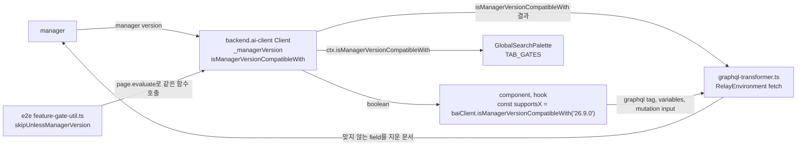
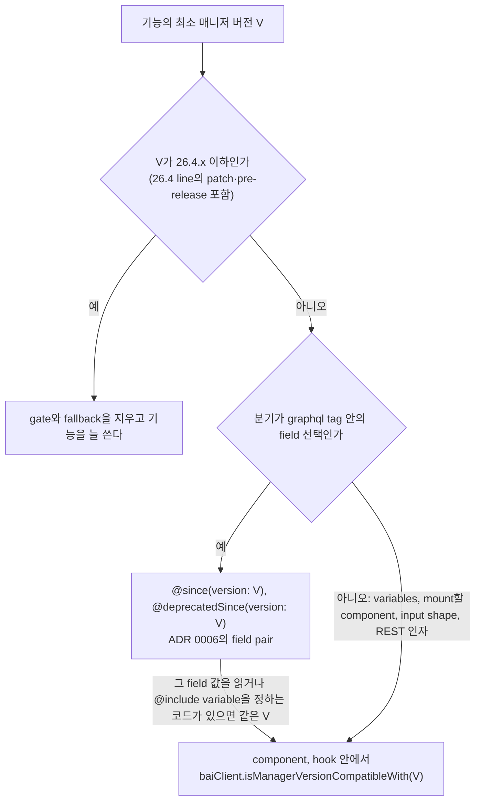

# 0010 — Component-level manager version gates

## Summary

> 낯선 용어는 문서 맨 아래 [용어](#용어)에 모아 두었다.

- 이 저장소가 지원하는 매니저 기준은 26.4 LTS line 전체다. 애플리케이션 코드에서는 26.4.x(patch·pre-release 포함) 또는 그보다 오래된 버전에서 들어온 기능의 [version gate](#용어)를 gate와 fallback 분기와 함께 지우고, 그 기능은 늘 있는 것으로 쓴다. call site의 버전 check는 26.5.0 이상에서 들어온 기능에만 남는다.
- 26.5.0 이상 매니저 버전에 따라 갈리는 분기는 그 field를 쓰는 component나 hook이 `baiClient.isManagerVersionCompatibleWith('<version>')`으로 직접 판정한다. 버전 문자열은 그 field를 처음 낸 매니저 버전이고, 읽는 사람은 call site에서 최소 버전을 바로 본다.
- `backend.ai-client`의 `Client`는 이름 붙은 [feature flag](#용어)를 더는 켜지 않는다. `_updateSupportList()`는 빈 함수이고, `supports(name)`은 API로 남지만 모든 이름에 `false`를 답한다.
- [ADR 0006](0006-version-gated-field-pairs-across-manager-versions.md)의 field pair(`@since`·`@deprecatedSince`와 `graphql-transformer.ts`)는 26.5.0 이상에서 들어온 field에 그대로 쓴다. 이 ADR은 ADR 0006 4절의 "document 밖의 분기는 feature flag로 고른다"는 규칙만 대신한다.
- e2e는 `skipUnlessManagerVersion`으로, 전역 검색 palette의 `TAB_GATES`는 `ctx.isManagerVersionCompatibleWith`로 같은 판정을 한다. 지원 기준은 e2e에 적용하지 않는다. e2e는 버전에 따라 갈리는 test마다 버전과 상관없이 gate와 version tag를 둔다.

## Context

- **Named flags**: 이 결정 전에는 `packages/backend.ai-client/src/client.ts`의 `_updateSupportList()`가 `isManagerVersionCompatibleWith('<version>')` block마다 `this._features['client-ip-of-login-history'] = true` 같은 항목을 켰고, component는 `baiClient.supports('client-ip-of-login-history')`로 읽었다. 새 query나 field 하나마다 `Client`에 항목이 하나씩 늘었다.
- **Hidden version**: `BAILoginHistoryTable`의 `supports('client-ip-of-login-history')`는 최소 매니저 버전을 보여 주지 않았다. 읽는 사람은 `client.ts`에서 그 이름을 다시 찾아야 버전을 알 수 있었다.
- **Dead compat code**: 지원 LTS가 26.4가 된 뒤에도 26.4 line 이하 flag의 꺼진 분기, `@since(version: "X")`(X는 26.4 line 이하), 25.14.0 미만 매니저를 위해 fragment의 `Query`를 `Queries`로 바꾸던 `graphql-transformer.ts`의 처리, `@deprecatedSince(version: "24.12.0")`가 붙은 image `name` field가 남아 있었다. 지원 범위의 매니저는 이 분기에 들어가지 않는다.
- **Version source**: `Client.get_manager_version()`이 매니저가 답한 버전을 `_managerVersion`에 담고, `isManagerVersionCompatibleWith(version)`은 그 값과 인자를 `comparePEP440Versions`로 비교해 `>= 0`이면 `true`를 답한다. PEP 440 비교라 `26.9.0a4`는 `26.9.0`보다 작다.

## 설계도

### 버전을 읽는 곳

### gate 하나를 처리하는 순서

## Decision

### 1. 지원 기준은 매니저 26.4 LTS line이다

- **Removed gates**: 애플리케이션 코드(`react/`, `packages/`)에서 최소 버전이 26.4.x 이하인 gate는 `26.4.2`, `26.4.4rc9` 같은 patch·pre-release까지 포함해 늘 참으로 본다. flag 항목, `isManagerVersionCompatibleWith` check, check가 꺼졌을 때의 fallback 분기, 그 분기만 쓰던 component·query·i18n key를 함께 지운다. 그 기능은 늘 있는 것으로 쓴다.
- **Stripped directives**: graphql tag의 `@since(version: "X")`는 X가 26.4.x 이하이면 지운다. `@deprecatedSince(version: "X")`는 X가 26.4.x 이하이면 그 옛 field 선택과, 그 field를 fallback으로 읽는 코드(`새 field ?? 옛 field` 같은 식)를 함께 지운다. 그 gate만 실어 나르던 `@include`·`@skip` variable도 지운다.
- **Latest patch assumed**: 26.4.x gate를 늘 참으로 보는 것은 지원하는 26.4 배포가 최신 26.4 patch를 돌린다고 가정한다. 이전 26.4 patch의 매니저는 답할 수 없는 field를 받는다.
- **Backport arrays stay**: `isManagerVersionCompatibleWith(['26.4.5', '26.8.2'])`나 `@sinceMultiple(versions: [...])`처럼 26.4.x 항목과 더 새 line의 항목을 함께 가진 배열 gate는 남긴다. 26.5.0부터 26.8.1까지의 매니저에는 그 기능이 없기 때문이다. 항목이 모두 26.4.x 이하인 배열은 단일 gate처럼 지운다.
- **Floor location**: 기준 26.4 line은 코드의 상수가 아니라 이 ADR이 정한다. 기준을 올리는 PR은 이 절을 대신하는 ADR을 함께 쓴다.
- **Transformer shims**: `graphql-transformer.ts`는 25.14.0 미만 매니저를 위한 `Query`·`Queries` 변환을 하지 않는다. 남은 일은 client directive를 읽어 field를 지우는 것뿐이다.

### 2. 버전 분기는 field를 쓰는 곳에서 판정한다

- **Call site check**: 매니저 버전으로 갈리는 분기는 그 분기를 가진 component나 hook이 `baiClient.isManagerVersionCompatibleWith('<version>')`을 직접 부른다. `react/`는 `useSuspendedBackendaiClient()`, BUI는 `useConnectedBAIClient()`로 client를 얻는다.
- **Non-component code**: hook을 부를 수 없는 코드는 같은 method를 다른 길로 부른다. 전역 검색 palette의 순수 함수는 `SearchContext.isManagerVersionCompatibleWith`를 인자로 받고, `RelayEnvironment.ts`는 `globalThis.backendaiclient`의 method를 부른다.
- **Version loaded first**: `_managerVersion`이 비어 있으면 `isManagerVersionCompatibleWith`는 모든 버전에 `false`를 답한다. login 경로가 `get_manager_version()`을 부른 뒤 `backend-ai-connected`를 보내고 `useSuspendedBackendaiClient()`는 그 뒤에 client를 돌려주므로, component 안의 check는 버전이 채워진 client를 본다.
- **Named constant**: 결과를 두 번 이상 쓰면 component 본문 위쪽의 상수에 담고, 이름은 기능을 드러낸다. 한 번만 쓰는 조건은 JSX나 식 안에 inline으로 둔다. `BAILoginHistoryTable`의 `const isClientIpSupported = baiClient.isManagerVersionCompatibleWith('26.9.0')`, `ResourceGroupList`의 `const supportsSubFilter = baiClient.isManagerVersionCompatibleWith('26.7.0')`가 그 모양이다.
- **Version string**: 인자는 그 field나 동작을 처음 낸 매니저 버전을 정확히 적는다. pre-release에서 shape이 바뀌었으면 `26.9.0a4`, `26.9.0rc3`처럼 그 pre-release를 적는다. 같은 기능을 여러 곳에서 판정하면 모두 같은 문자열을 쓴다.
- **Backported features**: 한 기능이 여러 minor line에 따로 들어갔으면 배열 `isManagerVersionCompatibleWith(['26.4.4', '26.9.0'])`을 쓴다. `pep440.ts`의 `isCompatibleMultipleConditions`는 연결된 매니저와 minor가 같은 항목과 비교하고, 같은 minor가 없으면 가장 높은 항목과 비교한다. graphql tag 안의 `@sinceMultiple(versions: [...])`은 이 규칙을 따르지 않는다. `RelayEnvironment.ts`의 `isNotCompatibleWithVersion`은 배열의 모든 버전 이상일 때만 field를 남긴다.
- **Field selection**: graphql tag 안에서 field 선택을 가르는 일은 ADR 0006의 `@since(version: V)`·`@deprecatedSince(version: V)`가 맡는다. component는 같은 V로 `isManagerVersionCompatibleWith(V)`를 불러, 그 field를 읽는 코드와 `@include`·`@skip` variable을 맞춘다. `useCurrentUserProjectRoles`는 `$supportsMyRolesV2`를 `isManagerVersionCompatibleWith('26.9.0a4')`의 결과로 보낸다.
- **Same rule outside GraphQL**: GraphQL이 아닌 분기도 같은 check를 쓴다. `RBACManagementPage`는 `isManagerVersionCompatibleWith('26.9.0a4')`로 mount할 role drawer를 고른다.

### 3. Client는 이름 붙은 flag를 켜지 않는다

- **Empty support list**: `Client._updateSupportList()`는 빈 함수이고, 새 flag를 이곳에 더하지 않는다. 새 field나 query에 gate가 필요하면 2절대로 call site에 check를 둔다.
- **supports() surface**: `react/`, BUI, e2e의 코드는 `supports`를 부르지 않는다. `Client.supports(name)`은 API로 남지만 `_features`가 늘 비어 있어 모든 이름에 `false`를 답한다.
- **ADR 0006 flags**: ADR 0006이 이름으로 부르는 flag는 아래 check가 대신한다.

| ADR 0006의 flag | 최소 버전 | 대신하는 check |
|---|---|---|
| `rbac-single-scope-role` | 26.9.0a4 | `useCurrentUserProjectRoles`, `RoleFormModal`, `RBACManagementPage`의 drawer 선택, `RoleAssignmentTab`, `ProjectAdminSettingModal`, `ProjectPage`가 `isManagerVersionCompatibleWith('26.9.0a4')`를 부른다. |
| `rbac-filter-wrapper` | 26.4.4rc9 | check가 없다. `useCurrentUserProjectRoles`, `LegacyRolePermissionTab`, `LegacyRoleScopeTab`은 permission filter의 `entityType`을 늘 `{ equals: ... }` shape으로 보낸다. |
| `role-mapped-scope-filter` | 26.8.0 | `RoleDetailDrawerContent`, `RoleAssignmentTab`, `RBACManagementPage`, `ProjectPage`가 `isManagerVersionCompatibleWith('26.8.0')`를 부른다. |
| `my-roles` | 26.4.0 | check가 없다. `useCurrentUserProjectRoles`는 주 query를 늘 `store-or-network`로 읽는다. |

### 4. 테스트와 palette도 버전으로 판정한다

- **E2E gate**: `e2e/utils/feature-gate-util.ts`의 `skipUnlessManagerVersion(page, version, reason)`이 페이지의 `backendaiclient.isManagerVersionCompatibleWith(version)`을 불러, `false`면 test를 skip한다. 같은 test에는 `@requires-manager-v26.9` 같은 version tag를 붙여 `--grep-invert`로 뺄 수 있게 한다.
- **E2E keeps every gate**: 1절의 지원 기준은 애플리케이션 코드에만 적용한다. e2e suite는 더 오래된 매니저를 상대로도 돌 수 있으므로, 버전에 따라 갈리는 test는 최소 버전이 26.4.x 이하여도 `skipUnlessManagerVersion`과 `@requires-manager-vX.Y` tag를 둔다. `dashboard.spec.ts`의 Agent Statistics test는 `25.15.0`과 `@requires-manager-v25.15`, `deployment-lifecycle.spec.ts`의 preset test는 `26.4.2`로 gate한다. 애플리케이션에서 fallback이 지워진 화면을 검증하던 test는 gate로 되살리지 않는다.
- **E2E overrides**: 연결된 매니저와 다른 버전의 경로를 강제하는 spec은 `isManagerVersionCompatibleWith`를 감싸 특정 버전 문자열에 `true`나 `false`를 답하게 한다. `e2e/serving/admin-preset-service-config.spec.ts`가 그 예다.
- **Palette context**: `react/src/components/GlobalSearchPalette/types.ts`의 `SearchContext`는 `supports` 대신 `isManagerVersionCompatibleWith`를 갖는다.
- **Palette gates**: `visibility.ts`의 `TAB_GATES`에 매니저 버전 gate를 둘 때는 탭을 그리는 page와 같은 버전 문자열로 `ctx.isManagerVersionCompatibleWith`를 부른다. 지금 `TAB_GATES`에 버전 gate 항목은 없다.

## 대안과 기각 사유

- **Keep named flags in the client**: `_updateSupportList()`에 flag를 계속 더하고 component는 `supports(name)`으로 읽는다. 버전 판정이 `client.ts` 한 파일에 모인다는 것이 장점이다. 기각한 이유는 Context가 적은 두 문제가 그대로 남기 때문이다. `Client`의 항목은 field마다 늘고, call site의 이름은 최소 버전을 숨긴다.
- **Central version table**: flag 대신 기능 이름과 버전을 짝지은 상수 map을 한 파일에 두고 component가 그 map을 읽는다. 이름과 버전을 한곳에서 볼 수 있다는 것이 장점이다. 기각한 이유는 이름을 거쳐 버전을 찾는 간접 참조가 named flag와 같아 call site에서 버전이 보이지 않기 때문이다.
- **Keep pre-LTS fallbacks**: 26.4 line 이하 gate를 지우지 않고 버전 check로만 바꾼다. 26.4 미만 매니저에 붙어도 기존 동작을 유지한다는 것이 장점이다. 기각한 이유는 지원 범위의 매니저가 들어가지 않는 분기를 유지·테스트해야 하고, 그 분기의 e2e spec도 지원하는 backend에서는 돌 수 없기 때문이다.
- **Floor at 26.4.0 only**: 기준을 `26.4.0` 하나로 두고 26.4.0 뒤의 patch·pre-release gate는 남긴다. 최신이 아닌 26.4 patch 매니저도 fallback으로 동작한다는 것이 장점이다. 기각한 이유는 지원 범위가 26.4 LTS line 전체이고, patch gate를 남기면 한 LTS line 안의 fallback 분기와 그 분기만 쓰는 component가 patch마다 쌓이기 때문이다.

## Consequences

- **No client edit per gate**: 새 gate를 더하는 PR은 `client.ts`를 고치지 않는다.
- **Repeated version strings**: 같은 기능을 여러 component가, 또는 page와 `TAB_GATES`가 함께 판정하면 같은 버전 문자열이 여러 파일에 적히고, 두 문자열이 같은지 아무도 검사하지 않는다. gate를 지우거나 기준을 올리는 PR은 `isManagerVersionCompatibleWith('…')`와 `@since(version: "…")`를 그 버전으로 grep해 애플리케이션 코드의 gate와 fallback을 함께 지우고, `e2e/`의 `skipUnlessManagerVersion`과 `@requires-manager-vX.Y` tag는 남긴다.
- **No lint guard**: 새 `_features` 항목이나 `supports(` 호출을 막는 lint rule은 없다. 리뷰가 이 ADR로 막는다.
- **Silent false for plugins**: `supports(name)`을 부르는 외부 plugin은 오류 없이 `false`를 받아 gate된 동작을 잃는다.
- **No login floor**: 로그인 단계에서 매니저 최소 버전을 검사하지 않는다. 26.4 미만 매니저와 최신이 아닌 26.4 patch 매니저는 지워진 fallback 대신 답할 수 없는 query를 받는다.
- **Out of scope**: `backend.ai-client` resource의 REST API v3/v4 field shim, 쓰이지 않는 `force2FA` 설정 경로, 코드가 더는 참조하지 않는 i18n key 네 개(`statistics.IOReadDesc` 등), `_features`를 세는 `scripts/release-risk-report.mjs`는 후속 정리에서 다룬다.

## 출처

- Jira: FR-3980. GitHub: #9738, PR #9739.
- 결정일: 2026-09-17.
- 관련: [ADR 0006](0006-version-gated-field-pairs-across-manager-versions.md)의 field pair는 그대로 발효 중이고, 그 4절의 feature flag 규칙을 이 ADR이 대신한다. [ADR 0003](0003-committed-search-index-artifact.md)은 `TAB_GATES`를 쓰는 전역 검색 palette의 인덱스를 정한다. 코드: `packages/backend.ai-client/src/client.ts`, `packages/backend.ai-client/src/pep440.ts`, `react/src/helper/graphql-transformer.ts`, `e2e/utils/feature-gate-util.ts`.

## 용어

| 용어 | 뜻 |
|---|---|
| version gate | 연결된 매니저 버전에 따라 field 선택, variables, mount할 component, request shape 중 하나를 고르는 분기다. |
| feature flag | 이 결정 전에 `backend.ai-client`의 `Client`가 `_updateSupportList()`에서 매니저 버전으로 켜던 이름 붙은 boolean이다. `baiClient.supports(name)`으로 읽었고, 지금은 켜는 곳이 없다. |
| `isManagerVersionCompatibleWith` | `Client`의 method로, 연결된 매니저 버전이 인자 버전 이상이면 `true`를 답한다. 비교는 `pep440.ts`의 `comparePEP440Versions`가 한다. |
