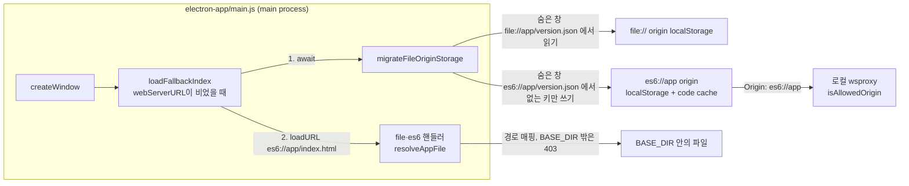

# 0010 — Electron renderer on the es6://app origin

## Summary

> 낯선 용어는 문서 맨 아래 [용어](#용어)에 모아 두었다.

- Electron 앱의 main window는 `index.html`을 `file://`이 아니라 `es6://app/index.html`에서 연다. 렌더러의 [origin](#용어)은 `es6://app`이다.
- `es6` 스킴은 `standard`와 `codeCache` [권한](#용어)으로 등록되어, 렌더러 JS의 [V8 code cache](#용어)가 두 번째 실행부터 쓰인다.
- `electron-app/main.js`의 `file`·`es6` 핸들러는 한 경로 규칙(`resolveAppFile`)으로 [`BASE_DIR`](#용어) 안의 파일을 돌려준다. 이전 형식인 `es6://assets/…`와 `es6://config.toml`도 계속 동작한다.
- `es6://app` 문서를 열기 직전에 `migrateFileOriginStorage`가 `file://` origin의 localStorage를 `es6://app`으로 한 번 복사한다.
- 로컬 [wsproxy](#용어)는 `es6://app` origin을 허용하고, `'null'` origin은 더 이상 허용하지 않는다.

## Context

- **Opaque document origin**: 이 결정 전에는 main window가 `file://app/index.html`을 열고, 번들은 `scripts/patch-electron-publicpath.js`가 바꾼 `es6://assets/…`에서 받았다. Chromium은 `file://` 문서에 [opaque origin](#용어)을 주고, opaque origin 문서에는 code cache를 쓰지 않는다. 그래서 `es6` 스킴에 `codeCache: true`만 켜면 `Code Cache/js`에 인덱스 파일(16 KB)만 남는다.
- **Measurement**: Linux(Electron 39, Xvfb)에서 `make dep_electron`과 같은 방식으로 조립한 앱으로, 프로세스 시작부터 로그인 폼이 뜰 때까지를 8회씩 쟀다. load average는 11 수준이었다. code cache는 두 번째 실행에서 만들어지고 세 번째부터 쓰이므로 3~8회차만 비교했다.

| 문서 origin | `Code Cache/js` | 3~8회차 중앙값 |
|---|---|---|
| `file://` (이전) | 16 KB | 약 1,960 ms |
| `es6://app` (이 결정) | 30개 파일, 3.5 MB | 약 1,740 ms |

- **Storage is per origin**: localStorage는 origin마다 따로 저장된다. 코드는 IndexedDB를 쓰지 않는다. backend 쿠키는 backend 도메인에 묶이므로 origin 변경의 영향을 받지 않는다.

## 설계도

## Decision

### 1. 렌더러 문서는 `es6://app/index.html`에서 연다

- **Entry URL**: `main.js`의 `APP_ORIGIN = 'es6://app'`, `mainIndexURL = 'es6://app/index.html'`. `loadFallbackIndex`와 두 "Refresh App" 메뉴가 이 URL을 쓴다. `LIVE_DEBUG`와 `webServerURL` 모드는 바뀌지 않는다.
- **Fixed host**: host는 `app` 하나로 고정한다. host가 바뀌면 origin이 바뀌어 저장소를 다시 옮겨야 한다. host가 파일명이면 루트 절대경로(`/resources/…`)가 그 host 아래로 풀려 i18n과 Monaco가 로드되지 않는다.
- **Router**: `react/src/routes.tsx`의 `/index.html` route가 `DefaultMenuRedirect`로 보낸다.

### 2. 두 스킴은 한 경로 규칙을 공유한다

- **URL to path**: `es6` 핸들러는 host가 `app`이면 pathname만, 아니면 `host + pathname`을 쓴다. `file` 핸들러는 항상 `host + pathname`을 쓴다. `serveAppFile`이 이 경로를 percent-decode하고, 디코딩에 실패하면 400을 돌려준다.
- **Path to file**: `resolveAppFile`이 아래 규칙으로 `BASE_DIR` 안의 파일을 고르고, 결과가 `BASE_DIR` 밖이면 403을 돌려준다.

| 경로 앞부분 | 파일 |
|---|---|
| `resources/`, `manifest/`, `app/` | `BASE_DIR/<경로>` |
| 그 밖 | `BASE_DIR/app/<경로>` |

- **Headers**: `es6` 응답은 `access-control-allow-origin: *`를 유지한다. 이전 형식 URL(`es6://assets/…`)은 `es6://app` 문서에서 보면 다른 origin이다.

### 3. localStorage는 한 번 옮긴다

- **Trigger**: `loadFallbackIndex`가 `es6://app/index.html`을 열기 전에 `migrateFileOriginStorage`를 await한다.
- **Procedure**: 숨은 `BrowserWindow`가 `file://app/version.json`에서 `localStorage` 항목을 읽고, `es6://app/version.json`으로 이동해 `es6://app`에 없는 키만 쓴 뒤 `session.flushStorageData()`를 부른다.
- **Marker**: `userData/es6-origin-migrated`에 `{ done, attempts }`를 JSON으로 쓴다. `done`이거나 `attempts`가 `MIGRATION_MAX_ATTEMPTS`(3)에 이르면 다시 실행하지 않는다.

### 4. wsproxy는 `es6://app`만 허용한다

- **Allowlist**: `src/wsproxy/manager.js`의 `isAllowedOrigin`은 Origin이 없거나 `es6://app`이면 허용한다. wsproxy는 렌더러와 같은 번들(`app/wsproxy/wsproxy.js`)로 배포되므로 `file://` 렌더러가 더는 없고, `'null'`은 브라우저에서 연 로컬 파일도 보내는 값이라 허용하지 않는다. `manager.test.ts`가 두 경우를 확인한다.

## 대안과 기각 사유

- **`codeCache: true`만 켜기**: 한 줄 변경이지만, 문서가 `file://`이면 캐시가 생기지 않는다. 기각.
- **파일명을 host로 쓰기(`es6://index.html`)**: `loadURL` 한 줄 변경이지만, 루트 절대경로 리소스가 404가 된다. 기각.
- **로컬 http 서버로 제공하기**: http(s)는 기본으로 code cache를 쓰지만, 다른 로컬 프로세스가 접근할 수 있는 포트가 하나 더 열린다. 기각.
- **저장소를 옮기지 않기**: 코드가 가장 적지만, 업데이트한 데스크톱 사용자의 설정과 로그인 정보가 초기화된다. 기각.

## Consequences

- **Warm start**: 두 번째 실행부터 V8 code cache 3.5 MB를 재사용해, 측정 머신에서 로그인 폼까지의 시간이 약 11% 줄었다.
- **First run cost**: 업데이트 후 첫 실행에 숨은 창을 두 번 로드하는 비용이 한 번 든다.
- **Upgrade path**: 이전 빌드에서 로그인해 둔 userData로 새 빌드를 띄우면, localStorage 9개 항목이 옮겨지고 로그인 폼 없이 `es6://app/project/default/start`가 열렸다.
- **New install**: 저장소가 빈 userData에서 로그인 폼으로 `admin` 계정이 로그인되고 소속 프로젝트가 채워졌다.
- **Rollback**: 이전 빌드로 되돌리면, `es6://app`에서 바꾼 설정은 `file://` 쪽에 없으므로 보이지 않는다.
- **Not measured**: macOS와 Windows.

## 출처

- [FR-4085](https://lablup.atlassian.net/browse/FR-4085) — 이 결정. 2026-09-25.
- Electron `CustomScheme.privileges.codeCache`, `session.setCodeCachePath`, `session.flushStorageData` (`electron.d.ts`, Electron 39).

## 용어

| 용어 | 뜻 |
|---|---|
| origin | 스킴과 host(와 port)로 정해지는 페이지의 소속. 저장소와 code cache가 이 단위로 나뉜다. |
| opaque origin | 브라우저가 소속을 정하지 않는 origin. `file://` 문서가 여기에 해당하고, HTTP 요청에는 `Origin: null`로 나간다. |
| V8 code cache | V8이 컴파일한 바이트코드를 디스크에 저장해 다음 실행에서 파싱과 컴파일을 건너뛰게 하는 캐시. Electron에서는 userData의 `Code Cache/js`에 있다. |
| 스킴 권한 | `protocol.registerSchemesAsPrivileged`로 커스텀 스킴에 주는 성질. `standard`는 http처럼 host와 path를 가진 URL로 해석하게 하고, `codeCache`는 그 스킴의 스크립트에 code cache를 쓰게 한다. |
| `BASE_DIR` | `main.js`가 있는 디렉터리. 그 아래에 `app/`, `resources/`, `manifest/`가 있다. |
| wsproxy | 앱이 띄우는 로컬 프록시(`src/wsproxy/manager.js`). 세션 앱(Jupyter 등)으로 가는 연결을 중계한다. |
