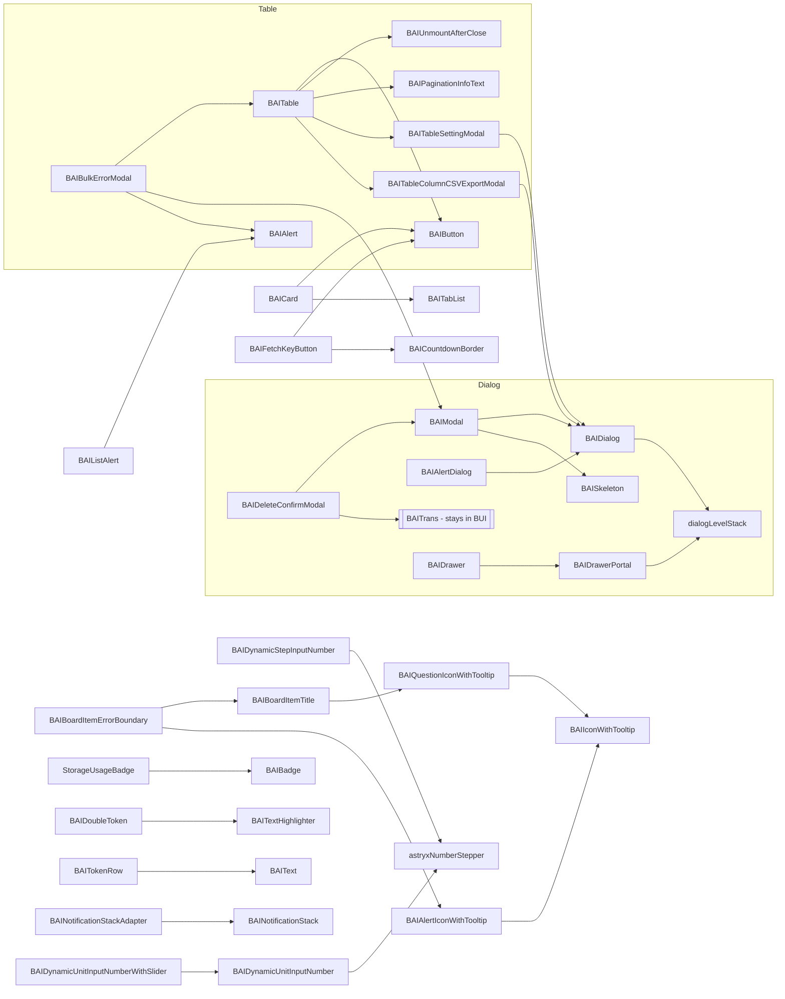

# Research: which BAI components could move to `@lablup/ui-common`

- Wayfinder map: FR-4046 (GitHub #9890) · Research ticket: FR-4050 (GitHub #9894) · Feeds FR-4054 (prop vocabulary) and FR-4055 (translation injection)
- Date: 2026-09-22 · backend.ai-webui `origin/main` @ `5cc8a323e` · `@astryxdesign/core` 0.6.2 / `@astryxdesign/lab` 0.3.0-canary.12db2a1 (`pnpm-workspace.yaml` catalog) · `@lablup/ui-common` 0.1.0-alpha.19 (`bdf2765`)
- Method: primary sources only. The source tree of `packages/backend.ai-ui/src` and `react/src/components`, `packages/backend.ai-ui/src/locale/en.json`, and ui-common's `CONTRIBUTING.md`, `README.md`, `package.json`, `scripts/check-boundary.mjs` and `src/`. A throwaway import-graph script walked every non-test, non-story, non-doc `.ts(x)` file, resolved relative imports through barrels to the file that defines each named import, and marked a file as Backend.AI-dependent if its import closure (comments stripped) reaches `react-relay` / `relay-runtime` / `graphql` tagged templates / `__generated__`, `backend.ai-client` / `useConnectedBAIClient` / `baiClient/`, `@tanstack/react-query`, `react-router`, `jotai`, or `BAIMetaDataProvider` / `BAIConfigProvider`. Every component the script reported as free was then read by hand for domain enums, domain-shaped props and wire protocols. The script cannot see those. The hand pass moved 9 script-free components to blocked and moved 1 script-blocked component (`BAIDynamicUnitInputNumberWithSlider`) back to candidate. Usage counts are files under `react/src` (excluding `__generated__`, tests and stories) that name the component and import it from `backend.ai-ui`, plus the number of `<Name` JSX sites.

## Answer in brief

| Bucket | Components | LOC | Meaning |
|---|---:|---:|---|
| **free** | 38 | 4,832 | No Backend.AI dependency and no user-facing string of their own. `BAICard` is free itself but reaches i18n through `BAIButton`. |
| **i18n-only** | 28 | 9,028 | No Backend.AI dependency. They call `useBAIi18n()` / `<BAITrans>` for **69 distinct static keys** (50 `comp:*`, 19 `general.*`). |
| **blocked** | 26 top-level + all 66 files in `components/fragments/`, all 14 in `components/baiClient/`, the providers and `unsafe/` | 5,601 top-level | Relay, `backend.ai-client`, BAI providers, router, domain enums, domain wire formats, or auth. |

The analysis covered 200 source files under `packages/backend.ai-ui/src/components` (93 top-level, 8 `Table/`, 66 `fragments/`, 14 `baiClient/`, 17 `provider/`, 2 `unsafe/`). No file under `fragments/` or `baiClient/` is free.

**Top candidates by payoff** (usage in `react/src`, files / JSX sites):
`BAIFlex` (288 / 973), `BAIModal` (118 / 129), `BAISkeleton` (81 / 174), `BAICard` (69 / 93), `BAIText` (67 / 161), `BAIUnmountAfterClose` (67 / 85), `BAITable` (56 / 41), `BAIButton` (55 / 72), `BAIFetchKeyButton` (41 / 39), `BAIMetadataList` (39 / 60), `BAIQuestionIconWithTooltip` (33 / 61), `BAIDeleteConfirmModal` (32 / 34), `BAISelect` (29 / 39).

**Blockers that are not Backend.AI dependencies but still gate a move.** The first two decide the order more than any single component does.

1. **`theme-shim` (3,101 LOC, antd-parity `theme.useToken()` with a vendored antd palette algorithm).** 13 candidates read it directly (14 with the blocked `ResourceStatistics`), among them `BAIFlex` and `BAITable`. Through `BAIFlex` it reaches almost everything, so it must be replaced by Astryx tokens before `BAIFlex` can leave. See the [dependency clusters](#dependency-clusters-what-must-move-together).
2. **ui-common today depends on nothing but React.** Its `peerDependencies` are `react` and `react-dom` only (`ui-common/package.json`), and `src/` imports no `@astryxdesign/*`. Every candidate here is built on Astryx, so none can land until FR-4048 settles how ui-common depends on Astryx. The map already decided that ui-common's own 17 components and 119-token contract are **replaced** by Astryx (FR-4046 description). ui-common's current `Button`, `Drawer`, `Select`, `Skeleton`, `Tabs`, `Badge`, `DataTable`, `BaseCard`, `StatCard`, `ProgressBar` and `Tooltip` are therefore name collisions to retire, not APIs to merge with.
3. **BUI form engine (`src/form-engine/`).** `BAICheckbox` reads form context, and `BAIBulkEditFormItem` is a `FormItem`. They either move with the form engine or take the form binding as a prop.
4. **`hooks/index.ts` is a mixed barrel.** Generic hooks (`useUpdatableState`, `useFetchKey`, …) live in the same file as `useAllowedHostNames` (backend.ai-client + react-query + Relay). The file therefore imports client code, and anything importing a generic hook from it is tainted. `BAIDynamicUnitInputNumberWithSlider` is the one candidate this blocks. Moving `useUpdatableState` out of the barrel unblocks it.
5. **ui-common admission rules** (`CONTRIBUTING.md` "Component admission"): a component must be product-neutral, have **a real second consumer**, and **ship with its tests**. 34 of the 66 candidates have no co-located `*.test.tsx` (see the Test file column). FR-4053 is revisiting these rules for the Astryx era, and the "second consumer" rule in particular conflicts with a bulk move.

## Candidate table (free and i18n-only)

Column notes:

- **Astryx used** lists `module:export` from `@astryxdesign/core` (or `lab/`) with type-only imports dropped.
- **Internal infra / hooks** lists the non-component BUI modules imported, plus third-party packages other than `react`.
- **i18n keys** are the literal keys in the file with their `en.json` value. That value is the natural English default for the future string prop.
- **antd-v6-shaped props** are the frozen antd vocabulary the props interface carries (see `.claude/rules/component-props-extension.md`).
- **Shadows Astryx?** says whether the ui-common name would sit on top of an Astryx component of the same role. Repo-wide imports reach 72 capitalised Astryx `core` modules, and none of them is `core/Modal`. `BAIModal` is built on `Dialog` plus `Layout`, so "hiding Astryx's Modal" in FR-4046 means hiding `Dialog` in practice. The installed catalog was not re-listed because `node_modules` is not installed in this worktree.
- **Test file** counts `Name.*test.tsx` files beside the source.

| Component | File | LOC | Astryx used | BAI components used | Internal infra / hooks | Verdict | i18n keys (en default) | antd-v6-shaped props | Candidate ui-common name | Shadows Astryx? | Used in react/src (files / JSX sites) | Used inside BUI (files) | Test file |
|---|---|---:|---|---|---|---|---|---|---|---|---|---|---|
| `BAIModal` | `BAIModal.tsx` | 775 | Button, Dialog:DialogHeader, IconButton, Layout, Layout:LayoutContent, Layout:LayoutFooter, Layout:LayoutHeader, Stack:HStack | BAIDialog, BAISkeleton | hooks/useBAIi18n, lucide-react | i18n | `general.button.Cancel` "Cancel" `comp:BAIModal.Minimize` "Minimize" `comp:BAIModal.Restore` "Restore" `comp:BAIModal.Maximize` "Maximize" `comp:BAIModal.ExitFullscreen` "Exit fullscreen" `comp:BAIModal.Fullscreen` "Fullscreen" `general.button.Close` "Close" | open, onCancel, onOk, okText, cancelText, okType, okButtonProps, cancelButtonProps, confirmLoading, footer, width, centered, maskClosable, keyboard, mask, closable, closeIcon, destroyOnClose/destroyOnHidden, forceRender, getContainer, afterClose, afterOpenChange, styles, classNames, zIndex, draggable, title (plus accepted-and-ignored: wrapClassName, rootClassName, bodyStyle, maskStyle, modalRender, transitionName, …) | Modal | yes — role of Astryx `Dialog` (+`Layout` slots); Astryx exports no `Modal` in this repo's import surface | 118 / 129 | 19 | — |
| `BAIDialog` | `BAIDialog.tsx` | 353 | Dialog, hooks:useFocusTrap, hooks:useScrollLock, naming:dataAttr, theme:useThemeName, utils:devWarn, utils:isFocusDetached, utils:mergeRefs | dialogLevelStack | classnames, react-dom | free — Base layer under BAIModal/BAIAlertDialog/table modals; imports Astryx internals (`hooks`, `naming`, `utils`) | — | width, zIndex | Dialog (internal base, or unexported) | yes — wraps Astryx `Dialog` | 1 / 0 | 8 | 1 |
| `BAIAlertDialog` | `BAIAlertDialog.tsx` | 121 | Button, Heading, Layout, Layout:LayoutContent, Layout:LayoutFooter, Stack:HStack, Text | BAIDialog | hooks/useBAIi18n | i18n | `general.button.Cancel` "Cancel" | — (Astryx-shaped: isCancelDisabled, isActionDisabled) | AlertDialog | yes — Astryx `AlertDialog` | 0 / 0 | 1 | 1 |
| `BAIDeleteConfirmModal` | `BAIDeleteConfirmModal.tsx` | 333 | Banner, Stack:VStack, Text, TextInput | BAIModal, BAITrans | hooks/useBAIi18n, lucide-react | i18n — Uses `<BAITrans>` for the "Type <code>x</code> to confirm" sentence — needs a ReactNode/render-prop string slot, not a plain string | `comp:BAIDeleteConfirmModal.DeleteNItems` "Delete {{count}} items" `comp:BAIDeleteConfirmModal.DeleteItem` "Delete" `general.button.Delete` "Delete" `comp:BAIDeleteConfirmModal.CannotBeUndone` "This action cannot be undone." `comp:BAIDeleteConfirmModal.AreYouSureToPermanentlyDeleteTarget` "Are you sure you want to permanently delete {{target}}?" `comp:BAIDeleteConfirmModal.AreYouSureToDelete` "Are you sure you want to delete?" `comp:BAIDeleteConfirmModal.TypeToConfirm` "Type <code>{{confirmText}}</code> to confirm." | inherits BAIModalProps (see BAIModal) | DeleteConfirmModal | no | 32 / 34 | 3 | — |
| `BAIPopconfirm` | `BAIPopconfirm.tsx` | 215 | Button, Popover, Stack:HStack, Stack:VStack, Text | — | hooks/useBAIi18n | i18n | `general.button.Confirm` "Confirm" `general.button.Cancel` "Cancel" | title, description, okText, cancelText, onConfirm, onCancel, icon (`isDanger` replaces okButtonProps.danger) | Popconfirm | partial — composes Astryx `Popover` | 10 / 13 | 0 | 1 |
| `BAIDrawer` | `BAIDrawer.tsx` | 161 | Heading, IconButton, Stack:HStack, Stack:StackItem, Stack:VStack, lab/Drawer | BAIDrawerPortal | hooks/useBAIi18n, classnames, lucide-react | i18n | `general.button.Close` "Close" | open, onClose, title, extra, size | Drawer | yes — `@astryxdesign/lab` `Drawer` | 8 / 8 | 0 | — |
| `BAIDrawerPortal` | `BAIDrawerPortal.tsx` | 143 | hooks:useFocusTrap, hooks:useScrollLock, naming:dataAttr, theme:useThemeName, utils:mergeRefs, lab/Drawer | dialogLevelStack | classnames, react-dom | free — Internal to BAIDrawer | — | — | (internal) | wraps lab `Drawer` | 1 / 0 | 2 | 1 |
| `BAIUnmountAfterClose` | `BAIUnmountAfterClose.tsx` | 111 | — | — | — | free | — | — | UnmountAfterClose | no | 67 / 85 | 10 | 1 |
| `BAIAlert` | `BAIAlert.tsx` | 115 | Banner | — | classnames | free | — | type, title (v6 name for message), message (still accepted), description, showIcon, icon, closable, onClose, banner, action | Alert | yes — Astryx `Banner` | 14 / 18 | 7 | — |
| `BAIListAlert` | `BAIListAlert.tsx` | 63 | — | BAIAlert | theme-shim, lodash-es | free — theme-shim | — | inherits BAIAlertProps | ListAlert | no | 4 / 4 | 2 | 1 |
| `BAINotificationStack` | `BAINotificationStack.tsx` | 410 | Banner, Button, ProgressBar, Stack:HStack, Stack:VStack, Text | — | — | free | — | — | NotificationStack | role overlaps Astryx `Toast` | 1 / 1 | 1 | 1 |
| `BAINotificationStackAdapter` | `BAINotificationStackAdapter.tsx` | 175 | — | BAINotificationStack | — | free — Adapter; not exported from the barrel | — | — | (internal) | — | 1 / 0 | 1 | — |
| `BAINotificationItem` | `BAINotificationItem.tsx` | 116 | Text | BAIFlex | theme-shim | free — theme-shim | — | — | NotificationItem | no | 3 / 3 | 0 | — |
| `BAIBulkErrorModal` | `BAIBulkErrorModal.tsx` | 118 | — | BAIAlert, BAIFlex, BAIModal, BAITable, tableTypes | hooks/useBAIi18n, theme-shim, lucide-react | i18n — theme-shim; pulls BAIModal + BAITable | `comp:BAIBulkErrorModal.ActionExecutionFailed` "Action execution failed" `comp:BAIBulkErrorModal.ErrorOccurred` "Error Occurred" | inherits BAIModalProps | BulkErrorModal | no | 6 / 0 | 1 | 1 |
| `BAIBoardItemErrorBoundary` | `BAIBoardItemErrorBoundary.tsx` | 56 | — | BAIAlertIconWithTooltip, BAIBoardItemTitle | hooks/useBAIi18n, theme-shim, react-error-boundary | i18n — theme-shim; react-error-boundary | `comp:BAIBoardItemErrorBoundary.UnexpectedError` "An unexpected error occurred. Please try again later or contact support if the problem persists." | — | BoardItemErrorBoundary | no | 3 / 6 | 0 | — |
| `BAIButton` | `BAIButton.tsx` | 203 | Button, IconButton | — | helper/astryxLabel, hooks/useBAIi18n | i18n | `general.button.Action` "Action" | type, size, icon, loading, disabled, danger, block, variant, color (+ BAI `action`) | Button | yes — Astryx `Button`/`IconButton` | 55 / 72 | 21 | 1 |
| `BAIFetchKeyButton` | `BAIFetchKeyButton.tsx` | 465 | ButtonGroup, DropdownMenu, DropdownMenu:DropdownMenuRadioGroup, DropdownMenu:DropdownMenuRadioItem, Tooltip | BAIButton, BAICountdownBorder | helper, hooks/useControllableValue, hooks/useBAIi18n, hooks/useIntervalValue, dayjs, dayjs/plugin/duration, lodash-es, lucide-react | i18n — dayjs; useIntervalValue | `comp:BAIFetchKeyButton.LastUpdated` "Last Updated" `comp:BAIFetchKeyButton.Refresh` "Refresh" `comp:BAIFetchKeyButton.EveryHours` "{{count}}h" `comp:BAIFetchKeyButton.EveryMinutes` "{{count}}m" `comp:BAIFetchKeyButton.EverySeconds` "{{count}}s" `comp:BAIFetchKeyButton.AutoRefresh` "Auto Refresh" `comp:BAIFetchKeyButton.Off` "Off" | loading, size, hidden | RefreshButton | no | 41 / 39 | 2 | — |
| `BAICountdownBorder` | `BAICountdownBorder.tsx` | 145 | — | — | theme-shim | free — theme-shim | — | — | CountdownBorder | no | 0 / 0 | 1 | — |
| `BAIColorPicker` | `BAIColorPicker.tsx` | 258 | Button, Popover, TextInput | BAIFlex | hooks/useBAIi18n | i18n | `comp:BAIColorPicker.SelectColor` "Select color" `comp:BAIColorPicker.HexValue` "Hex value" `comp:BAIColorPicker.Clear` "Clear" `comp:BAIColorPicker.NoColor` "No color" | value, onChangeComplete, showText, allowClear, onClear, disabled | ColorPicker | no | 1 / 1 | 0 | — |
| `BAIFlex` | `BAIFlex.tsx` | 158 | — | — | theme-shim | free — theme-shim (gap tokens via antd-parity `theme.useToken()`) | — | direction, wrap, justify, align, gap (antd `Flex`-like) | Flex | role of Astryx `Stack`/`HStack` | 288 / 973 | 47 | 1 |
| `BAICompactGroup` | `BAICompactGroup.tsx` | 97 | HStack | — | — | free | — | — (replaces antd `Space.Compact`) | CompactGroup | partial — Astryx `HStack` | 1 / 1 | 1 | 1 |
| `BAIRowWrapWithDividers` | `BAIRowWrapWithDividers.tsx` | 166 | — | — | theme-shim | free — theme-shim | — | — | DividedRow | no | 4 / 4 | 1 | — |
| `BAIOverlayScrollbar` | `BAIOverlayScrollbar.tsx` | 196 | — | — | — | free | — | — | OverlayScrollbar | no | 1 / 1 | 0 | 1 |
| `BAIAppShell` | `BAIAppShell.tsx` | 186 | AppShell, AppShell:useAppShellMobile, MobileNav, SideNav:SideNavRenderContext, Stack:VStack, theme:useTheme | — | classnames | free | — | — | AppShell | yes — Astryx `AppShell` | 2 / 1 | 0 | 1 |
| `BAICard` | `BAICard.tsx` | 378 | Card, Divider, Skeleton, Stack:HStack, Stack:VStack, TabList:Tab, Text:Heading | BAIButton, BAITabList | helper/astryxLabel, lucide-react | free (transitively i18n via BAIButton) — Frozen antd-Card escape hatch (PILOT-DECISION header) | — | title, extra, size, type="inner", bordered, variant, hoverable, loading, cover, actions, tabList, activeTabKey, defaultActiveTabKey, onTabChange, tabBarExtraContent, styles (ignored) | Card | yes — Astryx `Card` | 69 / 93 | 2 | 1 |
| `BAITabList` | `BAITabList.tsx` | 86 | TabList | — | — | free | — | type, tabBarExtraContent | TabList | yes — Astryx `TabList` | 2 / 1 | 1 | 1 |
| `BAITabCountBadge` | `BAITabCountBadge.tsx` | 58 | Badge | — | — | free | — | — | TabCountBadge | no | 3 / 3 | 0 | 1 |
| `BAISegmentedControlItem` | `BAISegmentedControlItem.tsx` | 32 | SegmentedControl:SegmentedControlItem | — | — | free | — | — | SegmentedControlItem | yes — Astryx `SegmentedControlItem` | 2 / 2 | 0 | — |
| `BAIMetadataList` | `BAIMetadataList.tsx` | 111 | MetadataList, MetadataList:MetadataListItem | — | — | free | — | bordered, size (antd `Descriptions`) | MetadataList | yes — Astryx `MetadataList` | 39 / 60 | 1 | 1 |
| `BAISkeleton` | `BAISkeleton.tsx` | 181 | Skeleton, Stack:HStack, Stack:VStack | — | — | free | — | — (antd `active`/`paragraph` mapped onto rows/hasTitle) | Skeleton | yes — Astryx `Skeleton` | 82 / 175 | 1 | — |
| `BAIBoardItemTitle` | `BAIBoardItemTitle.tsx` | 70 | Text:Heading | BAIQuestionIconWithTooltip, BAIFlex | theme-shim | free — theme-shim | — | — | BoardItemTitle | no | 10 / 10 | 2 | — |
| `BAIText` | `BAIText.tsx` | 412 | IconButton, Kbd, Link, Tooltip | — | hooks/useBAIi18n, classnames, lucide-react | i18n | `general.button.Copy` "Copy" `general.button.Copied` "Copied" `general.button.Collapse` "Collapse" `general.button.Expand` "Expand" | type, strong, italic, underline, delete, mark, code, keyboard, disabled, ellipsis, copyable (antd `Typography.Text`) | Text | yes — Astryx `Text` | 67 / 161 | 34 | 1 |
| `BAITextHighlighter` | `BAITextHighlighter.tsx` | 46 | — | — | theme-shim, lodash-es | free — theme-shim; host twin `react/src/components/TextHighlighter.tsx` (7 files) | — | — | TextHighlighter | no | 2 / 3 | 2 | — |
| `BAIBadge` | `BAIBadge.tsx` | 97 | StatusDot, Text | — | helper | free — Standalone antd-Badge surface (escape hatch) | — | color, processing, text (antd `Badge status`) | StatusBadge | role of Astryx `StatusDot` | 4 / 4 | 4 | — |
| `BAIBadgeCount` | `BAIBadgeCount.tsx` | 141 | Badge | — | — | free | — | count, showZero, offset, size (dot → hasDot, overflowCount → max) | CountBadge | yes — Astryx `Badge` | 3 / 3 | 1 | 1 |
| `BAIDoubleBadge` | `BAIDoubleBadge.tsx` | 44 | Badge, Stack:HStack | — | helper/astryxTagVariant, lodash-es | free | — | — | DoubleBadge | no | 5 / 6 | 2 | 1 |
| `BAIDoubleToken` | `BAIDoubleToken.tsx` | 59 | Stack:HStack, Token | BAITextHighlighter | helper/astryxTagVariant, lodash-es | free | — | — | DoubleToken | no | 9 / 12 | 4 | 1 |
| `BAIBooleanToken` | `BAIBooleanToken.tsx` | 37 | Token | — | — | free | — | — | BooleanToken | no | 4 / 4 | 4 | — |
| `BAITokenList` | `BAITokenList.tsx` | 162 | Badge, HoverCard, Link, Popover, Text, Token | BAIFlex | lodash-es | free | — | — | TokenList | no | 3 / 7 | 1 | 1 |
| `BAITokenRow` | `BAITokenRow.tsx` | 81 | Token | BAIFlex, BAIText | helper/astryxTagVariant, hooks/useBAIi18n, lodash-es | i18n | `comp:BAITokenRow.AndMore` "and {{rest}} more" | — | TokenRow | no | 2 / 2 | 0 | 1 |
| `StorageUsageBadge` | `StorageUsageBadge.tsx` | 30 | — | BAIBadge | helper | free — Generic percent→color threshold badge despite the name | — | inherits BAIBadgeProps | ThresholdBadge | no | 2 / 2 | 1 | — |
| `BAIIconWithTooltip` | `BAIIconWithTooltip.tsx` | 97 | Text, Tooltip | — | helper/astryxLabel | free | — | — | IconTooltip | no | 11 / 12 | 2 | — |
| `BAIQuestionIconWithTooltip` | `BAIQuestionIconWithTooltip.tsx` | 90 | — | BAIIconWithTooltip | helper/astryxPlacement, lucide-react | free | — | title, placement, open, onOpenChange, mouseEnterDelay (antd `Tooltip`) | HelpTooltip | no | 33 / 61 | 8 | — |
| `BAIAlertIconWithTooltip` | `BAIAlertIconWithTooltip.tsx` | 59 | — | BAIIconWithTooltip | lucide-react | free | — | — | WarningTooltip | no | 3 / 3 | 2 | — |
| `BAIImageWithFallback` | `BAIImageWithFallback.tsx` | 36 | — | — | — | free | — | — | ImageWithFallback | no | 0 / 0 | 1 | — |
| `BAIIntervalView` | `BAIIntervalView.tsx` | 22 | — | — | hooks/useIntervalValue, lodash-es | free — useIntervalValue | — | — | IntervalView | no | 5 / 5 | 2 | — |
| `BAINumberWithUnit` | `BAINumberWithUnit.tsx` | 69 | Text | BAIFlex | helper | free — helper unit fns (convertToBinaryUnit / convertToDecimalUnit) | — | — | NumberWithUnit | no | 1 / 1 | 1 | — |
| `BAIStatistic` | `BAIStatistic.tsx` | 187 | Text, Tooltip | BAIFlex | hooks/useBAIi18n, lodash-es | i18n | `comp:BAIStatistic.Unlimited` "Unlimited" | title, precision (antd `Statistic`) | Statistic | no | 2 / 2 | 1 | 1 |
| `BAIProgressWithLabel` | `BAIProgressWithLabel.tsx` | 102 | Text | BAIFlex | theme-shim, lodash-es | free — theme-shim | — | percent, strokeColor, showInfo, size (antd `Progress`) | LabeledProgress | partial — Astryx `ProgressBar` | 4 / 9 | 1 | — |
| `BAIResourceUnitGrid` | `BAIResourceUnitGrid.tsx` | 775 | Text | BAIFlex, BAIResourceUnitGrid.geometry | hooks/useBAIi18n, classnames | i18n — Props are generic groups/units despite the name | `comp:BAIResourceUnitGrid.ResourceGrid` "Resource grid" `comp:BAIResourceUnitGrid.UseColorN` "Use color {{n}}" `comp:BAIResourceUnitGrid.ChangeGroupColor` "Change group color" | — | UnitGrid | no | 1 / 3 | 2 | 2 |
| `BAIResourceUnitGridSkeleton` | `BAIResourceUnitGridSkeleton.tsx` | 115 | Skeleton | BAIFlex | classnames | free | — | — | UnitGridSkeleton | no | 3 / 3 | 0 | 1 |
| `BAISelectionLabel` | `BAISelectionLabel.tsx` | 65 | IconButton, Stack:HStack, Text | — | hooks/useBAIi18n, lucide-react | i18n | `general.NSelected` "{{count}} selected" `general.DeselectAll` "Deselect all" | — | SelectionLabel | no | 18 / 21 | 1 | — |
| `BAISelect` | `BAISelect.tsx` | 675 | MultiSelector, Selector | — | helper/astryxLabel, hooks/useBAIi18n, classnames, lodash-es | i18n | `general.Select` "Select" `general.Search` "Search" | options, value, defaultValue, onChange, onSelect, mode, allowClear, showSearch, status, size, open, onOpenChange, optionRender, popupMatchSelectWidth, popupRender, notFoundContent, suffixIcon, labelRender, maxTagCount, maxTagPlaceholder, optionLabelProp, filterOption, defaultActiveFirstOption, loading, ghost | Select | yes — Astryx `Selector`/`MultiSelector` | 29 / 39 | 17 | 1 |
| `BAIComplexSelect` | `BAIComplexSelect.tsx` | 760 | ComplexSelector, Divider, Field:InputClearButton, Icon, Indicator:useIndicator, Selector:SelectorOption, Spinner, Stack:HStack, Text, Token, VisuallyHidden, utils:themeProps | — | hooks/useBAIi18n, lodash-es | i18n | `general.SelectPlaceholder` "Select {{label}}" `comp:BAIComplexSelect.SearchOptions` "Search options" `comp:BAIComplexSelect.ClearSearch` "Clear Search options" `general.Search` "Search" `general.Loading` "Loading..." `comp:BAIComplexSelect.NoResults` "No results" `general.TotalItems` "Total {{total}} items" | allowClear (rest Astryx-shaped: isLoading, isDisabled, …) | ComplexSelect | yes — Astryx `ComplexSelector` | 4 / 4 | 21 | 2 |
| `BAICheckbox` | `BAICheckbox.tsx` | 97 | CheckboxInput | — | form-engine, helper/astryxLabel, hooks/useBAIi18n | i18n — form-engine (reads form context) | `general.Select` "Select" | checked, indeterminate, onChange(event-shaped), children | Checkbox | yes — Astryx `CheckboxInput` | 1 / 2 | 4 | — |
| `BAIUncontrolledInput` | `BAIUncontrolledInput.tsx` | 130 | NumberInput, TextInput | — | hooks/useBAIi18n | i18n | `general.Select` "Select" | status | UncontrolledInput | role of Astryx `TextInput`/`NumberInput` | 3 / 4 | 2 | — |
| `BAIDynamicStepInputNumber` | `BAIDynamicStepInputNumber.tsx` | 143 | InputGroup, NumberInput | astryxNumberStepper | helper/astryxLabel, hooks/useControllableValue, hooks/useBAIi18n, lodash-es | i18n | `general.Select` "Select" `general.Increase` "Increase" `general.Decrease` "Decrease" | addonAfter | StepNumberInput | role of Astryx `NumberInput` | 0 / 0 | 2 | — |
| `BAIDynamicUnitInputNumber` | `BAIDynamicUnitInputNumber.tsx` | 340 | InputGroup, InputGroup:InputGroupText, NumberInput, Selector | astryxNumberStepper | helper, hooks/useControllableValue, hooks/usePrevious, hooks/useBAIi18n, lodash-es | i18n — helper unit fns | `general.Select` "Select" `general.Increase` "Increase" `general.Decrease` "Decrease" `general.Unit` "Unit" | addonPrefix, addonSuffix (antd addonBefore/After analogues) | UnitNumberInput | role of Astryx `NumberInput` | 6 / 7 | 3 | 1 |
| `BAIDynamicUnitInputNumberWithSlider` | `BAIDynamicUnitInputNumberWithSlider.tsx` | 290 | Slider | BAIDynamicUnitInputNumber, BAIFlex | helper, helper/astryxLabel, hooks/useControllableValue, hooks, hooks/useBAIi18n, lodash-es | i18n (after split) — False positive of the scan: imports the generic `useUpdatableState` from `hooks/index.ts`, a barrel that also holds client/Relay hooks. Split that hook out first. | `comp:BAIDynamicUnitInputNumberWithSlider.Amount` "Amount" | inherits BAIDynamicUnitInputNumber | UnitNumberInputWithSlider | no | 1 / 1 | 0 | — |
| `BAIBulkEditFormItem` | `BAIBulkEditFormItem.tsx` | 289 | Link, TextInput | BAIFlex | form-engine, form-engine/FormItem, form-engine/interface, hooks/useControllableValue, hooks/useBAIi18n, lodash-es | i18n — form-engine (BUI form engine: FormItem, rules) — must move with it or take a render-prop | `comp:BAIBulkEditFormItem.KeepAsIs` "Keep as is" `comp:BAIBulkEditFormItem.Clear` "Clear" `comp:BAIBulkEditFormItem.UndoChanges` "Undo changes" | rules (antd `Form.Item` rule shape) | BulkEditField | no | 3 / 3 | 1 | 1 |
| `BAITable` | `Table/BAITable.tsx` | 1461 | EmptyState, Icon, IconButton, Pagination, Stack:HStack, Stack:VStack, Table, Table:pixel, Table:proportional, Table:useTableColumnResize, Table:useTableColumnSettings, Table:useTableSelection, Table:useTableSortable, Table:useTableStickyColumns, Text | BAIButton, BAIUnmountAfterClose, BAIPaginationInfoText, BAITableColumnCSVExportModal, BAITableSettingModal, tableTypes | hooks/useControllableValue, hooks/useBAIi18n, theme-shim, classnames, lodash-es, lucide-react | i18n — theme-shim; pulls BAIButton, BAIUnmountAfterClose, settings/CSV modals; @dnd-kit via settings modal | `comp:BAITable.ExpandRow` "Expand row" `comp:BAITable.InvalidPageNumber` "Invalid page number" `comp:BAITable.GoToFirstPage` "Go to first page" `comp:BAITable.NoDataToDisplay` "No data to display" `comp:BAITable.Pagination` "Pagination" `comp:BAITable.SettingTable` "Table Settings" `comp:BAITable.ExportCSV` "Export CSV" | columns, dataSource, rowKey, size, loading, rowSelection, pagination, expandable, locale, onRow, sticky, bordered, scroll, showHeader | Table | yes — Astryx `Table` | 56 / 41 | 32 | 8 |
| `BAITableSettingModal` | `Table/BAITableSettingModal.tsx` | 282 | Button, CheckboxInput, Dialog:DialogHeader, Layout, Layout:LayoutContent, Layout:LayoutFooter, Stack:HStack, Stack:VStack, Text, TextInput | BAIDialog | hooks/useBAIi18n, theme-shim, @dnd-kit/core, @dnd-kit/modifiers, @dnd-kit/sortable, @dnd-kit/utilities, lodash-es, lucide-react | i18n — theme-shim; @dnd-kit/* | `comp:BAITable.SearchTableColumn` "Search table columns" `comp:BAITable.SettingTable` "Table Settings" `comp:BAITable.SelectColumnToDisplay` "Select columns to display" `comp:BAITable.Cancel` "Cancel" `comp:BAITable.Apply` "Apply" | — | TableSettingsDialog | no | 1 / 1 | 2 | — |
| `BAITableColumnCSVExportModal` | `Table/BAITableColumnCSVExportModal.tsx` | 270 | Button, CheckboxInput, Dialog:DialogHeader, Layout, Layout:LayoutContent, Layout:LayoutFooter, Stack:HStack, Stack:VStack, Text, TextInput | BAIDialog, tableTypes | hooks/useBAIi18n, theme-shim, lodash-es | i18n — theme-shim | `comp:BAITable.ExportCSV` "Export CSV" `comp:BAITable.SelectColumnToDisplay` "Select columns to display" `comp:BAITable.SearchTableColumn` "Search table columns" `comp:BAITable.Cancel` "Cancel" `comp:BAITable.Export` "Export" | — | TableCSVExportDialog | no | 0 / 0 | 1 | — |
| `BAIPaginationInfoText` | `Table/BAIPaginationInfoText.tsx` | 24 | — | — | hooks/useBAIi18n | i18n — host twin `react/src/components/PaginationInfoText.tsx` | `comp:PaginationInfoText.Total` "{{start}} - {{end}} of {{total}} items" | — | PaginationInfoText | no | 0 / 0 | 1 | — |
| `TotalFooter` | `TotalFooter.tsx` | 42 | Text | BAIFlex | hooks/useBAIi18n, lucide-react | i18n — host twin `react/src/components/TotalFooter.tsx` | `general.TotalItems` "Total {{total}} items" | — | TotalFooter | no | 1 / 0 | 0 | — |
| `BAIPowerSearchAdapters` | `BAIPowerSearchAdapters.tsx` | 280 | PowerSearch:PowerSearchFilterEditor | — | lodash-es | free — Only consumed by the two blocked filters | — | — | (internal) | — | 1 / 0 | 2 | 1 |

### Support modules the candidates carry (not components in their own right)

| Module | LOC | Used by | Note |
|---|---:|---|---|
| `components/dialogLevelStack.ts` (+ `styles/zIndexLadder.ts`) | 174 | `BAIDialog`, `BAIDrawerPortal` | Nested-overlay z-index ladder. Moves with the dialog cluster. |
| `components/astryxNumberStepper.tsx` | 111 | `BAIDynamicStepInputNumber`, `BAIDynamicUnitInputNumber` | Stepper buttons for `NumberInput`. |
| `components/astryxFormControls.tsx` | 270 | host form items | Thin form-engine-aware wrappers. Moves only if the form engine moves. |
| `components/BAIResourceUnitGrid.geometry.ts` | 397 | `BAIResourceUnitGrid` | Pure layout math with 1 test file. |
| `components/Table/tableTypes.ts` | 295 | table cluster, `BAIBulkErrorModal` | Column and pagination types, antd-`ColumnType`-shaped. |
| `hooks/useBAIi18n.ts`, `components/BAITrans.tsx`, `locale/*` | — | 28 i18n-only candidates | **Stays in BUI.** This is the seam FR-4055 must replace with string props. |
| `hooks/useControllableValue.ts` | — | 7 candidates | Generic. Needs a ui-common home (`@lablup/ui-common/hooks` exists). |
| `hooks/useIntervalValue.tsx`, `usePrevious.ts`, `useEventNotStable.ts` | — | `BAIFetchKeyButton`, `BAIIntervalView`, `BAIDynamicUnitInputNumber` | Generic. |
| `helper/astryxLabel.ts`, `helper/astryxTagVariant.ts`, `helper/astryxPlacement.ts` | — | 6 / 4 / 1 candidates | Generic Astryx adapters. |
| `helper/index.ts` symbols `SemanticColor`, `convertToBinaryUnit`, `convertToDecimalUnit`, `parseValueWithUnit`, `SizeUnit`, `omitNullAndUndefinedFields`, `filterOutEmpty` | — | badges, number/unit components, `BAIFetchKeyButton` | Generic. The same barrel also exports `toGlobalId` / `toLocalId` (Relay) and `vfolderHostPermission` (domain), so split per symbol rather than moving the file. |
| `theme-shim/*` | 3,101 | 13 candidates | Needs replacing, not moving. See blocker 1. |
| `form-engine/*` | — | `BAICheckbox`, `BAIBulkEditFormItem` | See blocker 3. |

## Blocked components (top level of `components/`)

All 66 files in `components/fragments/` are Relay fragment components and are blocked. The same holds for `components/baiClient/FileExplorer/*` (backend.ai-client, react-query and router), `components/provider/*` (BAI client, config and metadata providers) and `components/unsafe/UNSAFELazyUserEmailView.tsx` (Relay). The blocked top-level components are:

| Component | File | LOC | Blocker | Notes | Used in react/src (files / JSX sites) | Used inside BUI (files) |
|---|---|---:|---|---|---|---|
| `BAINameActionCell` | `Table/BAINameActionCell.tsx` | 578 | router | `to?: LinkProps['to']` (react-router type) and renders `BAILink`; fixable with a `renderLink` prop | 41 / 40 | 4 |
| `BAIPropertyFilter` | `BAIPropertyFilter.tsx` | 613 | domain protocol | `value` is the Backend.AI queryfilter minilang string (manager `minilang/queryfilter.py`); i18n otherwise | 17 / 15 | 9 |
| `BAIGraphQLPropertyFilter` | `BAIGraphQLPropertyFilter.tsx` | 804 | domain protocol | `value` is a Backend.AI Strawberry GraphQL filter object (StringFilter/IntFilter/… matching schema.graphql) | 39 / 17 | 4 |
| `BAIAuditLogStatusBadge` | `BAIAuditLogStatusBadge.tsx` | 56 | domain enum | `AuditLogStatus` manager enum | 0 / 0 | 2 |
| `BAISchedulingResultBadge` | `BAISchedulingResultBadge.tsx` | 56 | domain enum | `SchedulingResult` manager enum | 0 / 0 | 6 |
| `BAIDeploymentStatusBadge` | `BAIDeploymentStatusBadge.tsx` | 116 | domain enum | `BAIDeploymentStatus` enum + i18n map | 2 / 2 | 2 |
| `BAIId` | `BAIId.tsx` | 47 | Relay global ID | `toLocalId` decodes a Relay global ID | 10 / 15 | 4 |
| `BAIVFolderIdenticon` | `BAIVFolderIdenticon.tsx` | 56 | Relay global ID | `vfolderId` → `toGlobalId('VirtualFolderNode', …)`; the `seed` path alone is generic (a generic `Identicon` could move) | 3 / 3 | 1 |
| `ResourceStatistics` | `ResourceStatistics.tsx` | 147 | domain shape | props are `{cpu, memory, accelerators[]}` resource data | 4 / 4 | 1 |
| `BAIInteractiveLoginButton` | `BAIInteractiveLoginButton.tsx` | 204 | auth | Backend.AI webserver login-check protocol (`useBAIInteractiveLogin` does `fetch`); authentication is never admitted | 0 / 0 | 0 |
| `BAILink` | `BAILink.tsx` | 136 | router | renders react-router `Link` when `to` is set | 22 / 27 | 13 |
| `BAIBackButton` | `BAIBackButton.tsx` | 42 | router | `useNavigate` | 1 / 1 | 0 |
| `BAIImageMetaIcon` | `BAIImageMetaIcon.tsx` | 52 | BAI provider | BAIMetaDataProvider image metadata | 4 / 6 | 1 |
| `BAIResourceNumberWithIcon` | `BAIResourceNumberWithIcon.tsx` | 296 | BAI provider + client | resource-slot metadata | 13 / 14 | 3 |
| `BAIAllowedHostNamesSelect` | `BAIAllowedHostNamesSelect.tsx` | 43 | client | `useAllowedHostNames` (backend.ai-client) | 2 / 2 | 1 |
| `BAIProjectResourceGroupSelect` | `BAIProjectResourceGroupSelect.tsx` | 128 | client | `useProjectResourceGroups` | 8 / 6 | 2 |
| `BAIVFolderDeleteButton` | `BAIVFolderDeleteButton.tsx` | 82 | Relay | fragment | 2 / 2 | 1 |
| `BAIVFolderDeleteButtonV2` | `BAIVFolderDeleteButtonV2.tsx` | 71 | Relay | fragment | 1 / 1 | 0 |
| `BAIAdminUserV2Table` | `BAIAdminUserV2Table.tsx` | 406 | Relay | fragment | 2 / 2 | 0 |
| `BAIKeypairResourcePolicyV2Table` | `BAIKeypairResourcePolicyV2Table.tsx` | 282 | Relay | fragment | 1 / 1 | 0 |
| `BAIProjectResourcePolicyV2Table` | `BAIProjectResourcePolicyV2Table.tsx` | 158 | Relay | fragment | 1 / 1 | 0 |
| `BAIUserResourcePolicyV2Table` | `BAIUserResourcePolicyV2Table.tsx` | 170 | Relay | fragment | 1 / 1 | 0 |
| `BAILoginHistoryTable` | `BAILoginHistoryTable.tsx` | 194 | Relay + client | fragment | 1 / 1 | 1 |
| `BAILoginSessionTable` | `BAILoginSessionTable.tsx` | 154 | Relay | fragment | 1 / 1 | 1 |
| `BAIUserNodes` | `BAIUserNodes.tsx` | 315 | Relay | fragment | 1 / 1 | 0 |
| `BAISessionNodesV2` | `BAISessionNodesV2.tsx` | 395 | Relay | fragment | 3 / 2 | 1 |

Three of these are close to movable. Each needs one small change:

- `BAINameActionCell` (41 host files) is blocked only by a react-router **type** (`to?: LinkProps['to']`) and by rendering `BAILink`. A `renderLink` / `linkComponent` prop would make it router-free.
- `BAILink` (22 files) can become router-free through the same adapter pattern: ui-common's `Link` takes a link component and the host passes react-router's `Link`.
- `BAIVFolderIdenticon` is generic on its `seed` path. Only the `vfolderId → toGlobalId` convenience is domain, so a generic `Identicon` can move and the vfolder variant can stay in BUI.

`BAIPropertyFilter` and `BAIGraphQLPropertyFilter` are generic UI over a Backend.AI **wire format**: the manager queryfilter minilang (`BAIPropertyFilter.tsx` header, linking `src/ai/backend/manager/models/minilang/queryfilter.py`) and the Strawberry filter input objects (`BAIGraphQLPropertyFilter.tsx:69-112`). The shared, generic part is `BAIPowerSearchAdapters.tsx`, which is free. Only the serializers are domain.

## Dependency clusters (what must move together)

Edges come from the resolved import graph and point from importer to imported.

`BAIFlex` is left out of the diagram because it is a hub. 15 components import it, 13 candidates plus 2 blocked ones: `BAIBoardItemTitle`, `BAIBulkEditFormItem`, `BAIBulkErrorModal`, `BAIColorPicker`, `BAINotificationItem`, `BAINumberWithUnit`, `BAIProgressWithLabel`, `BAIResourceUnitGrid`, `BAIResourceUnitGridSkeleton`, `BAIStatistic`, `BAITokenList`, `BAITokenRow`, `TotalFooter`, and the blocked `BAIInteractiveLoginButton` and `ResourceStatistics`. `BAIFlex` itself reads `theme-shim` for its gap scale.

Move-together units, in suggested order:

1. **Leaves with no BUI component dependency** (small helpers such as `SemanticColor` or `astryxLabel` aside). Any of these can go first: `BAIAlert`, `BAIBadge`, `BAIBadgeCount`, `BAIBooleanToken`, `BAIDoubleBadge`, `BAICompactGroup`, `BAIMetadataList`, `BAISkeleton`, `BAITabList`, `BAITabCountBadge`, `BAISegmentedControlItem`, `BAIOverlayScrollbar`, `BAIAppShell`, `BAIUnmountAfterClose`, `BAIImageWithFallback`, `BAIIconWithTooltip` and `BAINotificationStack`. The i18n leaves (strings only) are `BAIButton`, `BAIText`, `BAISelect`, `BAIComplexSelect`, `BAIPopconfirm`, `BAISelectionLabel` and `BAIUncontrolledInput`.
2. **`theme-shim` replacement, then `BAIFlex`.** This unblocks the 13 candidate `BAIFlex` importers and the 13 direct `theme-shim` readers (`BAIListAlert`, `BAINotificationItem`, `BAICountdownBorder`, `BAIRowWrapWithDividers`, `BAIBoardItemTitle`, `BAIBoardItemErrorBoundary`, `BAITextHighlighter`, `BAIProgressWithLabel`, `BAIBulkErrorModal`, `BAITable`, `BAITableSettingModal`, `BAITableColumnCSVExportModal`, and `BAIFlex` itself).
3. **Dialog cluster:** `BAIDialog` + `dialogLevelStack` + `zIndexLadder` → `BAIModal` (+ `BAISkeleton`), `BAIAlertDialog`, `BAIDrawerPortal` → `BAIDrawer`, then `BAIDeleteConfirmModal`. The last one needs a rich-text slot to replace `<BAITrans>`.
4. **Table cluster:** `BAITable` + `tableTypes` + `BAITableSettingModal` (brings `@dnd-kit/*`) + `BAITableColumnCSVExportModal` + `BAIPaginationInfoText` + `BAIUnmountAfterClose` + `BAIButton`, then `BAIBulkErrorModal`. `BAINameActionCell` stays behind until it gets a link adapter.
5. **Tooltip chain:** `BAIIconWithTooltip` → `BAIQuestionIconWithTooltip` / `BAIAlertIconWithTooltip` → `BAIBoardItemTitle` → `BAIBoardItemErrorBoundary`.
6. **Number/unit inputs:** `astryxNumberStepper` → `BAIDynamicStepInputNumber`, `BAIDynamicUnitInputNumber` (+ the unit helpers) → `BAIDynamicUnitInputNumberWithSlider` (after the `useUpdatableState` split).
7. **Form-bound:** `BAICheckbox` and `BAIBulkEditFormItem` move only with a decision about the form engine.

## i18n: what FR-4055 has to carry

- **28 components and 69 distinct static keys.** 19 of them are shared `general.*` keys (`general.button.Cancel` / `Close` / `Confirm` / `Delete` / `Copy` / `Copied` / `Expand` / `Collapse` / `Action`, `general.Select`, `general.Search`, `general.Loading`, `general.Increase` / `Decrease`, `general.Unit`, `general.NSelected`, `general.DeselectAll`, `general.SelectPlaceholder`, `general.TotalItems`). The other 50 are component-owned `comp:*` keys.
- **Interpolated keys need function- or node-typed props, not plain strings.** These are `general.SelectPlaceholder` (`{{label}}`), `general.TotalItems` (`{{total}}`), `general.NSelected` (`{{count}}`), `comp:BAIDeleteConfirmModal.DeleteNItems` (`{{count}}`), `…AreYouSureToPermanentlyDeleteTarget` (`{{target}}`), `…TypeToConfirm` (`Type <code>{{confirmText}}</code> to confirm.`, rendered through `<BAITrans>` with markup), `comp:BAIFetchKeyButton.Every{Hours,Minutes,Seconds}` (`{{count}}h/m/s`), `comp:BAIResourceUnitGrid.UseColorN` (`{{n}}`), `comp:BAITokenRow.AndMore` (`{{rest}}`) and `comp:PaginationInfoText.Total` (`{{start}} - {{end}} of {{total}} items`).
- Pluralisation: `DeleteNItems` and `NSelected` use i18next `count` and therefore depend on plural rules. ui-common's English-default-string convention (`CONTRIBUTING.md` "Text and labels") has no plural story yet.
- Many i18n candidates already accept an override prop and only fall back to `t()`, for example `BAIPopconfirm` `okText` / `cancelText` and `BAIUncontrolledInput` `label` (the blocked `BAIPropertyFilter` does the same with `label` / `placeholder` / `applyLabel`). The shape ui-common wants (a string prop with an English default) is therefore partly in place. The per-component detail belongs to FR-4054.

## antd-v6-shaped vocabulary on the candidates (input to FR-4054)

The components carrying the largest frozen antd surface are `BAIModal` (antd `Modal`, ~40 props including accepted-and-ignored ones), `BAISelect` (antd `Select`, ~25), `BAITable` (antd `Table`: `columns` / `dataSource` / `rowKey` / `rowSelection` / `pagination` / `expandable` / `scroll` / `onRow` / `locale` …), `BAICard` (antd `Card` incl. `tabList`, `type="inner"`, `styles`), `BAIText` (antd `Typography.Text`), `BAIAlert` (antd `Alert`), `BAIButton` (antd `Button`: `type` / `danger` / `block` / `loading`) and `BAIPopconfirm` (antd `Popconfirm`). Smaller surfaces carry antd `Badge` (`BAIBadge`, `BAIBadgeCount`), `Tooltip` (`BAIQuestionIconWithTooltip`), `Progress` (`BAIProgressWithLabel`), `Descriptions` (`BAIMetadataList` `bordered` / `size`), `Drawer` (`BAIDrawer` `open` / `onClose` / `extra` / `size`), `ColorPicker` (`BAIColorPicker`) and `Checkbox` (`BAICheckbox`). Astryx-shaped props (`isDisabled`, `isLoading`, `label` + `isLabelHidden`) already coexist with the antd names on `BAIComplexSelect`, `BAISelect`, `BAICheckbox` and the number inputs. The two vocabularies are mixed today.

## Host-side (`react/src/components`) generic components

The same script run over `react/src/components` (505 files) finds 117 files with no Relay / client / router / jotai / react-query in their import closure. That run does not follow imports into `backend.ai-ui`, so each hit below was read by hand, including the BUI names it imports. The rest are feature-specific (Chat UI on `@ai-sdk/react`, session/model-service form items, connection-info modals) or generated brand-icon data.

| Component | File | LOC | Importers in `react/src` | Deps of note | Verdict | Candidate ui-common name / note |
|---|---|---:|---:|---|---|---|
| `BAIRadioGroup` | `BAIRadioGroup.tsx` | 105 | 23 | Astryx `SegmentedControl` | free | `RadioGroup`. antd `Radio.Group` props (`options`, `optionType`, `buttonStyle`, `size`). Shadows Astryx `SegmentedControl` / `RadioList`. |
| `BAITabs` | `BAITabs.tsx` | 129 | 8 | Astryx `TabList`, BUI `BAITabList` | free | `Tabs`. antd `Tabs` props (`activeKey`, `defaultActiveKey`, `items`, `type`, `tabBarExtraContent`). Overlaps `BAITabList`. Consolidate into one before moving. |
| `ErrorBoundaryWithNullFallback` | `ErrorBoundaryWithNullFallback.tsx` | 13 | 12 | `react-error-boundary` | free | Trivial. Could live beside `BAIBoardItemErrorBoundary`. |
| `BAIBoard` | `BAIBoard.tsx` | 144 | 8 | `@cloudscape-design/board-components` | free | `Board`. It would add a Cloudscape dependency to ui-common. |
| `TextHighlighter` | `TextHighlighter.tsx` | 51 | 7 | theme-shim | free | **Host twin of BUI `BAITextHighlighter`.** This violates `.claude/rules/bui-component-home.md`. Fold into the BUI one first. |
| `TableColumnsSettingModal` | `TableColumnsSettingModal.tsx` | 104 | 5 | BUI `BAITableSettingModal` | free | Host adapter over the BUI modal. It follows the table cluster. |
| `InputNumberWithSlider` | `InputNumberWithSlider.tsx` | 312 | 4 | Astryx `NumberInput` / `Slider`, `BAIFlex`, host i18n `general.Value` | i18n (host key) | Overlaps `BAIDynamicUnitInputNumberWithSlider`. |
| `BAICodeEditor` | `BAICodeEditor.tsx` | 114 | 4 | `@monaco-editor/react`, `useThemeMode` (host localStorage global state) | blocked: host state | A `colorScheme` prop instead of `useThemeMode` would free it. It would add Monaco to ui-common. |
| `RouteErrorContent` | `RouteErrorContent.tsx` | 160 | 4 | `useThemeMode` | blocked: host state | Same fix as `BAICodeEditor`. |
| `SourceCodeView`, `Chat/SyntaxHighlighter` | | 102 / 37 | 7 / 2 | `useHighlight` → `shiki` + `swr` + `useThemeMode` | blocked: host state | Same fix as `BAICodeEditor`. |
| `Chat/CopyButton` | `Chat/CopyButton.tsx` | 77 | 4 | `react-copy-to-clipboard`, host i18n `sourceCodeViewer.Copy` / `Copied` | i18n (host keys) | Overlaps `BAIText copyable`. |
| `BAISider` | `BAISider.tsx` | 173 | 2 | Astryx `SideNav` | free | antd `Layout.Sider` props (`collapsed`, `onCollapse`). App chrome that `BAIAppShell` may subsume. |
| `BAITour` | `BAITour.tsx` | 65 | 2 | `@astryxdesign/lab` Tour | free | `Tour`. Extends lab `TourProps`. |
| `BAIProgress`, `BAIPanelItem` | | 116 / 96 | 1 / 2 | theme-shim, `usePrimaryColors` (theme-shim `generate`) | free after theme-shim | |
| `SimpleProgressWithLabel` | `SimpleProgressWithLabel.tsx` | 99 | 2 | BUI `BAIProgressWithLabel`, theme-shim | free after theme-shim | Overlaps `BAIProgressWithLabel`. |
| `DatePickerISO` | `DatePickerISO.tsx` | 112 | 1 | Astryx `DateTimeInput`, BUI `useControllableValue` | free | `DateTimeInputISO`. |
| `LightDarkColorPicker` | `LightDarkColorPicker.tsx` | 83 | 2 | BUI `BAIColorPicker`, host i18n `userSettings.LightMode` / `DarkMode` | i18n (host keys) | |
| `FluentEmojiIcon`, `brandIcons/createBrandIcon` (+36 generated icon data files), `ModelBrandIcon` | | 82 / 108 / 132 | 2 / 3 / 3 | none of note | free | Icon family. `ModelBrandIcon` maps LLM model names to brands, which is AI-product domain but not Backend.AI. |
| `SiderToggleButton`, `WebUIThemeToggleButton`, `SSHKeyBlock`, `SettingItem` | | | 1 each | `BAI_Z_INDEX`, `useThemeMode`, host i18n | keep in host | WebUI chrome or settings-page specific. |
| `TotalFooter`, `PaginationInfoText`, `SummaryItem`, `NonLinearSlider`, `BAIJSONViewerModal` | | 41 / 24 / 68 / 103 / 64 | **0** | | **dead code** | Nothing in `react/src`, `e2e` or `packages` imports them. `TotalFooter` and `PaginationInfoText` are also host twins of BUI components. Delete them rather than move them. |

## Caveats

- **Usage counts are textual.** They count files that mention the name and import it from `backend.ai-ui`, plus `<Name` JSX sites. A component passed as a value (for example `component={BAIFlex}`) is counted by file but not by JSX site. Counts under "Used inside BUI" include `fragments/` consumers.
- **The i18n key extraction reads string literals.** Keys built dynamically are listed as `(dynamic)` where a template was found (only in the two blocked filters). A key passed in through a map object is found, because the map holds literals (for example `BAIDeploymentStatusBadge`).
- **No node_modules in the worktree.** The live Astryx catalog (`astryx component --list`) was not run, so the "Shadows Astryx?" column rests on the modules this repository imports plus role, not on the full catalog.
- **`BAIPropertyFilter.tsx` contains a stray NUL byte.** `grep` without `-a` treats the file as binary and silently returns nothing. Any tooling in the move that greps sources should use `grep -a` or `rg`.
