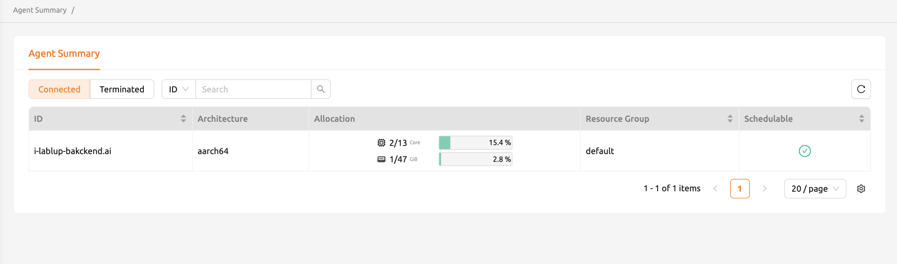

# Agent Summary

The **Agent Summary** page provides users with partial information about agent nodes when the server configuration allows it. On this page, you can view a list of agents including their endpoint addresses, CPU architecture, resource allocation status, and whether each agent is schedulable. This information is useful for checking resource availability before creating a session.

:::note
Depending on the server configuration, the Agent Summary feature may not be available. In that case, contact your system administrator.
:::
