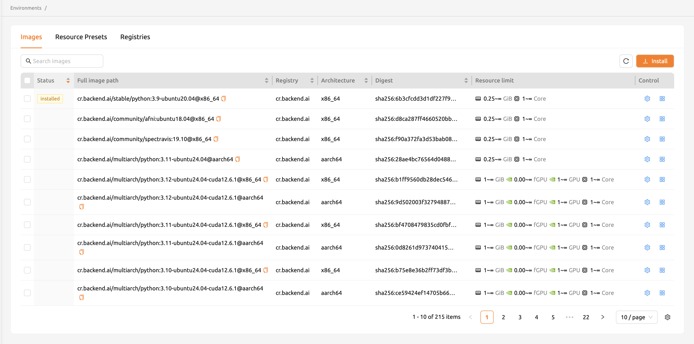
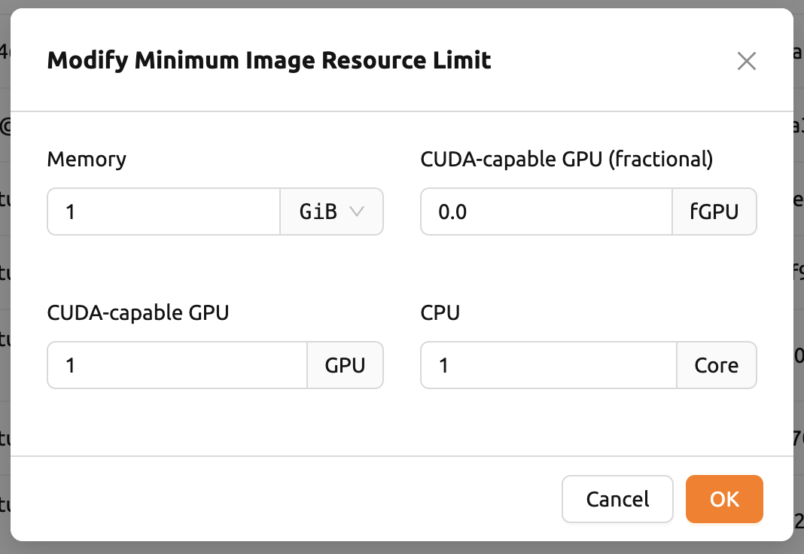
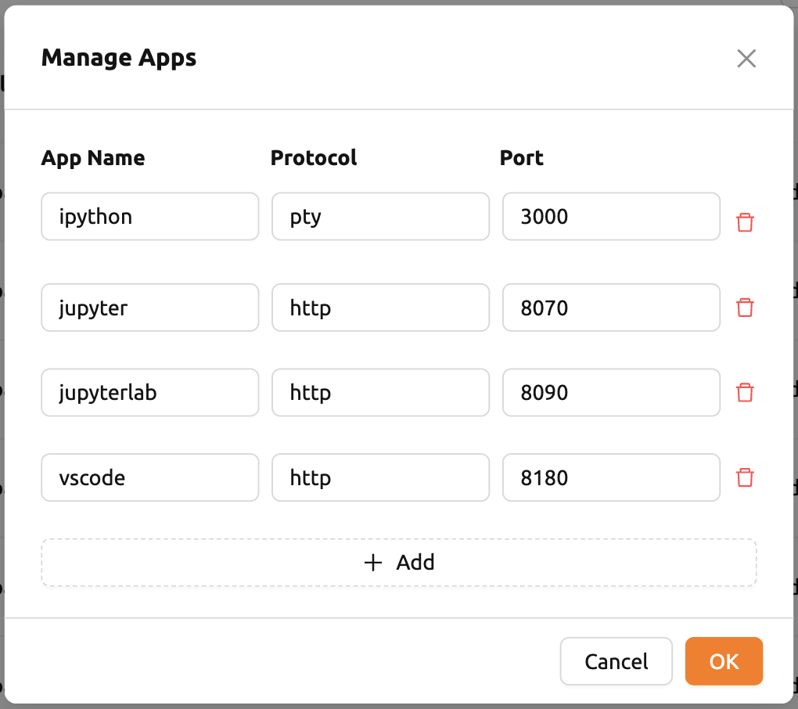
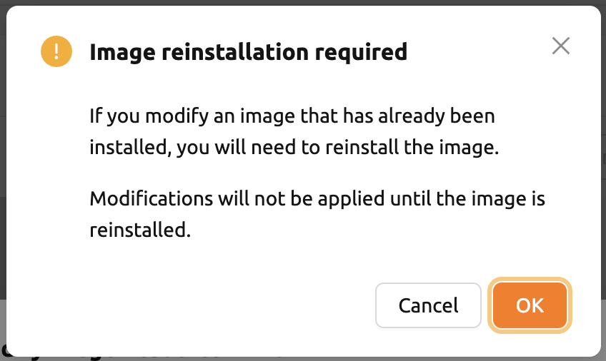
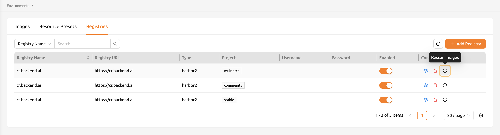
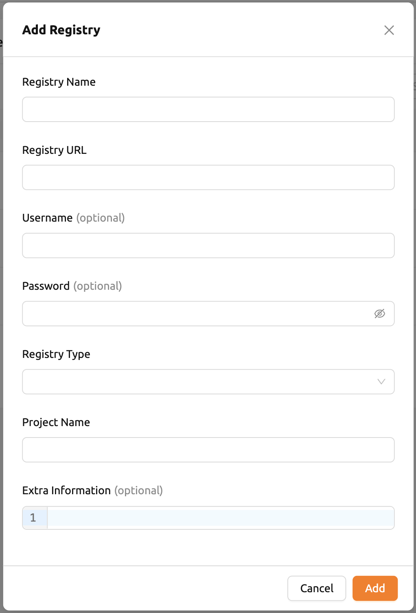
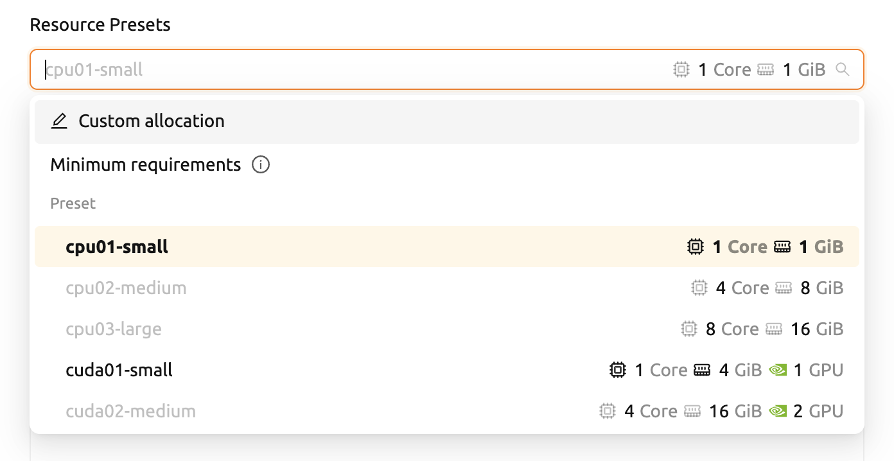
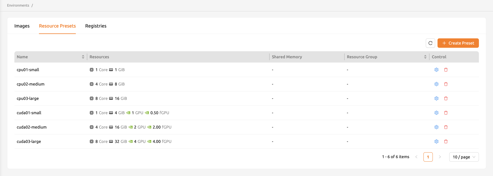
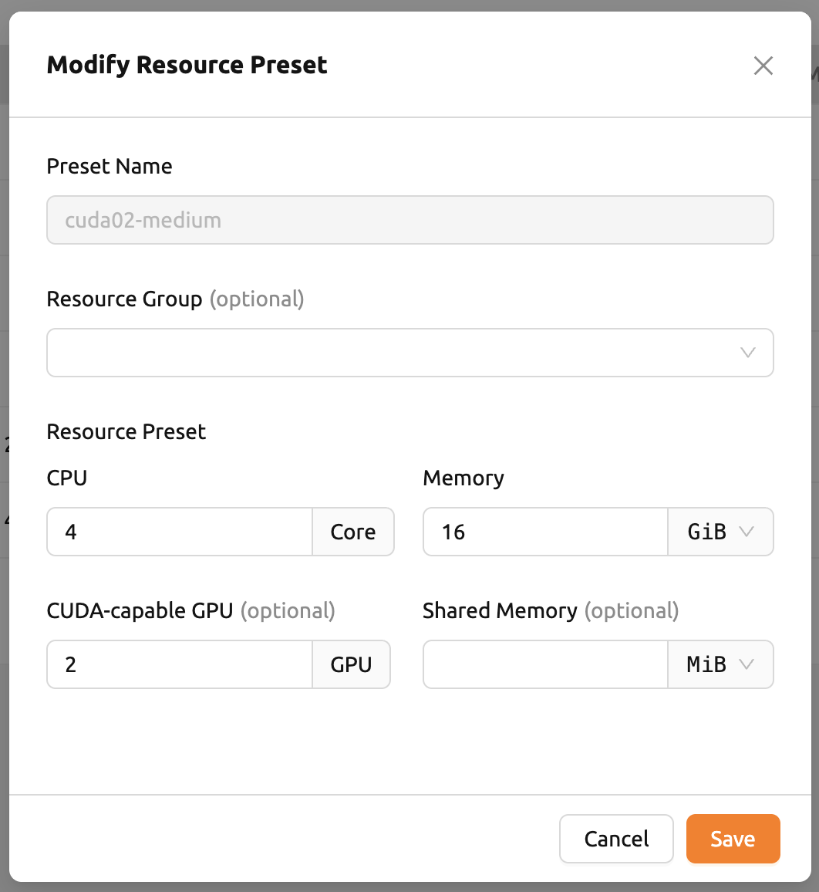
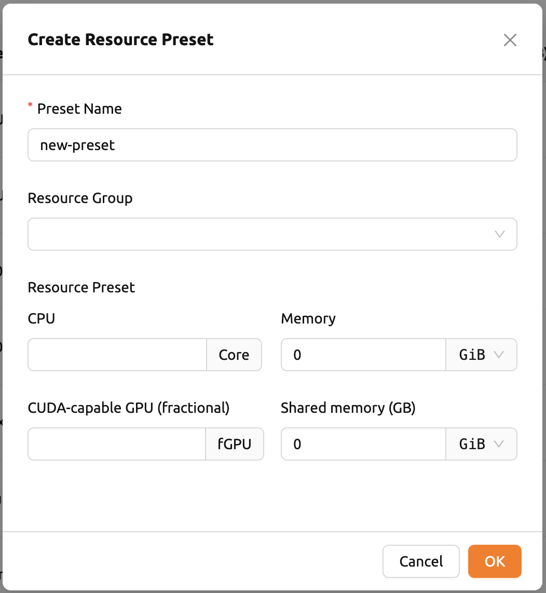

# Environments

The Environments page allows administrators to manage container images, docker registries, and resource presets used across Backend.AI. These settings control which images are available for compute sessions, how registries are connected, and what predefined resource configurations users can select.

## Manage Images

Administrators can manage images, which are used when creating a compute session, in the Images tab of the Environments page. This tab displays meta information for all images currently available in the Backend.AI server. You can check information such as registry, namespace, image name, base OS, digest, and minimum resources required for each image. Images that have been downloaded to one or more agent nodes display an `installed` tag in the Status column.

:::note
The feature to install images by selecting specific agents is currently under development.
:::

You can change the minimum resource requirements for each image by clicking the **Settings** (gear icon) in the Controls column. Each image has hardware and resource requirements for minimal operation. For example, GPU-only images require a minimum allocated GPU. The default minimum resource values are embedded in the image metadata. If you attempt to create a compute session with fewer resources than the minimum specified for an image, the request is automatically adjusted to the minimum resource requirements rather than being cancelled.

:::warning
Do not change the minimum resource requirements to an amount less than the predefined value. The minimum resource requirements included in the image metadata have been tested and verified. If you are not sure about the minimum resources needed, leave the defaults in place.
:::

You can also add or modify the supported apps for each image by clicking the **Apps** icon in the Controls column. The name of each app and its corresponding port number are displayed.

You can add custom applications by clicking the **+ Add** button. To delete an application, click the red trash can button on the right side of each row.

:::note
You need to reinstall the image after changing the managed app.

:::

## Manage Docker Registry

You can click on the Registries tab in the Environments page to see the information of the docker registries that are currently connected. `cr.backend.ai` is registered by default and is a registry provided by Harbor.

:::note
In an offline environment, the default registry is not accessible. Click the trash icon on the right to delete it.
:::

Click the refresh icon in Controls to update image metadata for Backend.AI from the connected registry. Image information that does not have Backend.AI labels among the images stored in the registry is not updated.

You can add your own private docker registry by clicking the **+ Add Registry** button. Note that the Registry Name and Registry URL address must be set identically. For the Registry URL, a scheme such as `http://` or `https://` must be explicitly included. Images stored in the registry must have a name prefixed with the Registry Name. Username and Password are optional and can be filled in if you have set separate authentication settings in the registry. In Extra Information, you can pass additional information needed for each registry type as a JSON string.

### GitLab Container Registry Configuration

When adding a GitLab container registry, you must specify the `api_endpoint` in the Extra Information field. This is required because GitLab uses separate endpoints for the container registry and the GitLab API.

For **GitLab.com (public instance)**:

- **Registry URL**: `https://registry.gitlab.com`
- **Extra Information**: `{"api_endpoint": "https://gitlab.com"}`

For **self-hosted (on-premise) GitLab**:

- **Registry URL**: Your GitLab registry URL (e.g., `https://registry.example.com`)
- **Extra Information**: `{"api_endpoint": "https://gitlab.example.com"}`

:::note
The `api_endpoint` should point to your GitLab instance URL, not the registry URL.
:::

Additional configuration notes:

- **Project path format**: When specifying the project, use the full path including namespace and project name (e.g., `namespace/project-name`). Both components are required for the registry to function correctly.
- **Access token permissions**: The access token used for the registry must have both `read_registry` and `read_api` scopes. The `read_api` scope is required for Backend.AI to query the GitLab API for image metadata during rescan operations.

You can also update the information of an existing registry, except the Registry Name.

After creating a registry and updating the image metadata, users still cannot use the images immediately. You must enable the registry by toggling the Enabled switch in the registry list to allow users to access images from the registry.

## Manage Resource Preset

The predefined resource presets are displayed in the Resource allocation panel when creating a compute session. Superadmins can manage these resource presets.

Go to the Resource Presets tab on the Environments page. You can check the list of currently defined resource presets.

You can set resources such as CPU, RAM, fGPU, and others by clicking the **Settings** (gear icon) in the Controls column. The Create or Modify Resource Preset dialog shows fields for the resources currently available. Depending on your server's settings, certain resources may not be visible. After setting the resources to the desired values, save your changes and verify that the corresponding preset appears when creating a compute session. If available resources are less than the amount defined in the preset, the corresponding preset will not be shown.

You can also create a new resource preset by clicking the **+ Create Presets** button at the top right of the Resource Presets tab. You cannot create a resource preset with a name that already exists, since the name is the key value for distinguishing each resource preset.

