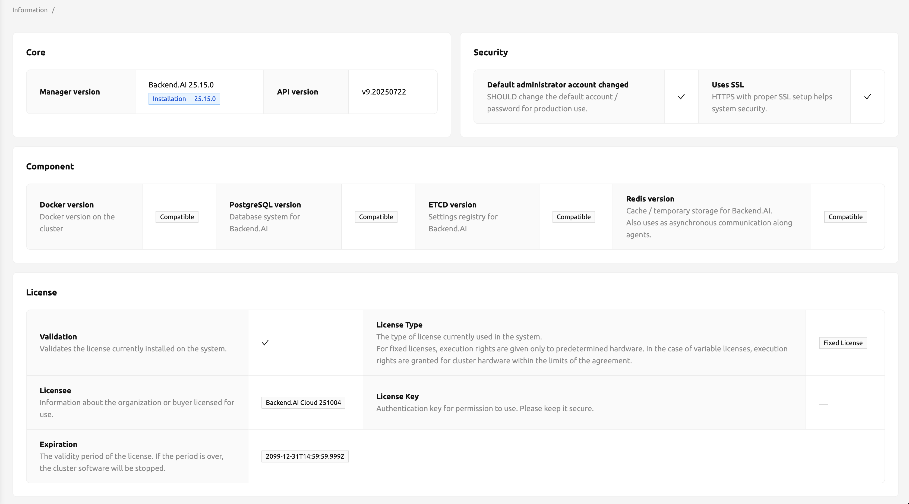

# Information

The Information page provides superadmins with a comprehensive overview of the Backend.AI cluster's system status, component versions, security configuration, and license details. You can access this page by selecting **Information** from the administration section in the sidebar menu.

<!-- TODO: Capture screenshot -->

## Core

The Core section displays version information about the Backend.AI manager.

- **Manager version**: The currently installed Backend.AI manager version and installation details.
- **API version**: The version of the Backend.AI API used by the current manager.

## Security

The Security section highlights important security-related status indicators for the cluster.

- **Default administrator account changed**: Indicates whether the default administrator account password has been changed from its initial value. For production deployments, you should always change the default credentials.
- **Uses SSL**: Indicates whether the Backend.AI endpoint is using HTTPS with proper SSL configuration. SSL is strongly recommended for production environments.

:::warning
If either security indicator shows a warning, take immediate action to secure your deployment. Change the default administrator password and configure SSL to protect your cluster.
:::

## Component

The Component section shows the compatibility status of the infrastructure components that Backend.AI depends on.

- **Docker version**: Compatibility status of the Docker installation on the cluster.
- **PostgreSQL version**: Compatibility status of the database system used by Backend.AI.
- **ETCD version**: Compatibility status of the distributed key-value store used as the settings registry.
- **Redis version**: Compatibility status of the cache and temporary storage system, also used for asynchronous communication between agents.

Each component displays a **Compatible** tag when the installed version meets Backend.AI's requirements.

## License

The License section displays the details of the enterprise license currently installed on the system. For open-source installations, this section may not be available.

- **Validation**: Indicates whether the currently installed license is valid.
- **License Type**: The type of license in use.
   * **Fixed License**: Execution rights are granted only to predetermined hardware.
   * **Dynamic License**: Execution rights are granted for cluster hardware within the limits of the agreement.
- **Licensee**: Information about the organization or entity licensed to use the software.
- **License Key**: The authentication key for the license. Keep this value secure.
- **Expiration**: The validity period of the license. When the license expires, the cluster software will stop functioning.

:::danger
If the license expiration date is approaching, contact your Backend.AI vendor to renew the license before the cluster is affected.
:::

