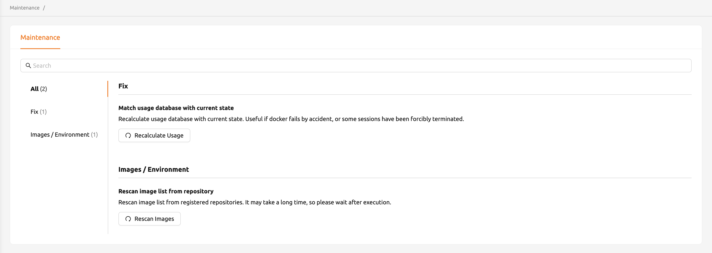

# Maintenance

The Maintenance page provides superadmins with tools to perform system maintenance tasks on the Backend.AI cluster. You can access this page by selecting **Maintenance** from the administration section in the sidebar menu.

<!-- TODO: Capture screenshot -->

The page is organized into functional groups, each containing specific maintenance actions. You can use the search bar at the top to filter actions by name.

## Fix

The Fix section contains tools for correcting inconsistencies in the system's internal state.

### Match Usage Database with Current State

Over time, the usage database may become out of sync with the actual state of sessions and resources. This can happen when Docker containers fail unexpectedly, or when sessions are forcibly terminated outside of Backend.AI's normal workflow.

Click the **Recalculate Usage** button to trigger a recalculation of the usage database. While the operation is running, a notification displays the progress. Once complete, you receive a confirmation message.

:::note
This operation may take some time depending on the size of the cluster. It is safe to navigate away from the page while the recalculation is in progress.
:::

## Images / Environment

The Images / Environment section contains tools for managing the container image registry.

### Rescan Image List from Repository

When new container images are added to the configured image registries, you need to rescan the image list so that Backend.AI is aware of the newly available images.

Click the **Rescan Images** button to initiate a rescan of all configured image registries. A background task notification tracks the progress of the scan. Depending on the number of registries and images, this operation may take a considerable amount of time.

:::warning
The image rescan process can take a long time if you have many registries or a large number of images. Allow the operation to complete before performing any image-related tasks.
:::

