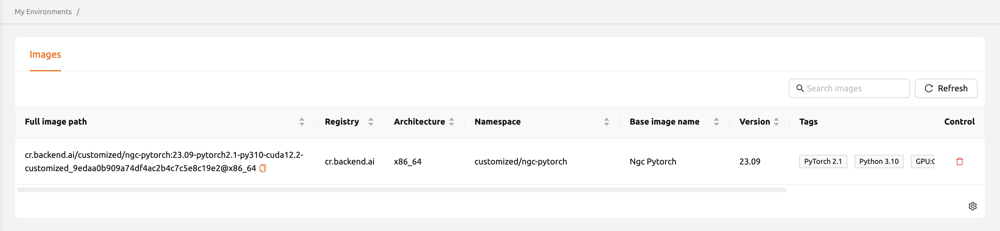
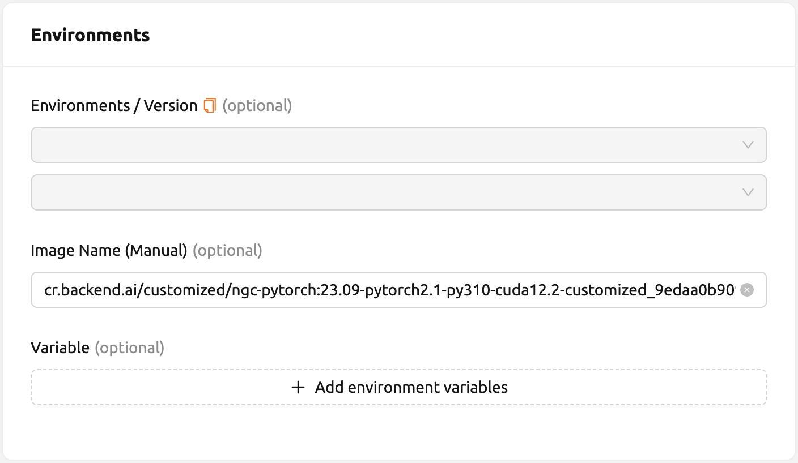
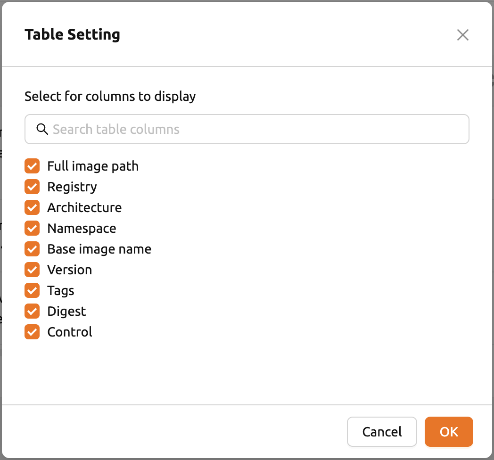

# My Environments

The **My Environments** page allows users to manage customized images created through session commits. This page displays a list of images that you have created by converting running sessions into reusable images.

## Images Tab

On the **Images** tab, you can view and manage customized images used in creating compute sessions. The tab displays metadata information including the registry, architecture, namespace, language, version, base, constraint, digest, and other details for each image.

### Deleting a Customized Image

To delete an image, click the red trash button in the **Control** column. After deletion, you will not be able to create new sessions using that image.

### Copying and Using an Image

You can copy a customized image name for manual use:

1. Click the **Copy** button in the Control column.
2. Navigate to the **Sessions** page and create a new session.
3. Paste the copied image name into the manual image input field.

### Customizing Table Columns

To customize which columns are visible, click the gear icon at the bottom right of the table and select the columns you want to display.

