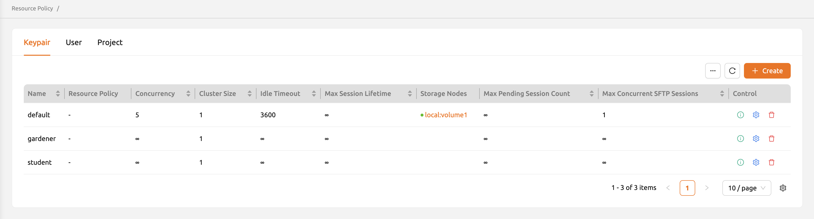
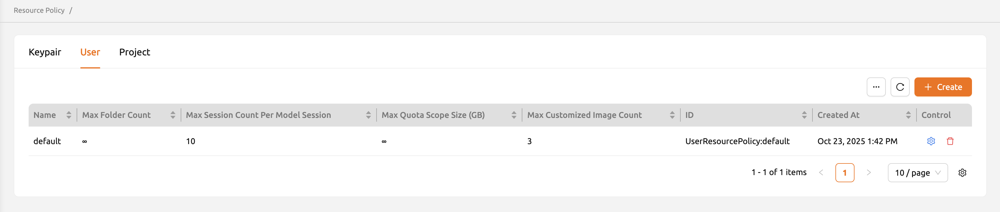
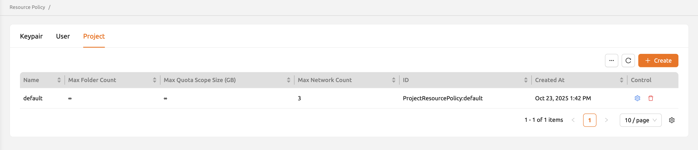

# Resource Policies

The Resource Policies page allows administrators to define and manage policies that control how compute and storage resources are allocated to keypairs, users, and projects. Resource policies set upper limits on resource usage, ensuring that no single entity can consume more than its fair share of cluster capacity.

You can access this page by selecting **Resource Policies** from the administration section in the sidebar menu.

<!-- TODO: Capture screenshot of the Resource Policies page -->

:::note
The Resource Policies page is available only to users with admin or superadmin roles.
:::

## Policy Types

The page is organized into three tabs, each managing a different type of resource policy. Select the appropriate tab to view and manage policies for that category.

### Keypair Policies

Keypair policies are applied per API keypair. Since each user typically has one active keypair, these policies effectively control the resource limits for individual API access credentials.

<!-- TODO: Capture screenshot of the Keypair Policies tab -->

Keypair policies include the following configurable fields:

- **Policy Name**: A unique name identifying the policy.
- **CPU**: The maximum number of CPU cores that can be allocated per session.
- **Memory**: The maximum amount of memory that can be allocated per session.
- **GPU**: The maximum number of GPU devices (or fractional GPU units) that can be allocated per session.
- **Max Concurrent Sessions**: The maximum number of sessions that can run simultaneously under this keypair.
- **Max Containers per Session**: The maximum number of containers allowed in a single multi-container session.
- **Max vFolder Count**: The maximum number of storage folders that can be created.
- **Max vFolder Size**: The maximum storage quota per storage folder.
- **Idle Timeout**: The duration after which an idle session is automatically terminated.

### User Policies

User policies are applied per user account and take effect regardless of which keypair the user is using. These policies provide account-level resource governance.

<!-- TODO: Capture screenshot of the User Policies tab -->

User policies include settings such as:

- **Policy Name**: A unique name identifying the policy.
- **Max vFolder Count**: The maximum number of storage folders the user can create.
- **Max vFolder Size**: The maximum size limit for each storage folder.
- **Max Quota Scope Size**: The maximum aggregate storage quota across all folders.

:::info
User policies were introduced in Backend.AI version 24.09. If your cluster is running an earlier version, only keypair policies may be available.
:::

### Project Policies

Project policies are applied at the project level, governing resource limits for all members working within a project. These policies help administrators control resource consumption at the team or department level.

<!-- TODO: Capture screenshot of the Project Policies tab -->

Project policies include settings such as:

- **Policy Name**: A unique name identifying the policy.
- **Max vFolder Count**: The maximum number of project-level storage folders.
- **Max vFolder Size**: The maximum size limit for each project storage folder.
- **Max Quota Scope Size**: The maximum aggregate storage quota for the project.

## Create a Resource Policy

To create a new resource policy:

1. Select the appropriate tab (Keypair Policies, User Policies, or Project Policies).
2. Click the **+ Create** button at the top of the policy list.
3. Fill in the policy fields in the creation dialog.
4. Click **Create** to save the new policy.

<!-- TODO: Capture screenshot of the resource policy creation dialog -->

:::warning
You cannot create a policy with the same name as an existing policy. Each policy name must be unique within its type.
:::

## Edit a Resource Policy

To modify an existing resource policy:

1. Locate the policy in the list.
2. Click the **Settings** (gear icon) button in the **Controls** column.
3. Update the desired fields in the edit dialog.
4. Click **Save** to apply the changes.

<!-- TODO: Capture screenshot of the resource policy edit dialog -->

:::warning
Changing a resource policy affects all keypairs, users, or projects currently assigned to that policy. Verify the scope of impact before making changes.
:::

## Delete a Resource Policy

To delete a resource policy:

1. Locate the policy in the list.
2. Click the **Delete** button in the **Controls** column.
3. Confirm the deletion in the confirmation dialog.

:::danger
You cannot delete a policy that is currently assigned to any keypair, user, or project. You must first reassign or remove all associations before deleting the policy.
:::

## Assigning Policies

After creating resource policies, you can assign them to specific entities:

- **Keypair policies**: Assign via the keypair settings on the [User Management](#user-management) page under the Credentials tab.
- **User policies**: Assign via the user settings on the [User Management](#user-management) page.
- **Project policies**: Assign via the project settings on the [Project Management](#project-management) page.

## Best Practices

- **Create tiered policies**: Define multiple policies with different resource limits (e.g., "basic", "standard", "premium") to accommodate varying user needs.
- **Set reasonable defaults**: Assign a sensible default policy to new keypairs and users to prevent unrestricted resource consumption.
- **Monitor usage**: Periodically review resource usage against policy limits to determine whether adjustments are needed.
- **Coordinate with quotas**: Resource policies work alongside storage quota settings on the [Resources](#resources) page. Ensure that policy limits and quota settings are consistent.
