# Resources

The Resources page allows superadmins to manage agent nodes, resource groups, and storage systems. This page provides tools for monitoring compute infrastructure, organizing agents into groups, and configuring storage quotas.

## Manage Agent Nodes

Superadmins can view the list of agent nodes currently connected to Backend.AI by visiting the Resources page. You can check each agent node's IP, connection time, and actual resources currently in use.

### Query Agent Nodes

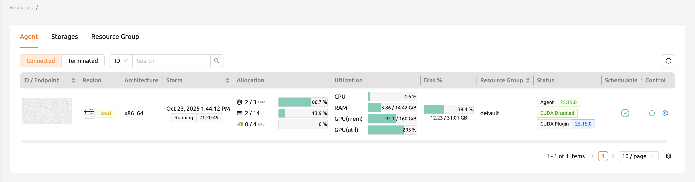

You can see detailed resource usage for an agent node by clicking the note icon in the Controls column.

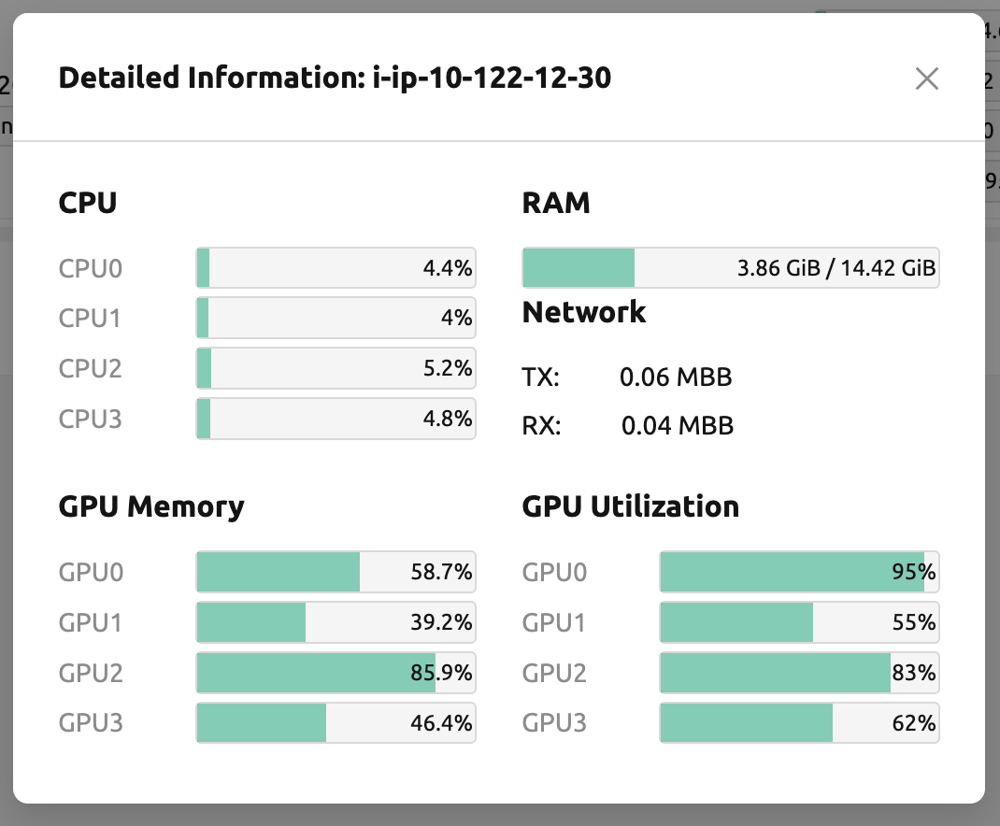

On the Terminated tab, you can check the information of agents that were previously connected and then terminated or disconnected. This can be used as a reference for node management. If the list is empty, no disconnection or termination has occurred.

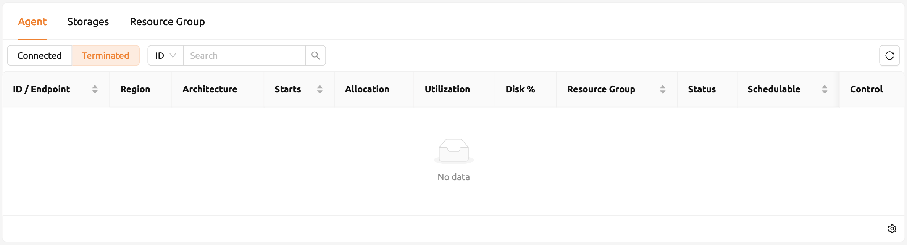

### Set Schedulable Status of Agent Nodes

You may want to prevent new compute sessions from being scheduled to an agent without stopping it. In this case, you can disable the Schedulable status of the agent. This allows you to block the creation of new sessions while preserving existing sessions on the agent.

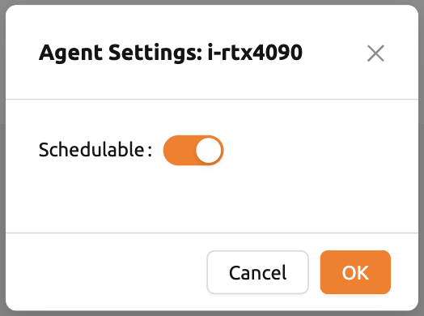

## Manage Resource Group

Agents can be grouped into units called resource groups. For example, if you have 3 agents with V100 GPUs and 2 agents with P100 GPUs, you can group the three V100 agents into one resource group and the remaining two P100 agents into another resource group, exposing two types of GPUs to users separately.

Adding a specific agent to a specific resource group is not currently handled in the WebUI. You can do this by editing the agent config file from the installation location and restarting the agent daemon. Management of resource groups is available in the Resource Group tab of the Resources page.

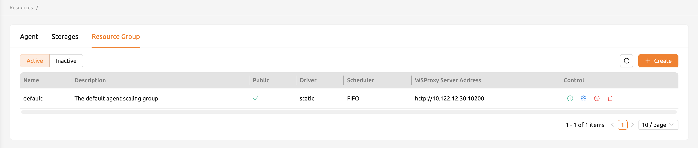

You can edit a resource group by clicking the **Settings** (gear icon) in the Controls column. In the Select scheduler field, you can choose the scheduling method for creating a compute session. Currently, there are three types: `FIFO`, `LIFO`, and `DRF`. `FIFO` and `LIFO` are scheduling methods that create the first- or last-enqueued compute session in the job queue. `DRF` stands for Dominant Resource Fairness, and it aims to provide resources as fairly as possible for each user. You can deactivate a resource group by turning off Active Status.

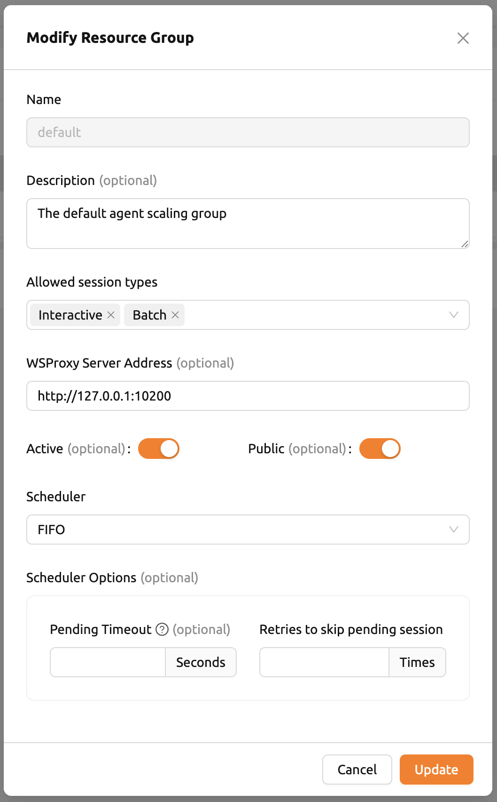

**WSProxy Server Address** sets the WSProxy address for the resource group's agents to use. If you set a URL in this field, WSProxy will relay app traffic (such as Jupyter) directly to the compute session via the agent, bypassing the Manager (v2 API). By enabling the v2 API, you can lower the Manager's burden when using app services, achieving better efficiency and scalability. If a direct connection from WSProxy to the agent node is not available, leave this field blank to fall back to the v1 API, which relays traffic through the Manager.

The resource group has further Scheduler Options:

- **Allowed session types**: You can allow certain types of sessions. You should allow at least one session type. The options are Interactive, Batch, and Inference.
- **Pending timeout**: A compute session will be canceled if it stays in `PENDING` status longer than the pending timeout. Set this value to zero (0) if you do not want to apply the pending timeout feature.
- **Retries to skip pending session**: The number of retries the scheduler attempts before skipping a `PENDING` session. This prevents one `PENDING` session from blocking the scheduling of subsequent sessions indefinitely (Head-of-line blocking). If no value is specified, the global value in Etcd is used (default: three times).

You can create a new resource group by clicking the **+ Create** button. You cannot create a resource group with a name that already exists, since the name is the key value.

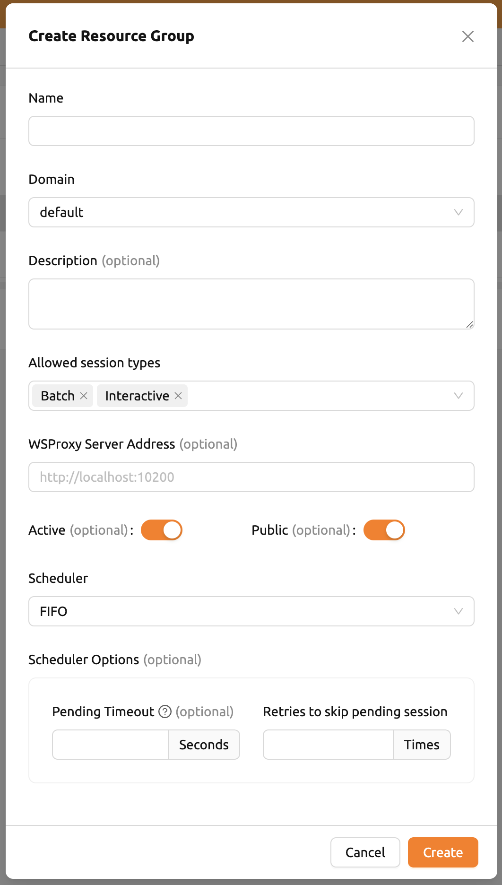

## Storages

On the Storages tab, you can see what kind of mount volumes (usually NFS) exist. From version 23.03, Backend.AI provides per-user and per-project quota settings on storage systems that support quota management. This feature allows administrators to manage and monitor the exact amount of storage usage for each user and project-based folder.

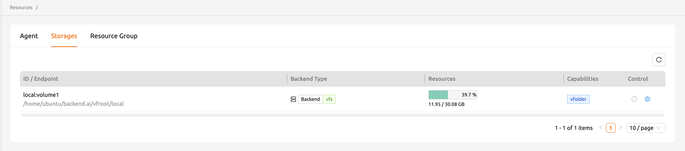

To set a quota, access the Storages tab on the Resources page and click the **Settings** (gear icon) in the Controls column.

:::note
Quota settings are only available on storage systems that support quota configuration (e.g., XFS, CephFS, NetApp, Purestorage). Although you can see storage usage regardless of the storage type, you cannot configure quotas on systems that do not support quota management internally.

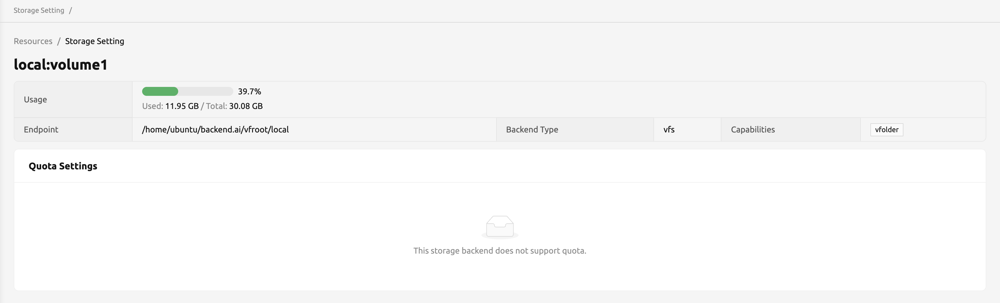
:::

### Quota Setting Panel

The Quota Setting page has two panels.

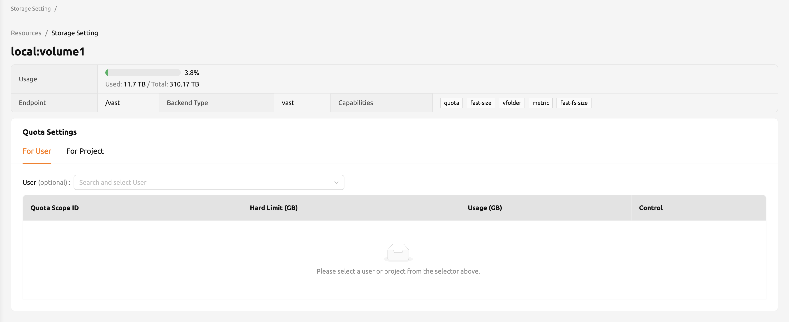

- **Overview panel**:
   * **Usage**: Shows the actual usage amount of the selected storage.
   * **Endpoint**: Represents the mount point of the selected storage.
   * **Backend Type**: The type of storage.
   * **Capabilities**: The supported features of the selected storage.
- **Quota Settings**:
   * **For User**: Configure per-user quota settings here.
   * **For Project**: Configure per-project quota (project-folder) settings here.
   * **ID**: Corresponds to the user or project ID.
   * **Hard Limit (GB)**: The currently set hard limit quota for the selected quota.
   * **Control**: Provides options for editing the hard limit or deleting the quota setting.

### Set User Quota

In Backend.AI, there are two types of storage folders: user-created and admin-created (project). To check and configure per-user quota settings, make sure the active tab of the Quota Settings panel is **For User**. Then select the user you want to check. You can see the quota ID that corresponds to the user's ID and any existing configuration in the table.

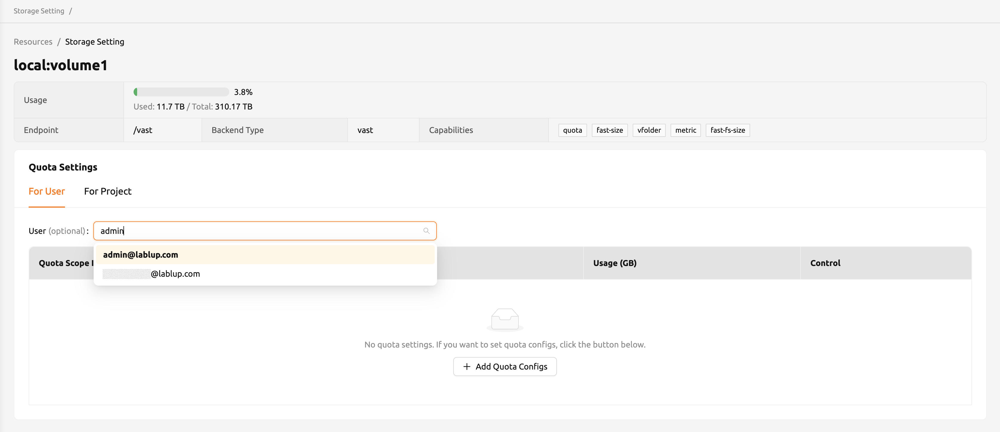

To edit the quota, click the **Edit** button in the Controls column. A dialog appears where you can configure the quota setting. After entering the desired amount, click **OK** to apply the changes.

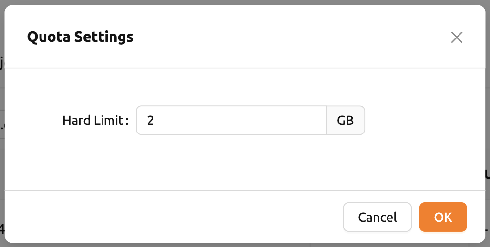

### Set Project Quota

Setting a quota on a project folder is similar to setting a user quota. The difference is that setting the project quota requires one additional step: selecting the domain that the project belongs to. After selecting the domain, select the project.

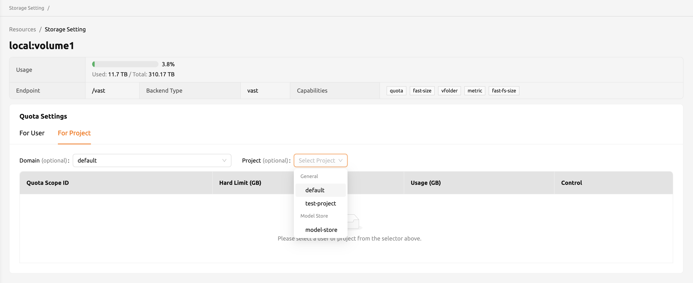

### Unset Quota

You can also unset a quota. After removing the quota setting, the quota will automatically follow the user or project default quota. To unset, click the **Unset** button in the Controls column. A confirmation message appears. Click **OK** to delete the current quota setting and reset it to the corresponding default quota.

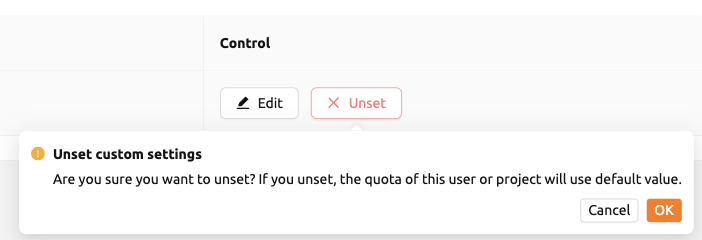

:::note
If no per-user or per-project quota is configured, the corresponding values in the user or project resource policy are used as defaults. For example, if no hard limit is set, the `max_vfolder_size` value in the resource policy is used.
:::
