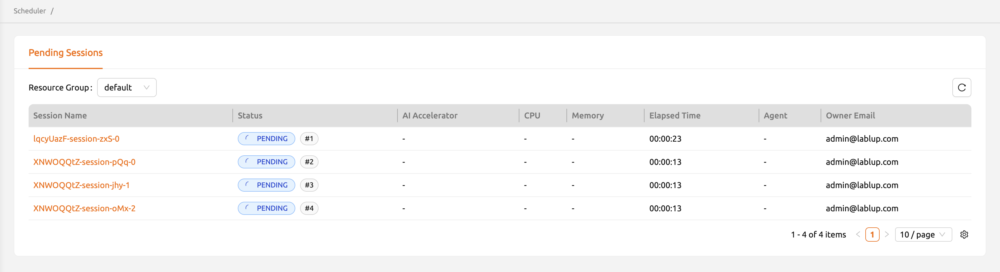

# Scheduler

The Scheduler page provides administrators with a dedicated interface for configuring fair-share scheduling weights across multiple organizational levels. Fair-share scheduling ensures that compute resources are distributed proportionally among resource groups, domains, projects, and users based on their assigned weights.

You can access this page by selecting **Scheduler** from the administration section in the sidebar menu.

<!-- TODO: Capture screenshot of the Scheduler page overview -->

:::note
The Scheduler page is available only when the Backend.AI cluster supports the fair-share scheduling feature. If this feature is not enabled, the menu item may not appear. Contact your system administrator to verify feature availability.
:::

## Fair-Share Scheduling Overview

Fair-share scheduling is a resource allocation strategy that distributes compute resources based on predefined weights. Instead of a simple first-come, first-served approach, fair-share scheduling considers the relative priority of different organizational units and adjusts scheduling order accordingly.

This approach prevents any single user or project from monopolizing cluster resources while ensuring that higher-priority workloads receive a proportionally larger share of compute capacity.

:::info
For basic scheduler type configuration (FIFO, LIFO, DRF), refer to the resource group settings on the [Resources](#resources) page or the global scheduler defaults on the [Configurations](#configurations) page. The Scheduler page focuses specifically on fair-share weight distribution.
:::

## Hierarchical Weight Configuration

The Scheduler page organizes fair-share weights into four hierarchical levels. You can navigate between these levels using the step-by-step wizard interface at the top of the page.

<!-- TODO: Capture screenshot of the step navigation -->

### Step 1: Resource Groups

The first level defines weights for each resource group. Resource groups with higher weights receive a proportionally larger share of scheduling priority.

- **Resource Group Name**: The name of the resource group.
- **Weight**: The relative scheduling weight assigned to the resource group.

<!-- TODO: Capture screenshot of the resource group weight configuration -->

### Step 2: Domains

The second level defines weights for domains within the system. Domains with higher weights have their sessions prioritized over domains with lower weights.

- **Domain Name**: The name of the domain.
- **Weight**: The relative scheduling weight assigned to the domain.

### Step 3: Projects

The third level defines weights for individual projects. This allows fine-grained control over scheduling priority at the project level within a domain.

- **Project Name**: The name of the project.
- **Weight**: The relative scheduling weight assigned to the project.

### Step 4: Users

The fourth and final level defines weights for individual users. This is the most granular level of scheduling control.

- **User ID**: The email or identifier of the user.
- **Weight**: The relative scheduling weight assigned to the user.

## Adjusting Weights

To modify a scheduling weight at any level:

1. Navigate to the appropriate step using the wizard navigation.
2. Locate the entity (resource group, domain, project, or user) you want to adjust.
3. Click the **Edit** button or the weight value to open the weight setting modal.
4. Enter the new weight value in the modal dialog.
5. Click **Save** to apply the change.

<!-- TODO: Capture screenshot of the weight setting modal -->

:::warning
Weight values are relative, not absolute. A weight of 2 does not mean twice the resources; it means twice the scheduling priority compared to an entity with a weight of 1. The actual resource allocation depends on resource availability and the weights of all competing entities at each level.
:::

## Usage Bucket Visualization

The Scheduler page includes a usage bucket visualization that shows how resources are being consumed relative to the assigned weights. This helps you identify imbalances between assigned weights and actual resource usage.

<!-- TODO: Capture screenshot of the usage bucket visualization -->

## Property Filtering

You can filter the entities displayed at each level using the property filter. This is useful when managing large numbers of resource groups, domains, projects, or users. Type in the filter box to narrow the list to matching entries.

## Best Practices

- **Start with balanced weights**: Assign equal weights initially and adjust based on observed usage patterns and organizational priorities.
- **Review periodically**: Resource demands change over time. Periodically review and adjust weights to reflect current priorities.
- **Document weight rationale**: Keep a record of why certain entities have higher weights to maintain transparency and facilitate future adjustments.
- **Monitor the pending queue**: Use the [Admin Sessions](#admin-sessions) page to observe how weight changes affect scheduling behavior and pending session counts.
