# User Management

Logging in with an admin account reveals an extra Administration menu on the bottom left of the sidebar. The **Users** page lists all user information registered in Backend.AI. Superadmin role users can see all users' information, create and deactivate users.

You can filter User ID (email), Name (username), Role, and Description by typing text in the search box on each column header.

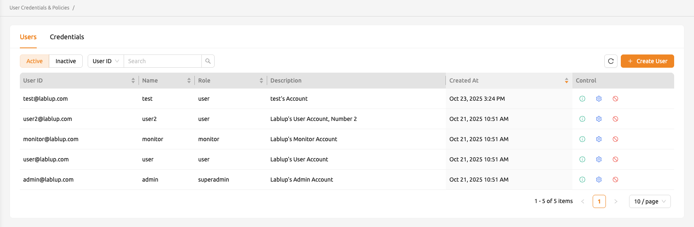

## Create and Update Users

You can create a user by clicking the **+ Create User** button. Note that the password must be longer than or equal to 8 characters, and at least 1 alphabet, 1 special character, and 1 number must be included. The maximum length allowed for E-Mail and Username is 64 characters.

If a user with the same email or username already exists, you cannot create the user account. Please try another email and username.

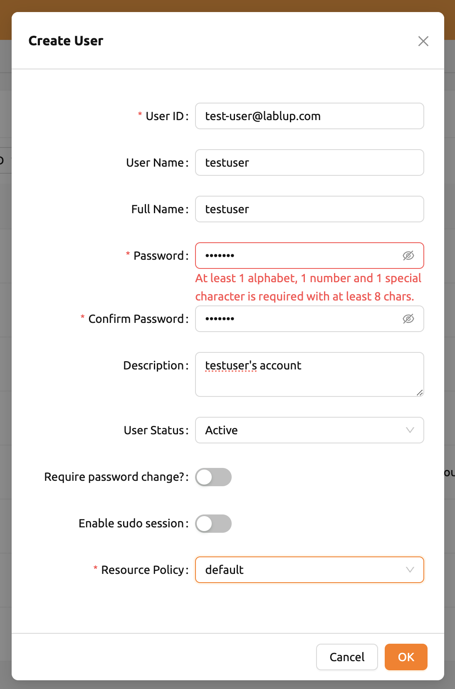

After creation, verify that the user appears in the list.

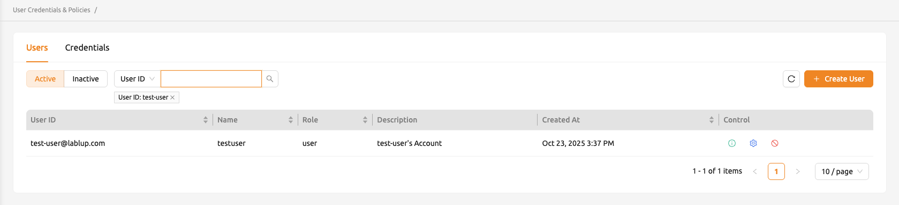

Click the green button in the **Controls** panel for more detailed user information. You can also check the domain and project information where the user belongs.

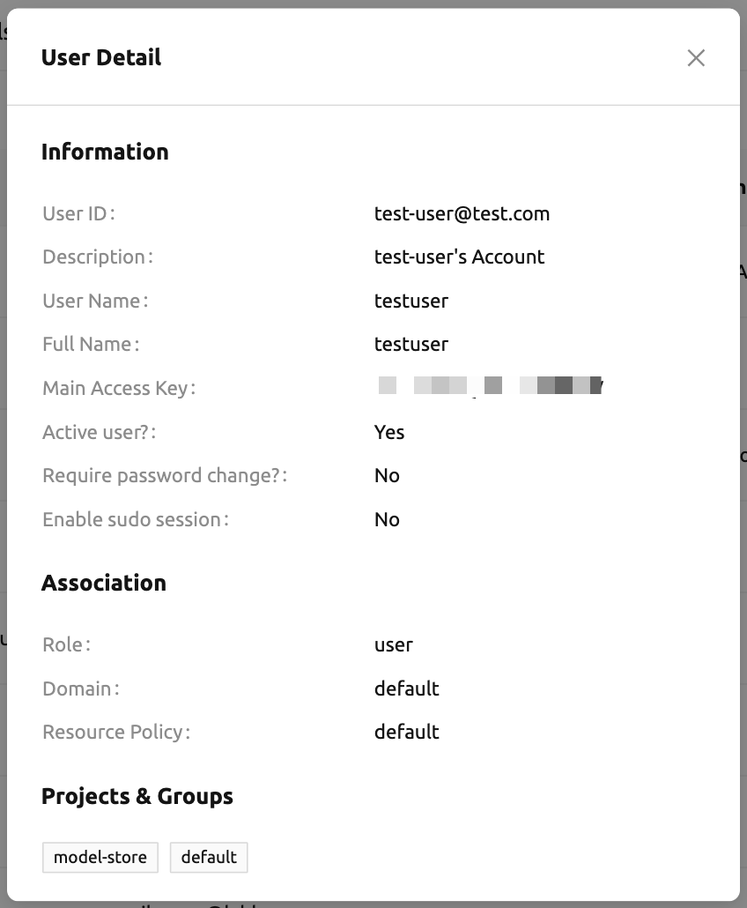

Click the **Setting (Gear)** icon in the **Controls** panel to update the information of an existing user. You can change the user's name, password, activation state, and other settings. The User ID cannot be changed.

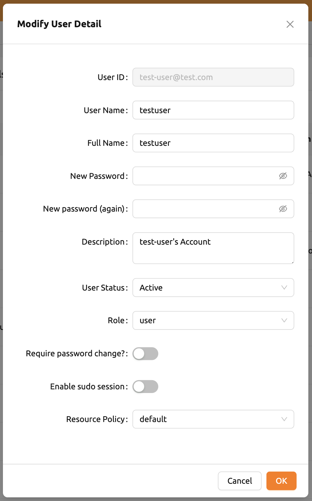

Each of the items at the bottom of the dialog has the following functions:

- **User Status**: Indicates the user's status. Inactive users cannot log in. "Before Verification" indicates that a user needs an additional step to activate the account, such as email verification or approval from an admin.
   * Inactive users are listed separately in the **Inactive** tab.
- **Require password change?**: If the admin has chosen random passwords while creating users in batches, this field can be set to ON to indicate that a password change is required. Users will see a top bar notification to update their password.
- **Enable sudo session**: Allow the user to use `sudo` in compute sessions. This is useful when the user needs to install packages or run commands that require root privileges.
   * It is not recommended to enable this option for all users, as it may cause security issues.
- **2FA Enabled**: A flag indicating whether the user uses two-factor authentication. When enabled, users are additionally required to enter an OTP code when logging in. Administrators can only disable two-factor authentication for other users.
- **Resource Policy**: From Backend.AI version 24.09, you can select the user resource policy to which the user belongs.

:::warning
Enabling sudo sessions for all users may introduce security risks. Only enable this option for users who specifically require root privileges.
:::

## Inactivate User Account

Deleting user accounts is not allowed even for superadmins, in order to track usage statistics per user, metric retention, and prevent accidental account loss. Instead, admins can inactivate user accounts to prevent users from logging in.

To deactivate a user:

1. Click the delete icon in the **Controls** panel.
2. A popover asking for confirmation appears.
3. Click the **Deactivate** button.

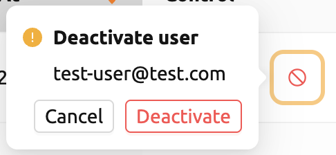

To re-activate users, go to the **Users - Inactive** tab and set the status of the target user to `Active`.

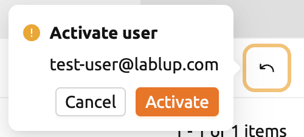

:::note
Deactivating or reactivating a user does not change the user's credentials, since a user account can have multiple keypairs, which makes it difficult to decide which credential should be reactivated.
:::

## Manage User's Keypairs

Each user account usually has one or more keypairs. A keypair is used for API authentication to the Backend.AI server after the user logs in. Login requires authentication via user email and password, but every request the user sends to the server is authenticated based on the keypair.

A user can have multiple keypairs, but to reduce the management burden, currently only one of the user's keypairs is used to send requests. When you create a new user, a keypair is automatically created, so you do not need to create and assign a keypair manually in most cases.

Keypairs can be listed on the **Credentials** tab of the Users page. Active keypairs are shown immediately, and to see inactive keypairs, click the **Inactive** panel at the bottom.

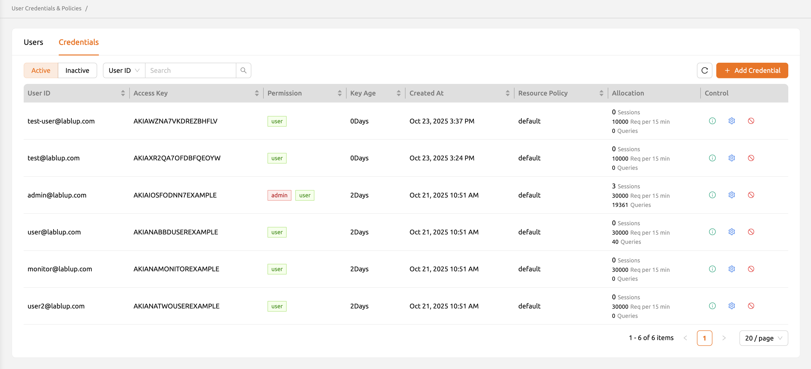

You can use the buttons in the **Controls** panel to view or update keypair details. Click the green info icon button to see specific details of the keypair. If necessary, you can copy the secret key by clicking the copy button.

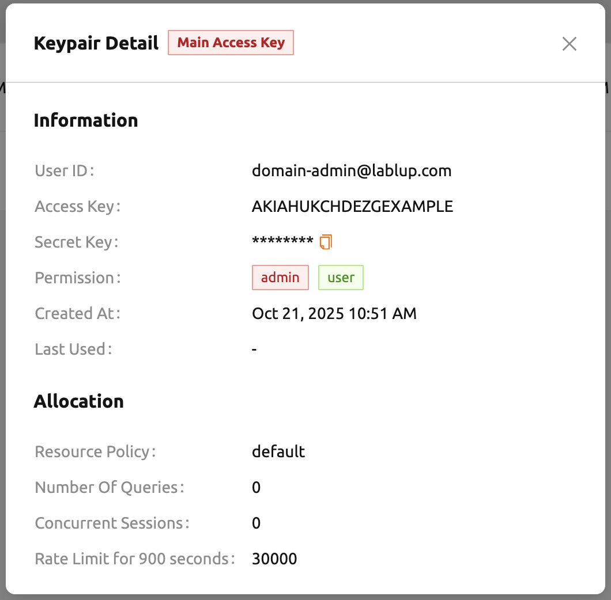

You can modify the resource policy and rate limit of the keypair by clicking the blue **Setting (Gear)** button.

:::warning
If the Rate Limit value is set too low, API operations such as login may be blocked.
:::

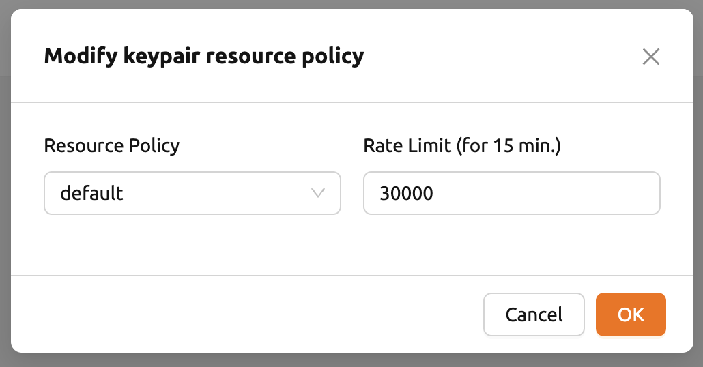

You can deactivate or reactivate a keypair by clicking the red **Deactivate** button or the black **Activate** button in the control column. Unlike the User tab, the Inactive tab allows permanent deletion of keypairs. However, you cannot permanently delete a keypair if it is currently being used as a user's main access key.

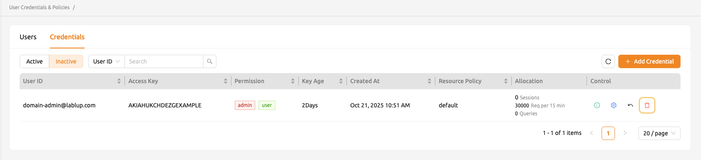

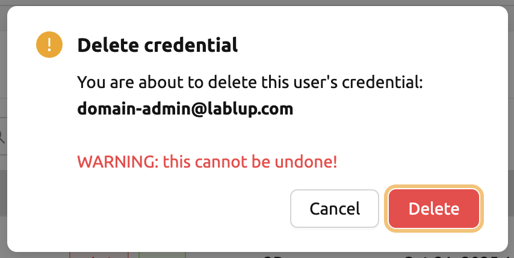

If you accidentally deleted a keypair, you can re-create a keypair for the user by clicking the **+ ADD CREDENTIAL** button at the upper right corner.

The **Rate Limit** field specifies the maximum number of requests that can be sent to the Backend.AI server in 15 minutes. For example, if set to 1000 and the keypair sends more than 1000 API requests in 15 minutes, the server throws an error and does not accept the request. It is recommended to use the default value and increase it when the API request frequency rises according to the user's usage pattern.

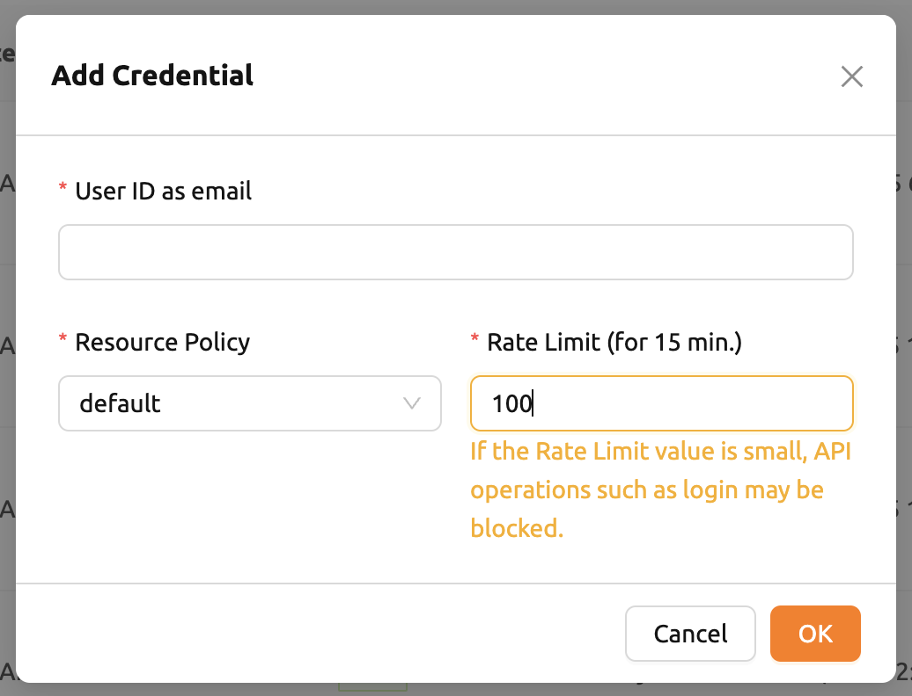
