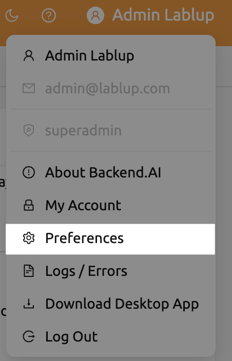
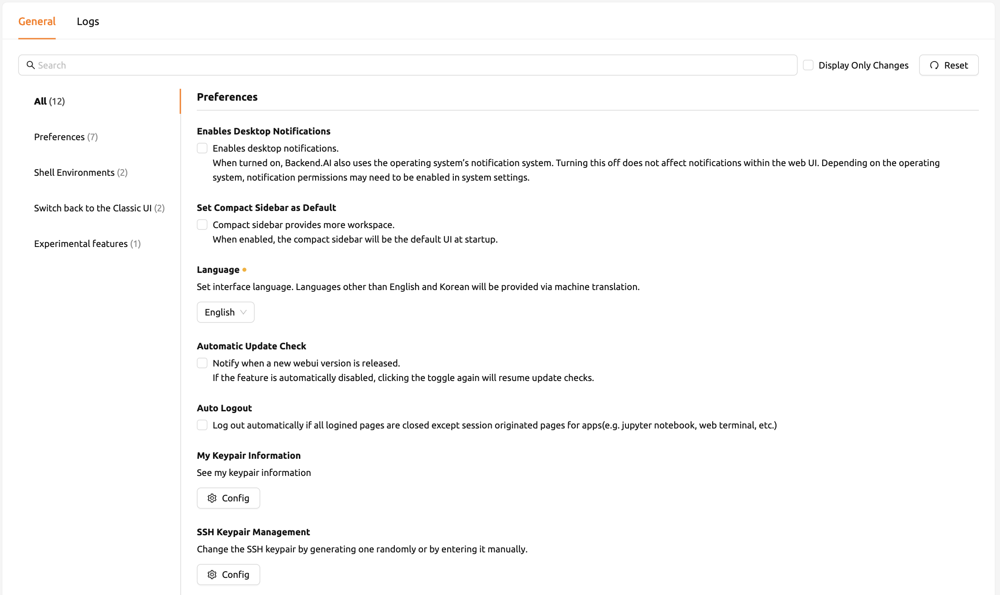
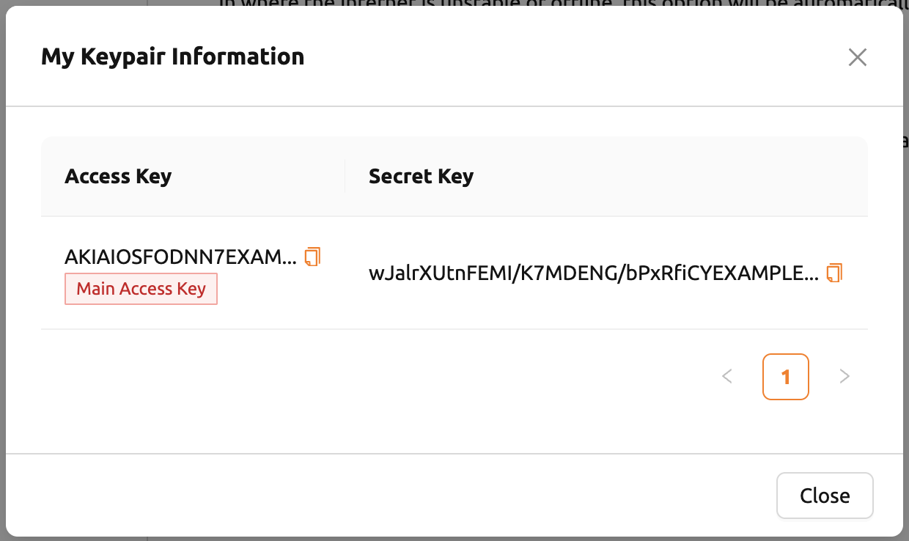
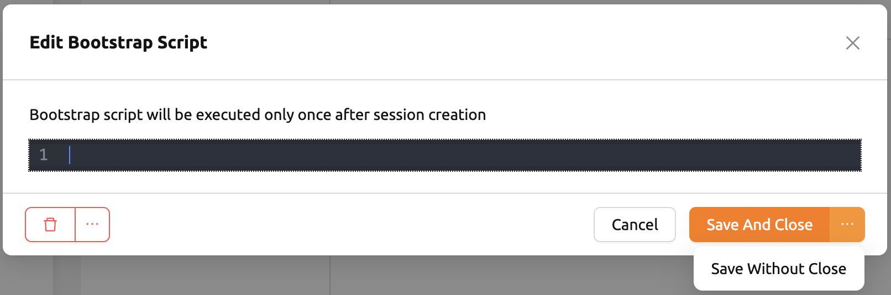
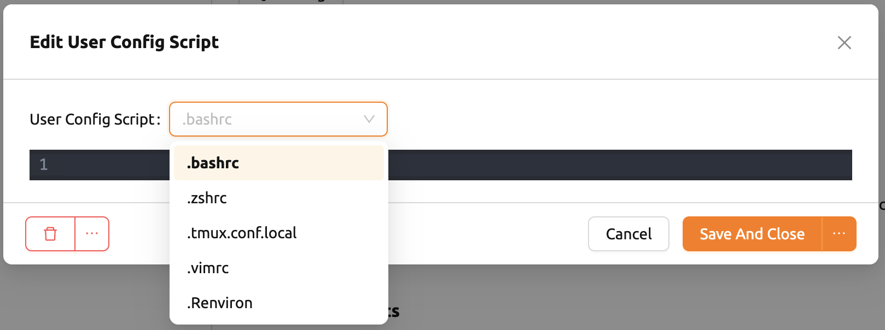
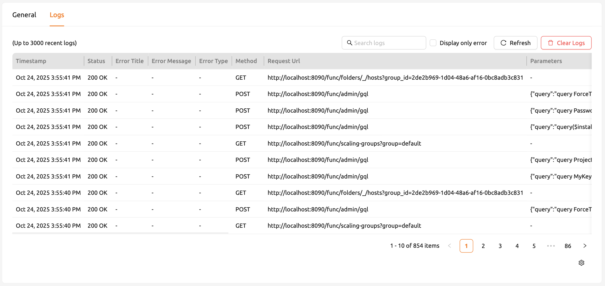
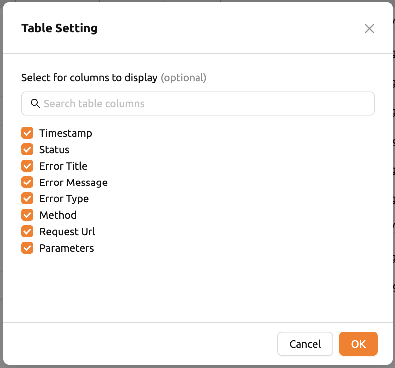

# User Settings

The User Settings page is accessed by selecting the **Preferences** menu that appears after clicking the person icon at the top right. Users can change their preferred settings including language, SSH keypair management, bootstrap scripts, and user config scripts.

## General Tab

The General tab contains various preference options. You can search for settings using the search field at the top, or filter to display only changed settings by clicking **Display Only Changes**. Click the **Reset** button to revert changes to defaults.

### Desktop Notifications

Enables or disables desktop notifications. If the browser and operating system support it, various messages from the WebUI will also appear in the desktop notification panel. If disabled at the operating system level during the first run, desktop notifications may not appear even if enabled here. Regardless of this setting, in-app notifications still work.

### Compact Sidebar

When enabled, the left sidebar is shown in a compact form (narrower width). The change is applied when the browser is refreshed. To immediately toggle the sidebar width without refreshing, click the leftmost icon at the top of the header. You can also use the shortcut key (`[`) to toggle.

### Language

Set the language displayed on the UI. Backend.AI supports more than 20 languages including English, Korean, Japanese, and more. Some UI items may not update their language until the page is refreshed.

:::note
Some translated items may be marked as `__NOT_TRANSLATED__`, indicating the item is not yet translated for that language. Since Backend.AI WebUI is open-sourced, contributions to improve translations are welcome.
:::

### Automatic Update Check

A notification window pops up when a new WebUI version is detected. This feature requires Internet access.

### Auto Logout

Automatically logs out when all Backend.AI WebUI pages are closed, except for pages created to run applications in sessions (e.g., Jupyter Notebook, web terminal).

### My Keypair Information

Every user has at least one keypair. You can view your access and secret keypair by clicking the **Config** button. Only one main access keypair is active at a time.

### SSH Keypair Management

When using applications in Backend.AI, you can create SSH/SFTP connections directly to compute sessions. Once you sign up, an SSH keypair is automatically provided. Click the button next to the SSH Keypair Management section to open the keypair dialog.

You can copy the existing SSH public key or generate a new keypair by clicking the **Generate** button. SSH public/private keys are randomly generated and stored as user information.

:::note
Backend.AI uses SSH keypairs based on OpenSSH. On Windows, you may need to convert the key to PPK format.
:::

From version 22.09, you can add your own SSH keypair by clicking the **Enter Manually** button, then pasting your public and private keys into the text areas.

### Bootstrap Script

If you want to execute a one-time script immediately after your compute sessions start, write the script content here.

:::note
The compute session will remain in the `PREPARING` status until the bootstrap script finishes execution. If the script contains long-running tasks, consider removing them from the bootstrap script and running them manually in a terminal.
:::

### User Config Script

You can write config scripts to replace default ones in a compute session. Files like `.bashrc`, `.tmux.conf.local`, `.vimrc`, and others can be customized. Use the drop-down menu to select the script type, write the content, and click **Save**.

## Logs Tab

The Logs tab displays detailed information about various logs recorded on the client side. You can search, filter, refresh, and clear error logs by clicking the **Clear Logs** button.

:::note
If only one page is logged in, clicking the Refresh button may not appear to work. The Logs page collects request/response data from server interactions. To verify logs are being recorded, open another page and then click Refresh.
:::

To customize which columns are visible, click the gear icon at the bottom right of the table.

