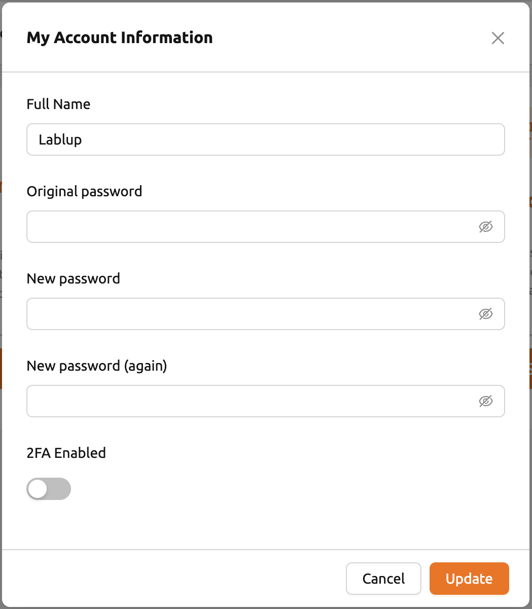
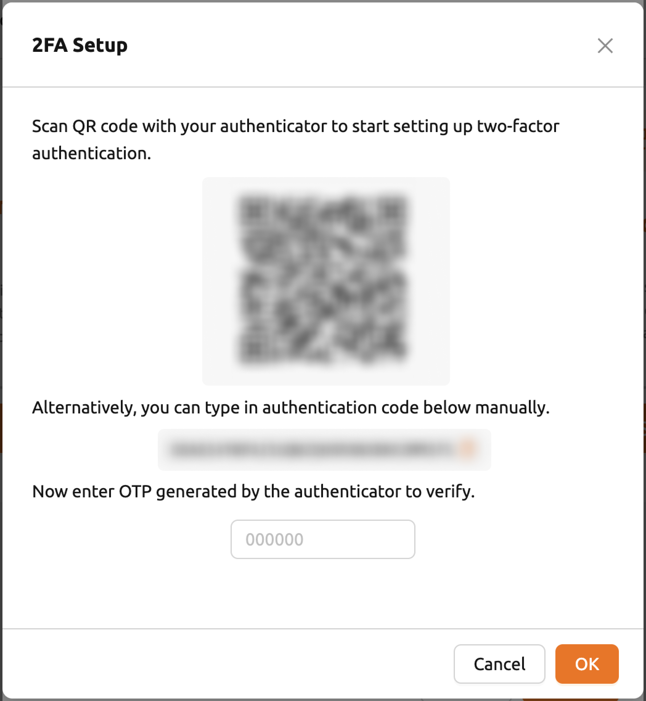

# How to Change Personal Informations

You can update your personal information -- including your display name and password -- through the **My Account** dialog in Backend.AI WebUI. This dialog is accessible from the user dropdown menu in the top-right corner of the page.

## Accessing My Account Information

1. Click the person icon (your username) at the top right of the header.
2. Select **My Account** from the dropdown menu.

The **My Account Information** dialog appears, where you can update your full name and password.

## Changing Your Full Name

1. In the **My Account Information** dialog, locate the **Full Name** field.
2. Enter your new display name (up to 64 characters).
3. Click **Update** to save the change.

:::note
Your full name is displayed in the user dropdown menu and may appear in shared project contexts visible to other users.
:::

## Changing Your Password

To change your password, fill in all three password fields in the **My Account Information** dialog:

1. **Original Password**: Enter your current password.
2. **New Password**: Enter the new password you want to use.
3. **New Password Again**: Re-enter the new password to confirm.

Click **Update** to apply both the full name and password changes at once.

:::warning
The new password must meet the system's password policy requirements. If the password does not satisfy the policy, an error message is displayed and the change is not applied.
:::

## Enabling Two-Factor Authentication (TOTP)

If your Backend.AI deployment supports TOTP (Time-based One-Time Password), a **TOTP Activated** toggle appears in the **My Account Information** dialog.

1. Toggle the switch to **on** to open the TOTP setup dialog.
2. Scan the QR code with an authenticator app (such as Google Authenticator or Authy).
3. Enter the verification code to complete setup.

To disable TOTP, toggle the switch to **off** and confirm the action in the warning dialog.

:::tip
Enabling TOTP adds an extra layer of security to your account. You will be prompted to enter a one-time code each time you log in.
:::

For a full overview of all user preferences and settings, see the [User Settings](../../administration/user-settings.md) page.

