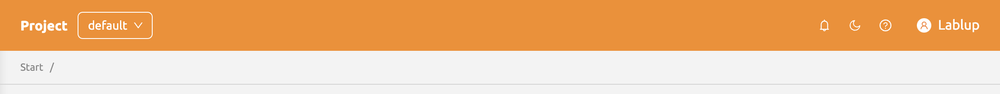
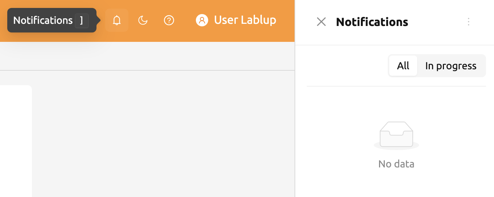
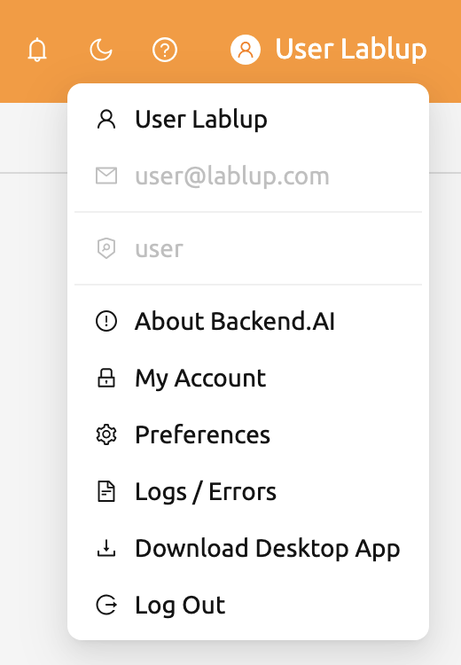
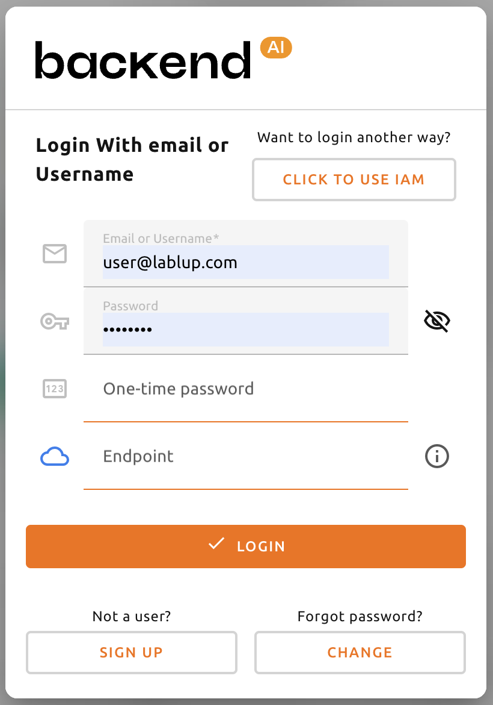

# Top Bar Features

The top bar includes various features that support your use of the WebUI.

## Project Selector

You can switch between projects using the project selector provided in the top bar. By default, the project you currently belong to is selected. Since each project may have different resource policies, switching projects may also change the available resource limits.

## Notification

The bell-shaped button is the event notification button. Events that need to be recorded during WebUI operation are displayed here. When background tasks are running, such as creating a compute session, you can check the jobs here. Press the shortcut key (`]`) to open and close the notification area.

## Theme Mode

You can change the theme mode of the WebUI using the dark mode button on the right side of the header.

## Help

Click the question mark button to access the web version of the user guide. You will be directed to the appropriate documentation based on the page you are currently on.

## User Menu

Click the person button on the right side of the top bar to see the user menu.

- **About Backend.AI**: Displays information such as the version of Backend.AI WebUI and license type.
- **My Account**: Check or update information for the current logged-in user.
- **Preferences**: Go to the user settings page.
- **Logs / Errors**: Go to the log page to check the log and error history recorded on the client side.
- **Download Desktop App**: Download the stand-alone WebUI app for your platform.
- **Log Out**: Log out of the WebUI.

### My Account

Click **My Account** to open the account information dialog.

- **Full Name**: User's name (up to 64 characters).
- **Original password**: Current password. Click the view button to see the input contents.
- **New password**: New password (8 characters or more containing at least 1 letter, number, and symbol).
- **2FA Enabled**: Enable two-factor authentication. When enabled, you will need to enter an OTP code when logging in.

:::note
Depending on the plugin settings, the `2FA Enabled` option might not be visible. In that case, contact your system administrator.
:::

### 2FA Setup

If you activate the **2FA Enabled** switch, a setup dialog appears.

Scan the QR code with your 2FA application (such as Google Authenticator, 1Password, or Bitwarden) and enter the 6-digit code. Click **Confirm** to activate 2FA.

When logging in with 2FA enabled, an additional field for the OTP code will appear after entering your email and password.

To disable 2FA, turn off the **2FA Enabled** switch and confirm in the dialog.
