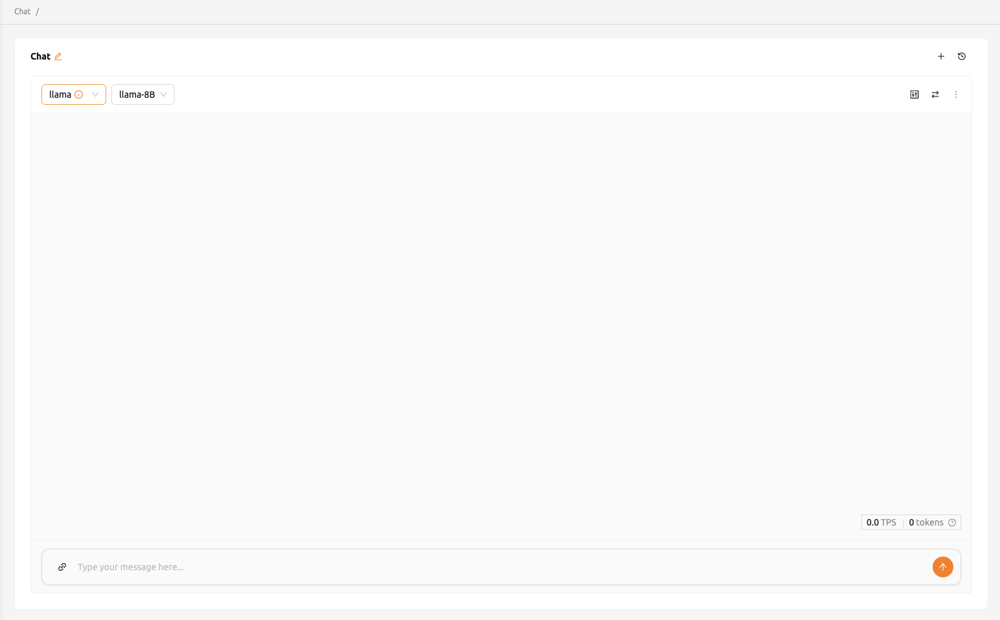
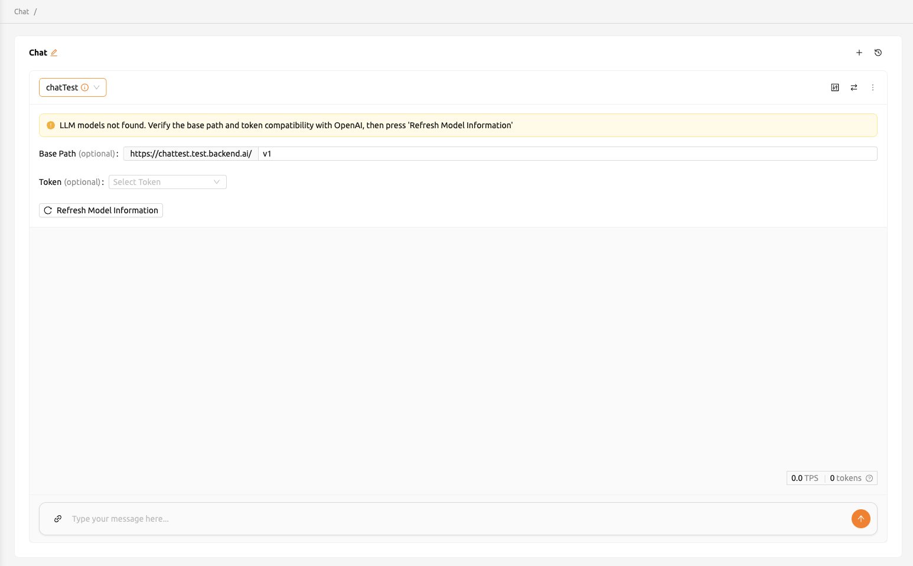
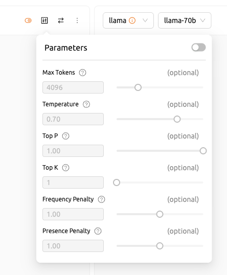
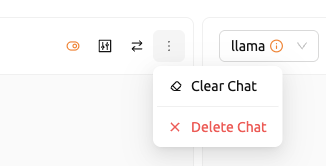

# Chat Interface Guide

The Chat page in Backend.AI Playground provides a full-featured interface for interacting with large language models (LLMs). You can send messages, compare outputs from different models side by side, and fine-tune generation parameters -- all from a single page.

You can access the Chat page by selecting **Chat** from the **Playground** section in the sidebar menu.

<!-- TODO: Capture screenshot of the Chat page overview -->

## Chat Layout

The Chat page is organized around *chat cards*. Each chat card represents an independent conversation with a selected model and endpoint. A chat card consists of:

- **Header**: Displays the endpoint and model selectors, along with the parameter and more options buttons.
- **Conversation area**: Shows the message history between you and the selected model, with your messages and the model's responses displayed in sequence.
- **Input area**: A text field at the bottom where you type messages and send them.

## Selecting Endpoints and Models

You can select the endpoint and model from the top left corner of each chat card. Click the endpoint field to search for or choose from available endpoints, and select the model in the same way.

<!-- TODO: Capture screenshot of the endpoint and model selection -->

If no model is associated with the selected endpoint, verify the base path and token compatibility, then click the **Refresh model info** button. When needed, you can configure custom model settings:

- **baseURL** (optional): Base URL of the server where the model is located. Include the version information (e.g., `https://api.openai.com/v1`).
- **Token** (optional): An authentication key to access the model service. The format and generation process vary depending on the service.

:::note
The Chat page communicates with endpoints using an OpenAI-compatible API format. Any endpoint that supports the OpenAI chat completions API can be used.
:::

## Sending Messages and Streaming Responses

Type your message in the input field at the bottom of a chat card and press **Enter** or click the **Send** button to submit it. The model generates a response in real time using streaming, so you see the output as it is produced.

While the model is generating a response, you can click the **Stop** button to cancel the streaming output.

The chat also supports file attachments. You can drag and drop files onto the chat card or use the file upload feature to include images and other files alongside your text messages.

## Adjusting Model Parameters

Click the parameter button in the top-right corner of a chat card to open the parameter adjustment panel. When enabled, you can configure the following values using sliders:

- **Max Tokens**: The maximum number of tokens the model can generate in a response (range: 50 to 16384).
- **Temperature**: Controls the randomness of the output. Lower values produce more deterministic responses (range: 0.0 to 1.0).
- **Top P**: Controls nucleus sampling, where the model considers tokens whose cumulative probability reaches this threshold (range: 0.0 to 1.0).
- **Top K**: Limits the number of highest-probability tokens considered at each step (range: 1 to 500).
- **Frequency Penalty**: Reduces repetition by penalizing tokens based on their frequency in the output so far (range: 0.0 to 2.0).
- **Presence Penalty**: Reduces repetition by penalizing tokens that have already appeared in the output (range: 0.0 to 2.0).

<!-- TODO: Capture screenshot of the parameter adjustment panel -->

:::tip
Use synchronized input together with different parameter settings on the same model to quickly see how adjusting temperature or top-p affects the response quality.
:::

## Clearing Chat History

To clear all messages from a chat card without removing the card itself, click the **more** button in the upper right corner and select **Clear chat**. This erases the conversation history while keeping the card and its endpoint/model configuration active.

<!-- TODO: Capture screenshot of the clear chat option -->

:::warning
Chat history is saved in your browser's local storage. Clearing your browser data or switching to a different browser will result in the loss of all chat history.
:::

For information on creating multiple chat cards and managing chat sessions, see the [How to Create Multiple Chat Windows](./how-to-create-multiple-chat-windows.md) page. For a general overview of the Playground section, see the [Playground Overview](../playground-overview.md) page.

