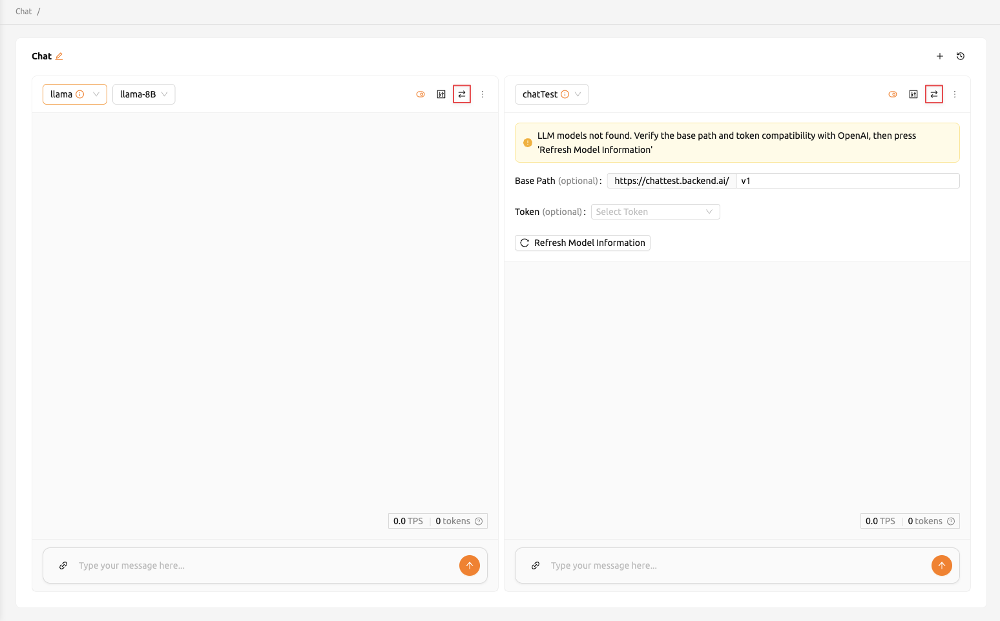
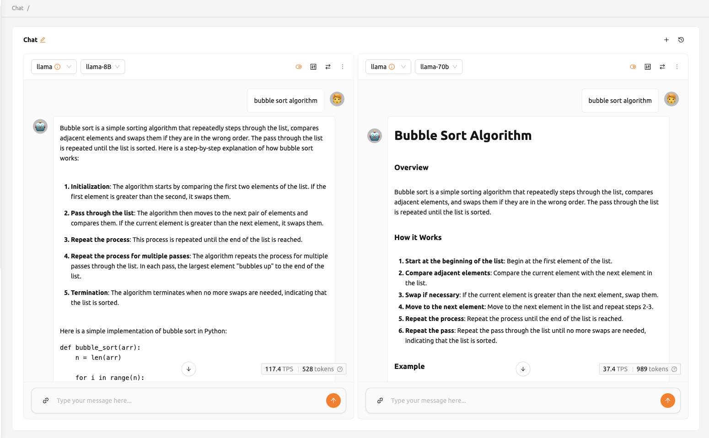
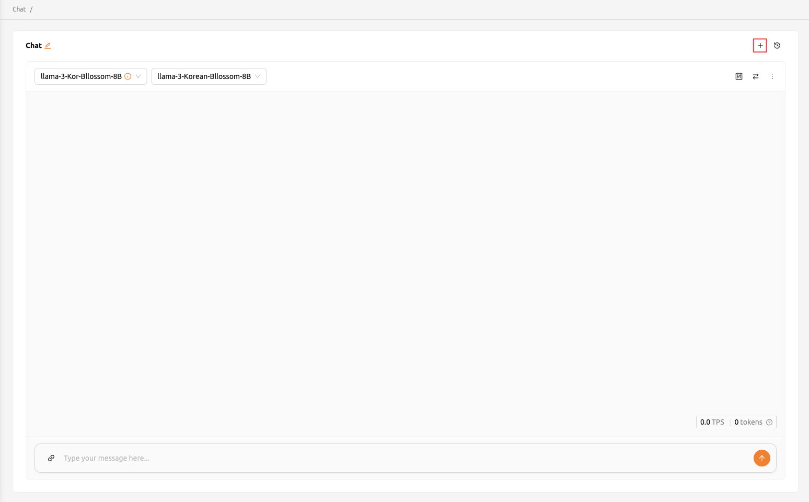
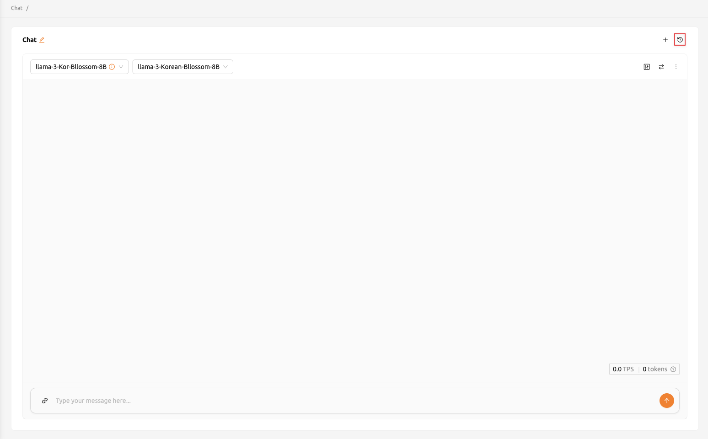
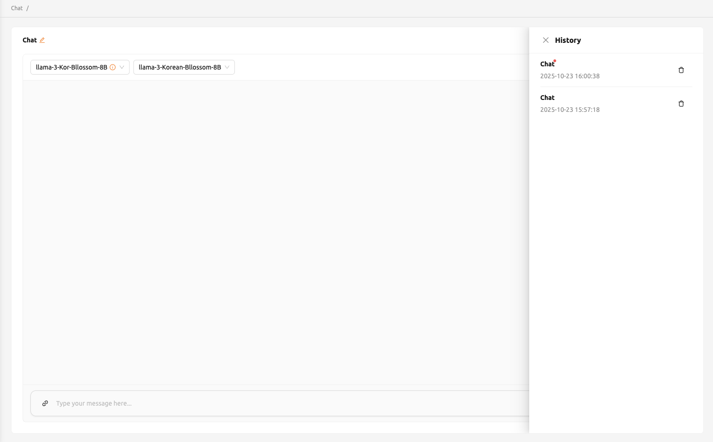

# How to Create Multiple Chat Windows

The Chat page in Backend.AI Playground supports multiple chat cards and chat sessions, allowing you to compare different models, test various parameter settings, and maintain separate conversation threads simultaneously.

## Adding Comparison Chat Cards

To add a new chat card for side-by-side comparison, click the comparison icon button located in the top right corner of the Chat page. Each new card operates independently, so you can select a different endpoint, model, and parameter configuration for each one.

<!-- TODO: Capture screenshot of the add comparison card button -->

You can have up to 10 chat cards open simultaneously. This is useful for comparing how different models or configurations respond to the same prompt.

## Removing a Chat Card

To remove a chat card:

1. Click the **more** button in the upper right corner of the chat card.
2. Select **Delete Chat** from the dropdown menu.

<!-- TODO: Capture screenshot of the delete chat option -->

:::warning
Deleting a chat card removes all entered content. This action cannot be undone.
:::

## Synchronizing Input Across Cards

The **Sync Input** button, located at the top right of the Chat page, enables synchronized input across multiple chat cards. When you enable this option:

- Pressing **Enter** or clicking the **Send** button on any card sends the same input to all cards where synchronization is enabled.
- Each card processes the input through its own selected model and parameters, allowing you to compare outputs side by side.

<!-- TODO: Capture screenshot of the sync input feature -->

:::tip
Use synchronized input to quickly evaluate how different models handle the same prompt. Combine this with different parameter settings on separate cards to see the effect of temperature, top-p, and other generation parameters.
:::

## Starting a New Chat Session

To start a new chat session, click the **+** button in the top right corner. Each chat session maintains its own set of chat cards, endpoint selections, and conversation history.

<!-- TODO: Capture screenshot of the new chat button -->

You can rename a chat session by clicking on its title in the header and typing a new name. This helps you organize sessions by topic or purpose.

## Browsing Chat History

All chat history is stored in your browser's local storage. You can access previous sessions by clicking the history button in the top-right corner, which opens a side drawer listing all saved sessions with their names and last-updated timestamps.

<!-- TODO: Capture screenshot of the history button -->

<!-- TODO: Capture screenshot of the chat history drawer -->

From the history drawer, you can:

- Click on any session to switch to it and resume the conversation.
- Click the trash icon next to a session to permanently delete it.

:::warning
Chat history is saved in your browser's local storage. Clearing your browser data or switching to a different browser will result in the loss of all chat history.
:::

For details on the chat interface layout, model selection, and parameter adjustment, see the [Chat Interface Guide](./chat-interface-guide.md) page.

