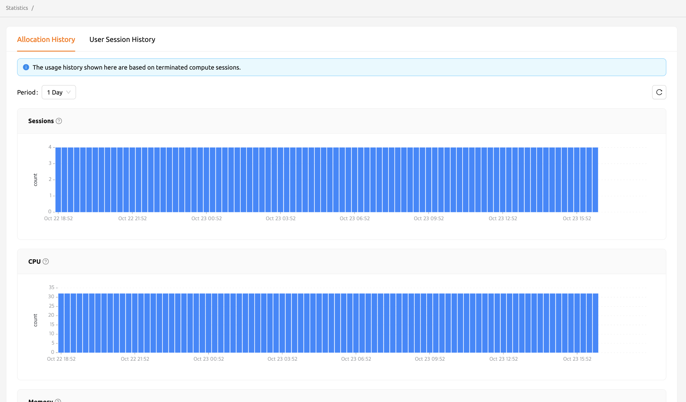
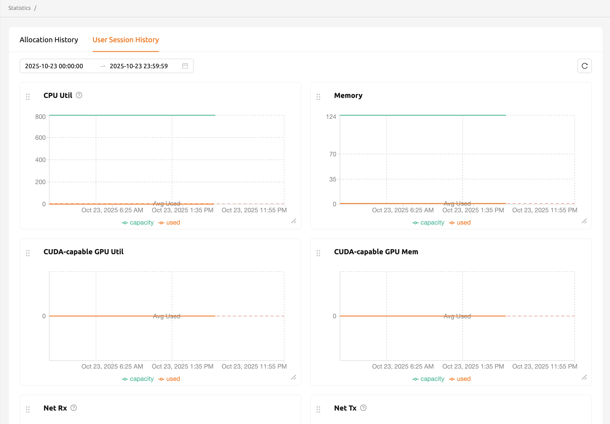

# Statistics Page

The Statistics page provides visual summaries of your compute session usage and resource consumption over time. You can use this page to review allocation trends and monitor how resources such as CPU, memory, and GPU have been utilized across your sessions.

## Allocation History

On the Statistics page, under the **Allocation History** tab, you can check simple statistics related to the use of compute sessions via a graph. You can check the statistics for a day or a week by selecting the usage period from the **Select Period** menu on the upper left. Displayed items are as follows:

- **Sessions**: The number of compute sessions created.
- **CPU**: The number of CPU cores allocated to the compute sessions.
- **Memory**: The amount of memory allocated to the compute sessions.
- **GPU**: The number of GPU units allocated to the compute sessions. If the fractional GPU (fGPU) feature is enabled, it may not match the physical GPU count.
- **IO-Read**: The amount of data read from the storage.
- **IO-Write**: The amount of data written to the storage.

:::note
The statistics shown here are based on terminated compute sessions. One-week statistics may not be available for users whose accounts were created less than a week ago.
:::

## User Session History

In the **User Session History** tab, you can view statistics on various resources used by sessions through graphs. Select the usage period using the **Select Period** menu. Displayed items include:

- **CPU Util**: The amount of CPU time used by the sessions.
- **Memory**: The amount of memory used by the sessions.
- **Net Rx**: The rate at which the container is receiving network data.
- **Net Tx**: The rate at which the container is sending network data.
- **IO Read**: The amount of data read from storage by the sessions.
- **IO Write**: The amount of data written to storage by the sessions.

Depending on available resources, additional items such as CUDA-capable GPU Util and CUDA-capable GPU Mem may be displayed.

