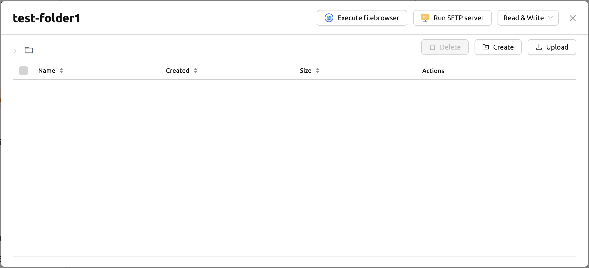
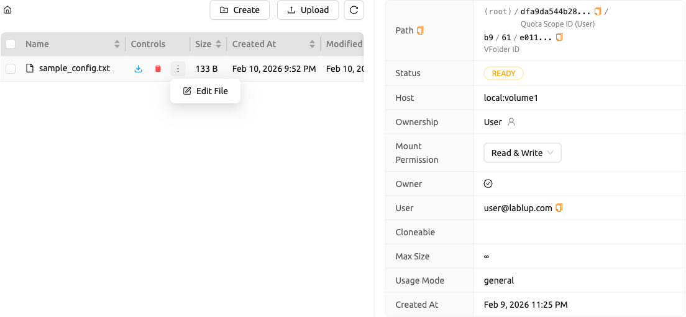
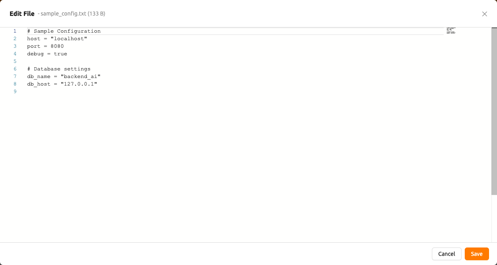
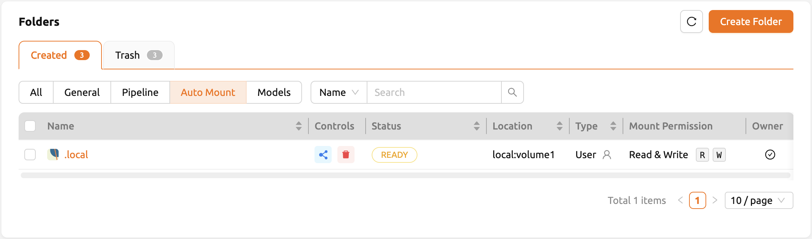
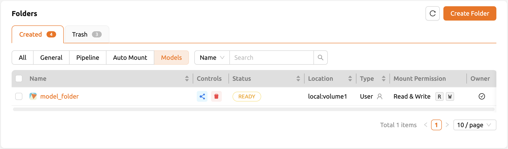

# Data

## Handling Data & Storage Folders

Backend.AI provides dedicated storage to preserve user files. Since all files and directories within a compute session are deleted upon session termination, it is recommended to save important data in a storage folder. The list of storage folders can be accessed by navigating to the **Data** page in the sidebar. Information such as folder name, ID, storage host (Location), and access permissions (Permission) are displayed for each folder.

There are two types of storage folders: `User` and `Project`. You can distinguish between them in the Type column.

- **User folder**: Created directly by an individual user for personal use.
- **Project folder**: Created by a domain administrator for each project. Regular users cannot create project folders; they can only use project folders created by an administrator.

## Storage Status and Quota

The Storage Status and Quota per storage volume display the following information:

- **Storage Status**
   * Created Folders: The number of folders that the user created.
   * Limit: The maximum number of folders that the user can create. This value depends on the resource policy applied to the user. Folders not created by the user (e.g., shared folders or project folders) are not counted.
   * Project Folders: The number of project folders that the user created.
   * Invited Folders: The number of folders that the user was invited to share.
- **Quota per storage volume**
   * Host: The name of the storage host.
   * Project: Current project folder usage / current project folder quota scope.
   * User: Current user folder usage / current user folder quota scope.

:::note
Quota is only available on storage systems that support quota settings (e.g., XFS, CephFS, NetApp, Purestorage). For quota configuration, refer to the administration section.
:::

## Explore Folder

Click the folder name to open a file explorer and view the contents of the folder.

Directories and files inside the folder are listed. Click a directory name in the Name column to navigate into it. You can download, delete, or rename files using the action buttons in the Actions column.

You can create a new directory with the **Create** button, or upload a local file or folder with the **Upload** button.

:::note
To ensure smooth performance, the screen limits the maximum number of files displayed when a directory contains an excessive number of files. Use a terminal or other application to view all files in such cases.
:::

### Edit Text Files

You can edit text files directly in the folder explorer. Click the **Edit File** button in the Control column for any text file.

The text file editor opens in a modal with a code editor interface. The editor automatically detects the file type and applies appropriate syntax highlighting. You can edit the content and click **Save** to upload the modified file, or **Cancel** to discard changes.

:::note
The Edit File button is only available when you have write permission on the storage folder.
:::

## Using FileBrowser

Backend.AI supports [FileBrowser](https://filebrowser.org), a web-based file management tool. FileBrowser is useful for uploading directories from your local machine while maintaining the tree structure.

To use FileBrowser, the following conditions are required:

- You can create at least one compute session.
- You can allocate at least 1 CPU core and 512 MB of memory.
- A FileBrowser-supported image must be installed.

### Execute FileBrowser from Folder Explorer

Go to the **Data** page and open the file explorer of the target folder. Click **Execute filebrowser** in the upper-right corner.

When you click the button, Backend.AI automatically creates a dedicated compute session for FileBrowser. You can manage this session from the Sessions page.

:::note
If you accidentally close the FileBrowser window, go to the Sessions page and click the FileBrowser application button of the FileBrowser compute session to reopen it.
:::

## Using SFTP Server

From version 22.09, Backend.AI supports SSH/SFTP file upload from both the desktop app and web-based WebUI. The SFTP server allows you to upload files quickly through reliable data streams.

Go to the **Data** page and open the file explorer of the target folder. Click **Run SFTP server** in the upper-right corner.

Click **Download SSH Key** to download the SSH private key (`id_container`). Note the host and port number, then use the connection example code to transfer files to the session.

:::note
Depending on the system settings, running an SFTP server from the file dialog may not be allowed.
:::

## Folder Categories

### Automount Folders

The Data page has an **Automount Folders** tab. Folders with names prefixed with a dot (`.`) appear in this tab. Automount folders are automatically mounted in your home directory even without manual mounting when creating a compute session. You can use this feature to maintain user-specific packages or environments (e.g., `.local`, `.pyenv`, `.linuxbrew`) across different sessions.

### Models

The **Models** tab facilitates model serving. You can store input data for model serving and training data in model-type folders.

For detailed instructions on creating, renaming, and deleting folders, see the [How to Create / Rename / Update / Delete Storage Folders](how-to-create-rename-update-delete-storage-folders.md) page.
