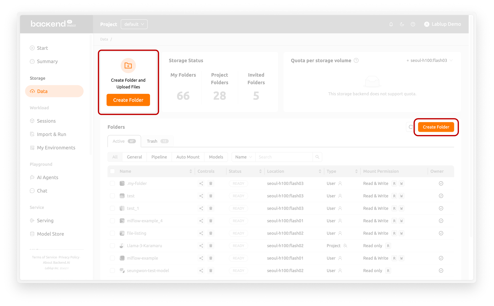
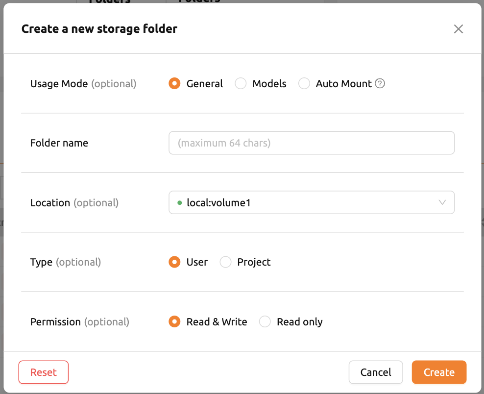
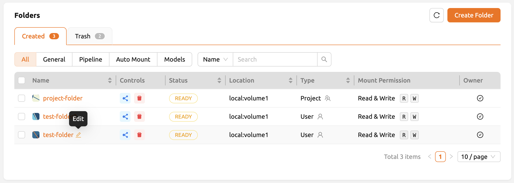
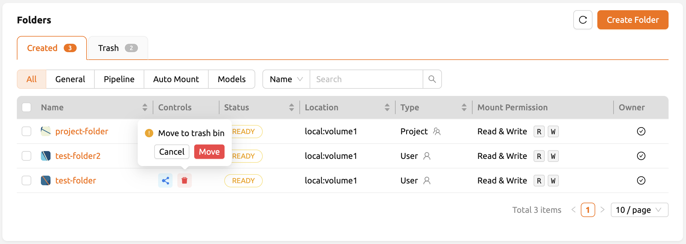
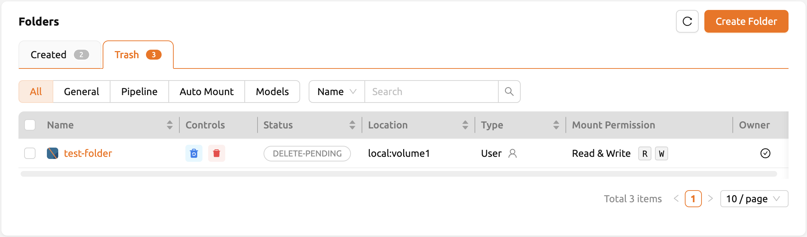
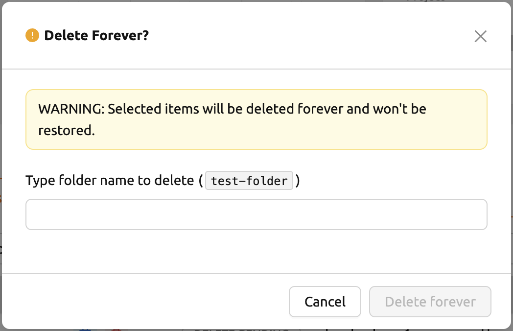

# How to Create / Rename / Update / Delete Storage Folders

## Creating a Storage Folder

To create a new folder, click the **Create Folder** button on the **Data** page.

A dialog opens where you can enter the folder information:

- **Folder name** (Required): Name of the folder, up to 64 characters.
- **Location**: Select the storage host where the folder will be created. If multiple hosts are available, choose one. An indicator shows the remaining capacity.
- **Usage Mode**: Set the purpose of the folder.
   * General: A folder for storing various data in a general-purpose manner.
   * Models: A folder specialized for model serving and management.
   * Auto Mount: Automatically mounted when a session is created. The folder name must start with a dot (`.`).
- **Type**: Determines the type of folder.
   * User: A folder that you can create and use individually.
   * Project: A folder created by an administrator and shared among users within a project.
- **Permission**: Set permission of a project folder for project members.
   * Read & Write: Both read and write operations are allowed.
   * Read Only: Project members cannot write to this folder inside their compute session.
- **Cloneable** (Optional): Shown only when you select `Models` as the usage mode. Determines whether the folder can be cloned.
- **Project** (Optional): Shown only when you select `Project` as the type. Specifies the project group to which the folder belongs.

After entering the required information, click the **Create** button to create the folder.

Folders created here can be mounted when starting a compute session. They appear under the default working directory `/home/work/` and files stored in mounted directories are preserved after session termination. However, if you delete the folder, all files within it will also be permanently removed.

## Renaming a Storage Folder

If you have permission to rename a storage folder, hover over the folder name to reveal the edit button (pencil icon). Click it to modify the folder name.

:::note
To rename a storage folder, appropriate permission is required. If the rename option is not available, contact your system administrator.
:::

## Deleting a Storage Folder

If you have permission to delete a storage folder, click the **trash bin** button to move the folder to the **Trash** tab. The folder is marked as delete-pending.

In the Trash tab, you can:

- **Restore** the folder by clicking the restore button in the Control column.
- **Permanently delete** the folder by clicking the trash bin button in the same column.

A confirmation dialog appears with an input field. Type the exact folder name and click the **DELETE FOREVER** button to permanently delete the folder.

:::danger
Deleting a storage folder is **irreversible**. All data in the folder will be permanently lost.
:::
