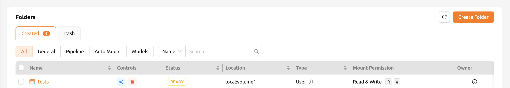
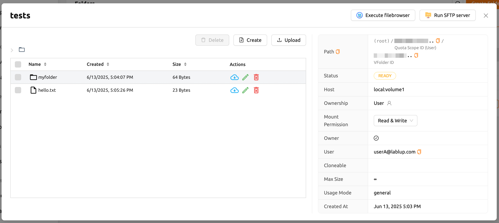
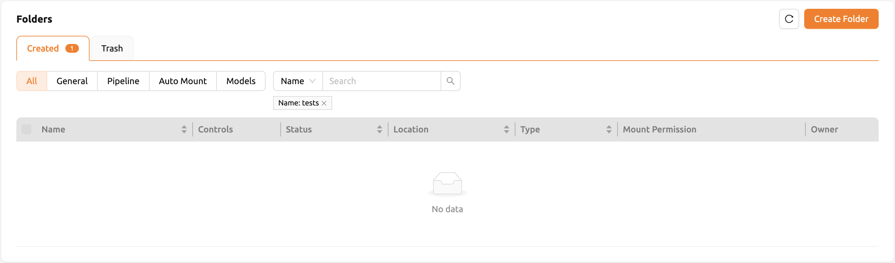
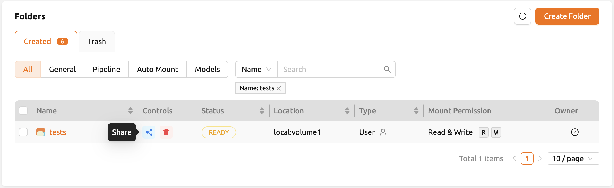
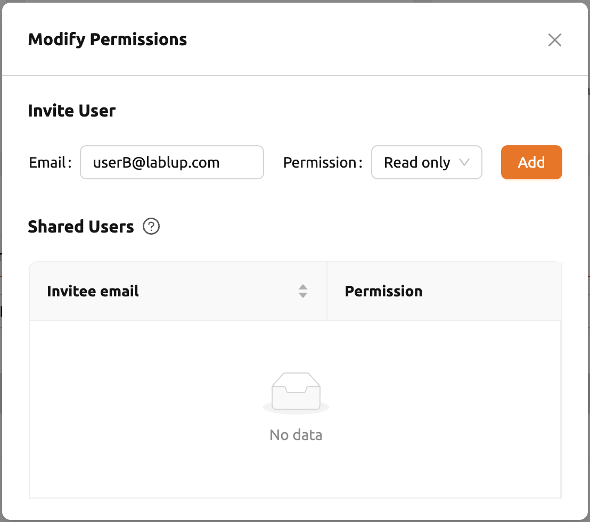
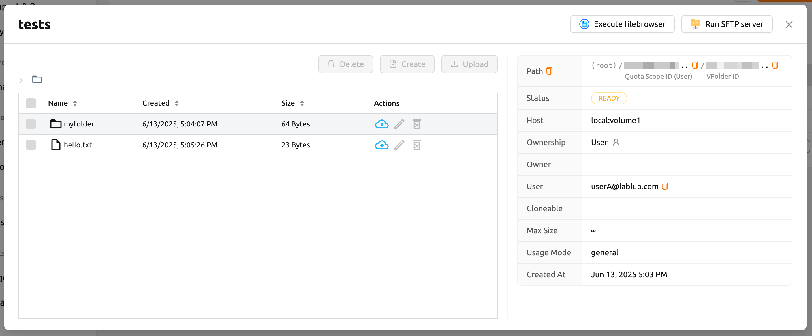
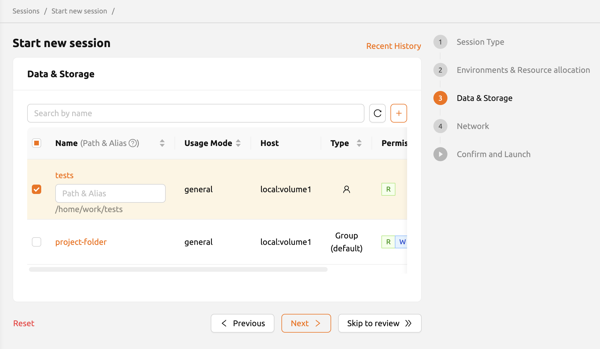
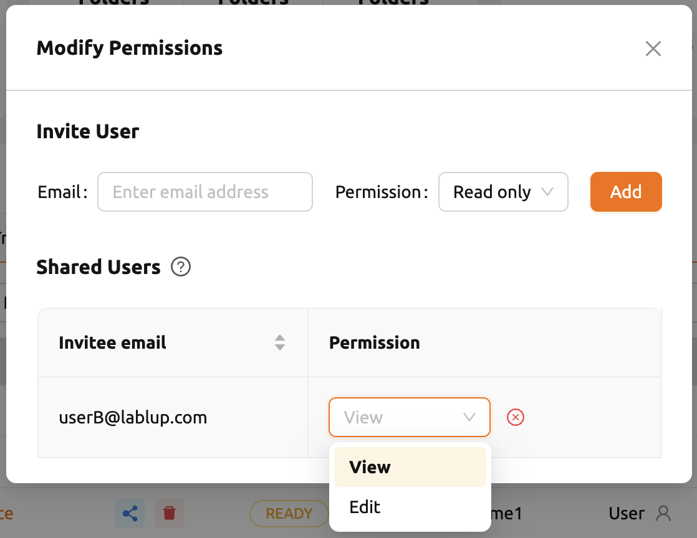

# How to Share Storage Folders

Backend.AI allows you to share your personal storage folders with other users within the platform. This section walks through the process of sharing a folder, accepting an invitation, and adjusting permissions.

## Share Storage Folders with Other Users

Let's learn how to share your personal storage folder with other users. First, log in to User A's account and go to the Data page. There are several folders, and we want to share a folder named `tests` to User B.

Inside the `tests` folder you can see files and directories like `hello.txt` and `myfolder`.

Confirm that the `tests` folder is not listed when logging in with User B's account.

:::warning
If a folder named `tests` already exists in User B's account, User A's `tests` folder cannot be shared with User B.
:::

Back to User A's account, click the **share** button in the Control column on the `tests` folder in the list.

In the **Invite User** section of the modal, enter User B's email address and select the desired permission level. If you choose **Read Only**, User B will be able to only view the folder but not modify it. If you select **Read & Write**, User B will be able to both view and modify the folder.

Switch back to User B's account and navigate to the Summary page. In the Invitation section of the Summary page, you will see the folder invitation. Click the **Accept** button to accept the invitation.

Go to the Data page and check that the `tests` folder is displayed in the list. If you don't see it on the list, try refreshing your browser page. Since you have accepted the invitation, you can now view the contents of User A's `tests` folder in User B's account. Unlike folders created by User B, shared folders appear without the check icon in the Owner column. You can also see the **Read only** mark displayed in the Mount Permission column.

Navigate inside the `tests` folder by clicking the folder icon in the Control panel of `tests`. You can check the `hello.txt` and `myfolder` that you verified in User A's account.

Create a compute session by mounting this storage folder with User B's account.

:::note
From version 24.09, Backend.AI offers an improved version of the session launcher (NEO) as the default. For instructions on how to use it, please refer to the [Session Management](../../workload/sessions/session-management.md) section.
:::

After creating a session, open the web terminal and check that the `tests` folder is mounted in the home folder. The contents of the `tests` folder are displayed, but attempts to create or delete files are not allowed. This is because User A shared it as read-only. User B can create a file in the `tests` folder if it has been shared with write access.

This way, you can share your personal storage folders with other users based on your Backend.AI email account.

:::note
Backend.AI also provides sharing a project storage folder with project members. For details, refer to the [User Management](../../../../administration/user-management.md) section.
:::

## Adjust Permission for Shared Folders

You can modify the permissions of a shared user from the folder sharing modal. Click **Select permission** to set the sharing permission. You can also remove invited users by clicking the **x** button next to their permission.

- **View**: The invited user has read-only access to the folder.
- **Edit**: The invited user has read and write access to the folder. The user cannot delete folders or files.

:::note
Renaming the folder itself is available only for the owner, even if the user has been granted Edit permission. Please note that Edit permission does not provide folder renaming.
:::
