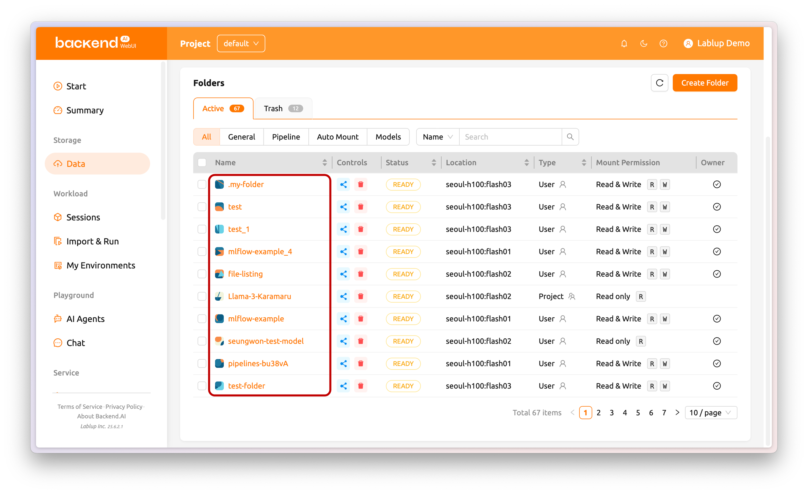
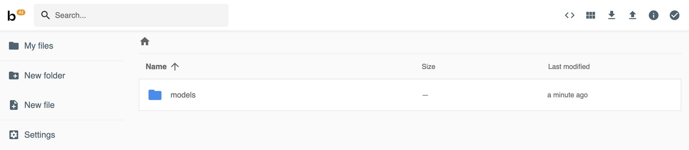
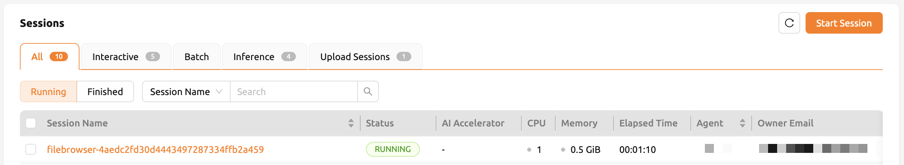
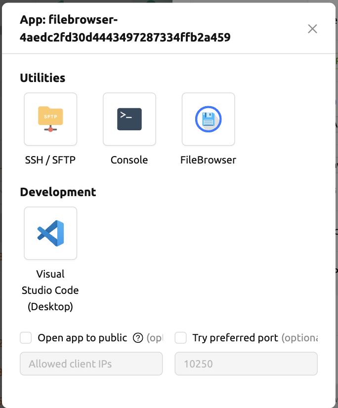
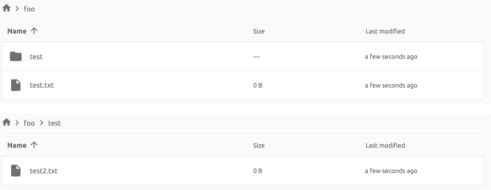
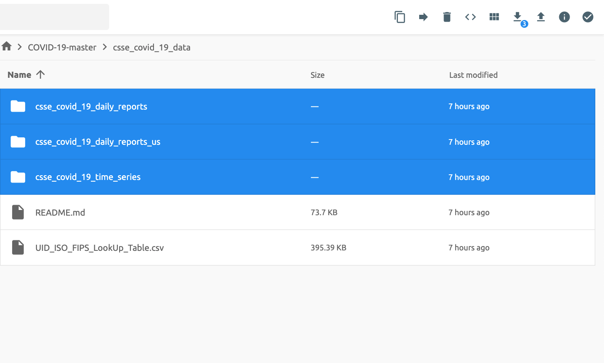
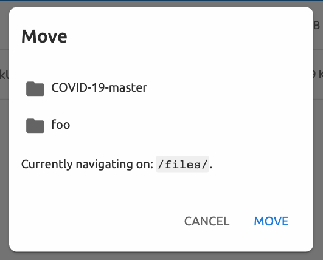
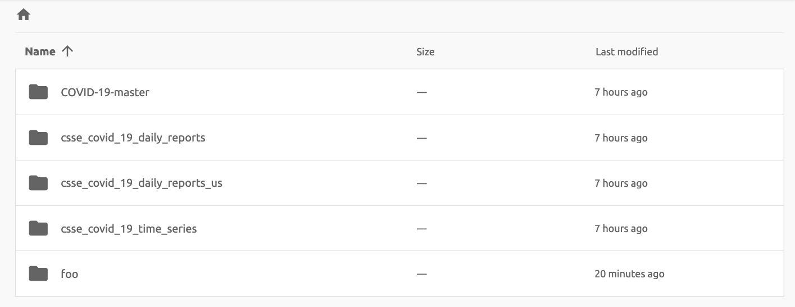
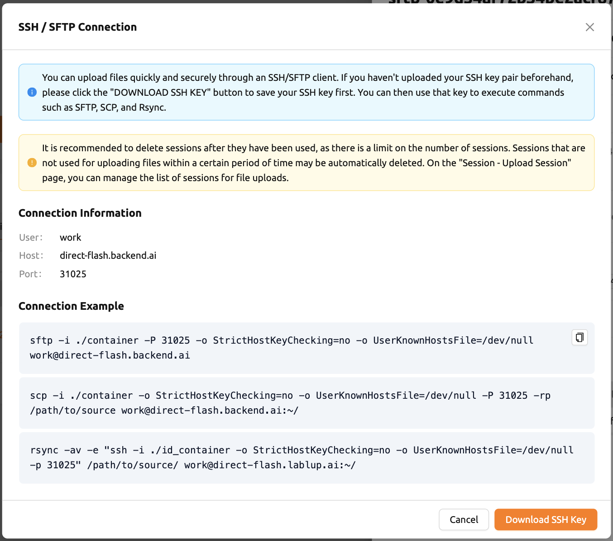

# How to Upload Files and Folders

This section describes how to explore, upload, and manage files and folders within your storage folders using the built-in file explorer, FileBrowser, and the SFTP server.

## Exploring Folders

Click the folder name to open a file explorer and view the contents of the folder.



You can see that directories and files inside the folder will be listed, if they exist. Click a directory name in the Name column to move to the directory. You can click the download button or delete button in the Actions column to download it or delete it entirely from the directory. You can rename a file or directory as well. For more detailed file operations, you can mount this folder when creating a compute session, and then use a service like Terminal or Jupyter Notebook to do it.


<!-- TODO: Capture screenshot of the folder explorer view (folder_explorer1.png not found locally) -->

You can create a new directory on the current path with the **Create** button (in the folder explorer), or upload a local file or folder with the **Upload** button. All of these file operations can also be performed using the above-described method of mounting folders into a compute session.

The maximum length of a file or directory name inside a folder may depend on the host file system. However, it usually cannot exceed 255 characters.

## Using FileBrowser

Backend.AI supports [FileBrowser](https://filebrowser.org/) from version 20.09. FileBrowser is a program that helps you manage files on a remote server through a web browser. This is especially useful when uploading a directory from your local machine.

Currently, Backend.AI provides FileBrowser as an application within a compute session. Therefore, the following conditions are required to launch it:

- You can create at least one compute session.
- You can allocate at least 1 core of CPU and 512 MB of memory.
- An image that supports FileBrowser must be installed.

You can access FileBrowser in two ways:

- Execute FileBrowser from the file explorer dialog of a storage folder.
- Launch a compute session directly from a FileBrowser image on the Sessions page.

### Execute FileBrowser from Folder Explorer Dialog

Go to the Data page and open the file explorer dialog of the target storage folder. Click the folder name to open the file explorer.


Click the **Execute filebrowser** button in the upper-right corner of the explorer.


<!-- TODO: Capture screenshot of the folder explorer view (folder_explorer1.png not found locally) -->

You can see that FileBrowser is opened in a new window. The storage folder you opened the explorer dialog for becomes the root directory. From the FileBrowser window, you can freely upload, modify, and delete any directories and files.



When you click the **EXECUTE FILEBROWSER** button, Backend.AI automatically creates a dedicated compute session for the app. In the Sessions page, you should see a FileBrowser compute session. It is your responsibility to delete this compute session when you are done.



:::note
If you accidentally close the FileBrowser window and want to reopen it, go to the Sessions page and click the FileBrowser application button of the FileBrowser compute session.
:::



When you click the **EXECUTE FILEBROWSER** button again in the storage folder explorer, a new compute session will be created and a total of two FileBrowser sessions will appear.

### Create a Compute Session with FileBrowser Image

You can directly create a compute session with FileBrowser-supported images. You need to mount at least one or more storage folders to access them. You can use FileBrowser without a problem even if you do not mount any storage folder, but all uploaded or updated files will be lost after the session is terminated.

:::note
The root directory of FileBrowser will be `/home/work`. Therefore, you can access any mounted storage folders for the compute session.
:::

### Basic Usage Examples of FileBrowser

Here, we present some basic usage examples of FileBrowser in Backend.AI. Most of the FileBrowser operations are intuitive, but if you need a more detailed guide, please refer to the [FileBrowser documentation](https://filebrowser.org/).

#### Upload Local Directory Using FileBrowser

FileBrowser supports uploading one or more local directories while maintaining the tree structure. Click the upload button in the upper right corner of the window, and click the **Folder** button. Then, a local file explorer dialog will appear and you can select any directory you want to upload.

:::note
If you try to upload a file to a read-only folder, FileBrowser will raise a server error.
:::


For example, upload a directory with the following structure:

```text
foo
+-- test
|   +-- test2.txt
+-- test.txt
```

After selecting the `foo` directory, you can see the directory has been uploaded successfully.



You can also upload local files and directories by drag and drop.

#### Move Files or Directories to Another Directory

Moving files or directories in a storage folder is also possible from FileBrowser. You can move files or directories by following the steps below:

1. Select directories or files from FileBrowser.

   

2. Click the **arrow** button in the upper right corner of FileBrowser.

   

3. Select the destination.

   

4. Click the **MOVE** button.

You will see that the moving operation has completed successfully.



:::note
FileBrowser is currently provided as an application inside a compute session. We are planning to update FileBrowser so that it can run independently without creating a session.
:::

## Using SFTP Server

From version 22.09, Backend.AI supports SSH / SFTP file upload from both the desktop app and the web-based WebUI. The SFTP server allows you to upload files quickly through reliable data streams.

:::note
Depending on the system settings, running the SFTP server from the file dialog may not be allowed.
:::

### Execute SFTP Server from Folder Explorer Dialog

Go to the Data page and open the file explorer dialog of the target storage folder. Click the folder button or the folder name to open the file explorer.

Click the **Run SFTP server** button in the upper-right corner of the explorer.



You can see the SSH / SFTP connection dialog. A new SFTP session will be created automatically. This session will not affect resource occupancy.


<!-- TODO: Capture screenshot of the expanded SSH/SFTP connection dialog (SSH_SFTP_connection_expanded.png not found locally) -->

:::note
Detailed information about large file upload via SSH/SFTP connection is provided in the connection dialog. Click the **Read more** text link to see all the details.
:::

For the connection, click the **DOWNLOAD SSH KEY** button to download the SSH private key (`id_container`). Also, remember the host and port number. Then, you can copy your files to the session using the Connection Example code written in the dialog, or refer to the [SFTP to Container](../../workload/sessions/sftp-to-container.md) guide. To preserve the files, you need to transfer the files to the storage folder. The session will be terminated when there is no transfer for some time.

:::info
If you upload your SSH keypair, the `id_container` will be set with your own SSH private key. You do not need to download it every time you want to connect via SSH to your container. Please refer to the [User Settings](../../../../administration/user-settings.md) section for managing your SSH keypair.
:::
