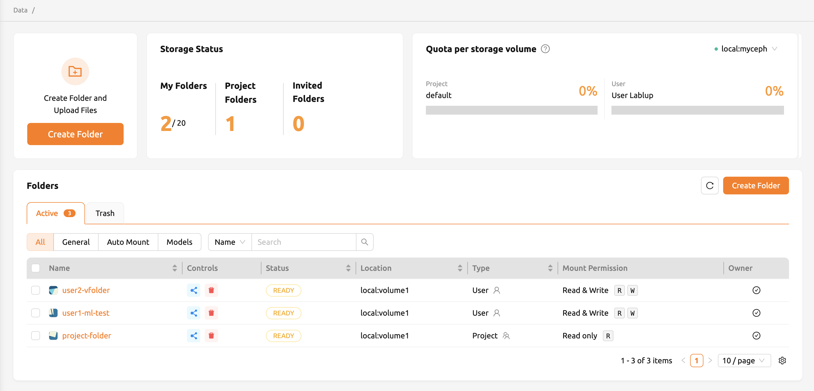
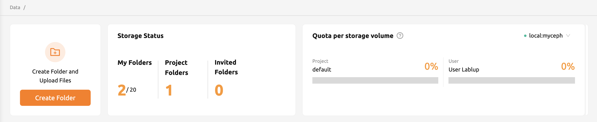

# Storage

Backend.AI provides dedicated persistent storage called *storage folders* (also known as *virtual folders* or *vfolders*) to preserve your files across compute sessions. Since all files and directories within a compute session are deleted upon session termination, you should save important data in a storage folder to keep it safe.

You can view and manage your storage folders by selecting **Data** from the sidebar menu.

<!-- TODO: Capture screenshot of the Data page overview -->

## What Are Storage Folders?

A storage folder is a persistent directory managed by Backend.AI that survives session termination. When you mount a storage folder into a compute session, it appears under the default working directory `/home/work/`. Any files you save to a mounted storage folder remain available even after the session ends.

:::tip
Always save your work -- datasets, model checkpoints, notebooks, and scripts -- to a mounted storage folder before terminating your session.
:::

## Folder Types

There are two types of storage folders, distinguished by the **Type** column on the Data page:

- **User folder**: Created by an individual user for personal use. Only the owner and explicitly invited users can access a user folder.
- **Project folder**: Created by a domain administrator and shared among all members of a project. Regular users cannot create project folders themselves; they can only use project folders that an administrator has set up.

## Usage Modes

When creating a storage folder, you select a usage mode that determines the folder's behavior:

- **General**: A general-purpose folder for storing datasets, code, configuration files, and other data.
- **Models**: A folder specialized for model serving and management. When this mode is selected, you can also configure the folder's cloneability.
- **Auto Mount**: A folder that is automatically mounted when you create a compute session, without requiring manual selection. The folder name must start with a dot (`.`), for example `.local` or `.pyenv`. This is useful for maintaining user-specific packages or environment configurations across different sessions.

## Storage Status and Quota

The **Storage Status** panel on the Data page displays a summary of your folder usage and quota limits:

- **Created Folders**: The number of folders you have created, along with the maximum number allowed by your resource policy.
- **Project Folders**: The number of project folders you have created.
- **Invited Folders**: The number of folders shared with you by other users.

The **Quota per storage volume** section shows your current usage and quota scope for each storage host.

<!-- TODO: Capture screenshot of the Storage Status panel -->

:::note
Quota is only available on storage systems that support quota settings (e.g., XFS, CephFS, NetApp, Purestorage). Contact your system administrator for quota configuration details.
:::

## Next Steps

For detailed instructions on working with storage folders, see the following pages:

- [Data Management Guide](data/data-management-guide.md) -- Overview of browsing, exploring, and editing files in storage folders.
- [How to Create / Rename / Update / Delete Storage Folders](data/how-to-create-rename-update-delete-storage-folders.md) -- Step-by-step instructions for folder lifecycle operations.
- [How to Upload Files and Folders](data/how-to-upload-a-files-folders-to-your-folder.md) -- Uploading data via the file explorer, FileBrowser, and SFTP.
- [How to Share Storage Folders](data/how-to-share-folders.md) -- Sharing folders with other users and managing permissions.

