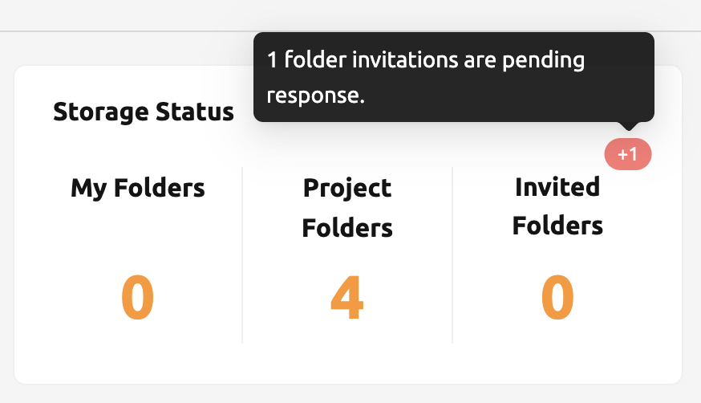
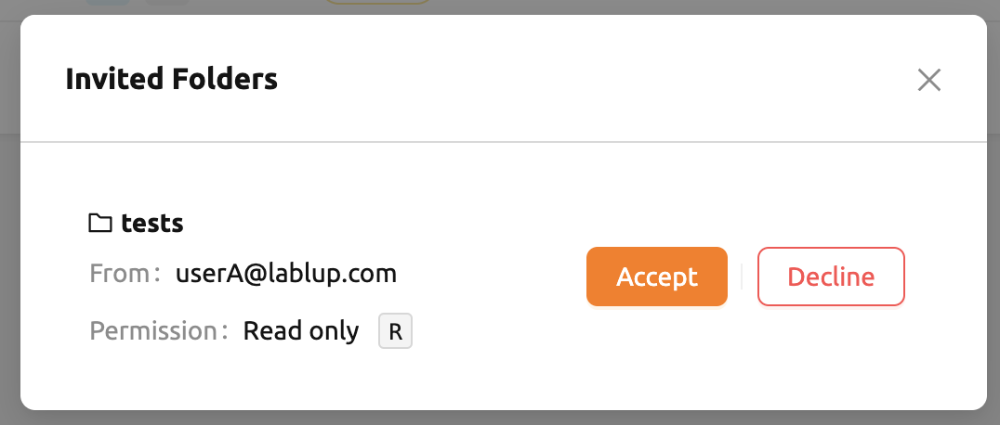
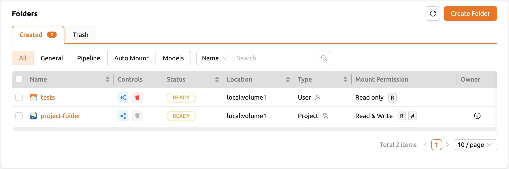
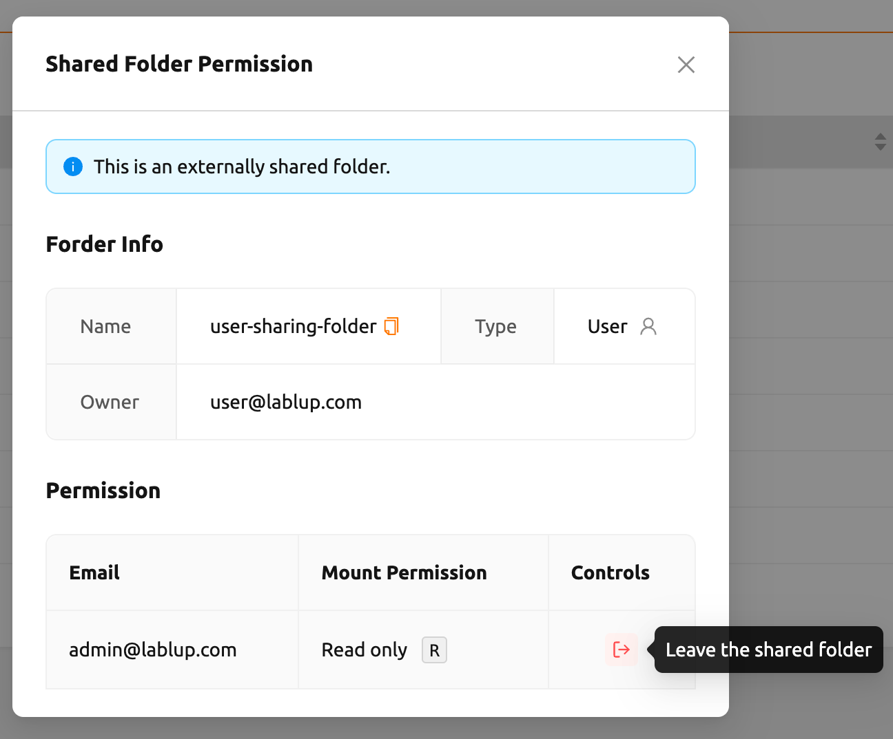

# How to Accept / Reject Invitations

When another user shares a storage folder with you, you receive an invitation that must be accepted before you can access the shared folder. This page explains how to view, accept, and reject folder sharing invitations.

## Viewing Pending Invitations

You can find pending invitations on the **Summary** page. The **Invitation** panel displays all folder invitations that are waiting for your response.

You can also check the number of invited folders in the **Storage Status** panel on the **Data** page. Clicking the invited folders badge opens a modal listing all pending invitations.

<!-- TODO: Capture screenshot of the Invitation panel on the Summary page -->

## Accepting an Invitation

To accept a folder sharing invitation:

1. Navigate to the **Summary** page or open the invitation list from the **Data** page.
2. Locate the invitation for the folder you want to access.
3. Click the **Accept** button next to the invitation.

<!-- TODO: Capture screenshot of the invitation accept action -->

After accepting, the shared folder appears in your folder list on the **Data** page. If the folder does not appear immediately, try refreshing the page.

:::note
You cannot accept an invitation if you already have a folder with the same name in your account. Rename or delete your existing folder first, then accept the invitation.
:::

## Rejecting an Invitation

If you do not need access to the shared folder, click the **Reject** button next to the invitation. The invitation is removed from your pending list, and you will not have access to the folder.

## Understanding Shared Folder Permissions

After accepting an invitation, your access level depends on the permission set by the folder owner:

- **View (Read Only)**: You can browse and download files in the folder, but you cannot create, modify, or delete files.
- **Edit (Read & Write)**: You can browse, download, create, and modify files. However, you cannot delete the folder itself or rename it.

Shared folders are visually distinguished from your own folders in the folder list -- they appear without the owner check icon in the **Owner** column, and the assigned permission level is shown in the **Mount Permission** column.

<!-- TODO: Capture screenshot of a shared folder in the folder list -->

:::tip
When you mount a shared read-only folder in a compute session, any attempts to write files to it will be denied. Make sure the folder owner has granted you the appropriate permission level for your use case.
:::

## Leaving a Shared Folder

If you no longer need access to a shared folder, you can leave it. Click the **Share** button next to the folder in the folder list, then select **Leave the shared folder** to remove your access.

<!-- TODO: Capture screenshot of the leave shared folder action -->

For more details on how folder sharing works from the owner's perspective, see the [How to Share Storage Folders](../storage/data/how-to-share-folders.md) page.

