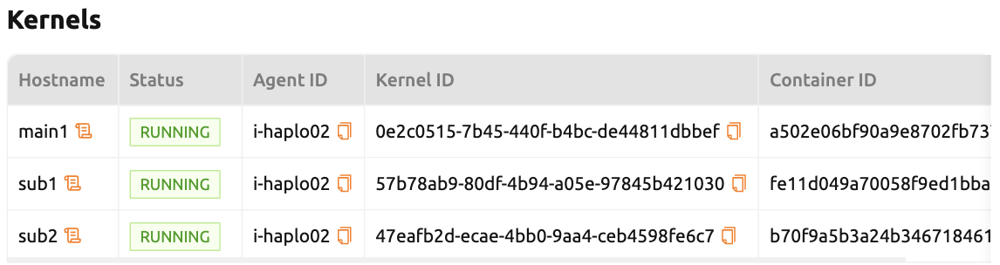
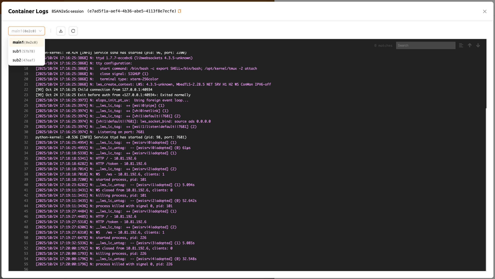

# Backend.AI Cluster Compute Session

Backend.AI supports cluster compute sessions for distributed computing and training tasks. A cluster session consists of multiple containers, each of which is created across multiple agent nodes. Containers under a cluster session are automatically connected to each other through a dynamically-created private network.

:::note
The cluster compute session feature is supported from Backend.AI server 20.09 or higher.
:::

## Overview

Temporary domain names (`main1`, `sub1`, `sub2`, etc.) are assigned to each container, making it simple to execute networking tasks such as SSH connections. All the necessary secret keys and settings for SSH connections between containers are automatically generated.

Key characteristics of cluster sessions:

- Containers under a cluster session are created across one or more agent nodes which belong to a resource group.
- A cluster session consists of one main container (`main1`) and one or more sub containers (`subX`).
- All containers under a cluster session are created by allocating the same amount of resources. For example, all four containers of a session are created with the same amount of resources.
- All containers under a cluster session mount the same storage folder specified when creating the compute session.
- All containers under a cluster session are tied to a private network.
   * The name of the main container is `main1`.
   * Sub-containers are named as `sub1`, `sub2`, and so on in increasing order.
   * There is no firewall between the containers that make up a cluster session.
   * You can directly connect to the main container, and sub-containers can only be connected from the main container.

## Cluster Session Types

There are two modes of cluster session:

- **Single Node**: A cluster session composed of two or more containers on one, same agent node. These are bound to a local bridge network.
- **Multi Node**: A cluster session composed of two or more containers on different agent nodes. These are bound to an overlay network.

:::note
A compute session with only one container is classified as a normal compute session, not a cluster session.
:::

A single node cluster session is created in the following cases:

- When you select **Single Node** for the Cluster mode field when creating a compute session. If there is no single agent with enough resources, the session stays in a `PENDING` state.
- When you select **Multi Node**, but there is a single agent with enough resources to create all containers, all of them are deployed on that agent to minimize network latency.

## Environment Variables

Each container in a cluster session has the following environment variables. You can refer to them to check the cluster configuration and current container information:

- `BACKENDAI_CLUSTER_HOST`: The name of the current container (e.g., `main1`)
- `BACKENDAI_CLUSTER_HOSTS`: Names of all containers belonging to the current cluster session (e.g., `main1,sub1,sub2`)
- `BACKENDAI_CLUSTER_IDX`: Numeric index of the current container (e.g., `1`)
- `BACKENDAI_CLUSTER_MODE`: Cluster session mode/type (e.g., `single-node`)
- `BACKENDAI_CLUSTER_ROLE`: Type of current container (e.g., `main`)
- `BACKENDAI_CLUSTER_SIZE`: Total number of containers belonging to the current cluster session (e.g., `4`)
- `BACKENDAI_KERNEL_ID`: ID of the current container (e.g., `3614fdf3-0e04-...`)
- `BACKENDAI_SESSION_ID`: ID of the cluster session to which the current container belongs (e.g., `3614fdf3-0e04-...`). The main container's `BACKENDAI_KERNEL_ID` is the same as `BACKENDAI_SESSION_ID`.

## Creating a Cluster Session

In the Sessions page, open the session creation dialog and configure it the same way as creating a normal compute session. The amount of resources you set is the amount allocated to **one container**. For example, if you set 4 CPUs, 4 cores are allocated to each container under the cluster session. To create a cluster session, server resources equal to N times the amount of resources are required (where N is the cluster size).

:::warning
Do not forget to mount a storage folder for data safekeeping, as data inside the session that is not stored in a mounted folder is deleted when the session ends.
:::

In the **Cluster mode** field, choose your cluster type:

- **Single Node**: All containers are created on one agent node.
- **Multi Node**: Containers are created across multiple agent nodes within a resource group. However, if all containers can be created on one agent node, they are all deployed on that node to minimize network latency.

Set the **Cluster size** below it. If set to 3, a total of three containers are created including the main container. These containers are bound under a private network to form one compute session.

Click **LAUNCH** to create the cluster session. After the session is created, you can view the created containers on the session details page.

## Using a Cluster Session

Open the terminal app in the compute session. If you look up the environment variables, you can see that the `BACKENDAI_CLUSTER_*` variables described above are set.

You can also SSH into the `sub1` container. No separate SSH configuration is required -- just issue the command `ssh sub1`. You can see the hostname after `work@` has changed, indicating you are in the sub container's shell.

In order to execute distributed learning through a cluster session, a distributed learning module provided by ML libraries such as TensorFlow or PyTorch, or additional supporting software such as Horovod, NNI, or MLFlow, is required. Backend.AI provides kernel images containing the software required for distributed learning.

## Viewing Logs Per Container

You can check the log of each container in the logs modal. This helps you understand what is happening not only in the `main` container but also in `sub` containers.

