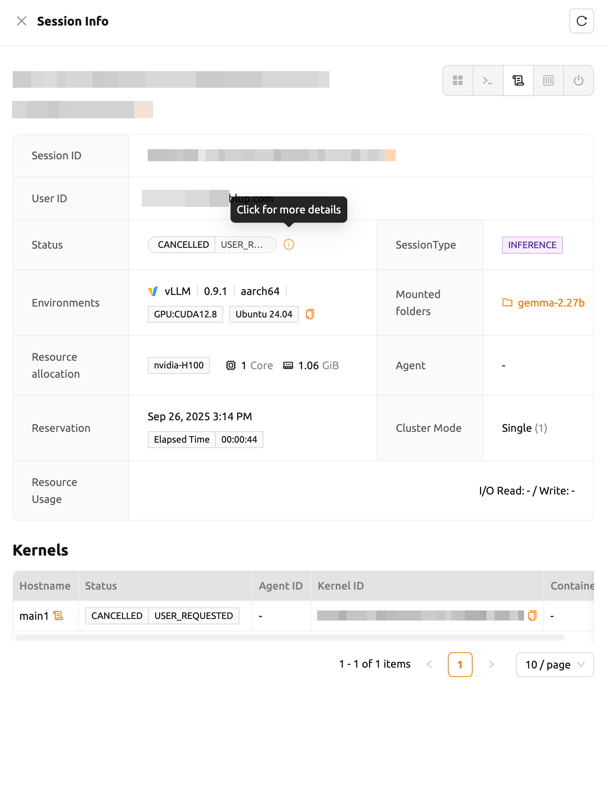
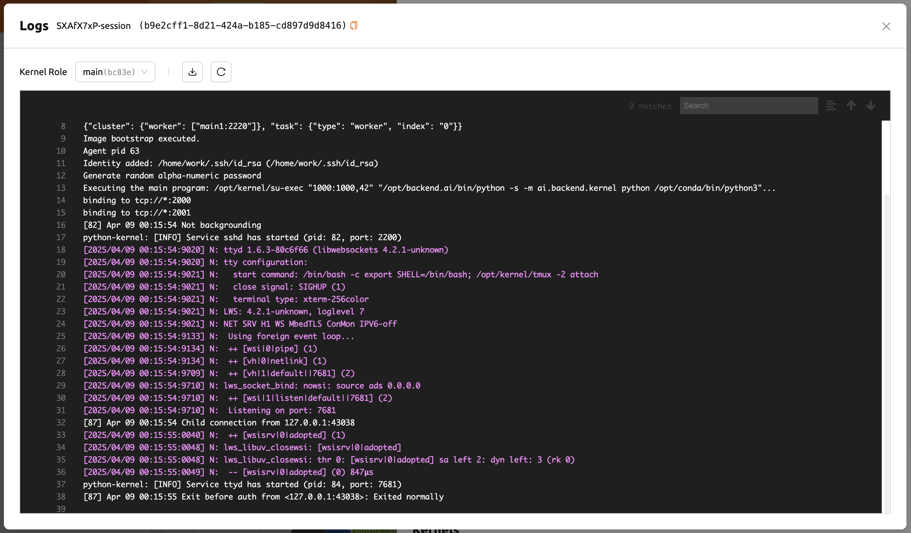

# How to Manage Existing Sessions

Once a compute session is running, you can access it, monitor its resource usage, view logs, and manage its lifecycle from the **Sessions** page. This page explains how to work with sessions that are already active.

## Viewing Session Details

Click a session name in the session list to open the session detail panel. The panel displays comprehensive information about the session, including:

- **Session ID** and **user ID**
- **Status** (e.g., Running, Pending, Terminated)
- **Type** (Interactive, Batch, or Inference)
- **Environment** and **image** used
- **Resource allocation** (CPU, memory, AI accelerator)
- **Mount information** (storage folders mounted to the session)
- **Elapsed time** and **reserved time**
- **Resource usage** including CPU utilization, memory consumption, and network I/O

<!-- TODO: Capture screenshot of session detail panel -->

## Accessing Running Sessions

Click the icons in the upper-right corner of the session detail panel to launch the available applications for that session.

### Jupyter Notebook

Click the first icon to open the app launcher, then select **Jupyter Notebook**. The notebook runs inside the compute session and uses the pre-installed language environment and libraries, so no separate package installation is required.

<!-- TODO: Capture screenshot of app launcher dialog -->

### Web Terminal

Click the terminal icon (second button) to open a web-based terminal. You can run shell commands directly inside the compute session. Files created in the terminal are immediately visible in Jupyter Notebook and vice versa, since both applications share the same container environment.

:::note
The available applications (Jupyter Notebook, VS Code, Terminal, etc.) depend on the container image used when creating the session.
:::

## Checking Resource Usage

The session detail panel displays real-time resource usage metrics for your running session, including:

- **CPU utilization** -- Percentage of allocated CPU cores in use
- **Memory consumption** -- Current memory usage relative to the allocated amount
- **AI accelerator utilization** -- GPU or other accelerator usage, if allocated
- **Network I/O** -- Data transferred in and out of the session

These metrics help you determine whether your session has sufficient resources or if adjustments are needed for future sessions.

## Viewing Session Logs

Click the log icon in the session detail panel to view the container logs for the session. Logs are useful for debugging errors, monitoring training progress, and reviewing the output of batch jobs.

<!-- TODO: Capture screenshot of session log viewer -->

## Renaming a Running Session

You can rename an active session by clicking the **Edit** button in the session detail panel. Enter a new name (4 to 64 alphanumeric characters, no spaces) and click **Confirm**.

## Session Status Transitions

A compute session goes through several statuses during its lifecycle: **Pending** (waiting for resources), **Preparing** (container being set up), **Running** (active and ready), **Terminating** (shutting down), **Terminated** (shut down, resources released), and **Cancelled** (cancelled before running).

:::tip
If a session stays in **Pending** status for an extended time, check whether sufficient resources are available in the selected resource group.
:::

## Idleness Checks

Backend.AI can automatically terminate idle sessions to reclaim resources. You can view the current idle check criteria in the **Idle Checks** section of the session detail panel. For details on the three types of idleness criteria (Max Session Lifetime, Network Idle Timeout, and Utilization Checker), refer to the [Sessions](session-management.md) page.

:::warning
Even if a process is running inside the session, it may be terminated by the Network Idle Timeout if there is no direct user interaction (such as typing in the terminal or running Jupyter cells).
:::
