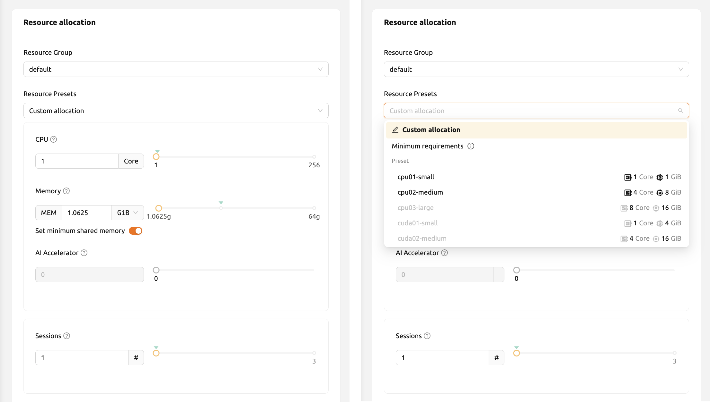

# How to Optimize Accelerated Computing

Backend.AI provides powerful GPU and AI accelerator management capabilities that allow you to allocate accelerator resources efficiently when creating compute sessions. This page explains how to use fractional GPU (fGPU) technology, allocate GPU resources, and follow best practices for accelerated computing.

## Fractional GPU (fGPU) Technology

Backend.AI features a unique *fractional GPU (fGPU)* technology that allows multiple compute sessions to share a single physical GPU. Instead of allocating an entire GPU to each session, Backend.AI virtualizes GPU resources so that you can request a fraction of a GPU -- for example, 0.5 fGPU or 0.3 fGPU.

This technology provides several benefits:

- **Higher utilization**: Multiple users or sessions can share a single physical GPU, reducing idle GPU time.
- **Cost efficiency**: You allocate only the GPU resources you actually need rather than reserving an entire device.
- **Flexible scaling**: You can fine-tune resource allocation to match the demands of your specific workload.

:::note
The fGPU feature is available when the Backend.AI cluster has CUDA GPU support with fractional GPU mode enabled (`cuda.shares`). Your administrator configures which GPU sharing mode is available in each resource group.
:::

## Allocating GPU Resources When Creating a Session

When you create a new compute session, you can specify the amount of AI accelerator resources in the **Environments & Resource Allocation** step of the session launcher.

<!-- TODO: Capture screenshot of resource allocation with GPU slider -->

1. Select the appropriate **Resource Group** that contains the GPU resources you need. Different resource groups may have different types of GPUs (e.g., NVIDIA A100, V100).
2. Adjust the **AI Accelerator** slider or input field to set the desired amount. When fGPU is enabled, you can specify fractional values such as 0.1, 0.5, or 1.0.
3. The minimum allocation step depends on the resource group configuration. By default, the step size is 0.1 fGPU, but administrators can configure a custom quantum size per resource group.

:::tip
If your workload does not require GPU resources (e.g., data preprocessing or lightweight scripting), set the AI Accelerator value to 0 to avoid occupying GPU resources unnecessarily.
:::

## Supported Accelerator Types

Backend.AI supports several types of AI accelerators:

| Accelerator Type | Description |
|------------------|-------------|
| **CUDA GPU** | NVIDIA GPUs allocated as whole devices (`cuda.device`) |
| **CUDA fGPU** | NVIDIA GPUs allocated as fractional shares (`cuda.shares`) |
| **ROCm GPU** | AMD GPUs using the ROCm platform |
| **TPU** | Google Tensor Processing Units |

The available accelerator types depend on the hardware installed in your cluster and the configuration set by your administrator.

## Monitoring GPU Utilization

After a session is running, you can monitor GPU utilization from the session detail panel. Click the session name in the session list to view resource usage metrics including:

- **Accelerator utilization** -- How actively the GPU is being used for computation
- **GPU memory consumption** -- The amount of GPU memory in use

These metrics are also used by the Backend.AI idle checker. If the utilization stays below the configured threshold for the specified idle timeout period (after the grace period), the session may be automatically terminated.

## Best Practices for GPU Usage

Follow these guidelines to make the most of your accelerator resources:

- **Right-size your allocation**: Start with a smaller fGPU allocation and increase it if you observe GPU memory errors or slow performance. Over-allocating wastes shared resources.
- **Allocate sufficient system memory**: When using a GPU, allocate at least twice the amount of GPU memory as system RAM. Otherwise, the GPU may experience increased idle time due to memory bottlenecks, resulting in performance penalties.
- **Use batch sessions for long training jobs**: Batch sessions automatically terminate after the script finishes, freeing GPU resources for other users.
- **Monitor utilization actively**: Check the session detail panel periodically to ensure your GPU resources are being utilized effectively. If utilization is consistently low, consider reducing the allocation.
- **Choose the right resource group**: If multiple resource groups are available, select the one with the GPU type best suited for your workload (e.g., A100 for large-scale training, T4 for inference).

:::warning
If the utilization checker is enabled and your GPU utilization remains below the threshold after the grace period, your session may be automatically terminated. Refer to the [How to Manage Existing Sessions](how-to-existing-sessions.md) page for details on idleness checks.
:::

## HPC Optimizations

For workloads that involve high-performance computing, Backend.AI provides an option to configure the `nthreads-var` value. By default, this is set equal to the number of CPU cores allocated to the session. However, for some multi-threaded workloads using OpenMP, setting the thread count to 1 or 2 can prevent performance degradation caused by an excessive number of threads.

You can configure this setting in the **Environments & Resource Allocation** step when creating a session.
