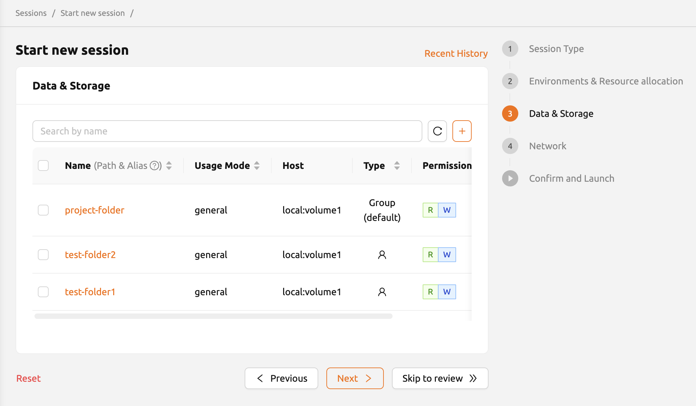

# Mounting Folders to a Compute Session

When a compute session is terminated, all files created inside the session are deleted by default. To preserve your data across sessions, you can mount storage folders (also known as virtual folders or vfolders) to a compute session. Files stored in mounted folders persist even after the session ends and can be reused by mounting them in future sessions.

## Mounting Folders During Session Creation

You can select storage folders to mount in the **Data & Storage** step of the session launcher.

1. Click the **START** button on the **Sessions** page to open the session launcher.
2. After configuring the session type and resource allocation, navigate to the **Data & Storage** step.
3. Select one or more folders from the list of available storage folders. Only folders that are mountable by your current user account and project are displayed.
4. Continue through the remaining steps and click **Launch** to create the session.


<!-- TODO: Capture screenshot of Data & Storage step in session launcher -->

:::tip
You can create a new storage folder directly from the session launcher by clicking the **+** button next to the search box. The newly created folder is automatically selected for mounting.
:::

:::note
Click a folder name in the **Data & Storage** step to open the folder explorer, where you can browse existing files, create new subfolders, and upload files before launching the session.
:::

## Where Mounted Folders Appear Inside a Session

By default, each selected folder is mounted under `/home/work/` inside the compute session, using the folder's name as the directory name. For example, if you mount a folder named `my-dataset`, it appears at `/home/work/my-dataset`.

You can customize the mount path by entering an absolute path in the **Path and Alias** input field. For example, writing `/workspace` mounts the folder at `/workspace` inside the session. A relative path mounts the folder under `/home/work/` with the specified path.

To verify that your folders are mounted correctly, open a web terminal in the running session and run:

```shell
ls /home/work/
```

You should see your mounted folders listed alongside any other files in the home directory.

## Auto-Mount Folders

Backend.AI supports special auto-mount folders that are automatically mounted whenever you create a compute session. These folders are created by naming them with a specific prefix:

- **`.local`**: Stores Python user packages installed via `pip`. When this folder exists, packages you install with `pip install` are saved to `.local` and remain available in future sessions without reinstallation.
- **`.linuxbrew`**: Stores packages installed via Homebrew on Linux. This folder is automatically mounted at `/home/linuxbrew/.linuxbrew`.

:::tip
Create a `.local` auto-mount folder to persist your Python packages across sessions. After installing a package with `pip install <package>`, the package is saved in `.local` and will be available the next time you create a session.
:::

## Preserving Data in Mounted Folders

Files created inside a mounted folder are preserved when the session is terminated. Files created outside of mounted folders (directly under `/home/work/` or elsewhere in the container) are deleted when the session ends.

To ensure your work is saved:

1. Always store important files (notebooks, datasets, model checkpoints) inside a mounted folder.
2. If you create files outside a mounted folder during your session, move them into a mounted folder before terminating the session.

:::warning
All files not stored in mounted storage folders are permanently deleted when a session is terminated. Move important data to a mounted folder before terminating.
:::

## Related Pages

- [Sessions](session-management.md) -- Overview of the Sessions page
- [How to Start / Terminate a Session](how-to-start-terminate-a-session.md) -- Creating and terminating sessions
