# Sessions

In Backend.AI, a *compute session* represents an isolated compute environment where you can run code, train models, or perform data analysis using allocated resources. Each session is created based on user-defined configurations such as runtime image, resource size, and environment settings. Once started, the session provides access to interactive applications, terminals, and logs, allowing you to manage and monitor your workloads efficiently.

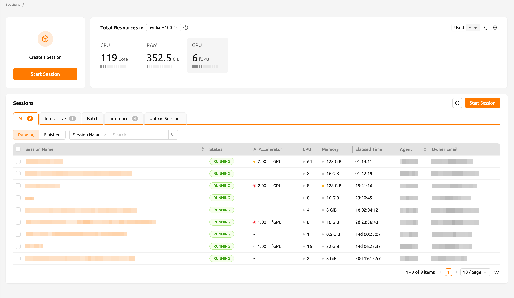

## Resource Summary Panels

At the top of the Sessions page, you can find panels displaying your available computing resources such as CPU, RAM, and AI Accelerators. Different panel views -- **My Total Resources Limit**, **My Resources in Resource Group**, and **Total Resources in Resource Group** -- can be selected depending on the information you need. Use the **Settings** button to change which panel is displayed.

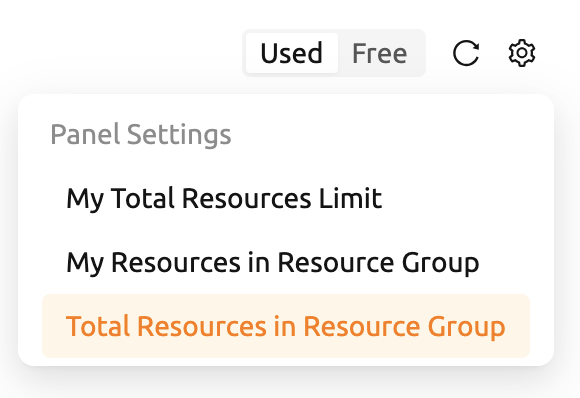

## Session List

The Sessions section displays a list of all active and completed compute sessions. You can filter sessions by type -- `Interactive`, `Batch`, `Inference`, or `Upload Sessions` -- and switch between **Running** and **Finished** tabs to manage sessions.

By default, you can view the following columns: session name, status, allocated resources (AI Accelerators, CPU, Memory), and elapsed time. For superadmins, additional columns such as agent and owner email are also available. You can show or hide columns by clicking the **Settings** button at the bottom right of the table.

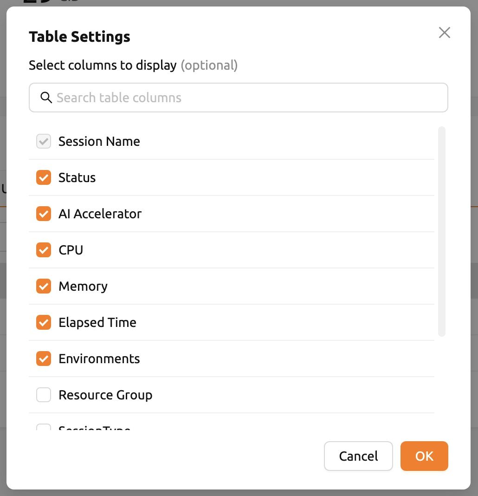

## Starting a New Session

Click the **START** button on the Sessions page to create a new compute session. The session launcher guides you through the following steps.

### Session Type

In the first step, select the type of session and optionally set a session name.

- **Session type**: Determines the type of the session.
   * Interactive: You interact with the session after creation (e.g., using Jupyter Notebook or Terminal). The session remains active until you explicitly terminate it or an idle check triggers automatic termination.
   * Batch: You pre-define a script that executes as soon as the session is ready. The session automatically terminates after the script finishes. This is useful for pipeline workloads and efficient resource utilization. You can optionally set a scheduled start time and a timeout duration.

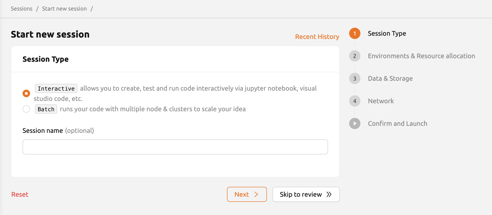

- **Session name**: You can specify a name for the compute session (4 to 64 alphanumeric characters, no spaces). If not specified, a random name is assigned automatically.

:::note
If you create a session with a superadmin or admin account, you can additionally assign a session owner by enabling the toggle and entering the user's email address.
:::

### Environments and Resource Allocation

Click **Next** to proceed to the environment and resource allocation step. If you want to use default values for all remaining settings, click **Skip to review**.

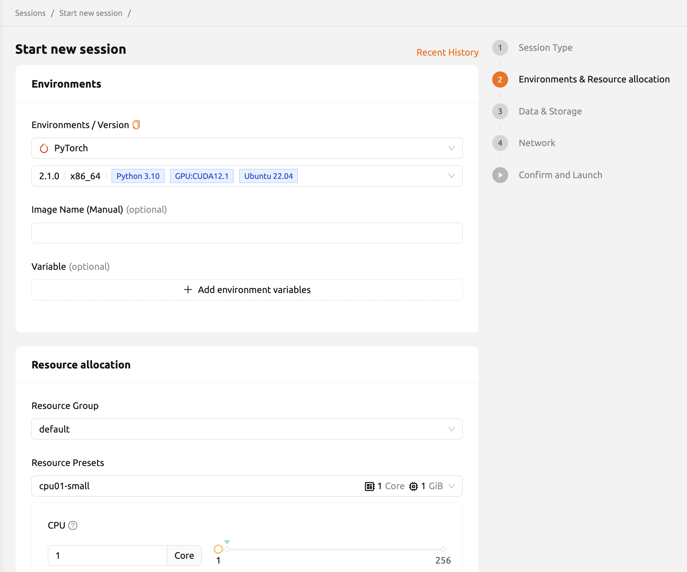

- **Environments**: Select the base environment for the compute session (e.g., TensorFlow, PyTorch, C++). The selected environment determines which packages are pre-installed.
- **Version**: Specify the version of the selected environment.
- **Set Environment Variable**: Add custom environment variables (e.g., `PATH`) by entering variable names and values in the configuration dialog.

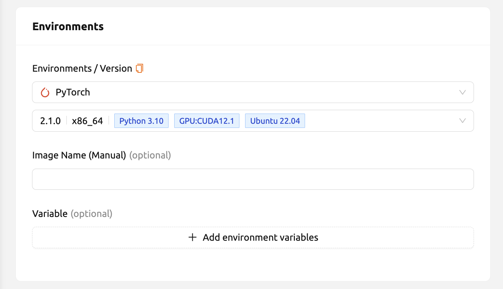

- **Resource Group**: Specifies the resource group in which to create the session. A resource group is a grouping of agent nodes with similar hardware specifications.
- **Resource Presets**: Select pre-defined resource templates or manually adjust the allocation of CPU, memory, shared memory, AI accelerator (GPU), and session count.

The meaning of each resource item is as follows:

- **CPU**: The number of CPU cores allocated to the session.
- **Memory**: The amount of RAM allocated. When using a GPU, allocate at least twice the GPU memory to avoid performance penalties.
- **Shared Memory**: The amount of shared memory in GB. Shared memory uses part of the allocated RAM and cannot exceed it.
- **AI Accelerator**: GPUs or NPUs suited for the matrix/vector computations involved in machine learning.
- **Sessions**: The number of sessions to create with the specified resource set. Requests exceeding available resources are placed in a waiting queue.

- **Cluster mode**: Allows you to create multiple containers at once for distributed computing. For more information, refer to the [Cluster Session](cluster-session.md) page.

:::note
The available resource groups and presets depend on your administrator's configuration and your resource policy.
:::

- **High-Performance Computing Optimizations**: Backend.AI provides options related to HPC optimizations. By default, the `nthreads-var` value is set equal to the number of session CPU cores. For some multi-thread workloads where multiple processes use OpenMP simultaneously, setting the number of threads to 1 or 2 can prevent performance degradation.

### Data and Storage

Click **Next** to proceed to the Data and Storage step. Here you can select storage folders to mount in the compute session.

Data stored in mounted folders is preserved even after the session ends. Folders are mounted under `/home/work/` by default. You can customize the mount path by entering an absolute path in the **Path and Alias** input field.

:::note
You can also create a new storage folder by clicking the **+** button next to the search box. The newly created folder is automatically selected for mounting.
:::

### Network

Click **Next** to proceed to the Network step. Here you can configure preopen ports for the session.

- **Preopen Ports**: Enter port numbers (between 1024 and 65535) separated by commas. These ports are opened inside the container at session startup, which is useful for running custom servers without building separate images.

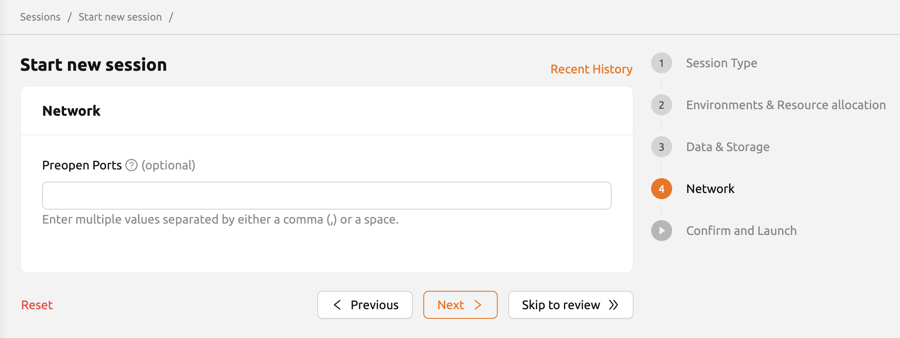

:::note
Preopen ports are internal container ports. When you click a preopen port in the session app launcher, a blank page appears until you bind a server to that port.
:::

### Confirm and Launch

Review all session settings on the final page, including environment, resource allocation, mounted folders, environment variables, and preopen ports. Click **Launch** to create the session. Click the **Edit** button at the top right of each card to go back to the relevant settings page.

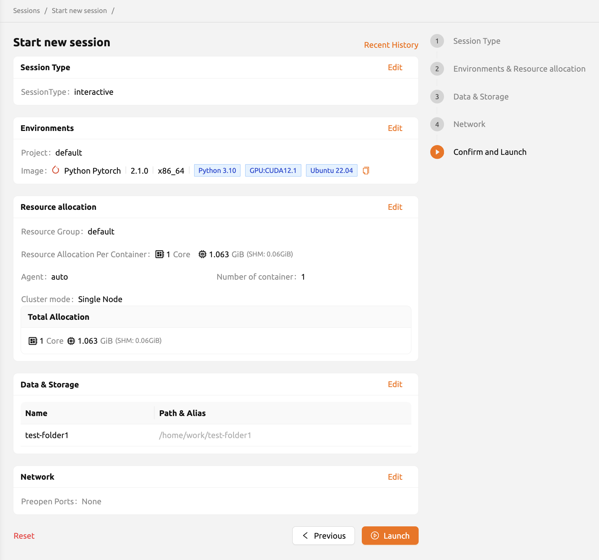

If there is an issue with the settings, an error message will be displayed.

When you click the **Launch** button without mounting any folders, a warning dialog appears. If folder mounting is not required, you can ignore the warning and proceed.

When the session is successfully created, a notification appears at the bottom-right corner of the screen with buttons to open the app dialog, launch the terminal, view container logs, and terminate the session.

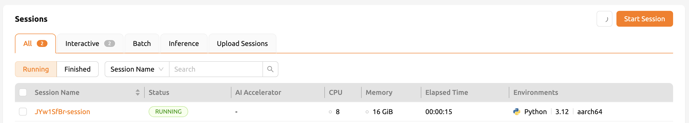

### Recent History

The Session Launcher provides a **Recent History** feature that remembers information about previously created sessions. The Recent History stores information about the five most recently created sessions. Clicking a session name takes you to the Confirm and Launch page. Each item can be renamed or pinned for easier access.

## Session Detail Panel

Click a session name in the session list to open the session detail panel. The panel displays information including session ID, user ID, status, type, environments, mount information, resource allocation, reserved time, elapsed time, agent, cluster mode, resource usage, and kernel information.

## Using Applications

### Jupyter Notebook

Click the first icon in the upper-right corner of the session detail panel to open the app launcher. Select **Jupyter Notebook** to open a notebook environment running inside the compute session.

The notebook uses the language environment and libraries provided by the session, so no separate package installation is required.

:::note
There are two check options in the app launcher:

- **Open app to public**: Makes the web service publicly accessible to anyone who knows the URL.
- **Try preferred port**: Attempts to assign a specific port number instead of a random one from the port pool.

Depending on the system configuration, these options may not be available.
:::

### Web Terminal

Click the terminal icon (second button) in the session detail panel to open a web-based terminal. You can run shell commands to interact with the compute session directly.

Files created in the terminal are immediately visible in Jupyter Notebook and vice versa, since both applications share the same container environment.

### Viewing Session Logs

You can view the log of the compute session by clicking the log icon in the session detail panel.

## Renaming a Running Session

You can rename an active session by clicking the **Edit** button in the session detail panel. The new session name must be 4 to 64 alphanumeric characters without spaces.

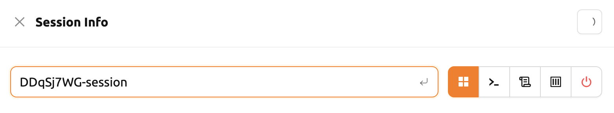

## Terminating a Session

To terminate a session, click the red power button and confirm by clicking **Terminate** in the dialog. Data inside the session that is not stored in a mounted folder is deleted when the session ends.

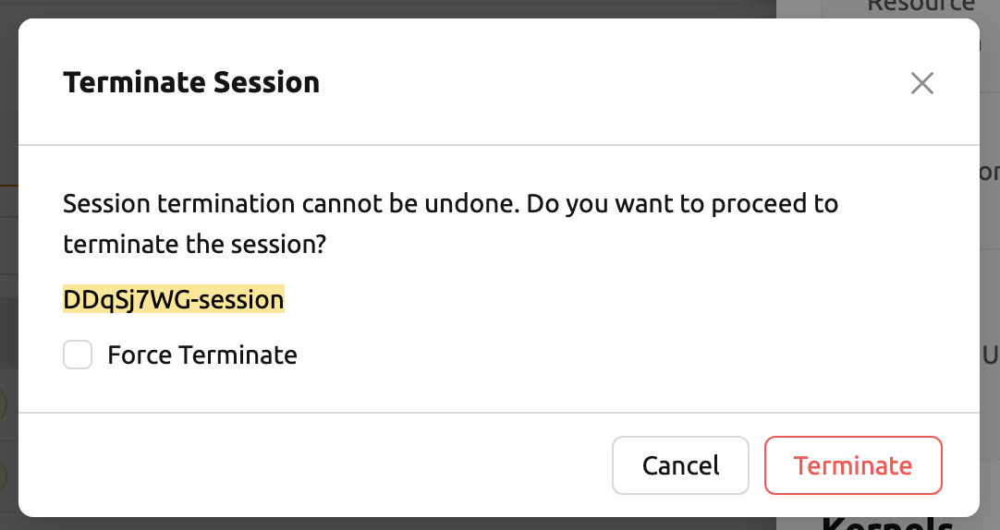

:::warning
All files not stored in mounted storage folders are permanently deleted when a session is terminated. Move important data to a mounted folder before terminating.
:::

## Idleness Checks

Backend.AI supports three types of idleness criteria for automatic session termination:

- **Max Session Lifetime**: Force-terminates sessions after a specified time from creation. This prevents sessions from running indefinitely.
- **Network Idle Timeout**: Force-terminates sessions that do not exchange data with the user (browser or web app) after a specified time. Even if a process is running inside the session, it is subject to termination if there is no user interaction.
- **Utilization Checker**: Reclaims resources based on the utilization of allocated resources.
   * Grace Period: The time during which the utilization idle checker is inactive. Even with low usage, the session is not terminated during this period.
   * Utilization Threshold: If resource utilization does not exceed the set threshold for a specified duration (idle timeout), the session is automatically terminated.

The criteria for session termination can be found in the **Idle Checks** section of the session detail panel.

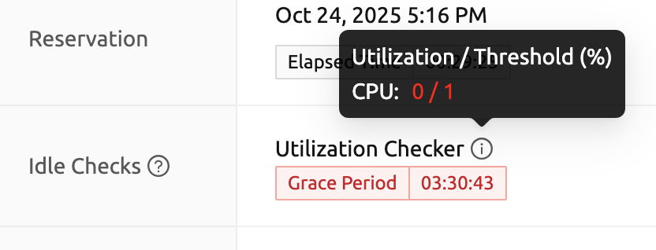

:::note
Depending on the environment settings, the available idle checkers and resource types may differ.
:::

## Save Container Commit

Backend.AI supports the "Convert Session to Image" feature. Committing a running session saves the current state as a new container image. Click the **Commit** button (fourth icon) in the session detail panel to open the commit dialog.

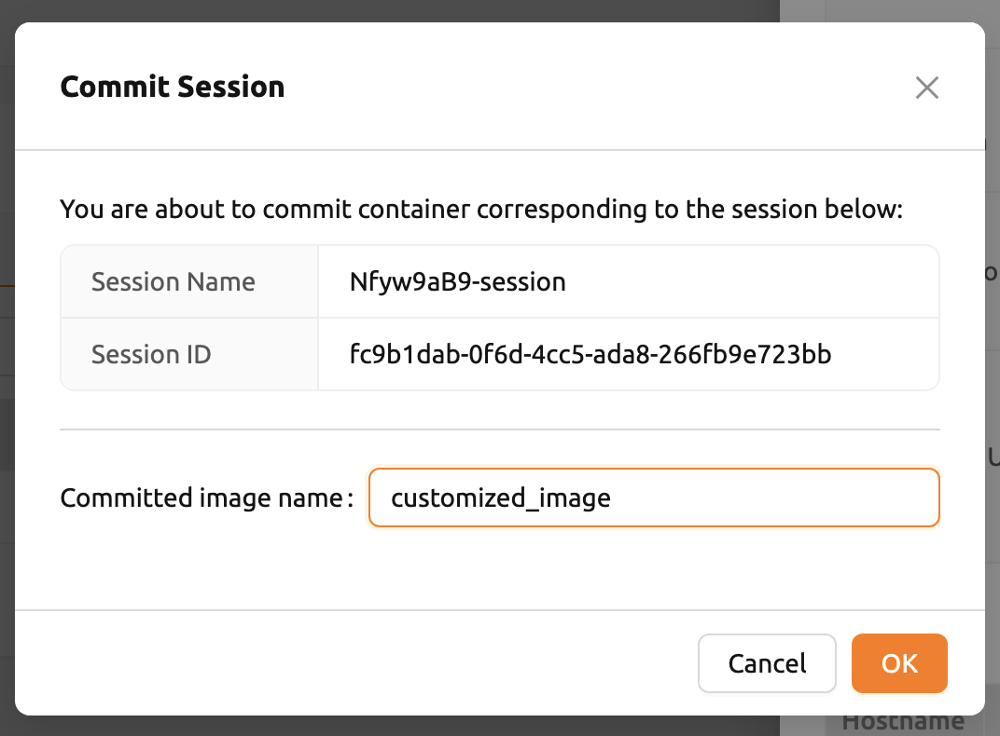

Enter a session name (4 to 32 characters, alphanumeric, hyphens, or underscores) and click **PUSH SESSION TO CUSTOMIZED IMAGE**. The customized image can be used in future session creations.

:::note
Convert Session to Image is only available for interactive sessions. Directories mounted to the container (including `/home/work/`) are not included in the final image.
:::

## Utilizing Converted Images

After converting a session to an image, you can select the customized image from the environments list in the session launcher when creating a new session. The converted image is tagged with `Customized<session name>` and is not exposed to other users.

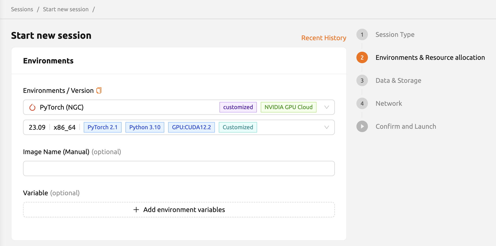

## Advanced Web Terminal Usage

The web-based terminal internally embeds a utility called [tmux](https://github.com/tmux/tmux/wiki). tmux is a terminal multiplexer that supports opening multiple shell windows within a single shell, allowing multiple programs to run in foreground simultaneously.

### Copy Terminal Contents

tmux has its own clipboard buffer. When copying terminal contents, you may find that paste only works within tmux by default. To copy terminal contents to your system clipboard, you can temporarily turn off tmux mouse support:

1. Press `Ctrl-B` to enter tmux control mode
2. Type `:set -g mouse off` and press `Enter`
3. Drag the desired text from the terminal with the mouse
4. Press `Ctrl-C` (or `Cmd-C` on Mac) to copy to your system clipboard

To re-enable mouse scrolling, press `Ctrl-B` and type `:set -g mouse on`.

:::note
In the Windows environment, use the following shortcuts:

- Copy: Hold down `Shift`, right-click and drag
- Paste: Press `Ctrl-Shift-V`
:::

### Check Terminal History Using Keyboard

Press `Ctrl-B`, then press the `Page Up` and `Page Down` keys to browse terminal history. Press `q` to exit search mode.

### Spawn Multiple Shells

Press `Ctrl-B` then `c` to create a new shell window. Press `Ctrl-B` then `w` to list all currently open shells and move between them using the up/down keys.

To exit or terminate the current shell, enter the `exit` command or press `Ctrl-B` then `x` and type `y`.

In summary:

- `Ctrl-B c`: Create a new tmux shell
- `Ctrl-B w`: Query current tmux shells and move between them
- `exit` or `Ctrl-B x`: Terminate the current shell

## Cluster Session (Multi-Container Session)

Backend.AI supports multi-node workloads that let you create a bundle of containers from multiple nodes. This enables distributed deep learning and big data analysis.

Each compute session consists of one or more kernels. In the Docker backend, a kernel corresponds to a container. In the Kubernetes backend, a session corresponds to a pod, and each kernel represents a container within that pod.

:::info
Some setups may use the host networking mode which transparently opens the host IP and ports to all containers. In that case, there are no bridge/overlay networks. All overlapping apps (e.g., sshd) in different user sessions receive unique port numbers automatically.
:::
