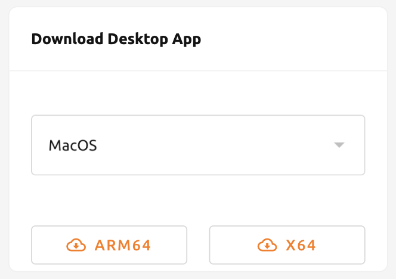
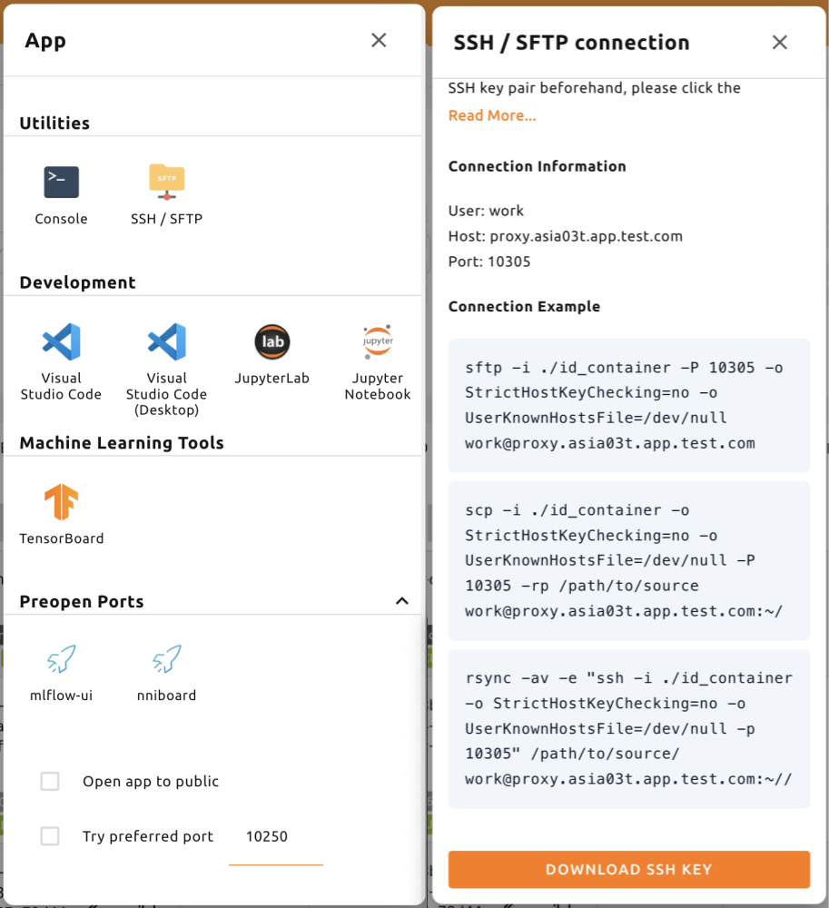
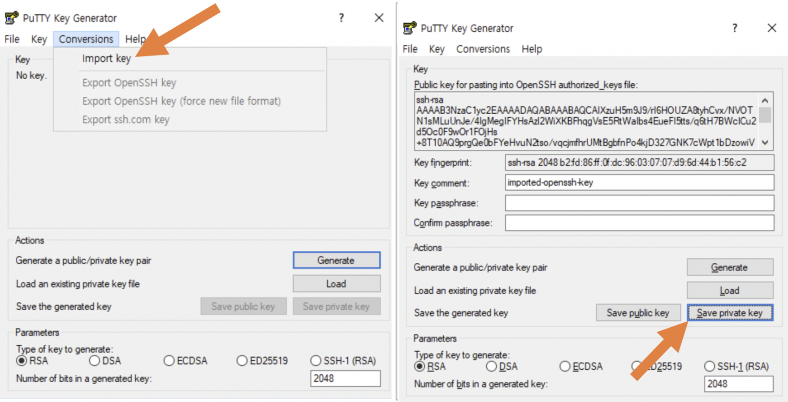
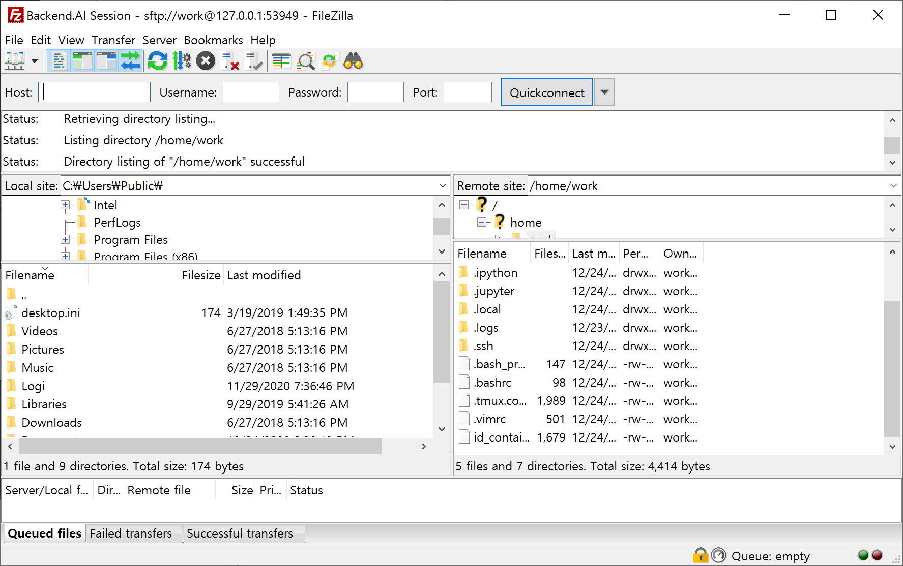
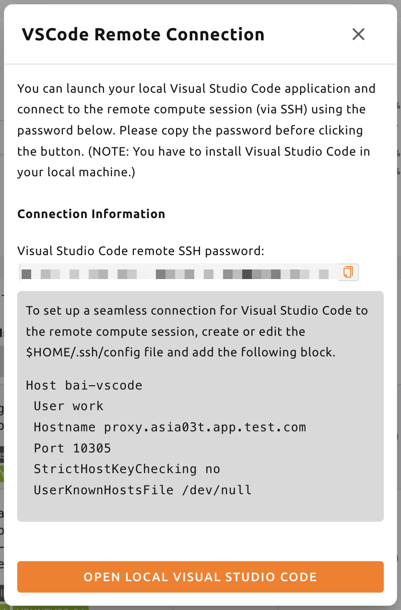
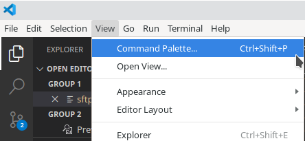
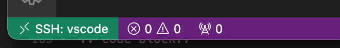
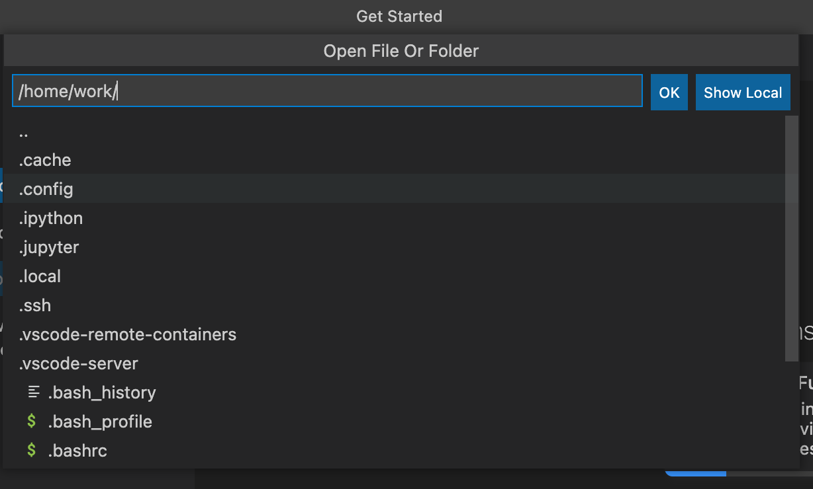
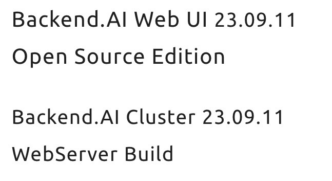

# SSH/SFTP Connection to a Compute Session

Backend.AI supports SSH/SFTP connections to your compute sessions (containers). This section describes how to set up and use these connections.

:::note
From version 24.03, the SSH/SFTP connection feature is available in both the web browser and the WebUI Desktop application. For version 23.09 or lower, you need to use the WebUI Desktop app. You can download the desktop app from a panel on the Summary page, which automatically provides the compatible version.



You can also download the app from https://github.com/lablup/backend.ai-webui/releases. Make sure to download the compatible version of the WebUI. You can check the WebUI version by clicking **About Backend.AI** in the user menu on the upper-right side.
:::

## For Linux / Mac

First, create a compute session, then click the app icon (first button) in the session detail panel, followed by the **SSH / SFTP** icon. A daemon that allows SSH/SFTP access from inside the container will be initiated, and the WebUI app interacts with the daemon through a local proxy service.

:::note
You cannot establish an SSH/SFTP connection to the session until you click the SSH/SFTP icon. When you close the WebUI app and launch it again, the connection between the local proxy and the WebUI app is initialized, so you must click the SSH/SFTP icon again.
:::

Next, a dialog containing SSH/SFTP connection information will appear. Remember the address (especially the assigned port) written in the SFTP URL and click the download link to save the `id_container` file on your local machine. This file is an automatically generated SSH private key. You can also download the `id_container` file located under `/home/work/` using the web terminal or Jupyter Notebook. The auto-generated SSH key may change when a new session is created, in which case it must be downloaded again.



To SSH connect to the compute session with the downloaded SSH private key, run the following command in your shell environment. Write the path to the downloaded `id_container` file after the `-i` option and the assigned port number after the `-p` option. The user inside the compute session is usually set to `work`.

```shell
$ ssh \
    -i ~/.ssh/id_container -p 30722 \
    -o StrictHostKeyChecking=no \
    -o UserKnownHostsFile=/dev/null \
    work@127.0.0.1
Warning: Permanently added '[127.0.0.1]:30722' (RSA) to the list of known hosts.
f310e8dbce83:~$
```

Connecting by SFTP is similar. After running your SFTP client and setting the public key-based connection method, specify `id_container` as the SSH private key. Refer to your FTP client's manual for details.

:::note
The SSH/SFTP connection port number is randomly assigned each time a session is created. If you want to use a specific port number, you can enter it in the **Preferred SSH Port** field in the user settings menu. To avoid collisions with other services, it is recommended to specify a port number between 10000-65000. If multiple sessions use SSH/SFTP simultaneously, the second connection cannot use the designated port and receives a random port instead.
:::

:::note
If you want to use your own SSH keypair instead of `id_container`, create a user-type folder named `.ssh`. Create an `authorized_keys` file in that folder and append your SSH public key. You can then connect via SSH/SFTP using your own private key without downloading `id_container`.
:::

:::warning
If you receive a "bad permissions" warning, change the permission of the `id_container` file to 600:

```shell
$ chmod 600 <id_container path>
```


:::

## For Windows / FileZilla

The Backend.AI WebUI app supports OpenSSH-based public key connections (RSA2048). To access with a client such as PuTTY on Windows, you must convert the private key into a `ppk` file through a program such as PuTTYgen. Refer to https://wiki.filezilla-project.org/Howto for the conversion method.

To connect via SFTP through FileZilla on Windows:

1. Create a compute session, check the connection port, and download `id_container`
2. Run PuTTYgen and click **Import key** in the Conversions menu
3. Select the downloaded `id_container` file from the file open dialog
4. Click **Save private key** and save the file as `id_container.ppk`



5. In FileZilla, go to **Settings > Connection > SFTP** and register the key file `id_container.ppk`


6. Open **Site Manager**, create a new site, and enter the connection information


When connecting to a container for the first time, a confirmation popup may appear. Click **OK** to save the host key.


After a while, the connection is established. You can now transfer large files to `/home/work/` or other mounted storage folders with this SFTP connection.



## For Visual Studio Code

Backend.AI supports development with Visual Studio Code through SSH/SFTP connections to a compute session. Once connected, you can interact with files and folders anywhere on the compute session.

1. Install Visual Studio Code and the [Remote Development extension pack](https://aka.ms/vscode-remote/download/extension)


2. In the VSCode Remote Connection dialog, click the copy icon button to copy the Visual Studio Code remote SSH password. Remember the port number.



3. Edit the SSH config file (`~/.ssh/config` for Linux/Mac, or `C:\Users\[user name]\.ssh\config` for Windows) and add the following block:

```text
Host bai-vscode
User work
Hostname 127.0.0.1
Port 49335
StrictHostKeyChecking no
UserKnownHostsFile /dev/null
```

4. In Visual Studio Code, select **Command Palette...** from the **View** menu



5. Choose **Remote-SSH: Connect to Host...**


6. Select your host from the list of hosts in `.ssh/config`


7. After connecting, you will see an empty window. The Status bar shows which host you are connected to.



8. Open any folder or workspace on the remote host by accessing **File > Open...** or **File > Open Workspace...**



## Establish SSH Connection with Backend.AI Client Package

This section describes how to establish an SSH connection to a compute session in environments where a graphical user interface (GUI) cannot be used.

Typically, GPU nodes that run compute sessions cannot be accessed directly from the outside. To establish an SSH or SFTP connection, a local proxy that creates a tunnel needs to be launched to relay the connection between you and the session. Using the Backend.AI Client package, this process is relatively simple to configure.

### Prepare Backend.AI Client Package

#### Prepare with Docker Image

The Backend.AI Client package is available as a Docker image:

```shell
$ docker pull lablup/backend.ai-client

$ # For a specific version:
$ docker pull lablup/backend.ai-client:<version>
```

You can find the Backend.AI server version in the **About Backend.AI** menu under the person icon on the top right corner of the WebUI.



Run the Docker image:

```shell
$ docker run --rm -it lablup/backend.ai-client bash
```

Check if the `backend.ai` command is available:

```shell
$ backend.ai
```

#### Prepare Directly from Host with a Python Virtual Environment

If you cannot use Docker, you can install the Backend.AI Client package directly. Prerequisites include a compatible Python version (check the [compatibility matrix](https://github.com/lablup/backend.ai#python-version-compatibility)), and optionally `clang` and `zstd`.

It is recommended to use a Python virtual environment. You can use a statically-built Python binary from the [indygreg repository](https://github.com/indygreg/python-build-standalone/releases):

```shell
$ wget https://github.com/indygreg/python-build-standalone/releases/download/20240224/cpython-3.11.8+20240224-x86_64-unknown-linux-gnu-pgo-full.tar.zst
$ tar -I unzstd -xvf *.tar.zst
$ ./python/install/bin/python3 -m venv .venv
$ source .venv/bin/activate
(.venv) $ pip install -U pip==24.0 && pip install -U setuptools==65.5.0
(.venv) $ pip install -U backend.ai-client~=23.09
(.venv) $ backend.ai
```

### Setting Up Server Connection for CLI

Create a `.env` file with the following content. Use the same address for `webserver-url` that you use to connect to the WebUI service from your browser:

```shell
BACKEND_ENDPOINT_TYPE=session
BACKEND_ENDPOINT=<webserver-url>
```

Run the following CLI command to connect to the server:

```shell
$ backend.ai login
User ID: myuser@test.com
Password:
Login succeeded.
```

### SSH/SCP Connection to Compute Session

Create a compute session from the browser and mount the folder where you want to copy data. Remember the session name (e.g., `ibnFmWim-session`).

To SSH directly:

```shell
$ backend.ai ssh ibnFmWim-session
running a temporary sshd proxy at localhost:9922 ...
work@main1[ibnFmWim-session]:~$
```

To download the SSH key file and explicitly run the ssh command, first launch a local proxy service:

```shell
$ backend.ai app ibnFmWim-session sshd -b 9922
A local proxy to the application "sshd" provided by the session "ibnFmWim-session" is available at:
tcp://127.0.0.1:9922
```

Open another terminal window and download the SSH key:

```shell
$ source .venv/bin/activate
$ backend.ai session download ibnFmWim-session id_container
Downloading files: 3.58kbytes [00:00, 352kbytes/s]
Downloaded to /*/client.
```

Use the downloaded key to SSH:

```shell
$ ssh \
    -o StrictHostKeyChecking=no \
    -o UserKnownHostsFile=/dev/null \
    -i ./id_container \
    -p 9922 \
    work@127.0.0.1
```

You can also use `scp` to copy files. Copy files to the mounted folder within the compute session to preserve them after the session is terminated:

```shell
$ scp \
    -o StrictHostKeyChecking=no \
    -o UserKnownHostsFile=/dev/null \
    -i ./id_container \
    -P 9922 \
    test_file.xlsx work@127.0.0.1:/home/work/myfolder/
```

When all tasks are completed, press `Ctrl-C` on the first terminal to cancel the local proxy service.
