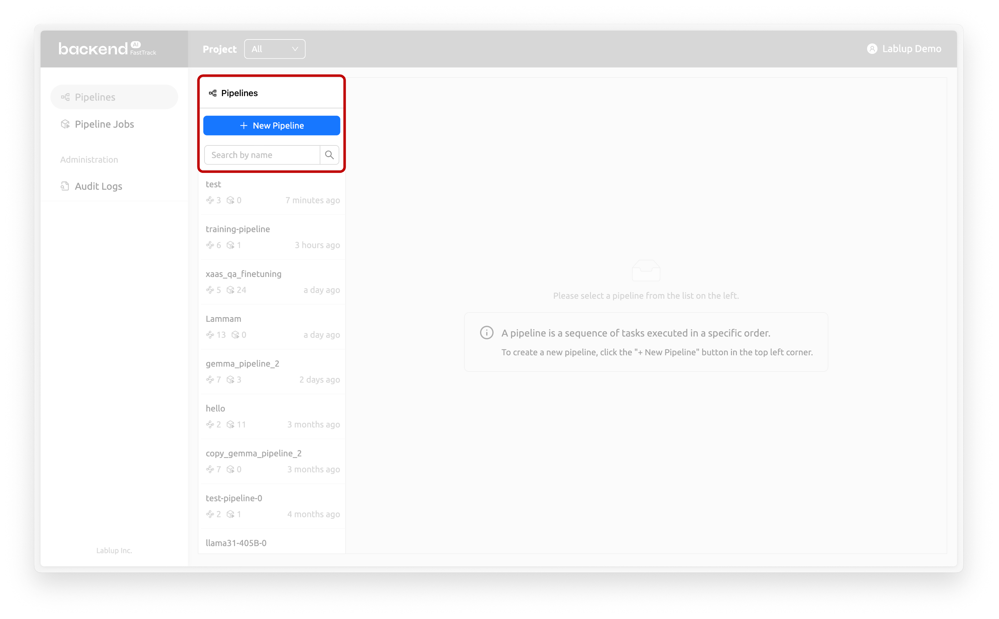
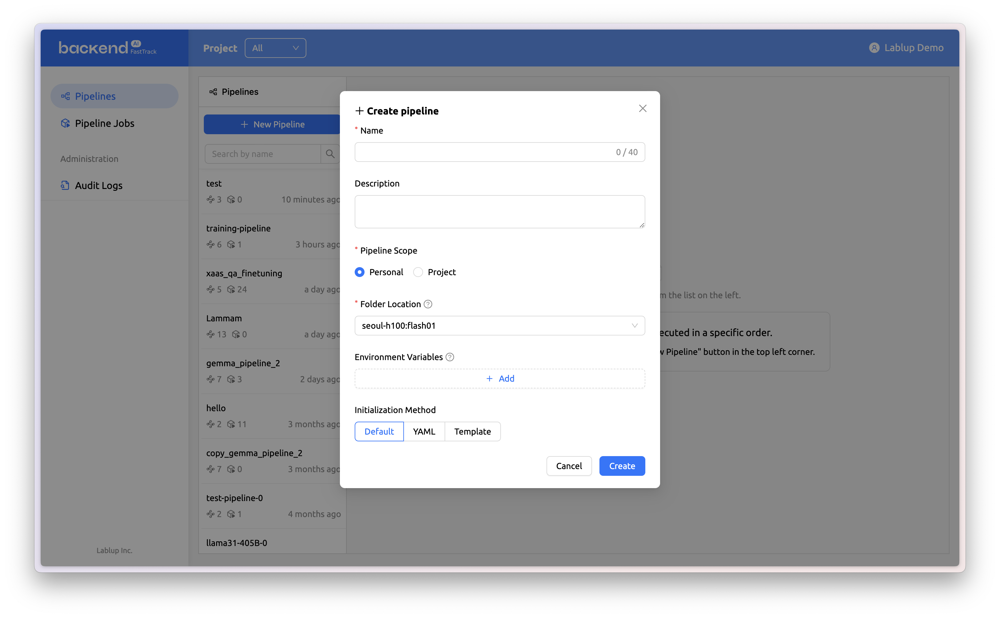

# Creating and editing a new pipeline

## Creating a pipeline

<figure><figcaption></figcaption></figure>

To create a new pipeline, click the `+ New Pipeline` button on the left top of the pipelines page.

<figure><figcaption></figcaption></figure>

00000

* Name (Required): The name used to distinguish this pipeline from other pipelines.
* Description: A description of the pipeline. This field is optional.
* Pipeline Scope (Required): Set the scope of the pipeline.
  * Personal: Select this option when the pipeline is for personal use and will not be shared.
  * Project: Select this option when the pipeline will be shared within a project.
* Folder Location (Required): Select the NFS host where the pipeline folder will be created. If multiple NFS hosts are available, one can be chosen from the list.
* Environment Variables:
* Initialization Variables:

Backend.AI WebUI

## Editing a pipeline

