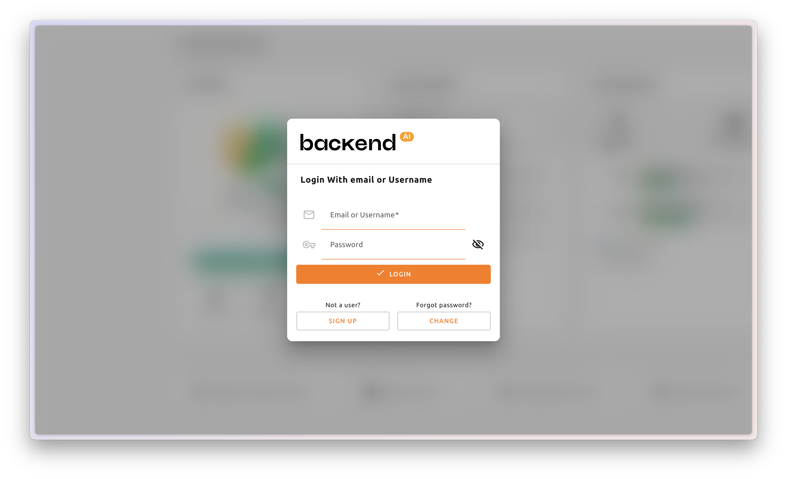
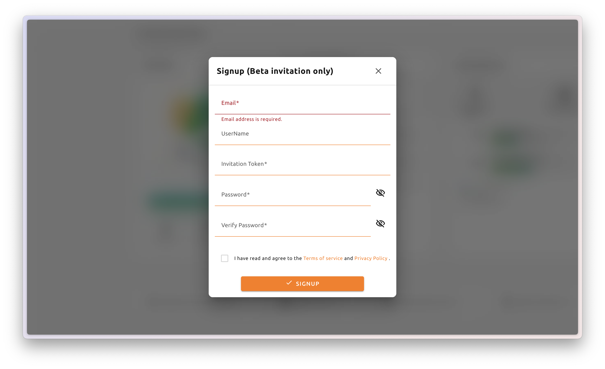
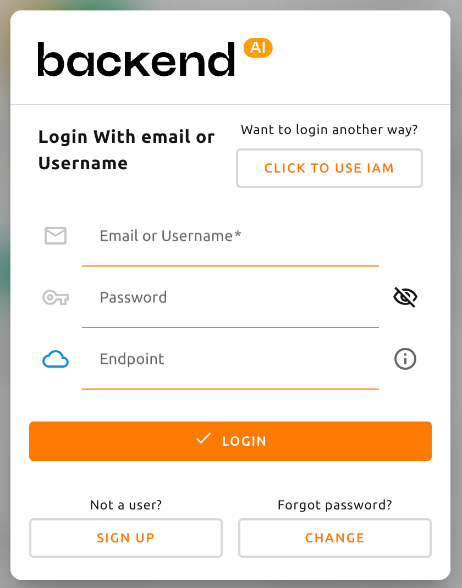

# Signup and Login

## Signup

access cloud.backend.ai / appropriate access to sign up.

<figure><figcaption></figcaption></figure>

<figure><figcaption></figcaption></figure>

:::info
**Notes**

Depending on internal policies, server configurations, or plugin settings, registration via 'Sign Up' button may be unavailable. In such cases, a separate invitation token may be required, or an administrator approval may be necessary. If registration is not possible, contact the system administrator for further assistance.
:::

To signup, enter information such as email address, username, and password, then read and agree to the Terms of Service and Privacy Policy before clicking the "Sign Up" button. Depending on system settings, an invitation token may be required to complete the registration process. Additionally, a verification email may be sent to confirm ownership of the provided email address. In such cases, registration must be completed by following the verification link in the email before logging in with the new account.

The following password requirements apply to Backend.AI accounts. To enhance security and prevent unauthorized access, passwords must be at least eight characters long and include at least one letter, one number, and one special character.

:::info
### About Our Security

Backend.AI securely stores user passwords using one-way hashing. The system utilizes BCrypt, the default password hashing algorithm for BSD, ensuring that even server administrators cannot access user passwords.
:::

###

## Login

<figure><figcaption></figcaption></figure>

**Email or Username**: By default, user authentication is performed using the registered email address. Username-based login is available only when a dedicated plugin is applied. For other login methods, refer to the internal policies and configuration settings of the organization.

**Password**: Use the password set during Backend.AI account creation to login. If the password is forgotten, a new password can be issued by clicking the "Forgot Password?" button below. \
(Availability may vary depending on organizational policies.)

**Click to use IAM**: (Optional) Identity and Access Management (IAM) login is available for users possessing valid Access Key (AK) and Secret Key (SK) credentials.

:::info
**Notes**

The IAM login option is available only when IAM authentication is enabled. If this feature is not activated in the environment, the corresponding button will not be displayed and IAM login will not be accessible.
:::

:::warning
**Warning**

For security reasons, if more than 10 consecutive login failures occur, further login attempts will be restricted for 20 minutes. If the restriction persists after 20 minutes, contact the system administrator for assistance.
:::

## Logout

When you are done using Backend.AI, you can log out from the Backend.AI page.

##

##

##

## Troubleshooting

### Reset Password

If you have forgotten your Backend.AI password, you can send a password reset link to your email by clicking `Forgot Password?` and then the `CHANGE` button on the login panel. Follow the instructions in the received email to change your password. Depending on server settings, the password reset feature may be disabled by the administrator. If the password reset button does not appear or the password recovery feature does not work, contact your system administrator.

